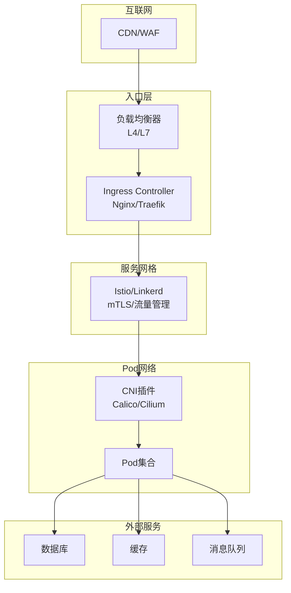

> **生产环境安全提示**
>
> 本文档包含可直接执行的运维命令。执行前请确认：当前目标集群与 Namespace 是否正确；是否具备足够的 RBAC 权限；是否已在非生产环境验证。命令风险等级标注：🔴 高风险（可能造成数据丢失或服务中断）、🟡 中风险（会修改集群状态，但通常可回滚）、🟢 低风险/只读（信息收集，无副作用）。


# [[Kubernetes|Kubernetes]] 网络配置最佳实践

> **适用版本**: Kubernetes v1.25-v1.32 | **最后更新**: 2026-05 | **作者**: 系统生成 | **质量等级**: ⭐⭐⭐⭐⭐ 专家级

> **生产环境实战经验总结**: 基于大规模集群网络运维经验，涵盖从CNI选型到网络策略的全方位最佳实践

---

## 概述

本指南提供生产环境 Kubernetes 网络配置的最佳实践，帮助团队构建安全、高效、可扩展的网络基础设施。

### 目标读者

- **网络工程师**: 了解Kubernetes网络架构和CNI插件选型
- **SRE**: 掌握网络故障排查和性能优化
- **DevOps 工程师**: 学习网络策略配置和安全加固

### 前置知识

- Kubernetes 核心概念（Pod、[[Service|Service]]、[[Ingress|Ingress]]）
- Linux 网络基础（iptables、ipvs、vxlan）
- 网络安全基础（防火墙、ACL）

---

## 问题描述

### 常见问题

**问题1：Pod间通信异常**
- **症状**：Pod间无法通信，Service发现失败
- **原因**：CNI插件配置错误，网络策略冲突
- **影响**：业务服务间通信中断，影响业务功能

**问题2：网络性能瓶颈**
- **症状**：网络延迟高，吞吐量低
- **原因**：CNI插件性能不佳，网络配置不当
- **影响**：业务性能下降，用户体验差

**问题3：网络安全漏洞**
- **症状**：未授权访问，数据泄露
- **原因**：网络策略缺失，安全配置不当
- **影响**：安全风险，合规问题

---

## 解决方案

### CNI插件选型

**主流CNI插件对比**：

| 特性 | Calico | Cilium | Flannel | Weave |
|------|--------|--------|---------|-------|
| **网络模式** | BGP/VXLAN | eBPF | VXLAN | VXLAN |
| **网络策略** | ✅ 完整 | ✅ 增强 | ❌ 无 | ✅ 基础 |
| **性能** | 高 | 极高 | 中 | 中 |
| **可观测性** | 中 | 高 | 低 | 中 |
| **eBPF支持** | ❌ | ✅ | ❌ | ❌ |
| **适用场景** | 通用 | 高性能 | 简单 | 小规模 |

**选型建议**：
- **通用场景**：Calico - 稳定可靠，社区活跃
- **高性能场景**：Cilium - eBPF加持，性能卓越
- **简单场景**：Flannel - 配置简单，易于维护
- **小规模场景**：Weave - 快速部署，功能够用

### 网络架构设计

**生产环境网络架构**：



**架构优势**：
- **分层清晰**：各层职责明确，易于维护
- **安全可控**：每层都有安全策略
- **可观测性**：全链路监控和追踪
- **弹性扩展**：各层可独立扩展

### 关键配置

#### 1. Calico 配置

```yaml
# Calico Installation
apiVersion: operator.tigera.io/v1
kind: Installation
metadata:
  name: default
spec:
  calicoNetwork:
    ipPools:
    - blockSize: 26
      cidr: 10.244.0.0/16
      encapsulation: VXLAN
      natOutgoing: Enabled
      nodeSelector: all()
    linuxDataplane: Iptables
    multiInterfaceMode: None
    nodeAddressAutodetectionV4:
      firstFound: true
```

#### 2. Cilium 配置

```yaml
# Cilium Helm Values
apiVersion: cilium.io/v2alpha1
kind: CiliumConfig
metadata:
  name: cilium
  namespace: kube-system
spec:
  ipam:
    operator:
      clusterPoolIPv4PodCIDR: "10.244.0.0/16"
  kubeProxyReplacement: "strict"
  enableIPv4Masquerade: true
  enableIPv6Masquerade: false
  enableBPFMasquerade: true
  enableHostReachableServices: true
  enableExternalIPs: true
  enableNodePort: true
  enableSessionAffinity: true
  enableBandwidthManager: true
  enableBBR: true
  tunnel: "disabled"
  autoDirectNodeRoutes: true
```

#### 3. 网络策略配置

```yaml
# 默认拒绝所有流量
apiVersion: networking.k8s.io/v1
kind: NetworkPolicy
metadata:
  name: default-deny-all
  namespace: production
spec:
  podSelector: {}
  policyTypes:
  - Ingress
  - Egress
---
# 允许特定服务通信
apiVersion: networking.k8s.io/v1
kind: NetworkPolicy
metadata:
  name: allow-frontend-to-backend
  namespace: production
spec:
  podSelector:
    matchLabels:
      app: backend
  policyTypes:
  - Ingress
  ingress:
  - from:
    - podSelector:
        matchLabels:
          app: frontend
    ports:
    - protocol: TCP
      port: 8080
```

---

## 实施步骤

### 前置条件

**硬件要求**：
- 节点：支持VXLAN或BGP的网络环境
- 网络：节点间网络互通，MTU ≥ 1500
- 带宽：万兆网络推荐

**软件要求**：
- Kubernetes：v1.25+
- 内核版本：≥ 4.19（Cilium需要≥ 5.4）
- kube-proxy：IPVS模式推荐

### 步骤1：网络规划

```bash
#!/bin/bash
# 网络规划脚本

# 1. 确定Pod CIDR
POD_CIDR="10.244.0.0/16"

# 2. 确定Service CIDR
SERVICE_CIDR="10.96.0.0/12"

# 3. 确定节点网络
NODE_NETWORK="192.168.1.0/24"

# 4. 计算子网
echo "Pod CIDR: $POD_CIDR"
echo "Service CIDR: $SERVICE_CIDR"
echo "Node Network: $NODE_NETWORK"

# 5. 验证网络不重叠
if ipcalc -n "$POD_CIDR" | grep -q "Network:"; then
    echo "✓ Pod CIDR 格式正确"
else
    echo "✗ Pod CIDR 格式错误"
    exit 1
fi
```

### 步骤2：安装CNI插件

> ⚠️ **🟡 中危变更** — 变更集群资源状态，建议先 --dry-run 或 diff 确认
> - `helm upgrade/install`：部署/升级 release
> - `kubectl apply/create/replace`：创建/变更集群资源

``` bash
# 🟡 中风险：会修改集群/资源状态，执行前请确认目标、影响范围与授权
#!/bin/bash
# 安装 Calico

# 1. 添加 Helm 仓库
helm repo add projectcalico https://docs.tigera.io/calico/charts
helm repo update

# 2. 创建命名空间
kubectl create namespace tigera-operator

# 3. 安装 Calico Operator
helm install calico projectcalico/tigera-operator \
  --namespace tigera-operator \
  --version v3.26.1

# 4. 配置 Calico
cat <<EOF | kubectl apply -f -
apiVersion: operator.tigera.io/v1
kind: Installation
metadata:
  name: default
spec:
  calicoNetwork:
    ipPools:
    - blockSize: 26
      cidr: 10.244.0.0/16
      encapsulation: VXLAN
      natOutgoing: Enabled
      nodeSelector: all()
EOF

# 5. 验证安装
kubectl get pods -n calico-system
```
### 步骤3：配置网络策略

> ⚠️ **🟡 中危变更** — 变更集群资源状态，建议先 --dry-run 或 diff 确认
> - `kubectl apply/create/replace`：创建/变更集群资源

``` bash
# 🟡 中风险：会修改集群/资源状态，执行前请确认目标、影响范围与授权
#!/bin/bash
# 配置网络策略

# 1. 创建默认拒绝策略
cat <<EOF | kubectl apply -f -
apiVersion: networking.k8s.io/v1
kind: NetworkPolicy
metadata:
  name: default-deny-all
spec:
  podSelector: {}
  policyTypes:
  - Ingress
  - Egress
EOF

# 2. 允许DNS查询
cat <<EOF | kubectl apply -f -
apiVersion: networking.k8s.io/v1
kind: NetworkPolicy
metadata:
  name: allow-dns
spec:
  podSelector: {}
  policyTypes:
  - Egress
  egress:
  - to:
    - namespaceSelector:
        matchLabels:
          kubernetes.io/metadata.name: kube-system
    ports:
    - protocol: UDP
      port: 53
    - protocol: TCP
      port: 53
EOF

# 3. 允许特定命名空间通信
cat <<EOF | kubectl apply -f -
apiVersion: networking.k8s.io/v1
kind: NetworkPolicy
metadata:
  name: allow-namespace-communication
  namespace: production
spec:
  podSelector: {}
  policyTypes:
  - Ingress
  - Egress
  ingress:
  - from:
    - namespaceSelector:
        matchLabels:
          name: production
  egress:
  - to:
    - namespaceSelector:
        matchLabels:
          name: production
EOF
```
### 步骤4：配置Ingress

> ⚠️ **🟡 中危变更** — 变更集群资源状态，建议先 --dry-run 或 diff 确认
> - `helm upgrade/install`：部署/升级 release

``` bash
# 🟡 中风险：会修改集群/资源状态，执行前请确认目标、影响范围与授权
#!/bin/bash
# 安装 Nginx Ingress Controller

# 1. 添加 Helm 仓库
helm repo add ingress-nginx https://kubernetes.github.io/ingress-nginx
helm repo update

# 2. 安装 Ingress Controller
helm install ingress-nginx ingress-nginx/ingress-nginx \
  --namespace ingress-nginx \
  --create-namespace \
  --set controller.replicaCount=2 \
  --set controller.nodeSelector."kubernetes\.io/os"=linux \
  --set controller.service.type=LoadBalancer

# 3. 验证安装
kubectl get pods -n ingress-nginx
kubectl get svc -n ingress-nginx
```
---

## 验证方法

### 自动化验证脚本

``` bash
# 🟡 中风险：会修改集群/资源状态，执行前请确认目标、影响范围与授权
#!/bin/bash
# 网络配置验证脚本

echo "=== Kubernetes 网络配置验证 ==="
echo "验证时间: $(date)"
echo ""

# 1. 检查CNI插件状态
echo "1. CNI插件状态:"
kubectl get pods -n kube-system | grep -E "calico|cilium|flannel"
echo ""

# 2. 检查网络策略
echo "2. 网络策略:"
kubectl get networkpolicy --all-namespaces
echo ""

# 3. 检查Pod网络
echo "3. Pod网络连通性:"
kubectl run test-pod --image=busybox --rm -it --restart=Never -- wget -qO- http://kubernetes.default.svc.cluster.local
echo ""

# 4. 检查Service发现
echo "4. Service发现:"
kubectl get svc --all-namespaces
echo ""

# 5. 检查Ingress状态
echo "5. Ingress状态:"
kubectl get ingress --all-namespaces
echo ""

# 6. 检查DNS解析
echo "6. DNS解析:"
kubectl run dns-test --image=busybox --rm -it --restart=Never -- nslookup kubernetes.default
echo ""

echo "=== 验证完成 ==="
```
### 手动验证清单

**CNI插件验证**：
- [ ] CNI插件Pod运行正常
- [ ] Pod间通信正常
- [ ] Service发现正常
- [ ] DNS解析正常

**网络策略验证**：
- [ ] 默认拒绝策略生效
- [ ] 允许的通信正常
- [ ] 拒绝的通信被阻断
- [ ] 策略变更生效

**Ingress验证**：
- [ ] Ingress Controller运行正常
- [ ] 域名解析正确
- [ ] TLS证书有效
- [ ] 流量路由正确

---

## 常见陷阱

### 陷阱1：MTU配置不当

**问题**：VXLAN封装会增加50字节开销，导致MTU超过物理网络限制。

**后果**：数据包分片，网络性能下降。

**正确做法**：
```bash
# 检查物理网络MTU
ip link show eth0 | grep mtu

# 配置CNI插件MTU
# Calico
calicoctl node status | grep MTU

# Cilium
cilium config view | grep mtu
```

### 陷阱2：网络策略冲突

**问题**：多个网络策略同时生效，导致预期外的流量被阻断。

**后果**：服务间通信异常，难以排查。

**正确做法**：
``` bash
# 🟡 中风险：会修改集群/资源状态，执行前请确认目标、影响范围与授权
# 查看所有网络策略
kubectl get networkpolicy --all-namespaces -o yaml

# 查看特定Pod的策略
kubectl describe pod <pod-name> -n <namespace>

# 测试网络连通性
kubectl run test-pod --image=busybox --rm -it --restart=Never -- wget -qO- http://<service-name>
```
### 陷阱3：DNS配置错误

**问题**：CoreDNS配置不当，导致Service发现失败。

**后果**：服务间通信异常，应用无法找到后端服务。

**正确做法**：
``` bash
# 🟡 中风险：会修改集群/资源状态，执行前请确认目标、影响范围与授权
# 检查CoreDNS状态
kubectl get pods -n kube-system -l k8s-app=kube-dns

# 检查CoreDNS配置
kubectl get configmap coredns -n kube-system -o yaml

# 测试DNS解析
kubectl run dns-test --image=busybox --rm -it --restart=Never -- nslookup kubernetes.default
```
---

## 相关资源

### 官方文档
- [Kubernetes 网络](https://kubernetes.io/docs/concepts/cluster-administration/networking/)
- [网络策略](https://kubernetes.io/docs/concepts/services-networking/network-policies/)
- [Service](https://kubernetes.io/docs/concepts/services-networking/service/)

### 工具推荐
- [Calico](https://docs.tigera.io/calico/) - 网络和网络策略
- [Cilium](https://docs.cilium.io/) - eBPF网络
- [CNI](https://github.com/containernetworking/cni) - 容器网络接口

### 参考案例
- [Calico生产部署](https://docs.tigera.io/calico/latest/getting-started/kubernetes/self-managed-onprem/onpremises)
- [Cilium生产部署](https://docs.cilium.io/en/stable/installation/k8s-install-helm/)

---

## 版本历史

| 版本 | 日期 | 变更说明 | 作者 |
|------|------|----------|------|
| v1.0 | 2026-05 | 初始版本 | 系统生成 |

---

**最佳实践原则**: 具体、可操作、可验证、可维护

---

**文档维护**：定期审查和更新，确保与Kubernetes版本和CNI插件版本保持同步

## See Also

- 04-production-environment-deployment
- kubernetes-cluster
- storage
- 01-migration-assessment-planning

## Related

- [[生态参考/topic-index/terway-index.md|Terway 知识图谱索引]]
- [[生态参考/topic-index/observability-index.md|Observability 可观测性知识图谱索引]]


<!-- risk-assessed -->
