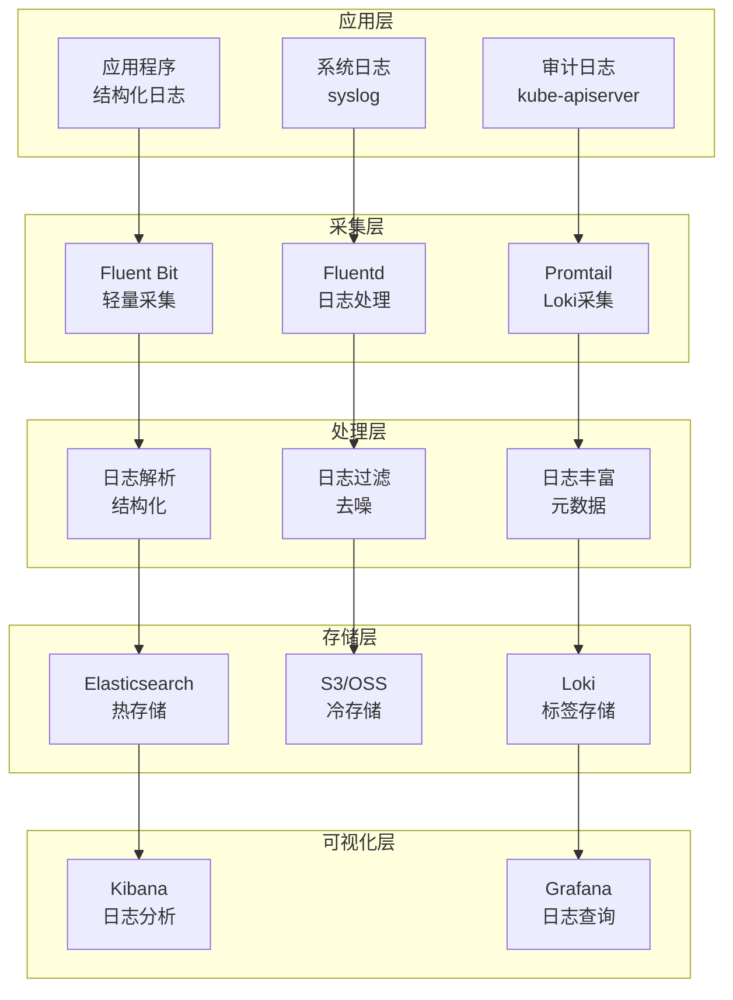

title: Kubernetes 日志管理最佳实践
description: 生产环境 Kubernetes 日志管理配置的最佳实践指南
category: domain-11-production-operations/topic-best-practices/observability
tags:
- kubernetes
- logging
- elasticsearch
- fluentd
- loki
last_updated: 2026-05
difficulty: advanced
reading_level: advanced
audience:
- SRE
- DevOps 工程师
- 平台工程师
estimated_read_time: 20min
intent_queries:
- Kubernetes 日志管理 最佳实践
- 如何 配置 EFK 日志栈
- Kubernetes 日志收集 策略
trigger_keywords:
- Kubernetes
- 日志管理
- EFK
- 日志收集
cross_refs:
- type: domain
  path: ../../domain-06-observability/
  label: 日志管理知识域
- type: domain
  path: ../../domain-06-observability/
  label: 可观测性知识域
- type: best-practice
  path: ./monitoring.md
  label: 监控最佳实践
authors:
- name: KUDIG Team
  role: contributor
k8s_versions:
- '1.28'
- '1.29'
- '1.30'
- '1.31'
- '1.32'
---
# Kubernetes 日志管理最佳实践

> **适用版本**: Kubernetes v1.25-v1.32 | **最后更新**: 2026-05 | **作者**: 系统生成 | **质量等级**: ⭐⭐⭐⭐⭐ 专家级

> **生产环境实战经验总结**: 基于大规模集群日志管理运维经验，涵盖从日志收集到分析的全方位最佳实践

---

## 概述

本指南提供生产环境 Kubernetes 日志管理配置的最佳实践，帮助团队构建高效、可靠、可扩展的日志管理体系。

### 目标读者

- **SRE**: 了解日志架构设计和故障排查
- **DevOps 工程师**: 掌握日志收集和存储配置
- **平台工程师**: 学习日志分析和可视化

### 前置知识

- Kubernetes 核心概念（Pod、Namespace、DaemonSet）
- 日志基础（日志级别、日志格式、日志聚合）
- EFK/ELK 栈基础（Elasticsearch、Fluentd/Fluent Bit、Kibana）

---

## 问题描述

### 常见问题

**问题1：日志丢失**
- **症状**：部分日志缺失
- **原因**：日志收集配置不当，缓冲区溢出
- **影响**：故障排查困难，审计不完整

**问题2：日志存储成本高**
- **症状**：日志存储费用超出预算
- **原因**：日志保留策略不当，存储空间浪费
- **影响**：成本超支，资源浪费

**问题3：日志查询缓慢**
- **症状**：日志查询响应缓慢
- **原因**：索引配置不当，查询优化不足
- **影响**：故障排查延迟，效率低下

---

## 解决方案

### 日志架构设计

**日志架构设计原则**：
- **可靠收集**：确保日志不丢失
- **高效存储**：合理的保留策略和压缩
- **快速查询**：优化的索引和查询
- **成本可控**：分层存储和归档策略

**日志架构图**：



### 关键配置

#### 1. Fluent Bit配置

```yaml
# Fluent Bit DaemonSet配置
apiVersion: apps/v1
kind: DaemonSet
metadata:
  name: fluent-bit
  namespace: logging
spec:
  selector:
    matchLabels:
      name: fluent-bit
  template:
    metadata:
      labels:
        name: fluent-bit
    spec:
      containers:
      - name: fluent-bit
        image: fluent/fluent-bit:2.1
        resources:
          requests:
            memory: 128Mi
            cpu: 100m
          limits:
            memory: 256Mi
            cpu: 200m
        volumeMounts:
        - name: varlog
          mountPath: /var/log
        - name: containers
          mountPath: /var/lib/docker/containers
          readOnly: true
        - name: config
          mountPath: /fluent-bit/etc/
      volumes:
      - name: varlog
        hostPath:
          path: /var/log
      - name: containers
        hostPath:
          path: /var/lib/docker/containers
      - name: config
        configMap:
          name: fluent-bit-config
```

#### 2. Fluent Bit配置文件

```yaml
# Fluent Bit配置
apiVersion: v1
kind: ConfigMap
metadata:
  name: fluent-bit-config
  namespace: logging
data:
  fluent-bit.conf: |
    [SERVICE]
        Flush         5
        Log_Level     info
        Daemon        off
        Parsers_File  parsers.conf
    
    [INPUT]
        Name              tail
        Tag               kube.*
        Path              /var/log/containers/*.log
        Parser            docker
        DB                /var/log/flb_kube.db
        Mem_Buf_Limit     5MB
        Skip_Long_Lines   On
        Refresh_Interval  10
    
    [FILTER]
        Name                kubernetes
        Match               kube.*
        Kube_URL            https://kubernetes.default.svc:443
        Kube_CA_File        /var/run/secrets/kubernetes.io/serviceaccount/ca.crt
        Kube_Token_File     /var/run/secrets/kubernetes.io/serviceaccount/token
        Kube_Tag_Prefix     kube.var.log.containers.
        Merge_Log           On
        K8S-Logging.Parser  On
        K8S-Logging.Exclude Off
    
    [OUTPUT]
        Name            es
        Match           kube.*
        Host            elasticsearch.logging.svc.cluster.local
        Port            9200
        Index           kubernetes
        Type            _doc
        Logstash_Format On
        Logstash_Prefix kubernetes
        Retry_Limit     False
```

#### 3. Elasticsearch配置

```yaml
# Elasticsearch配置
apiVersion: elasticsearch.k8s.elastic.co/v1
kind: Elasticsearch
metadata:
  name: elasticsearch
  namespace: logging
spec:
  version: 8.10.0
  nodeSets:
  - name: default
    count: 3
    config:
      node.store.allow_mmap: false
    podTemplate:
      spec:
        containers:
        - name: elasticsearch
          resources:
            requests:
              memory: 2Gi
              cpu: 1
            limits:
              memory: 4Gi
              cpu: 2
    volumeClaimTemplates:
    - metadata:
        name: elasticsearch-data
      spec:
        accessModes:
        - ReadWriteOnce
        resources:
          requests:
            storage: 100Gi
        storageClassName: fast-ssd
```

---

## 实施步骤

### 前置条件

**硬件要求**：
- Elasticsearch节点：4核CPU, 8GB内存, 100GB SSD
- 存储：高性能SSD，足够存储30天日志

**软件要求**：
- Kubernetes：v1.25+
- Helm：v3.0+
- ECK Operator：v2.9+

### 步骤1：安装ECK Operator

```bash
#!/bin/bash
# 安装ECK Operator

# 1. 安装CRD
kubectl create -f https://download.elastic.co/downloads/eck/2.9.0/crds.yaml

# 2. 安装Operator
kubectl apply -f https://download.elastic.co/downloads/eck/2.9.0/operator.yaml

# 3. 验证安装
kubectl get pods -n elastic-system
```

### 步骤2：部署Elasticsearch

```bash
#!/bin/bash
# 部署Elasticsearch

# 1. 创建命名空间
kubectl create namespace logging

# 2. 部署Elasticsearch
cat <<EOF | kubectl apply -f -
apiVersion: elasticsearch.k8s.elastic.co/v1
kind: Elasticsearch
metadata:
  name: elasticsearch
  namespace: logging
spec:
  version: 8.10.0
  nodeSets:
  - name: default
    count: 3
    config:
      node.store.allow_mmap: false
    podTemplate:
      spec:
        containers:
        - name: elasticsearch
          resources:
            requests:
              memory: 2Gi
              cpu: 1
            limits:
              memory: 4Gi
              cpu: 2
    volumeClaimTemplates:
    - metadata:
        name: elasticsearch-data
      spec:
        accessModes:
        - ReadWriteOnce
        resources:
          requests:
            storage: 100Gi
        storageClassName: fast-ssd
EOF

# 3. 验证部署
kubectl get elasticsearch -n logging
```

### 步骤3：部署Fluent Bit

```bash
#!/bin/bash
# 部署Fluent Bit

# 1. 添加Helm仓库
helm repo add fluent https://fluent.github.io/helm-charts
helm repo update

# 2. 安装Fluent Bit
helm install fluent-bit fluent/fluent-bit \
  --namespace logging \
  --set config.outputs[0].name=es \
  --set config.outputs[0].match=kube.* \
  --set config.outputs[0].host=elasticsearch-es-http.logging.svc.cluster.local \
  --set config.outputs[0].port=9200 \
  --set config.outputs[0].index=kubernetes \
  --set config.outputs[0].logstash_format=On

# 3. 验证部署
kubectl get pods -n logging | grep fluent-bit
```

### 步骤4：部署Kibana

```bash
#!/bin/bash
# 部署Kibana

# 1. 部署Kibana
cat <<EOF | kubectl apply -f -
apiVersion: kibana.k8s.elastic.co/v1
kind: Kibana
metadata:
  name: kibana
  namespace: logging
spec:
  version: 8.10.0
  count: 1
  elasticsearchRef:
    name: elasticsearch
  podTemplate:
    spec:
      containers:
      - name: kibana
        resources:
          requests:
            memory: 1Gi
            cpu: 500m
          limits:
            memory: 2Gi
            cpu: 1
EOF

# 2. 验证部署
kubectl get kibana -n logging
```

---

## 验证方法

### 自动化验证脚本

```bash
#!/bin/bash
# 日志管理配置验证脚本

echo "=== Kubernetes 日志管理配置验证 ==="
echo "验证时间: $(date)"
echo ""

# 1. 检查Elasticsearch状态
echo "1. Elasticsearch状态:"
kubectl get elasticsearch -n logging
echo ""

# 2. 检查Fluent Bit状态
echo "2. Fluent Bit状态:"
kubectl get pods -n logging | grep fluent-bit
echo ""

# 3. 检查Kibana状态
echo "3. Kibana状态:"
kubectl get kibana -n logging
echo ""

# 4. 检查日志索引
echo "4. 日志索引:"
kubectl exec -it elasticsearch-es-default-0 -n logging -- curl -s "localhost:9200/_cat/indices?v"
echo ""

# 5. 测试日志查询
echo "5. 日志查询测试:"
kubectl exec -it elasticsearch-es-default-0 -n logging -- curl -s "localhost:9200/kubernetes/_search?q=*&size=1" | jq '.hits.hits[0]._source'
echo ""

echo "=== 验证完成 ==="
```

### 手动验证清单

**Elasticsearch验证**：
- [ ] Elasticsearch集群运行正常
- [ ] 节点健康状态良好
- [ ] 索引创建正常
- [ ] 查询性能正常

**Fluent Bit验证**：
- [ ] Fluent Bit DaemonSet运行正常
- [ ] 日志收集正常
- [ ] 日志解析正确
- [ ] 日志发送正常

**Kibana验证**：
- [ ] Kibana运行正常
- [ ] 数据源配置正确
- [ ] 日志查询正常
- [ ] 仪表板显示正常

---

## 常见陷阱

### 陷阱1：日志缓冲区溢出

**问题**：日志缓冲区设置过小，导致日志丢失。

**后果**：重要日志丢失，故障排查困难。

**正确做法**：
```yaml
# 配置合适的缓冲区
[INPUT]
    Name              tail
    Tag               kube.*
    Path              /var/log/containers/*.log
    Parser            docker
    DB                /var/log/flb_kube.db
    Mem_Buf_Limit     10MB  # 增大缓冲区
    Skip_Long_Lines   On
    Refresh_Interval  10
```

### 陷阱2：索引策略不当

**问题**：索引策略不当，导致查询缓慢。

**后果**：日志查询延迟，故障排查效率低下。

**正确做法**：
```yaml
# 配置索引生命周期管理
apiVersion: v1
kind: ConfigMap
metadata:
  name: elasticsearch-ilm
data:
  policy.json: |
    {
      "policy": {
        "phases": {
          "hot": {
            "actions": {
              "rollover": {
                "max_size": "10GB",
                "max_age": "1d"
              }
            }
          },
          "warm": {
            "min_age": "7d",
            "actions": {
              "shrink": {
                "number_of_shards": 1
              }
            }
          },
          "cold": {
            "min_age": "30d",
            "actions": {
              "freeze": {}
            }
          },
          "delete": {
            "min_age": "90d",
            "actions": {
              "delete": {}
            }
          }
        }
      }
    }
```

### 陷阱3：日志格式不统一

**问题**：日志格式不统一，导致解析困难。

**后果**：日志分析困难，查询效率低下。

**正确做法**：
```json
// 统一日志格式
{
  "timestamp": "2026-05-19T10:30:00Z",
  "level": "INFO",
  "service": "myapp",
  "trace_id": "abc123",
  "message": "Request processed",
  "duration_ms": 100,
  "status_code": 200
}
```

---

## 相关资源

### 官方文档
- [Kubernetes 日志](https://kubernetes.io/docs/concepts/cluster-administration/logging/)
- [Elasticsearch](https://www.elastic.co/guide/en/elasticsearch/reference/current/index.html)
- [Fluent Bit](https://docs.fluentbit.io/)

### 工具推荐
- [ECK](https://www.elastic.co/guide/en/cloud-on-k8s/current/index.html) - Elasticsearch Operator
- [Fluent Bit](https://fluentbit.io/) - 日志收集
- [Loki](https://grafana.com/oss/loki/) - 日志聚合

### 参考案例
- [EFK部署](https://kubernetes.io/docs/tasks/debug-application-cluster/logging-elasticsearch-kibana/)
- [日志最佳实践](https://kubernetes.io/docs/concepts/cluster-administration/logging/)

---

## 版本历史

| 版本 | 日期 | 变更说明 | 作者 |
|------|------|----------|------|
| v1.0 | 2026-05 | 初始版本 | 系统生成 |

---

**最佳实践原则**: 具体、可操作、可验证、可维护

---

**文档维护**：定期审查和更新，确保与Elasticsearch和Kubernetes版本保持同步

## See Also

- [[domain-11-production-operations/topic-best-practices/migration/09-migration-toolchain.md|09-migration-toolchain]]
- [[domain-11-production-operations/topic-best-practices/migration/10-real-world-case-study.md|10-real-world-case-study]]
- [[domain-11-production-operations/topic-best-practices/observability/monitoring.md|monitoring]]
- [[domain-11-production-operations/topic-best-practices/observability/tracing.md|tracing]]
