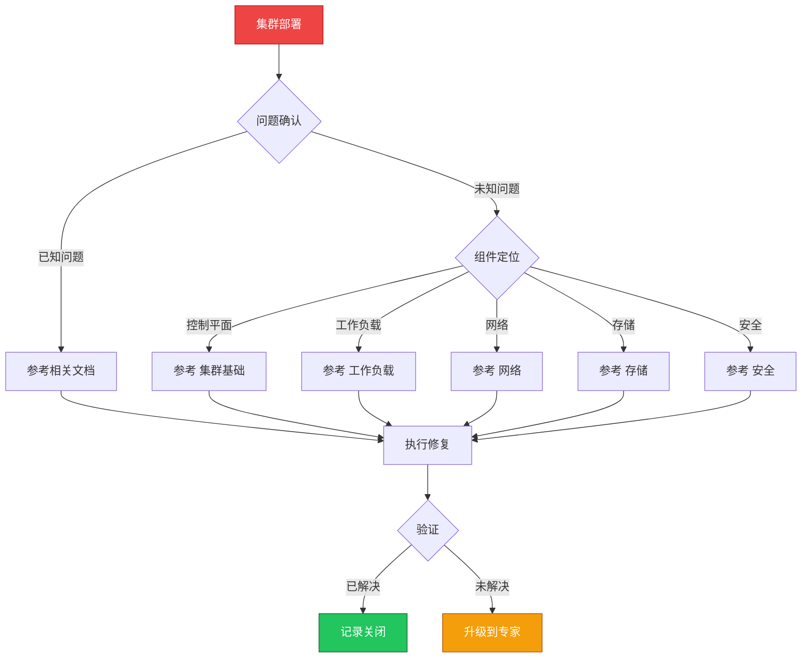

> **生产环境安全提示**
>
> 本文档包含可直接执行的运维命令。执行前请确认：当前目标集群与 Namespace 是否正确；是否具备足够的 RBAC 权限；是否已在非生产环境验证。命令风险等级标注：🔴 高风险（可能造成数据丢失或服务中断）、🟡 中风险（会修改集群状态，但通常可回滚）、🟢 低风险/只读（信息收集，无副作用）。

# 场景: 集群部署

> **场景 ID**: SC-01
> **英文**: Cluster Deployment
> **最后更新**: 2026-05-20

---

## 场景概述

集群部署是从零开始构建 [[Kubernetes|Kubernetes]] 生产环境的第一步。本文档汇总了 KUDIG 知识库中所有与集群部署相关的文档、技能和故障树。

---

## 快速决策树

---

## 相关文档

- 集群基础/12-cluster-deployment-patterns.md
- 集群基础/06-cluster-configuration-parameters.md
- 集群基础/07-upgrade-paths-strategy.md
- 集群基础/03-plane-high-availability.md
- [[平台工程/README.md|README]]
- [[发布变更/部署方案/README.md|README]]

---

## FTA 故障树

- [[故障诊断/FTA故障树/list/apiserver-fta.md|apiserver fta]]
- [[故障诊断/FTA故障树/list/etcd-fta.md|etcd fta]]
- [[故障诊断/FTA故障树/list/node-fta.md|node fta]]

---

## 操作技能

暂无专项技能卡片

---

## 关联场景

| 关联场景 | 说明 |
|---|---|

## Related

- [[entities/kudig-metadata-index.md|README]].md|README]]
- [[skills/apiserver-fta.md|apiserver-fta]]
- [[skills/etcd-fta.md|etcd-fta]]
- [[entities/kubernetes.md|kubernetes]]

<!-- risk-assessed -->
