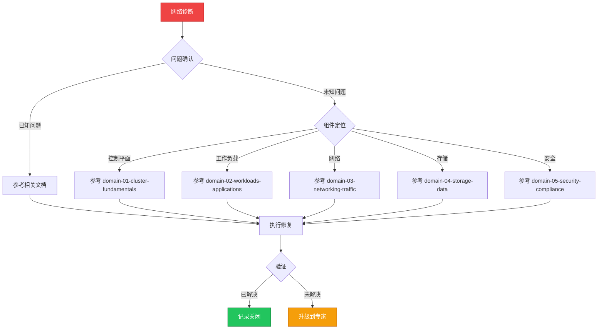

# 场景: 网络诊断

> **场景 ID**: SC-11
> **英文**: Network Diagnosis
> **最后更新**: 2026-05-20

---

## 场景概述

网络问题是 K8s 运维中最常见的问题类型。

---

## 快速决策树

---

## 相关文档

- [[domain-03-networking-traffic/README.md]]
- [[domain-03-networking-traffic/README.md]]
- [[domain-03-networking-traffic/README.md|Domain 5: [[网络诊断速查卡|Networking]] — Terway 专题]]

---

## FTA 故障树

- [[domain-10-troubleshooting-diagnostics/topic-fta/list/dns-fta.md]]
- [[domain-10-troubleshooting-diagnostics/topic-fta/list/service-fta.md]]
- [[domain-10-troubleshooting-diagnostics/topic-fta/list/ingress-fta.md]]
- [[domain-10-troubleshooting-diagnostics/topic-fta/list/networkpolicy-fta.md]]
- [[domain-10-troubleshooting-diagnostics/topic-fta/list/service-fta.md]]

---

## 操作技能

暂无专项技能卡片

---

## 关联场景

| 关联场景 | 说明 |
|---|---|

## Related

- [[references/kudig-metadata-index.md|README]].md|README]]
- [[domain-17-system-foundation/topic-cheat-sheet/k8s.md|k8s]]
- [[skills/service-fta.md|service-fta]]
- [[domain-10-troubleshooting-diagnostics/topic-fta/list/dns-fta.md|dns-fta]]
- [[domain-10-troubleshooting-diagnostics/topic-fta/list/ingress-fta.md|ingress-fta]]
