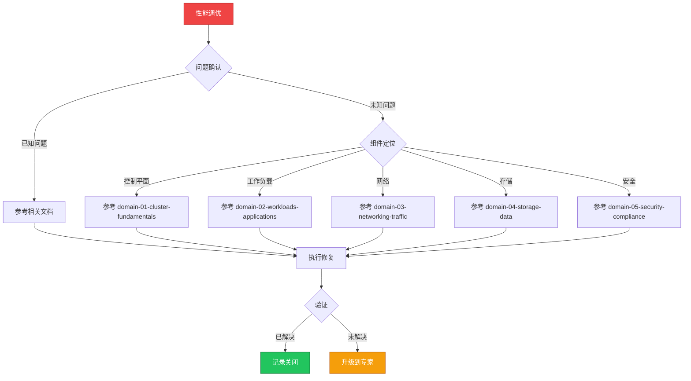

# 场景: 性能调优

> **场景 ID**: SC-04
> **英文**: Performance Tuning
> **最后更新**: 2026-05-20

---

## 场景概述

性能调优涉及集群各个层面的参数调整和资源优化。

---

## 快速决策树

---

## 相关文档

- [[domain-01-cluster-fundamentals/13-performance-tuning-guide.md]]
- [[domain-07-platform-engineering/README.md]]
- [[domain-11-production-operations/README.md]]

---

## FTA 故障树

- [[domain-10-troubleshooting-diagnostics/topic-fta/list/hpa-fta.md]]
- [[domain-10-troubleshooting-diagnostics/topic-fta/list/node-fta.md]]

---

## 操作技能

暂无专项技能卡片

---

## 关联场景

| 关联场景 | 说明 |
|---|---|

## Related

- [[README.md|README]]
- [[domain-06-observability/19-cluster-performance-tuning.md|19-cluster-performance-tuning]]
- [[domain-10-troubleshooting-diagnostics/topic-fta/list/node-fta.md|node-fta]]
- [[domain-10-troubleshooting-diagnostics/topic-fta/list/vpa-fta.md|vpa-fta]]
