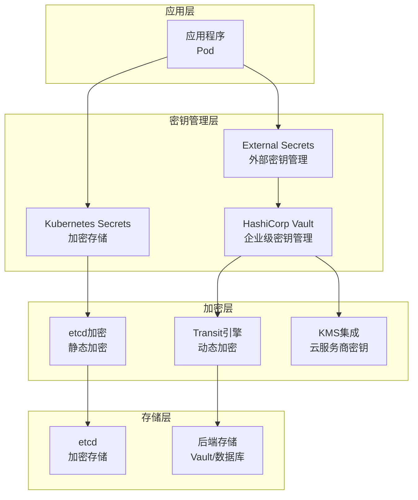

> **生产环境安全提示**
>
> 本文档包含可直接执行的运维命令。执行前请确认：当前目标集群与 Namespace 是否正确；是否具备足够的 RBAC 权限；是否已在非生产环境验证。命令风险等级标注：🔴 高风险（可能造成数据丢失或服务中断）、🟡 中风险（会修改集群状态，但通常可回滚）、🟢 低风险/只读（信息收集，无副作用）。


title: [[Kubernetes|Kubernetes]] 密钥管理最佳实践
description: 生产环境 Kubernetes 密钥管理配置的最佳实践指南
category: 生产运维/topic-best-practices/security
tags:
- kubernetes
- security
- [[Secrets|secrets]]
- vault
- encryption
last_updated: 2026-05
difficulty: advanced
reading_level: advanced
audience:
- 安全工程师
- SRE
- DevOps 工程师
estimated_read_time: 20min
intent_queries:
- Kubernetes 密钥管理 最佳实践
- 如何 配置 Kubernetes Secrets
- Kubernetes Vault 集成
trigger_keywords:
- Kubernetes
- 密钥管理
- Secrets
- Vault
cross_refs:
- type: domain
  path: ../../安全/
  label: 安全知识域
- type: domain
  path: ../../安全/
  label: 云原生安全知识域
- type: best-practice
  path: ./pod-security.md
  label: Pod安全最佳实践
authors:
- name: KUDIG Team
  role: contributor
k8s_versions:
- '1.28'
- '1.29'
- '1.30'
- '1.31'
- '1.32'
---
# Kubernetes 密钥管理最佳实践

> **适用版本**: Kubernetes v1.25-v1.32 | **最后更新**: 2026-05 | **作者**: 系统生成 | **质量等级**: ⭐⭐⭐⭐⭐ 专家级

> **生产环境实战经验总结**: 基于大规模集群密钥管理运维经验，涵盖从Secrets配置到Vault集成的全方位最佳实践

---

## 概述

本指南提供生产环境 Kubernetes 密钥管理配置的最佳实践，帮助团队构建安全、合规、可审计的密钥管理体系。

### 目标读者

- **安全工程师**: 了解Kubernetes密钥管理架构和安全配置
- **SRE**: 掌握密钥轮换和故障排查
- **DevOps 工程师**: 学习Secrets配置和外部密钥管理

### 前置知识

- Kubernetes 核心概念（Secret、ConfigMap、Volume）
- 密钥管理基础（加密、轮换、访问控制）
- 外部密钥管理系统（Vault、KMS）

---

## 问题描述

### 常见问题

**问题1：密钥泄露**
- **症状**：密码、密钥等敏感信息暴露
- **原因**：Secrets未加密存储，访问控制不当
- **影响**：敏感信息泄露，安全风险

**问题2：密钥管理混乱**
- **症状**：密钥分散在各处，难以管理
- **原因**：缺乏统一的密钥管理策略
- **影响**：密钥泄露风险增加，合规问题

**问题3：密钥轮换困难**
- **症状**：密钥过期后难以更新
- **原因**：缺乏自动轮换机制
- **影响**：服务中断，安全风险

---

## 解决方案

### 密钥管理架构

**密钥管理架构设计**：



**架构优势**：
- **分层清晰**：各层职责明确，易于维护
- **安全可控**：多层加密保护
- **集中管理**：统一密钥管理
- **自动轮换**：支持密钥自动轮换

### 关键配置

#### 1. Kubernetes Secrets加密

```yaml
# EncryptionConfiguration
apiVersion: apiserver.config.k8s.io/v1
kind: EncryptionConfiguration
resources:
  - resources:
      - secrets
    providers:
      - aescbc:
          keys:
            - name: key1
              secret: <base64-encoded-secret>
      - identity: {}
```

#### 2. External Secrets配置

```yaml
# External Secrets Operator配置
apiVersion: external-secrets.io/v1beta1
kind: SecretStore
metadata:
  name: vault-backend
  namespace: production
spec:
  provider:
    vault:
      server: "http://vault.example.com:8200"
      path: "secret"
      version: "v2"
      auth:
        kubernetes:
          mountPath: "kubernetes"
          role: "production"
          serviceAccountRef:
            name: "vault-sa"
---
# External Secret配置
apiVersion: external-secrets.io/v1beta1
kind: ExternalSecret
metadata:
  name: database-credentials
  namespace: production
spec:
  refreshInterval: 1h
  secretStoreRef:
    name: vault-backend
    kind: SecretStore
  target:
    name: database-credentials
    creationPolicy: Owner
  data:
  - secretKey: username
    remoteRef:
      key: secret/data/database
      property: username
  - secretKey: password
    remoteRef:
      key: secret/data/database
      property: password
```

#### 3. Vault配置

```yaml
# Vault Kubernetes认证配置
apiVersion: v1
kind: ServiceAccount
metadata:
  name: vault-sa
  namespace: production
automountServiceAccountToken: true
---
# Vault策略配置
apiVersion: v1
kind: ConfigMap
metadata:
  name: vault-policy
  namespace: production
data:
  production-policy.hcl: |
    path "secret/data/database/*" {
      capabilities = ["read", "list"]
    }
    path "secret/data/api-keys/*" {
      capabilities = ["read", "list"]
    }
```

---

## 实施步骤

### 前置条件

**硬件要求**：
- 支持加密的存储系统
- 网络隔离环境

**软件要求**：
- Kubernetes：v1.25+
- External Secrets Operator：v0.8+
- HashiCorp Vault：v1.13+

### 步骤1：配置etcd加密

> ⚠️ **🟠 高危操作** — 影响业务流量或节点状态，需变更工单+影响评估+计划回滚
> - `systemctl stop/restart`：停止/重启系统服务，影响节点上所有容器

> **🔴 高风险操作警告**
>
> 下方命令属于不可逆或高影响操作，执行前请确认：
> - 已备份关键数据与配置
> - 处于批准的变更窗口期
> - 已获得相关责任人授权
> - 已准备回滚或恢复方案
> - 目标集群、Namespace、节点/资源名称正确无误

``` bash
# 🔴 高风险：可能造成数据丢失或服务中断，执行前需备份、变更审批与回滚方案
#!/bin/bash
# 配置etcd加密

# 1. 生成加密密钥
ENCRYPTION_KEY=$(head -c 32 /dev/urandom | base64)

# 2. 创建加密配置
cat <<EOF > encryption-config.yaml
apiVersion: apiserver.config.k8s.io/v1
kind: EncryptionConfiguration
resources:
  - resources:
      - secrets
    providers:
      - aescbc:
          keys:
            - name: key1
              secret: ${ENCRYPTION_KEY}
      - identity: {}
EOF

# 3. 应用加密配置
sudo cp encryption-config.yaml /etc/kubernetes/encryption-config.yaml

# 4. 更新API Server配置
sudo sed -i 's|--encryption-provider-config=.*|--encryption-provider-config=/etc/kubernetes/encryption-config.yaml|' /etc/kubernetes/manifests/kube-apiserver.yaml

# 5. 重启API Server
sudo systemctl restart kubelet

# 6. 验证加密
kubectl get secrets --all-namespaces -o json | jq '.items[] | select(.metadata.name | test("test")) | .data'
```
### 步骤2：安装External Secrets Operator

> ⚠️ **🟡 中危变更** — 变更集群资源状态，建议先 --dry-run 或 diff 确认
> - `helm upgrade/install`：部署/升级 release

``` bash
# 🟡 中风险：会修改集群/资源状态，执行前请确认目标、影响范围与授权
#!/bin/bash
# 安装External Secrets Operator

# 1. 添加Helm仓库
helm repo add external-secrets https://charts.external-secrets.io
helm repo update

# 2. 安装Operator
helm install external-secrets external-secrets/external-secrets \
  -n external-secrets \
  --create-namespace \
  --set installCRDs=true

# 3. 验证安装
kubectl get pods -n external-secrets
```
### 步骤3：配置Vault集成

```bash
#!/bin/bash
# 配置Vault集成

# 1. 启用Kubernetes认证
vault auth enable kubernetes

# 2. 配置Kubernetes认证
vault write auth/kubernetes/config \
  kubernetes_host="https://kubernetes.default.svc"

# 3. 创建策略
vault policy write production - <<EOF
path "secret/data/database/*" {
  capabilities = ["read", "list"]
}
path "secret/data/api-keys/*" {
  capabilities = ["read", "list"]
}
EOF

# 4. 创建角色
vault write auth/kubernetes/role/production \
  bound_service_account_names=vault-sa \
  bound_service_account_namespaces=production \
  policies=production \
  ttl=1h

# 5. 创建测试密钥
vault kv put secret/database username="admin" password="securepassword"
```

### 步骤4：配置密钥轮换

> ⚠️ **🟡 中危变更** — 变更集群资源状态，建议先 --dry-run 或 diff 确认
> - `kubectl apply/create/replace`：创建/变更集群资源

``` bash
# 🟡 中风险：会修改集群/资源状态，执行前请确认目标、影响范围与授权
#!/bin/bash
# 配置密钥轮换

# 1. 创建密钥轮换CronJob
cat <<EOF | kubectl apply -f -
apiVersion: batch/v1
kind: CronJob
metadata:
  name: secret-rotation
  namespace: production
spec:
  schedule: "0 0 * * *"
  jobTemplate:
    spec:
      template:
        spec:
          serviceAccountName: vault-sa
          containers:
          - name: rotation
            image: vault:1.13.0
            command:
            - /bin/sh
            - -c
            - |
              # 轮换数据库密码
              NEW_PASSWORD=$(openssl rand -base64 32)
              vault kv put secret/database username="admin" password="\$NEW_PASSWORD"
              
              # 更新Kubernetes Secret
              kubectl create secret generic database-credentials \
                --from-literal=username=admin \
                --from-literal=password=\$NEW_PASSWORD \
                --dry-run=client -o yaml | kubectl apply -f -
          restartPolicy: OnFailure
EOF

echo "密钥轮换CronJob已创建"
```
---

## 验证方法

### 自动化验证脚本

``` bash
# 🟡 中风险：会修改集群/资源状态，执行前请确认目标、影响范围与授权
#!/bin/bash
# 密钥管理配置验证脚本

echo "=== Kubernetes 密钥管理配置验证 ==="
echo "验证时间: $(date)"
echo ""

# 1. 检查etcd加密配置
echo "1. etcd加密配置:"
kubectl get configmap -n kube-system | grep encryption
echo ""

# 2. 检查External Secrets Operator
echo "2. External Secrets Operator:"
kubectl get pods -n external-secrets
echo ""

# 3. 检查SecretStore
echo "3. SecretStore:"
kubectl get secretstore --all-namespaces
echo ""

# 4. 检查ExternalSecret
echo "4. ExternalSecret:"
kubectl get externalsecret --all-namespaces
echo ""

# 5. 检查Vault状态
echo "5. Vault状态:"
vault status
echo ""

# 6. 测试密钥访问
echo "6. 密钥访问测试:"
kubectl run test-pod --image=busybox --rm -it --restart=Never -- cat /var/secrets/database/password
echo ""

echo "=== 验证完成 ==="
```
### 手动验证清单

**etcd加密验证**：
- [ ] 加密配置正确
- [ ] Secrets已加密存储
- [ ] 加密密钥安全存储
- [ ] 加密性能可接受

**External Secrets验证**：
- [ ] Operator安装成功
- [ ] SecretStore配置正确
- [ ] ExternalSecret同步正常
- [ ] 密钥访问正常

**Vault集成验证**：
- [ ] Vault安装成功
- [ ] Kubernetes认证配置正确
- [ ] 策略配置正确
- [ ] 密钥访问正常

**密钥轮换验证**：
- [ ] 轮换策略配置正确
- [ ] 自动轮换正常
- [ ] 轮换后服务正常
- [ ] 轮换日志完整

---

## 常见陷阱

### 陷阱1：Secrets未加密存储

**问题**：Kubernetes Secrets默认以base64编码存储，未加密。

**后果**：etcd泄露时，Secrets可被直接读取。

**正确做法**：
```yaml
# 配置EncryptionConfiguration
apiVersion: apiserver.config.k8s.io/v1
kind: EncryptionConfiguration
resources:
  - resources:
      - secrets
    providers:
      - aescbc:
          keys:
            - name: key1
              secret: <base64-encoded-secret>
      - identity: {}
```

### 陷阱2：密钥硬编码

**问题**：将密钥硬编码在代码或配置文件中。

**后果**：密钥泄露到代码仓库，安全风险。

**正确做法**：
```yaml
# 使用External Secrets
apiVersion: external-secrets.io/v1beta1
kind: ExternalSecret
metadata:
  name: database-credentials
spec:
  refreshInterval: 1h
  secretStoreRef:
    name: vault-backend
    kind: SecretStore
  target:
    name: database-credentials
    creationPolicy: Owner
  data:
  - secretKey: username
    remoteRef:
      key: secret/data/database
      property: username
  - secretKey: password
    remoteRef:
      key: secret/data/database
      property: password
```

### 陷阱3：密钥访问控制不当

**问题**：所有Pod都可以访问所有Secrets。

**后果**：权限过大，安全风险。

**正确做法**：
```yaml
# 使用RBAC限制访问
apiVersion: rbac.authorization.k8s.io/v1
kind: Role
metadata:
  name: secret-reader
  namespace: production
rules:
- apiGroups: [""]
  resources: ["secrets"]
  verbs: ["get", "list"]
  resourceNames: ["database-credentials"]
---
apiVersion: rbac.authorization.k8s.io/v1
kind: RoleBinding
metadata:
  name: secret-reader-binding
  namespace: production
subjects:
- kind: ServiceAccount
  name: app-sa
  namespace: production
roleRef:
  kind: Role
  name: secret-reader
  apiGroup: rbac.authorization.k8s.io
```

---

## 相关资源

### 官方文档
- [Secrets](https://kubernetes.io/docs/concepts/configuration/secret/)
- [加密静态数据](https://kubernetes.io/docs/tasks/administer-cluster/encrypt-data/)
- [密钥管理](https://kubernetes.io/docs/concepts/configuration/secret/)

### 工具推荐
- [External Secrets Operator](https://external-secrets.io/) - 外部密钥管理
- [HashiCorp Vault](https://www.vaultproject.io/) - 企业级密钥管理
- [Sealed Secrets](https://github.com/bitnami-labs/sealed-secrets) - 加密Secrets

### 参考案例
- [Vault Kubernetes集成](https://www.vaultproject.io/docs/auth/kubernetes)
- [External Secrets配置](https://external-secrets.io/latest/)

---

## 版本历史

| 版本 | 日期 | 变更说明 | 作者 |
|------|------|----------|------|
| v1.0 | 2026-05 | 初始版本 | 系统生成 |

---

**最佳实践原则**: 具体、可操作、可验证、可维护

---

**文档维护**：定期审查和更新，确保与Kubernetes版本和密钥管理工具版本保持同步

## See Also

- network-security
- pod-security
- common-best-practices
- deployment.md|01-local-demo-deployment]]

## Related

- [[concepts/CI-CD 流水线 × Secret 管理.md|CI-CD 流水线 × Secret 管理]] — Cross-reference
- [[concepts/Secret 管理 × 存储模型.md|Secret 管理 × 存储模型]] — Cross-reference
- [[concepts/Pod 生命周期 × Secret 管理.md|Pod 生命周期 × Secret 管理]] — Cross-reference
- [[entities/metal3-io.md|Metal3]] — Cross-reference


<!-- risk-assessed -->
