---
title: "Deployment 异常故障树分析"
category: skills
summary: "<!-- condition: kubectl get rs -n <ns> -o jsonpath='{range .items[?(@.spec.replicas != @.status.readyReplicas)]} {.metadata.name}{\'\n\'}{end}' 显示副本数不匹配 --> - **目标**：覆盖 Deployme..."
tags: ["k8s", "fta", "troubleshooting"]
sources: ["domain-10-troubleshooting-diagnostics/topic-fta/list/deployment-fta.md"]
created: 2026-05-21
updated: 2026-05-21
lifecycle: draft
lifecycle_changed: "2026-05-21"
tier: supporting
base_confidence: 0.7
---

# Deployment 异常故障树分析

<!-- condition: kubectl get rs -n <ns> -o jsonpath='{range .items[?(@.spec.replicas != @.status.readyReplicas)]} {.metadata.name}{\"\n\"}{end}' 显示副本数不匹配 -->

# Deployment 异常 FTA 树

## 适用范围与说明
- **目标**：覆盖 Deployment 滚动更新失败、回滚失败与副本不一致的关键成因与路径。
- **范围**：滚动发布、ReplicaSet 协同、镜像与探针、资源与配额、准入与策略。
- **符号**：
  - **OR 门**：任一子事件成立即可触发父事件
  - **AND 门**：所有子事件同时成立才触发父事件

---

## Mermaid FTA 树

```mermaid
flowchart TD
  TE[顶事件: Deployment 更新异常]
  OR0{{OR}}
  TE --> OR0

  OR0 --> RS[ReplicaSet 协同异常]
  OR0 --> POD[Pod 启动异常]
  OR0 --> STRAT[滚动策略异常]
  OR0 --> RES[资源与配额异常]
  OR0 --> SEC[安全与准入异常]

  RS_OR{{OR}}
  RS --> RS_OR
  RS_OR --> RS1[新旧 RS 版本冲突]
  RS_OR --> RS2[期望副本不收敛]
  RS_OR --> RS3[历史版本清理异常]

  RS1_OR{{OR}}
  RS1 --> RS1_OR
  RS1_OR --> RS1A[新 RS 创建失败]
  RS1_OR --> RS1B[旧 RS 无法缩容]

  POD_OR{{OR}}
  POD --> POD_OR
  POD_OR --> POD1[镜像拉取失败]
  POD_OR --> POD2[探针失败]
  POD_OR --> POD3[CrashLoopBackOff]
  POD_OR --> POD4[调度失败]

  POD1_OR{{OR}}
  POD1 --> POD1_OR
  POD1_OR --> POD1A[镜像不存在]
  POD1_OR --> POD1B[仓库认证失败]
  POD1_OR --> POD1C[网络不可达]

  POD2_OR{{OR}}
  POD2 --> POD2_OR
  POD2_OR --> POD2A[Readiness 探针失败]
  POD2_OR --> POD2B[Liveness 探针失败]
  POD2_OR --> POD2C[Startup 探针超时]

  STRAT_OR{{OR}}
  STRAT --> STRAT_OR
  STRAT_OR --> STR1[maxUnavailable/maxSurge 配置不当]
  STRAT_OR --> STR2[滚动更新卡死]
  STRAT_OR --> STR3[回滚失败]

  AND_STUCK{{AND}}
  STR2 --> AND_STUCK
  AND_STUCK --> STR2A[新 Pod CrashLoop]
  AND_STUCK --> STR2B[maxUnavailable=0]

  AND_ROLLBACK{{AND}}
  STR3 --> AND_ROLLBACK
  AND_ROLLBACK --> STR3A[历史 RS 被删除]
  AND_ROLLBACK --> STR3B[revisionHistoryLimit 过小]

  RES_OR{{OR}}
  RES --> RES_OR
  RES_OR --> RES1[资源不足导致调度失败]
  RES_OR --> RES2[配额限制]
  RES_OR --> RES3[PDB 阻止更新]

  RES1_OR{{OR}}
  RES1 --> RES1_OR
  RES1_OR --> RES1A[节点资源耗尽]
  RES1_OR --> RES1B[资源碎片化]

  SEC_OR{{OR}}
  SEC --> SEC_OR
  SEC_OR --> SEC1[准入 Webhook 拒绝]
  SEC_OR --> SEC2[安全策略阻断]
  SEC_OR --> SEC3[RBAC 权限不足]

  SEC1_OR{{OR}}
  SEC1 --> SEC1_OR
  SEC1_OR --> SEC1A[Webhook 超时]
  SEC1_OR --> SEC1B[策略校验失败]
```



---

## 生产级观测与证据
- **事件**：`ProgressDeadlineExceeded`、`FailedCreate`、`FailedScheduling`、`Unhealthy`、`BackOff`。
- **关键指标**：`kube_deployment_status_replicas_available`、`kube_deployment_status_replicas_unavailable`、`kube_deployment_status_observed_generation`、`kube_replicaset_status_ready_replicas`。
- **关键日志**：`kube-controller-manager`、`kubelet`、`admission webhook` 日志。
- **配置核对**：滚动发布策略（maxUnavailable/maxSurge）、镜像与探针、资源请求与配额、准入策略、revisionHistoryLimit。

---

## JSON 工作流（含与/或门控件）

```json
{
  "flow_steps": [
    { "name": "开始", "action": "start", "step": "start_deploy_fta", "next_step": "event_deploy_abnormal" },
    { "name": "顶事件: Deployment 更新异常", "action": "event", "step": "event_deploy_abnormal", "description": "滚动更新停滞/回滚失败/副本不一致", "next_step": "gate_root_or" },
    { "name": "根因 OR 门", "action": "gate_or", "step": "gate_root_or", "control": "or_gate", "gate_type": "OR", "next_steps": ["cat_rs", "cat_pod", "cat_strat", "cat_res", "cat_sec"] },

    { "name": "ReplicaSet 协同异常", "

## 相关链接

- [[FTA Methodology and Core Principles|FTA 方法论]]
- [[FTA Diagnostic Execution Engine|FTA 诊断执行引擎]]
- [[ts-workloads|工作负载故障排查]]

## Related

- [[deployment]] — Deployment
- [[kubelet]] — kubelet
