> **生产环境安全提示**
>
> 本文档包含可直接执行的运维命令。执行前请确认：当前目标集群与 Namespace 是否正确；是否具备足够的 RBAC 权限；是否已在非生产环境验证。命令风险等级标注：🔴 高风险（可能造成数据丢失或服务中断）、🟡 中风险（会修改集群状态，但通常可回滚）、🟢 低风险/只读（信息收集，无副作用）。

# etcd 异常故障树分析

<!-- condition: kubectl get --raw /healthz/etcd 返回非 200 或 etcdctl endpoint health 显示异常 -->

# etcd 异常 FTA 树

## 适用范围与说明
- **目标**：覆盖 etcd 不可用、写入失败与一致性风险的关键成因与路径。
- **范围**：成员可用性、读写性能、磁盘与 IO、网络与时钟、证书与访问控制、碎片与压缩。
- **符号**：
  - **OR 门**：任一子事件成立即可触发父事件
  - **AND 门**：所有子事件同时成立才触发父事件

---

## Mermaid FTA 树

```mermaid
flowchart TD
  TE[顶事件: etcd 不可用/性能劣化]
  OR0{{OR}}
  TE --> OR0

  OR0 --> QUO[多数成员不可用]
  OR0 --> IO[磁盘与 IO 异常]
  OR0 --> NET[网络与时钟异常]
  OR0 --> CERT[证书与访问异常]
  OR0 --> PERF[性能与碎片化异常]

  %% 多数成员不可用分支 - 扩展到3-4层
  QUO_OR{{OR}}
  QUO --> QUO_OR
  QUO_OR --> QUO1[成员宕机/重启]
  QUO_OR --> QUO2[leader 选举异常]
  QUO_OR --> QUO3[成员脑裂]

  QUO1_OR{{OR}}
  QUO1 --> QUO1_OR
  QUO1_OR --> QUO1A[进程 OOM]
  QUO1_OR --> QUO1B[节点宕机]
  QUO1_OR --> QUO1C[资源不足无法启动]

  QUO2_OR{{OR}}
  QUO2 --> QUO2_OR
  QUO2_OR --> QUO2A[选举超时]
  QUO2_OR --> QUO2B[票数分裂]
  QUO2_OR --> QUO2C[leader 频繁切换]

  QUO3_OR{{OR}}
  QUO3 --> QUO3_OR
  QUO3_OR --> QUO3A[网络分区导致脑裂]
  QUO3_OR --> QUO3B[成员配置不一致]

  %% 磁盘与 IO 异常分支 - 扩展到3-4层 + AND 门
  IO_OR{{OR}}
  IO --> IO_OR
  IO_OR --> IO1[磁盘空间问题]
  IO_OR --> IO2[IO 性能问题]
  IO_OR --> IO3[数据损坏]

  IO1_OR{{OR}}
  IO1 --> IO1_OR
  IO1_OR --> IO1A[磁盘满]
  IO1_OR --> IO1B[quota-backend-bytes 超限]
  IO1_OR --> IO1C[快照文件过大]

  IO2_AND{{AND}}
  IO2 --> IO2_AND
  IO2_AND --> IO2A[WAL fsync 延迟高]
  IO2_AND --> IO2B[磁盘非 SSD]

  IO3_OR{{OR}}
  IO3 --> IO3_OR
  IO3_OR --> IO3A[WAL 损坏]
  IO3_OR --> IO3B[数据库文件损坏]
  IO3_OR --> IO3C[快照损坏]

  %% 网络与时钟异常分支 - 扩展到3-4层 + AND 门
  NET_OR{{OR}}
  NET --> NET_OR
  NET_OR --> NET1[成员间网络问题]
  NET_OR --> NET2[时钟同步问题]
  NET_OR --> NET3[防火墙/端口问题]

  NET1_OR{{OR}}
  NET1 --> NET1_OR
  NET1_OR --> NET1A[网络延迟高]
  NET1_OR --> NET1B[丢包严重]
  NET1_OR --> NET1C[网络分区]

  NET2_AND{{AND}}
  NET2 --> NET2_AND
  NET2_AND --> NET2A[时间漂移超过容忍]
  NET2_AND --> NET2B[NTP 服务异常]

  NET3_OR{{OR}}
  NET3 --> NET3_OR
  NET3_OR --> NET3A[peer 端口 2380 被阻断]
  NET3_OR --> NET3B[client 端口 2379 被阻断]

  %% 证书与访问异常分支 - 扩展到3-4层
  CERT_OR{{OR}}
  CERT --> CERT_OR
  CERT_OR --> CERT1[证书问题]
  CERT_OR --> CERT2[认证问题]
  CERT_OR --> CERT3[权限问题]

  CERT1_OR{{OR}}
  CERT1 --> CERT1_OR
  CERT1_OR --> CERT1A[证书过期]
  CERT1_OR --> CERT1B[证书链不完整]
  CERT1_OR --> CERT1C[peer/client 证书不匹配]

  CERT2_OR{{OR}}
  CERT2 --> CERT2_OR
  CERT2_OR --> CERT2A[client 认证失败]
  CERT2_OR --> CERT2B[peer 认证失败]

  CERT3_OR{{OR}}
  CERT3 --> CERT3_OR
  CERT3_OR --> CERT3A[RBAC auth 配置错误]
  CERT3_OR --> CERT3B[用户权限不足]

  %% 性能与碎片化异常分支 - 扩展到3-4层
  PERF_OR{{OR}}
  PERF --> PERF_OR
  PERF_OR --> PERF1[碎片化问题]
  PERF_OR --> PERF2[请求压力问题]
  PERF_OR --> PERF3[压缩问题]

  PERF1_OR{{OR}}
  PERF1 --> PERF1_OR
  PERF1_OR --> PERF1A[长期未压缩]
  PERF1_OR --> PERF1B[频繁更新导致碎片]

  PERF2_OR{{OR}}
  PERF2 --> PERF2_OR
  PERF2_OR --> PERF2A[读请求峰值]
  PERF2_OR --> PERF2B[写请求峰值]
  PERF2_OR --> PERF2C[Watch 连接过多]

  PERF3_OR{{OR}}
  PERF3 --> PERF3_OR
  PERF3_OR --> PERF3A[自动压缩未启用]
  PERF3_OR --> PERF3B[压缩期间性能下降]
```

---

## 生产级观测与证据
- **事件**：`etcdserver: request timed out`、`leader changed` 频繁、`mvcc: database space exceeded`。
-

## 相关链接

- [[skills/FTA Methodology and Core Principles.md|FTA 方法论]]
- [[skills/FTA Diagnostic Execution Engine.md|[[FTA 诊断执行引擎|FTA 诊断执行引擎]]]]
- etcd 故障排查

## Related

- [[skills/FTA-Driven Runbook Automation.md|FTA-Driven Runbook Automation]] — FTA-Driven Runbook Automation
- [[cluster-upgrade-fta]] — 集群升级异常故障树分析
- [[job-cronjob-fta]] — Job/CronJob 异常故障树分析
- [[skills/skill-README.md|skill-README]] — topic-skills — 工单智能体 Kubernetes 诊断 Skill 库
- [[etcd]] — etcd

- [[故障诊断/FTA故障树/list/etcd-fta.md|etcd 异常故障树分析]]
- [[生态参考/领域索引/backup-dr-index.md|Backup & DR 备份与灾备知识图谱索引]]
- [[生态参考/领域索引/etcd-index.md|etcd 知识图谱索引]]

<!-- risk-assessed -->
