---
title: "Service Mesh(Istio) 异常故障树分析"
category: skills
summary: "<!-- condition: kubectl get pods -n istio-system -o jsonpath='{range .items[?(@.status.phase!='Running')]}{.metadata.name}{\'\n\'}{end}' 显示 Istio 控制面异常 --> - **目标**：覆盖 Istio 控制面..."
tags: ["k8s", "fta", "troubleshooting"]
sources: ["domain-10-troubleshooting-diagnostics/topic-fta/list/service-mesh-istio-fta.md"]
created: 2026-05-21
updated: 2026-05-21
lifecycle: draft
lifecycle_changed: "2026-05-21"
tier: supporting
base_confidence: 0.7
---

# Service Mesh(Istio) 异常故障树分析

<!-- condition: kubectl get pods -n istio-system -o jsonpath='{range .items[?(@.status.phase!="Running")]}{.metadata.name}{\"\n\"}{end}' 显示 Istio 控制面异常 -->

# Service Mesh（Istio）异常 FTA 树

## 适用范围与说明
- **目标**：覆盖 Istio 控制面不可用、Sidecar 注入失败、xDS 配置推送异常、mTLS 证书问题、数据面流量异常与多集群联邦故障的关键成因与路径。
- **范围**：istiod 控制面、Sidecar 注入器（MutatingWebhook）、xDS/Envoy 配置同步、mTLS 证书生命周期、VirtualService/DestinationRule 流量策略、Gateway、多集群/联邦。
- **符号**：
  - **OR 门**：任一子事件成立即可触发父事件
  - **AND 门**：所有子事件同时成立才触发父事件

---

## Mermaid FTA 树

```mermaid
flowchart TD
  TE["顶事件: Service Mesh 异常<br/>流量中断 / 注入失败 / 策略不生效"]
  OR0{{OR}}
  TE --> OR0

  %% ======== 一级分类 ========
  OR0 --> CAT_CP["A. 控制面（istiod）异常"]
  OR0 --> CAT_INJ["B. Sidecar 注入异常"]
  OR0 --> CAT_XDS["C. xDS 配置/推送异常"]
  OR0 --> CAT_MTLS["D. mTLS/证书异常"]
  OR0 --> CAT_DATA["E. 数据面流量异常"]
  OR0 --> CAT_MULTI["F. 多集群/联邦异常"]

  %% ======== A. 控制面 ========
  A_OR{{OR}}
  CAT_CP --> A_OR
  A_OR --> A1["A1. istiod Pod 不可用<br/>崩溃 / OOM / 调度失败"]
  A_OR --> A2["A2. istiod 资源耗尽<br/>CPU/内存/连接数"]
  A_OR --> A3["A3. istiod 版本不兼容<br/>与 K8s/Envoy 版本冲突"]
  A_OR --> A4["A4. 控制面证书过期<br/>CA 签发异常"]

  %% ======== B. Sidecar 注入 ========
  B_OR{{OR}}
  CAT_INJ --> B_OR
  B_OR --> B1["B1. Webhook 服务不可达<br/>istiod Service 异常"]
  B_OR --> B2["B2. Namespace 标签缺失<br/>istio-injection=enabled"]
  B_OR --> B3["B3. 注入策略冲突<br/>Sidecar 配置覆盖"]
  B_OR --> B4_AND["B4. 注入静默失败<br/>(AND 门)"]

  B4_AND_GATE{{"AND"}}
  B4_AND --> B4_AND_GATE
  B4_AND_GATE --> B4C1["Webhook failurePolicy=Ignore"]
  B4_AND_GATE --> B4C2["istiod 不可用"]

  %% ======== C. xDS 配置 ========
  C_OR{{OR}}
  CAT_XDS --> C_OR
  C_OR --> C1["C1. xDS 推送失败<br/>Envoy 拒绝配置"]
  C_OR --> C2["C2. 配置版本不一致<br/>Envoy 使用旧配置"]
  C_OR --> C3["C3. xDS 推送风暴<br/>大量配置变更"]
  C_OR --> C4["C4. Envoy 配置过大<br/>内存溢出"]
  C_OR --> C5_AND["C5. 配置推送延迟<br/>(AND 门)"]

  C5_AND_GATE{{"AND"}}
  C5_AND --> C5_AND_GATE
  C5_AND_GATE --> C5C1["Service/Endpoint 数量巨大"]
  C5_AND_GATE --> C5C2["istiod 资源不足处理不过来"]

  %% ======== D. mTLS/证书 ========
  D_OR{{OR}}
  CAT_MTLS --> D_OR
  D_OR --> D1["D1. 证书过期<br/>自动轮换失败"]
  D_OR --> D2["D2. 证书链不完整<br/>中间 CA 缺失"]
  D_OR --> D3["D3. mTLS 模式不匹配<br/>STRICT vs PERMISSIVE 冲突"]
  D_OR --> D4["D4. SDS 推送失败<br/>证书未送达 Envoy"]
  D_OR --> D5_AND["D5. mTLS 握手失败<br/>(AND 门)"]

  D5_AND_GATE{{"AND"}}
  D5_AND --> D5_AND_GATE
  D5_AND_GATE --> D5C1["PeerAuthentication 设为 STRICT"]
  D5_AND_GATE --> D5C2["对端未注入 Sidecar"]

  %% ======== E. 数据面流量 ========
  E_OR{{OR}}
  CAT_DATA --> E_OR
  E_OR --> E1["E1. VirtualService 路由错误<br/>匹配规则/权重问题"]
  E_OR --> E2["E2. DestinationRule 异常<br/>子集/负载均衡错误"]
  E_OR --> E3["E3. Envoy 资源耗尽<br/>连接数/内存/CPU"]
  E_OR --> E4["E4. 重试/超时配置不当<br/>重试风暴"]
  E_OR --> E5["E5. Gateway 配置错误<br/>入口流量异常"]

  %% ======== F. 多集群 ========
  F_OR{{OR}}
  CAT_MULTI --> F_OR
  F_OR --> F1["F1. 跨集群服务发现失败<br/>Remote Secret 异常"]
  F_OR --> F2["F2. 东西向网关不可达<br/>跨集群通信中断"]
  F_OR --> F3["F3. 信任域不一致<br/>跨集群 mTLS 失败"]
```

---

## 生产级观测与证据

| 类别 | 关键信号 |
|------|---------|
| **事件** | Sidecar 注入 Webhook 失败事件、Pod 

## 相关链接

- [[FTA Methodology and Core Principles|FTA 方法论]]
- [[FTA Diagnostic Execution Engine|FTA 诊断执行引擎]]
- [[ts-networking|网络故障排查]]

## Related

- [[istio]] — Istio
- [[envoy]] — Envoy
