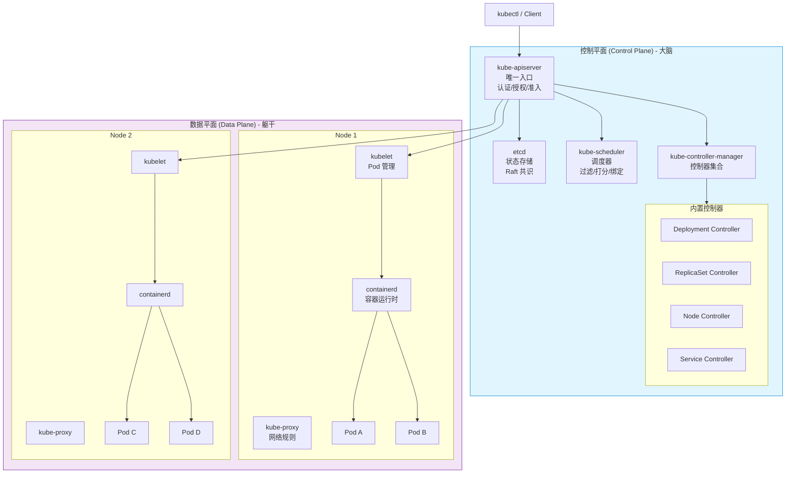
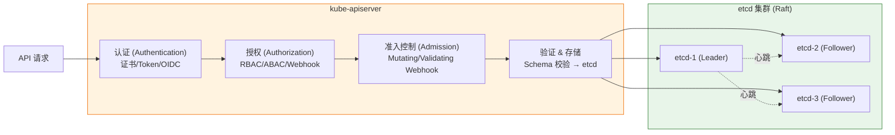
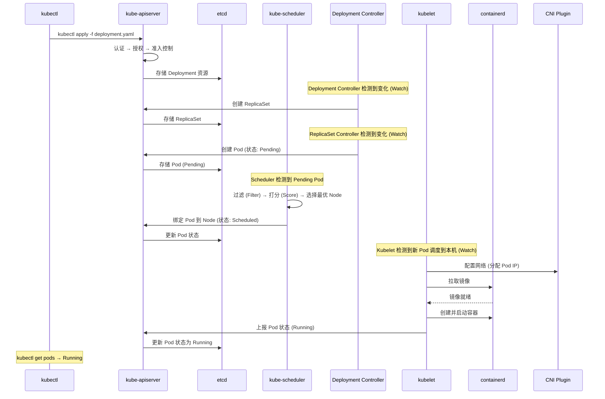

# [[Kubernetes|Kubernetes]] 架构与基础概念全栈培训

> **适用版本**: Kubernetes v1.28 - v1.32 | **文档类型**: 基础架构通识
> **核心原则**: 理解分布式系统设计哲学、掌握集群核心组件、构建云原生思维

---

<!-- chunk: 演讲概述 -->## 演讲概述

## 目标受众

- Kubernetes 初学者：从零建立云原生思维模型
- 运维工程师：深入理解控制平面与数据平面的协作机制
- 开发人员：理解应用在 Kubernetes 上运行的底层逻辑
- 架构师：掌握分布式系统设计哲学，指导技术选型

## 预计时长

| 阶段 | 内容 | 时长 |
|------|------|------|
| 第一阶段 | 核心概念与术语体系 | 30 分钟 |
| 第二阶段 | 控制平面架构深度解析 | 45 分钟 |
| 第三阶段 | 声明式 API 与控制器模式 | 30 分钟 |
| 第四阶段 | 请求完整生命周期追踪 | 30 分钟 |
| 第五阶段 | 生产环境高可用与 [[etcd|etcd]] 运维 | 30 分钟 |
| 第六阶段 | 实战演示与动手实验 | 40 分钟 |
| Q&A | 互动问答 | 15 分钟 |
| **合计** | | **约 3.5 小时** |

## 核心学习目标

完成本次培训后，学员能够：

1. 准确描述 Kubernetes 控制平面和数据平面的组件职责
2. 跟踪一个 `kubectl apply` 请求从提交到 Pod 运行的完整生命周期
3. 理解声明式 API 和控制器模式的设计哲学
4. 解释 etcd 在集群中的关键角色及其高可用机制
5. 执行基本的集群健康检查和故障定位操作
6. 设计符合生产要求的 etcd 备份恢复策略

## 核心要点

1. Kubernetes 是分布式系统的"操作系统"，不是简单的容器编排工具
2. 声明式 API 是 Kubernetes 的设计灵魂
3. 控制平面（大脑）和数据平面（躯干）的协作机制
4. etcd 是整个集群状态的唯一真实来源
5. 理解请求从 `kubectl apply` 到 Pod 运行的完整生命周期

---

<!-- chunk: 课程大纲 -->## 课程大纲

| 序号 | 章节 | 关键知识点 | 对应演示 |
|------|------|-----------|---------|
| 1 | 什么是 Kubernetes | 核心功能、设计哲学、与 Docker 关系 | 演示 1 |
| 2 | 核心术语清单 | Pod/Node/Namespace/Label/Annotation/Controller | 演示 1 |
| 3 | 声明式 API vs 命令式 API | 对比分析、GitOps 思维 | 演示 2 |
| 4 | 控制器模式 | Watch-Diff-Reconcile 循环 | 演示 3 |
| 5 | 控制平面组件 | API Server/etcd/Scheduler/Controller Manager | 演示 4 |
| 6 | 数据平面组件 | [[kubelet|kubelet]]/kube-proxy/containerd | 演示 4 |
| 7 | 请求完整生命周期 | 从 apply 到 Pod Running 的每一步 | 演示 2 |
| 8 | etcd 深度解析 | Raft 共识、性能要求、备份恢复 | 演示 5 |
| 9 | 资源隔离与配额 | Namespace/ResourceQuota/LimitRange | 演示 6 |
| 10 | 生产环境高可用 | 多 Master、etcd 集群、灾备方案 | 演示 5 |

---

<!-- chunk: 核心概念讲解 -->## 核心概念讲解

## 什么是 Kubernetes？

Kubernetes（简称 K8s）是一个开源的容器编排平台，最初由 Google 设计并捐赠给 Cloud Native Computing Foundation（CNCF）。它的核心定位是**分布式系统的操作系统**（Cloud OS）——正如操作系统管理 CPU、内存、磁盘等硬件资源，Kubernetes 管理的是节点、网络、存储等分布式资源。

Google 每周运行超过 20 亿个容器，Kubernetes 的设计灵感来源于 Google 内部的 Borg 系统。Borg 系统的论文是理解 Kubernetes 设计哲学的重要参考文献。

**核心功能全景：**

| 功能 | 说明 | 类比 |
|------|------|------|
| 自愈 (Self-healing) | 自动重启失败容器、替换和重新调度 Pod | 免疫系统 |
| 弹性扩缩 (Scaling) | 根据负载自动增减副本数 | 红绿灯调控 |
| 服务发现与负载均衡 | 自动为 Pod 分配 DNS 名称和 IP | 电话簿 + 分流器 |
| 滚动更新与回滚 | 零停机更新应用版本 | 换轮胎不停车 |
| 配置与密钥管理 | 统一管理环境变量、证书、密码 | 保险柜 |
| 存储编排 | 自动挂载各种存储系统 | USB 热插拔 |
| 批处理 | 支持一次性任务和定时任务 | 流水线调度 |

**设计哲学：声明式 API (Declarative API)**

这是理解 Kubernetes 最关键的概念。传统的命令式（Imperative）做法是告诉系统"怎么做"：

```bash
# 命令式：告诉系统每一步怎么做
docker run -d --name nginx -p 80:80 nginx:1.25
docker stop nginx
docker rm nginx
docker run -d --name nginx -p 80:80 nginx:1.26
```

而 Kubernetes 的声明式做法是告诉系统"我要什么"：

```yaml
apiVersion: apps/v1
kind: Deployment
metadata:
  name: nginx
spec:
  replicas: 3
  selector:
    matchLabels:
      app: nginx
  template:
    metadata:
      labels:
        app: nginx
    spec:
      containers:
      - name: nginx
        image: nginx:1.25
        ports:
        - containerPort: 80
        resources:
          requests:
            cpu: 100m
            memory: 128Mi
          limits:
            cpu: 500m
            memory: 512Mi
```

你声明"我要 3 个 Nginx 副本"，Kubernetes 会持续工作来"对齐"到这个状态。如果有人不小心删了一个 Pod，Kubernetes 会自动创建新的来补齐——这就是自愈的本质。

**声明式 vs 命令式对比：**

| 维度 | 命令式 | 声明式 |
|------|--------|--------|
| 思维模式 | 告诉系统"怎么做" | 告诉系统"我要什么" |
| 状态管理 | 隐式（靠操作历史） | 显式（YAML 即状态） |
| 可审计性 | 困难 | 天然支持（Git 友好） |
| 幂等性 | 不保证 | 天然幂等 |
| 冲突处理 | 后执行覆盖先执行 | 自动合并或报错 |
| 适用场景 | 临时调试 | 生产环境 |

## 核心术语清单

| 术语 | 定义 | 类比 |
|------|------|------|
| **Pod** | 最小调度单位，一个或多个容器的组合。同一 Pod 内的容器共享网络（同一 IP）和存储（Volume） | 一间办公室里的人 |
| **Node** | 集群中的工作机器（物理机或虚拟机），运行 kubelet 和容器运行时 | 一栋大楼 |
| **Namespace** | 逻辑隔离环境，用于资源分组和权限控制。不同 Namespace 的资源互相隔离 | 大楼里的楼层 |
| **Context** | kubectl 连接集群的凭证和环境定义，存储在 kubeconfig 文件中 | 门禁卡 |
| **Label** | 附加在资源上的键值对，用于筛选和组织资源 | 员工工牌上的部门标签 |
| **Annotation** | 附加在资源上的键值对，用于存储非标识性元数据（如构建信息、联系方式） | 员工档案里的备注 |
| **Controller** | 持续监控并维护资源状态的控制器，实现声明式 API 的核心机制 | 巡视的管理员 |
| **ReplicaSet** | 确保 Pod 副本数始终符合期望的控制器 | 部门编制管理 |
| **Deployment** | 管理 ReplicaSet 的生命周期，支持滚动更新和回滚 | 项目经理 |
| **Service** | 为一组 Pod 提供稳定的访问入口（固定 IP 和 DNS 名称） | 公司前台总机 |
| **ConfigMap** | 存储非敏感配置数据的键值对 | 公告栏 |
| **Secret** | 存储敏感数据（密码、证书、Token） | 保险柜 |

## 控制器模式 (Controller Pattern)

控制器模式是 Kubernetes 极其重要的设计模式，几乎所有的 Kubernetes 功能都基于此实现。理解控制器模式，就理解了 Kubernetes 的运行本质。

```
   ┌──────────────────────────────────────────────────┐
   │                 Controller Loop                    │
   │                                                    │
   │   ┌──────────┐     ┌──────────┐     ┌──────────┐ │
   │   │  Watch    │────>│  Diff    │────>│  Reconcile│ │
   │   │ (监听变化) │     │ (对比差异) │     │ (执行对齐) │ │
   │   └──────────┘     └──────────┘     └──────────┘ │
   │         ^                               |         │
   │         └───────────────────────────────┘         │
   │                  (持续循环)                         │
   └──────────────────────────────────────────────────┘
```

1. **Watch（监听）**：通过 Informer 机制监听 API Server 的资源变化。Informer 维护了一个本地缓存（Store），避免每次都访问 API Server
2. **Diff（对比）**：比较期望状态（Spec）和实际状态（Status）。Spec 由用户通过 YAML 定义，Status 由控制器上报
3. **Reconcile（对齐）**：执行操作使实际状态趋向期望状态。这个过程是幂等的——多次执行结果一致

**Kubernetes 内置控制器一览：**

| 控制器 | 职责 | 运行位置 |
|--------|------|---------|
| Deployment Controller | 管理 ReplicaSet 的创建和滚动更新 | kube-controller-manager |
| ReplicaSet Controller | 维护 Pod 副本数 | kube-controller-manager |
| Node Controller | 监控节点健康状态，处理 NotReady 节点 | kube-controller-manager |
| Service Controller | 管理 Service 和 Endpoints | kube-controller-manager |
| Namespace Controller | 管理命名空间生命周期 | kube-controller-manager |
| Job Controller | 管理一次性任务的执行 | kube-controller-manager |
| CronJob Controller | 管理定时任务的调度 | kube-controller-manager |
| PV Controller | 管理 PV/PVC 绑定 | kube-controller-manager |
| kubelet | 管理 Pod 生命周期、容器健康检查 | 每个 Node 上 |

这个循环永不停止，确保集群始终处于你声明的状态。这就是为什么 Kubernetes 被称为"自愈系统"——只要你声明了期望状态，它就会持续工作来维持这个状态。

---

<!-- chunk: 架构图 -->## 架构图

## Kubernetes 整体架构



## 控制平面组件详解



**控制平面组件职责：**

| 组件 | 职责 | 类比 | 监听端口 |
|------|------|------|---------|
| **kube-apiserver** | 集群 API 的唯一入口，所有操作都经过它。负责认证、授权、准入控制 | 公司前台 | 6443 (HTTPS) |
| **etcd** | 强一致性分布式键值数据库，存储集群所有状态数据。是唯一的状态存储 | 公司档案室 | 2379 (Client) |
| **kube-scheduler** | 监听未调度的 Pod，根据资源、策略、约束选择最优 Node | HR 分配工位 | 10259 (HTTPS) |
| **kube-controller-manager** | 运行各种控制器的进程，负责维护集群状态 | 各部门经理 | 10257 (HTTPS) |

**数据平面组件职责：**

| 组件 | 职责 | 类比 | 监听端口 |
|------|------|------|---------|
| **kubelet** | Node 上的代理，负责 Pod 生命周期管理，向 API Server 汇报状态 | 楼层管理员 | 10250 (HTTPS) |
| **kube-proxy** | 维护 Service 的网络规则（iptables/IPVS），实现服务发现和负载均衡 | 楼层前台转接 | 10256 (Metrics) |
| **Container Runtime** | 运行容器的软件（如 containerd、CRI-O） | 工位上的电脑 | N/A |

## 请求完整生命周期



**详细步骤解析：**

| 步骤 | 组件 | 动作 | 涉及 API |
|------|------|------|---------|
| 1 | kubectl | 读取 YAML，发送 POST 请求到 API Server | POST /apis/apps/v1/namespaces/{ns}/deployments |
| 2 | API Server | 认证（验证客户端身份） | Authentication Module |
| 3 | API Server | 授权（检查 RBAC 规则） | Authorization Module |
| 4 | API Server | 准入控制（Mutating → Validating） | Admission Chain |
| 5 | API Server | 验证 Schema 并写入 etcd | etcd txn (transaction) |
| 6 | Deployment Controller | Watch 到新 Deployment，创建 ReplicaSet | POST /apis/apps/v1/namespaces/{ns}/replicasets |
| 7 | ReplicaSet Controller | Watch 到新 ReplicaSet，创建 Pod | POST /api/v1/namespaces/{ns}/pods |
| 8 | Scheduler | Watch 到 Pending Pod，执行调度算法 | POST /api/v1/namespaces/{ns}/pods/{name}/binding |
| 9 | kubelet | Watch 到 Pod 绑定到本机，调用 CRI/CNI | CRI: CreateContainer / CNI: AddNetwork |
| 10 | kubelet | 上报 Pod 状态到 API Server | PUT /api/v1/namespaces/{ns}/pods/{name}/status |

---

<!-- chunk: 实战演示步骤 -->## 实战演示步骤

## 演示 1：集群信息探索

```bash
# 查看集群信息
kubectl cluster-info
# 预期输出:
# Kubernetes control plane is running at https://172.16.0.100:6443
# CoreDNS is running at https://172.16.0.100:6443/api/v1/namespaces/kube-system/services/kube-dns:dns/proxy

# 查看集群版本
kubectl version --short
# 预期输出:
# Client Version: v1.29.2
# Server Version: v1.29.2

# 查看节点列表
kubectl get nodes -o wide
# 预期输出:
# NAME     STATUS   ROLES           AGE   VERSION   INTERNAL-IP     OS-IMAGE       KERNEL-VERSION
# master   Ready    control-plane   30d   v1.29.2   172.16.0.100    Ubuntu 22.04   5.15.0-91
# node1    Ready    <none>          30d   v1.29.2   172.16.0.101    Ubuntu 22.04   5.15.0-91
# node2    Ready    <none>          30d   v1.29.2   172.16.0.102    Ubuntu 22.04   5.15.0-91

# 查看节点详情（关注 Capacity 和 Allocatable）
kubectl describe node node1 | grep -A 10 "Capacity"
# 预期输出:
# Capacity:
#   cpu:                8
#   ephemeral-storage:  103080204Ki
#   hugepages-1Gi:      0
#   hugepages-2Mi:      0
#   memory:             32829844Ki
#   pods:               110
# Allocatable:
#   cpu:                7500m
#   memory:             31831244Ki
#   pods:               110

# 查看集群中所有命名空间
kubectl get namespaces
# 预期输出:
# NAME              STATUS   AGE
# default           Active   30d
# kube-node-lease   Active   30d
# kube-public       Active   30d
# kube-system       Active   30d

# 查看 kube-system 命名空间下的核心组件
kubectl get pods -n kube-system -o wide
# 预期输出:
# NAME                             READY   STATUS    RESTARTS   AGE   IP              NODE
# coredns-5d78c9869d-abc12         1/1     Running   0          30d   10.244.0.3      master
# etcd-master                      1/1     Running   0          30d   172.16.0.100    master
# kube-apiserver-master            1/1     Running   0          30d   172.16.0.100    master
# kube-controller-manager-master   1/1     Running   0          30d   172.16.0.100    master
# kube-proxy-xxxxx                 1/1     Running   0          30d   172.16.0.101    node1
# kube-scheduler-master            1/1     Running   0          30d   172.16.0.100    master
```

## 演示 2：部署第一个应用并追踪生命周期

> ⚠️ **🟡 中危变更** — 变更集群资源状态，建议先 --dry-run 或 diff 确认
> - `kubectl apply/create/replace`：创建/变更集群资源

```bash
# 步骤 1: 创建 Deployment
kubectl create deployment nginx-demo --image=nginx:1.25 --replicas=3
# 预期输出: deployment.apps/nginx-demo created

# 步骤 2: 观察资源创建过程（开两个终端窗口）
# 终端 1: 实时观察 Pod 创建
kubectl get pods -l app=nginx-demo -w
# 预期输出:
# NAME                          READY   STATUS    RESTARTS   AGE
# nginx-demo-7c6b4f7d9b-abc12   0/1     Pending   0          0s
# nginx-demo-7c6b4f7d9b-def34   0/1     Pending   0          0s
# nginx-demo-7c6b4f7d9b-ghi56   0/1     Pending   0          0s
# nginx-demo-7c6b4f7d9b-abc12   0/1     ContainerCreating   0          0s
# nginx-demo-7c6b4f7d9b-def34   0/1     ContainerCreating   0          0s
# nginx-demo-7c6b4f7d9b-ghi56   0/1     ContainerCreating   0          0s
# nginx-demo-7c6b4f7d9b-abc12   1/1     Running              0          5s
# nginx-demo-7c6b4f7d9b-def34   1/1     Running              0          6s
# nginx-demo-7c6b4f7d9b-ghi56   1/1     Running              0          7s

# 步骤 3: 查看 Deployment 状态
kubectl get deployment nginx-demo
# 预期输出:
# NAME          READY   UP-TO-DATE   AVAILABLE   AGE
# nginx-demo    3/3     3            3           30s

# 步骤 4: 查看底层 ReplicaSet
kubectl get rs
# 预期输出:
# NAME                    DESIRED   CURRENT   READY   AGE
# nginx-demo-7c6b4f7d9b   3         3         3       45s

# 步骤 5: 查看 Pod 分布在哪些节点
kubectl get pods -l app=nginx-demo -o wide
# 预期输出:
# NAME                          READY   STATUS    RESTARTS   AGE   IP           NODE
# nginx-demo-7c6b4f7d9b-abc12   1/1     Running   0          1m    10.244.1.5   node1
# nginx-demo-7c6b4f7d9b-def34   1/1     Running   0          1m    10.244.2.8   node2
# nginx-demo-7c6b4f7d9b-ghi56   1/1     Running   0          1m    10.244.1.6   node1

# 步骤 6: 追踪一个 Pod 的完整事件链
kubectl describe pod nginx-demo-7c6b4f7d9b-abc12
# 关注 Events 部分:
# Events:
#   Type    Reason     Age   From               Message
#   ----    ------     ----  ----               -------
#   Normal  Scheduled  2m    default-scheduler  Successfully assigned default/nginx-demo-... to node1
#   Normal  Pulling    2m    kubelet            Pulling image "nginx:1.25"
#   Normal  Pulled     1m    kubelet            Successfully pulled image "nginx:1.25" in 3.2s
#   Normal  Created    1m    kubelet            Created container nginx
#   Normal  Started    1m    kubelet            Started container nginx

# 步骤 7: 查看集群级别的事件
kubectl get events --sort-by=.lastTimestamp
kubectl get events --field-selector reason=Scheduled
kubectl get events --field-selector reason=Started
kubectl get events --field-selector reason=Created
```

## 演示 3：声明式 API 验证——自愈能力

> ⚠️ **🟡 中危变更** — 变更集群资源状态，建议先 --dry-run 或 diff 确认
> - `kubectl delete`：删除资源（可由声明式清单重建）

```bash
# 步骤 1: 查看当前 Pod
kubectl get pods -l app=nginx-demo
# 预期输出: 3 个 Running Pod

# 步骤 2: 手动删除一个 Pod（模拟问题）
kubectl delete pod nginx-demo-7c6b4f7d9b-abc12
# 预期输出: pod "nginx-demo-7c6b4f7d9b-abc12" deleted

# 步骤 3: 立即观察——新 Pod 自动创建
kubectl get pods -l app=nginx-demo -w
# 预期输出:
# NAME                          READY   STATUS        RESTARTS   AGE
# nginx-demo-7c6b4f7d9b-abc12   1/1     Terminating   0          5m
# nginx-demo-7c6b4f7d9b-jkl78   0/1     Pending       0          0s
# nginx-demo-7c6b4f7d9b-jkl78   0/1     ContainerCreating   0          0s
# nginx-demo-7c6b4f7d9b-jkl78   1/1     Running              0          3s
# 注意: Terminating 的旧 Pod 和新创建的 Pod 同时存在

# 步骤 4: 查看 ReplicaSet 控制器的事件记录
kubectl describe rs nginx-demo-7c6b4f7d9b | grep -A 10 Events
# 可以看到 ReplicaSet 检测到 Pod 数量不足，自动创建新 Pod

# 步骤 5: 验证副本数始终为 3
kubectl get pods -l app=nginx-demo --no-headers | wc -l
# 预期输出: 3
```

## 演示 4：API Server 鉴权链追踪

```bash
# 查看当前用户权限
kubectl auth can-i --list
# 预期输出（部分）:
# Resources                                       Non-Resource URLs   Resource Names   Verbs
# selfsubjectreviews.authentication.k8s.io        []                  []               [create]
# selfsubjectaccessreviews.authorization.k8s.io   []                  []               [create]
# pods                                             []                  []               [get list watch create delete ...]

# 检查特定操作权限
kubectl auth can-i create deployments
# 预期输出: yes

kubectl auth can-i delete pods -n kube-system
# 预期输出: no (如果当前用户没有 kube-system 的删除权限)

# 检查其他用户的权限
kubectl auth can-i get secrets --as=system:serviceaccount:default:default
# 预期输出: no

# 查看 API Server 的健康状态
kubectl get --raw /healthz
# 预期输出: ok

kubectl get --raw /livez
# 预期输出: ok

# 查看 API Server 的指标
kubectl get --raw /metrics | head -20
```

## 演示 5：etcd 状态验证

```bash
# 查看 etcd 集群健康状态
kubectl -n kube-system exec -it etcd-master -- \
  etcdctl endpoint health \
  --cacert=/etc/kubernetes/pki/etcd/ca.crt \
  --cert=/etc/kubernetes/pki/etcd/server.crt \
  --key=/etc/kubernetes/pki/etcd/server.key
# 预期输出:
# 172.16.0.100:2379 is healthy: successfully committed proposal: took = 2.3ms

# 查看 etcd 集群成员
kubectl -n kube-system exec -it etcd-master -- \
  etcdctl member list \
  --cacert=/etc/kubernetes/pki/etcd/ca.crt \
  --cert=/etc/kubernetes/pki/etcd/server.crt \
  --key=/etc/kubernetes/pki/etcd/server.key \
  -w table
# 预期输出:
# +------------------+---------+--------+---------------------------+---------------------------+
# |        ID        | STATUS  |  NAME  |       PEER ADDRS          |      CLIENT ADDRS         |
# +------------------+---------+--------+---------------------------+---------------------------+
# | 7e3a5c4b2d1f0e9a | started | etcd-1 | https://172.16.0.100:2380 | https://172.16.0.100:2379 |
# +------------------+---------+--------+---------------------------+---------------------------+

# 查看 etcd 数据库大小
kubectl -n kube-system exec -it etcd-master -- \
  etcdctl endpoint status \
  --cacert=/etc/kubernetes/pki/etcd/ca.crt \
  --cert=/etc/kubernetes/pki/etcd/server.crt \
  --key=/etc/kubernetes/pki/etcd/server.key \
  -w table
# 预期输出:
# +---------------------------+------------------+---------+---------+-----------+------------+
# |         ENDPOINT          |        ID        | VERSION | DB SIZE | IS LEADER | RAFT TERM  |
# +---------------------------+------------------+---------+---------+-----------+------------+
# | https://172.16.0.100:2379 | 7e3a5c4b2d1f0e9a |  3.5.9  |  56 MB  | true      |     12345  |
# +---------------------------+------------------+---------+---------+-----------+------------+

# etcd 备份操作（生产环境定期执行）
kubectl -n kube-system exec -it etcd-master -- \
  etcdctl snapshot save /var/lib/etcd/snapshot-$(date +%Y%m%d).db \
  --cacert=/etc/kubernetes/pki/etcd/ca.crt \
  --cert=/etc/kubernetes/pki/etcd/server.crt \
  --key=/etc/kubernetes/pki/etcd/server.key
# 预期输出:
# Snapshot saved at /var/lib/etcd/snapshot-20260118.db

# 验证备份文件
kubectl -n kube-system exec -it etcd-master -- \
  etcdctl snapshot status /var/lib/etcd/snapshot-20260118.db -w table
# 预期输出:
# +----------+----------+------------+------------+
# |   HASH   | REVISION | TOTAL KEYS | TOTAL SIZE |
# +----------+----------+------------+------------+
# | abc12345 |  1234567 |       8901 |      56 MB |
# +----------+----------+------------+------------+
```

## 演示 6：资源隔离与配额

> ⚠️ **🟡 中危变更** — 变更集群资源状态，建议先 --dry-run 或 diff 确认
> - `kubectl apply/create/replace`：创建/变更集群资源

```bash
# 创建测试命名空间
kubectl create namespace lab
# 预期输出: namespace/lab created

# 创建 ResourceQuota（限制命名空间资源总量）
cat <<EOF | kubectl apply -f -
apiVersion: v1
kind: ResourceQuota
metadata:
  name: lab-quota
  namespace: lab
spec:
  hard:
    requests.cpu: "4"
    requests.memory: 8Gi
    limits.cpu: "8"
    limits.memory: 16Gi
    pods: "20"
    services: "5"
    persistentvolumeclaims: "10"
    configmaps: "20"
    secrets: "20"
EOF
# 预期输出: resourcequota/lab-quota created

# 创建 LimitRange（限制单个 Pod 资源上下限）
cat <<EOF | kubectl apply -f -
apiVersion: v1
kind: LimitRange
metadata:
  name: lab-limits
  namespace: lab
spec:
  limits:
  - type: Container
    default:
      cpu: 500m
      memory: 256Mi
    defaultRequest:
      cpu: 100m
      memory: 128Mi
    max:
      cpu: "2"
      memory: 2Gi
    min:
      cpu: 50m
      memory: 64Mi
EOF
# 预期输出: limitrange/lab-limits created

# 验证配额
kubectl describe resourcequota lab-quota -n lab
# 预期输出:
# Name:            lab-quota
# Namespace:       lab
# Resource         Used  Hard
# --------         ----  ----
# configmaps       0     20
# limits.cpu       0     8
# limits.memory    0     16Gi
# persistentvolumeclaims 0 10
# pods             0     20
# requests.cpu     0     4
# requests.memory  0     8Gi
# secrets          0     20
# services         0     5

kubectl describe limitrange lab-limits -n lab
# 预期输出:
# Type        Resource  Min   Max  Default Request  Default Limit  Max Limit/Request Ratio
# ----        --------  ---   ---  ---------------  -------------  -----------------------
# Container   cpu       50m   2    100m             500m           -
# Container   memory    64Mi  2Gi  128Mi            256Mi          -

# 测试配额限制——创建超出配额的 Deployment
kubectl create deployment test-over --image=nginx --replicas=25 -n lab
# 预期输出: 部分 Pod 会因为超过 pods 配额而处于 Pending 状态

# 查看配额使用情况
kubectl describe resourcequota lab-quota -n lab
# 可以看到 Used 数量增加
```

---

<!-- chunk: 动手实验 -->## 动手实验

## 实验 1：追踪 Pod 创建的完整生命周期

**目标**：理解从 YAML 提交到 Pod Running 的每一步

**步骤**：

> ⚠️ **🔴 灾难性操作** — 含不可逆命令，执行前必须满足变更窗口+双人复核+事前备份+回滚方案
> - `kubectl delete --all`：批量删除某类全部资源，波及面巨大
> - `kubectl apply/create/replace`：创建/变更集群资源

```bash
# 1. 清理环境
kubectl delete deployment --all --force --grace-period=0 2>/dev/null  # ⚠️ 批量删除，波及面大

# 2. 开启事件监控
kubectl get events --sort-by=.lastTimestamp -w &

# 3. 创建 Deployment
kubectl apply -f - <<EOF
apiVersion: apps/v1
kind: Deployment
metadata:
  name: lifecycle-demo
spec:
  replicas: 1
  selector:
    matchLabels:
      app: lifecycle
  template:
    metadata:
      labels:
        app: lifecycle
    spec:
      containers:
      - name: nginx
        image: nginx:1.25
        ports:
        - containerPort: 80
EOF

# 4. 按 Ctrl+C 停止事件监控

# 5. 查看完整事件链
kubectl get events --sort-by=.lastTimestamp --field-selector involvedObject.kind=Deployment
kubectl get events --sort-by=.lastTimestamp --field-selector involvedObject.kind=ReplicaSet
kubectl get events --sort-by=.lastTimestamp --field-selector involvedObject.kind=Pod

# 6. 查看 Pod 详细事件
POD_NAME=$(kubectl get pods -l app=lifecycle -o jsonpath='{.items[0].metadata.name}')
kubectl describe pod $POD_NAME | grep -A 20 Events

# 预期观察到的阶段:
# - Scheduled: Pod 被调度到某个 Node
# - Pulling: kubelet 开始拉取镜像
# - Pulled: 镜像拉取完成
# - Created: 容器被创建
# - Started: 容器启动成功
```

**验证问题**：从事件中找出 Pod 经历了哪些阶段？每个阶段的执行组件是什么？

## 实验 2：验证控制器自愈机制

**目标**：理解 ReplicaSet 控制器的 Watch-Diff-Reconcile 循环

**步骤**：

> ⚠️ **🟡 中危变更** — 变更集群资源状态，建议先 --dry-run 或 diff 确认
> - `kubectl apply/create/replace`：创建/变更集群资源
> - `kubectl delete`：删除资源（可由声明式清单重建）
> - `kubectl label/annotate`：改元数据可能影响选择器/控制器

```bash
# 1. 创建 Deployment
kubectl apply -f - <<EOF
apiVersion: apps/v1
kind: Deployment
metadata:
  name: self-heal-demo
spec:
  replicas: 3
  selector:
    matchLabels:
      app: self-heal
  template:
    metadata:
      labels:
        app: self-heal
    spec:
      containers:
      - name: nginx
        image: nginx:1.25
EOF

# 2. 记录当前 Pod 名称
kubectl get pods -l app=self-heal -o custom-columns=NAME:.metadata.name,NODE:.spec.nodeName

# 3. 删除一个 Pod
POD_TO_DELETE=$(kubectl get pods -l app=self-heal -o jsonpath='{.items[0].metadata.name}')
kubectl delete pod $POD_TO_DELETE

# 4. 立即观察
kubectl get pods -l app=self-heal -w

# 5. 记录事件
kubectl get events --sort-by=.lastTimestamp | grep -E "Killing|Created|Started"

# 6. 尝试修改 Pod 的 Label（使其脱离 Selector）
REMAINING_POD=$(kubectl get pods -l app=self-heal -o jsonpath='{.items[0].metadata.name}')
kubectl label pod $REMAINING_POD app- --overwrite
kubectl label pod $REMAINING_POD app=orphaned

# 7. 观察——控制器会创建新 Pod 来补齐副本数
kubectl get pods -l app=self-heal
kubectl get pods -l app=orphaned

# 8. 清理
kubectl delete deployment self-heal-demo
kubectl delete pod $REMAINING_POD
```

**验证问题**：修改 Label 后为什么 ReplicaSet 会创建新 Pod？被改 Label 的 Pod 的命运是什么？

## 实验 3：etcd 数据探索

**目标**：理解 etcd 存储了哪些数据

**步骤**：

```bash
# 1. 查看 etcd 中存储的所有键（前缀）
kubectl -n kube-system exec -it etcd-master -- \
  etcdctl get / --prefix --keys-only \
  --cacert=/etc/kubernetes/pki/etcd/ca.crt \
  --cert=/etc/kubernetes/pki/etcd/server.crt \
  --key=/etc/kubernetes/pki/etcd/server.key | head -30

# 2. 查看特定 Pod 的 etcd 数据
kubectl -n kube-system exec -it etcd-master -- \
  etcdctl get /registry/pods/default/nginx-demo-xxx \
  --cacert=/etc/kubernetes/pki/etcd/ca.crt \
  --cert=/etc/kubernetes/pki/etcd/server.crt \
  --key=/etc/kubernetes/pki/etcd/server.key

# 3. 统计各类资源的数量
kubectl -n kube-system exec -it etcd-master -- \
  etcdctl get /registry/pods --prefix --keys-only \
  --cacert=/etc/kubernetes/pki/etcd/ca.crt \
  --cert=/etc/kubernetes/pki/etcd/server.crt \
  --key=/etc/kubernetes/pki/etcd/server.key | grep -c "^/registry/pods/"

# 4. 执行 etcd 备份
kubectl -n kube-system exec -it etcd-master -- \
  etcdctl snapshot save /var/lib/etcd/lab-snapshot.db \
  --cacert=/etc/kubernetes/pki/etcd/ca.crt \
  --cert=/etc/kubernetes/pki/etcd/server.crt \
  --key=/etc/kubernetes/pki/etcd/server.key

# 5. 验证备份
kubectl -n kube-system exec -it etcd-master -- \
  etcdctl snapshot status /var/lib/etcd/lab-snapshot.db -w table

```

---

<!-- chunk: 常见问题与回答 -->## 常见问题与回答

## Q1: Kubernetes 和 Docker 的关系是什么？

**回答**: Docker 是一种容器运行时，负责构建和运行容器。Kubernetes 是容器编排平台，负责管理大规模的容器集群。在 Kubernetes v1.20 之后，Kubernetes 不再直接使用 Docker 作为运行时，而是通过符合 CRI（Container Runtime Interface）标准的运行时（如 containerd）来运行容器。实际上，Docker 构建的镜像仍然可以在 Kubernetes 中使用，因为镜像格式遵循 OCI 标准。简单来说：Docker 是"造集装箱"的，Kubernetes 是"调度整个港口"的。

## Q2: 为什么 etcd 如此重要？能不用 etcd 吗？

**回答**: etcd 是 Kubernetes 集群状态的**唯一真实来源**（Single Source of Truth）。所有集群数据——Pod 定义、Service 配置、Secret、ConfigMap——全部存储在 etcd 中。如果 etcd 数据丢失，等同于整个集群彻底瘫痪。etcd 不能被替换（至少目前不能），因为 Kubernetes 深度依赖 etcd 的 Watch 机制来实现控制器模式。**SRE 红线**: 生产环境必须部署 3 个或 5 个 etcd 节点的集群，且必须使用 SSD 磁盘，定期备份数据。

## Q3: kube-apiserver 为什么是唯一入口？Pod 能不能直接访问 etcd？

**回答**: kube-apiserver 是所有集群操作的**唯一入口**，这是安全设计的基本原则。如果允许 Pod 直接访问 etcd，就意味着任何应用都可以读写集群的所有状态数据——这是严重的安全风险。API Server 提供了认证（你是谁）、授权（你能做什么）、准入控制（你的操作是否合规）三层安全防护。即使在 kube-system 命名空间中，也只有 etcd Pod 本身可以访问 etcd。

## Q4: Master 节点能不能运行业务 Pod？

**回答**: 生产环境中**严禁**在 Master 节点运行业务 Pod。原因有三：(1) Master 节点承载控制平面组件（apiserver、etcd、scheduler），业务 Pod 可能竞争 CPU/内存资源，导致控制平面不稳定；(2) Master 节点默认有 NoSchedule 污点（Taint），普通 Pod 不会被调度到 Master；(3) 如果 Master 因业务 Pod 的资源消耗而不可用，整个集群将无法调度新 Pod、无法处理故障恢复。

## Q5: Namespace 和 Context 有什么区别？

**回答**: Namespace 是 Kubernetes **集群内部**的逻辑隔离机制，用于将同一集群中的资源分组（如按团队、环境、项目划分）。Context 是 **kubeconfig 文件中**的概念，定义了连接到哪个集群、使用哪个用户凭证、默认操作哪个 Namespace。Context 是客户端侧的概念，Namespace 是服务端侧的概念。一个 kubeconfig 可以有多个 Context，每个 Context 可以指向不同的集群。

## Q6: 声明式 API 和命令式 API 各自的适用场景？

**回答**: 声明式 API（`kubectl apply -f`）适合生产环境，因为它天然支持版本控制（GitOps）、幂等操作（多次执行结果一致）、自愈能力。命令式 API（`kubectl run`、`kubectl scale`）适合临时调试和快速验证。在团队协作中，声明式 API 配合 Git 仓库可以实现完整的变更审计和回滚能力。建议：所有生产变更通过 GitOps 流程执行，命令式操作仅用于紧急排障。

## Q7: 如何理解 Kubernetes 的"最终一致性"？

**回答**: Kubernetes 不保证集群状态在任意时刻都完全符合声明，但保证**最终**会趋向声明状态。例如你声明 3 个副本，但某个节点刚宕机——此时可能只有 2 个副本在运行，但控制器会检测到差异并在其他节点创建新 Pod，最终恢复到 3 个。这个过程中存在短暂的不一致窗口（通常几秒到几分钟），但系统会持续收敛。理解最终一致性对于设计分布式应用至关重要——不要假设状态变更立即生效。

## Q8: etcd 的脑裂问题怎么解决？

**回答**: etcd 使用 Raft 共识算法来避免脑裂。关键设计是**必须部署奇数个节点**（3、5、7）。当网络分区发生时，只有拥有多数节点（quorum）的分区才能继续提供服务。例如 3 节点集群需要 2 节点存活，5 节点集群需要 3 节点存活。少数派分区会自动停止写入，避免数据不一致。生产环境推荐 3 节点起步（容忍 1 节点问题），超大规模集群使用 5 节点（容忍 2 节点问题）。

## Q9: ResourceQuota 和 LimitRange 的区别是什么？

**回答**: ResourceQuota 是**命名空间级别**的总限额，限制整个命名空间能使用的资源总量（如最多 4 核 CPU、20 个 Pod）。LimitRange 是**单个容器级别**的上下限，定义每个容器的默认资源值和最大/最小值。两者配合使用：LimitRange 确保每个 Pod 有合理的资源配置，ResourceQuota 确保整个命名空间不会超支。当 Pod 未指定 resources 时，LimitRange 的 default 值会被自动应用。

## Q10: 生产环境 etcd 的最佳实践是什么？

**回答**: (1) 使用 SSD/NVMe 磁盘，etcd 对磁盘延迟极度敏感，建议 fdatasync 延迟 < 10ms；(2) 部署 3 或 5 节点集群，禁止 2 节点（无法形成 quorum）；(3) 独立部署 etcd 集群，不要与 Master 组件共享节点资源；(4) 定期备份数据（`etcdctl snapshot save`），建议每小时自动备份一次；(5) 监控 etcd 指标：磁盘 WAL 写入延迟、MVCC 提交延迟、Leader 变更次数；(6) 控制数据库大小在 2GB 以内（默认限制 2GB）；(7) etcd 节点之间的网络延迟应 < 10ms。

## Q11: kubelet 和 kube-proxy 是控制平面还是数据平面组件？

**回答**: kubelet 和 kube-proxy 属于**数据平面**（也称节点平面）组件。它们运行在每个 Node 上，负责具体的执行工作：kubelet 管理 Pod 生命周期，kube-proxy 管理网络规则。它们不是"控制"集群的组件，而是"执行"集群决策的组件。控制平面只包含 kube-apiserver、etcd、kube-scheduler、kube-controller-manager。

## Q12: Deployment、ReplicaSet、Pod 之间的关系是什么？

**回答**: 它们是一个层级关系：Deployment 管理 ReplicaSet，ReplicaSet 管理 Pod。Deployment 是最上层，负责滚动更新和回滚策略；ReplicaSet 负责维护 Pod 副本数；Pod 是实际运行容器的最小单位。每次 Deployment 更新镜像版本时，会创建一个新的 ReplicaSet，逐步增加新 ReplicaSet 的副本数，同时减少旧 ReplicaSet 的副本数，实现滚动更新。

---

<!-- chunk: 要点总结 -->## 要点总结

## 核心架构记忆口诀

| 口诀 | 含义 |
|------|------|
| **一个入口** | kube-apiserver 是所有操作的唯一入口 |
| **一个存储** | etcd 是集群状态的唯一真实来源 |
| **一个模式** | 声明式 API + 控制器循环贯穿整个设计 |
| **两层平面** | 控制平面（决策）+ 数据平面（执行） |
| **三个组件** | kubelet（管 Pod）、kube-proxy（管网络）、containerd（管容器） |

## 核心概念速查表

| 概念 | 一句话解释 |
|------|-----------|
| 声明式 API | 告诉系统"我要什么"，而非"怎么做" |
| 控制器模式 | Watch → Diff → Reconcile 永不停歇的循环 |
| 最终一致性 | 系统最终会达到你声明的状态，但不保证立刻 |
| Pod | 最小调度单位，共享网络的容器组 |
| Service | 为动态 Pod 提供稳定的访问入口 |
| Namespace | 逻辑隔离环境，资源分组和权限控制 |
| etcd | 集群状态的唯一真实来源，Raft 共识保证一致性 |

## SRE 运维红线

| 红线 | 说明 | 违反后果 |
|------|------|---------|
| **红线 1** | 生产环境 etcd 必须部署在 SSD 磁盘上 | 磁盘慢导致 API Server 超时，整个集群不可用 |
| **红线 2** | 严禁在 Master 节点运行业务 Pod | 业务 Pod 竞争资源导致控制平面不稳定 |
| **红线 3** | 所有 API Server 访问必须经过鉴权 | 未授权访问可能导致数据泄露或集群被破坏 |
| **红线 4** | etcd 必须部署奇数节点（3/5/7） | 偶数节点无法正确处理脑裂，存在数据丢失风险 |
| **红线 5** | 定期备份 etcd 数据（建议每小时一次） | 数据丢失意味着整个集群需要从零重建 |
| **红线 6** | 所有生产 Pod 必须配置 resources requests/limits | 资源竞争导致关键服务不可用 |

## 生产注意事项

1. **etcd 备份**：设置 CronJob 每小时执行 `etcdctl snapshot save`，备份文件存储到远程存储
2. **API Server 限流**：配置 `--max-requests-inflight` 和 `--max-mutating-requests-inflight` 防止过载
3. **控制器调优**：`kube-controller-manager` 的 `--kube-api-qps` 和 `--kube-api-burst` 根据集群规模调整
4. **资源配额**：每个 Namespace 必须配置 ResourceQuota 和 LimitRange
5. **证书管理**：所有组件证书有有效期，设置证书过期告警（提前 30 天）

## 架构思维导图

```
Kubernetes Architecture
├── 控制平面 (Control Plane)
│   ├── kube-apiserver (认证/授权/准入)
│   ├── etcd (状态存储/Watch 机制/Raft 共识)
│   ├── kube-scheduler (过滤/打分/绑定)
│   └── kube-controller-manager
│       ├── Deployment Controller
│       ├── ReplicaSet Controller
│       ├── Node Controller
│       ├── Service Controller
│       ├── Job/CronJob Controller
│       └── PV/PVC Controller
├── 数据平面 (Data Plane)
│   ├── kubelet (Pod 生命周期/健康检查/状态上报)
│   ├── kube-proxy (Service 网络规则/iptables/IPVS)
│   └── Container Runtime (containerd/CRI-O)
├── 设计哲学
│   ├── 声明式 API (Desired State)
│   ├── 控制器模式 (Watch-Diff-Reconcile)
│   ├── 最终一致性 (Eventual Consistency)
│   ├── 松耦合组件 (Microservice Architecture)
│   └── 可扩展接口 (CRI/CNI/CSI/Custom Controller)
└── 资源管理
    ├── Namespace (逻辑隔离)
    ├── ResourceQuota (命名空间配额)
    ├── LimitRange (容器级限制)
    └── RBAC (访问控制)
```

---

<!-- chunk: 延伸阅读 -->## 延伸阅读

## 官方文档

| 资源 | 链接 | 说明 |
|------|------|------|
| Kubernetes 架构 | https://kubernetes.io/docs/concepts/architecture/ | 官方架构概念 |
| Kubernetes 组件 | https://kubernetes.io/docs/concepts/overview/components/ | 组件详解 |
| etcd 文档 | https://etcd.io/docs/ | etcd 官方文档 |
| Kubernetes API 概念 | https://kubernetes.io/docs/reference/using-api/ | API 机制详解 |
| Raft 论文 | https://raft.github.io/raft.pdf | Raft 共识算法 |

## 推荐学习路径

| 阶段 | 学习内容 | 参考资源 |
|------|---------|---------|
| 入门 | 理解 Pod、Node、Namespace 基础概念 | 官方教程 + 本培训 |
| 进阶 | 掌握控制器模式和声明式 API | Kubernetes in Action |
| 高级 | etcd 性能调优和集群高可用 | etcd 运维指南 |
| 专家 | 源码级理解 API Server 和调度器 | Kubernetes 源码分析 |

## 关联培训专题

- `kubernetes-workload-presentation.md` — 深入理解 Deployment、StatefulSet 等工作负载
- `kubernetes-scheduling-presentation.md` — 调度器过滤与打分机制详解
- `kubernetes-security-rbac-presentation.md` — 认证、授权与准入控制深入解析
- `kubernetes-observability-presentation.md` — 监控 etcd 和控制平面组件
- `kubernetes-troubleshooting-methodology-presentation.md` — 控制平面故障排查

---

> **Kusheet Project** | 作者: Allen Galler (allengaller@gmail.com)

---

<!-- chunk: Obsidian 相关文档 -->## Obsidian 相关文档

- topic-presentations MOC
- Topic: Presentations（技术演示文稿）
- Kubernetes CoreDNS 全栈进阶培训 (从入门到专家)
- Kubernetes Ingress 全栈进阶培训 (从入门到专家)
- Kubernetes 可观测性全栈培训 (监控、日志、追踪)
- Kubernetes 调度与编排策略全栈培训
- Kubernetes 安全与 RBAC 权限管理全栈培训
- Kubernetes Service 全栈进阶培训 (从入门到专家)
- Kubernetes 存储体系全栈进阶培训 (从入门到专家)
- Kubernetes Terway (Aliyun) 全栈进阶培训 (从入门到专家)
- Kubernetes 故障排查方法论全栈培训
- Kubernetes Workload 全栈进阶培训 (从入门到专家)

## See Also

- analogy-dictionary
- lecturer-persona
- kubernetes-coredns-presentation
- kubernetes-ingress-presentation

```