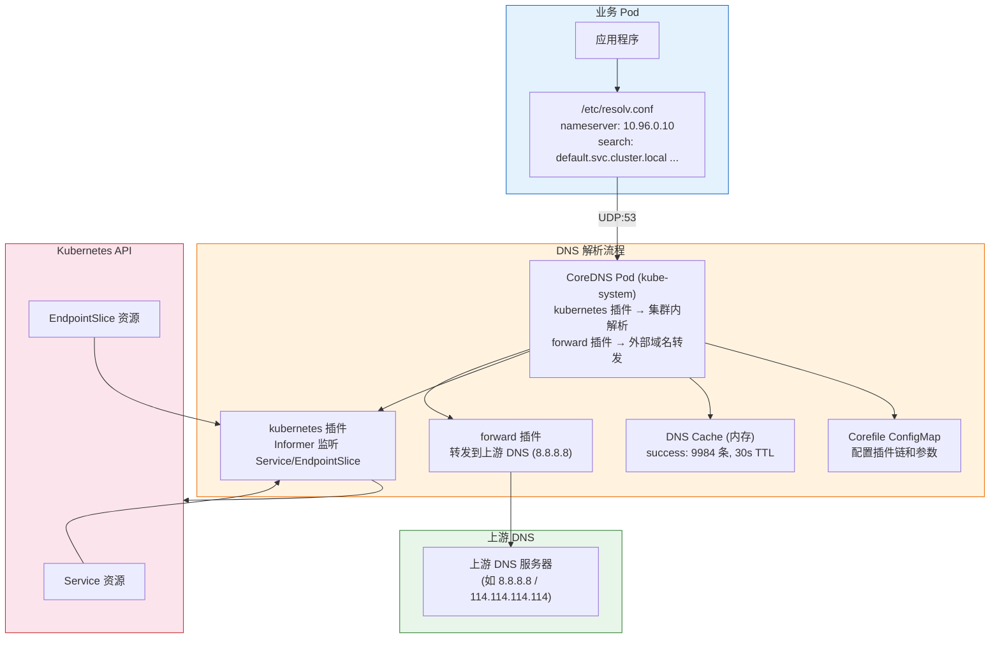
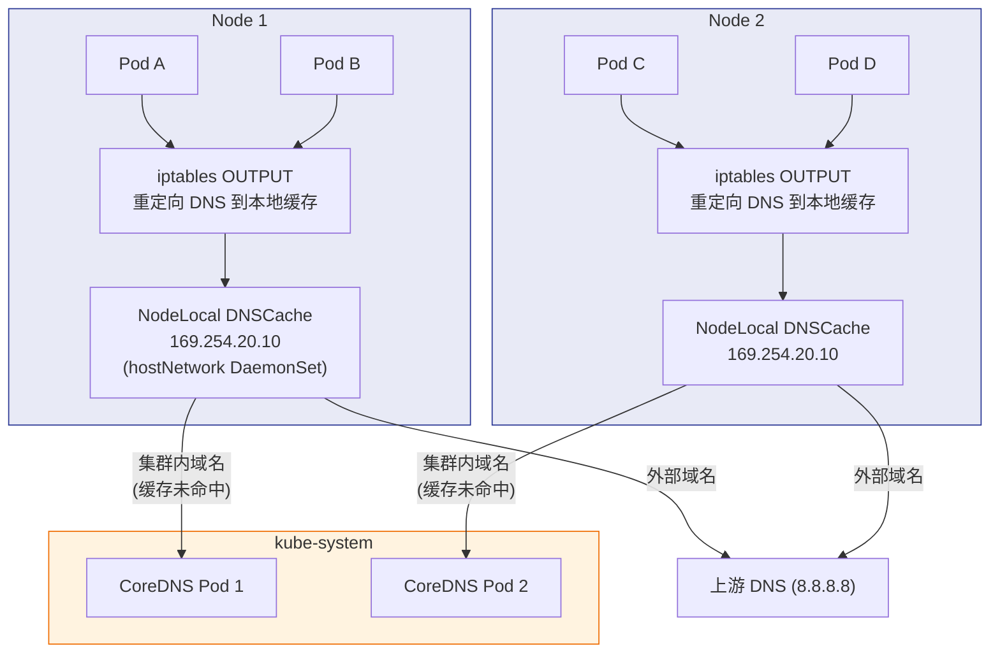

# [[Kubernetes|Kubernetes]] [[CoreDNS|CoreDNS]] 全栈进阶培训 (从入门到专家)

> **适用版本**: Kubernetes v1.28 - v1.32 | **文档类型**: 全栈技术实战指南
> **核心原则**: 掌握服务发现入口、极致性能调优、深度故障排查

---

<!-- chunk: 演讲概述 -->## 演讲概述

#<!-- chunk: 目标受众 -->## 目标受众

- 网络初学者：理解 DNS 在 Kubernetes 中的角色
- SRE 工程师：掌握 CoreDNS 性能调优和故障排查
- 架构师：设计大规模集群的 DNS 架构方案
- 应用开发者：理解 Pod DNS 配置对应用的影响

#<!-- chunk: 预计时长 -->## 预计时长

| 阶段 | 内容 | 时长 |
|------|------|------|
| 第一阶段 | DNS 基础与服务发现概念 | 25 分钟 |
| 第二阶段 | CoreDNS 架构与插件深度解析 | 40 分钟 |
| 第三阶段 | ndots 陷阱与搜索域优化 | 25 分钟 |
| 第四阶段 | NodeLocal DNSCache 部署与调优 | 30 分钟 |
| 第五阶段 | 实战演示与动手实验 | 30 分钟 |
| 第六阶段 | 故障排查与 SRE 运维 | 25 分钟 |
| Q&A | 互动问答 | 15 分钟 |
| **合计** | | **约 3 小时** |

#<!-- chunk: 核心学习目标 -->## 核心学习目标

完成本次培训后，学员能够：

1. 解释 CoreDNS 在 Kubernetes 服务发现中的核心角色
2. 配置和优化 Corefile 以满足不同场景需求
3. 理解 ndots 参数对 DNS 性能的影响并进行调优
4. 部署 NodeLocal DNSCache 解决 conntrack 竞态问题
5. 排查 DNS 解析失败、5 秒超时等常见问题
6. 监控 CoreDNS 的关键性能指标并配置告警

#<!-- chunk: 核心要点 -->## 核心要点

1. CoreDNS 是集群内部的"电话簿"，所有服务发现依赖它
2. 理解 DNS 解析规则：FQDN、短域名、搜索域
3. ndots 陷阱是大规模集群中 DNS 性能的头号杀手
4. NodeLocal DNSCache 是解决 conntrack 竞态问题的标准方案
5. 掌握 CoreDNS 的插件化架构和性能指标
6. CoreDNS 的缓存 TTL 配置直接影响 [[Service|Service]] 变更的生效时间

---

<!-- chunk: 课程大纲 -->## 课程大纲

| 序号 | 章节 | 关键知识点 | 时长 |
|------|------|-----------|------|
| 1 | DNS 基础 | DNS 记录类型、解析流程、递归/迭代查询 | 15min |
| 2 | CoreDNS 架构 | 插件链、Informer 监听、Corefile 配置 | 25min |
| 3 | DNS 解析规则 | FQDN、搜索域、ndots、Pod resolv.conf | 15min |
| 4 | ndots 优化 | ndots 陷阱分析、FQDN 绕过、自定义 dnsConfig | 15min |
| 5 | NodeLocal DNSCache | conntrack 竞态、部署架构、性能收益 | 20min |
| 6 | Corefile 调优 | cache TTL、forward 配置、max_concurrent | 15min |
| 7 | 故障排查 | 5 秒超时、SERVFAIL、延迟诊断 | 15min |
| 8 | 实战演示 | 完整部署和测试流程 | 30min |

---

<!-- chunk: 核心概念讲解 -->## 核心概念讲解

#<!-- chunk: 什么是 CoreDNS？ -->## 什么是 CoreDNS？

CoreDNS 是 Kubernetes 集群内部的 DNS 服务器，从 v1.13 开始取代 kube-dns 成为默认 DNS 方案。它的核心职责是**将服务名称解析为 IP 地址**——当 Pod 想要访问 `my-service` 时，它会向 CoreDNS 查询"这个服务的 IP 是什么？"。

**为什么 DNS 对 Kubernetes 如此重要？**

在 Kubernetes 中，Pod 的 IP 是动态变化的——每次重建都会获得新 IP。如果没有 DNS，应用之间就必须硬编码 IP 地址，这在动态环境中是不可行的。DNS 提供了一个稳定的服务名称到动态 IP 的映射，使得服务发现成为可能。

**DNS 解析的完整流程：**

```
应用发起请求 "my-service"
    ↓
Pod 的 /etc/resolv.conf 查找 nameserver
    ↓
发送 DNS 查询到 CoreDNS (10.96.0.10:53)
    ↓
CoreDNS kubernetes 插件查找 Service 记录
    ↓
从 Informer 缓存中找到 my-service → 10.96.100.50
    ↓
返回 A 记录: my-service.default.svc.cluster.local → 10.96.100.50
    ↓
应用使用 IP 发起连接
```

**CoreDNS vs 传统 kube-dns：**

| 维度 | CoreDNS | kube-dns (旧) |
|------|---------|--------------|
| 架构 | 单进程、插件化 | 多容器（dnsmasq + skydns + sidecar） |
| 配置 | Corefile（灵活的 DSL） | 命令行参数 |
| 扩展性 | 通过插件轻松扩展 | 困难 |
| 内存占用 | 更低（单进程） | 更高（多容器） |
| 社区活跃度 | CNCF 毕业项目 | 已废弃 |
| 性能 | 更好（Go 实现，无 dnsmasq 瓶颈） | 较差 |

#<!-- chunk: DNS 解析规则详解 -->## DNS 解析规则详解

**全限定域名 (FQDN)** 格式：

```
<service-name>.<namespace>.svc.<cluster-domain>
```

示例：

```
my-service.production.svc.cluster.local
redis.infrastructure.svc.cluster.local
postgres-0.postgres-headless.data.svc.cluster.local
```

**搜索域 (Search Domain) 机制：**

每个 Pod 的 `/etc/resolv.conf` 都会配置搜索域，使得短域名可以自动补全：

```
nameserver 10.96.0.10
search default.svc.cluster.local svc.cluster.local cluster.local
options ndots:5
```

这意味着当你访问 `my-service` 时，系统会依次尝试：

| 尝试序号 | 查询的域名 | 预期结果 |
|---------|-----------|---------|
| 1 | `my-service.default.svc.cluster.local` | 命中！返回 IP |
| 2 | `my-service.svc.cluster.local` | 不需要尝试 |
| 3 | `my-service.cluster.local` | 不需要尝试 |

如果第 1 次就命中，后续搜索域不会被查询。

**ndots 参数陷阱（重要！）：**

`ndots:5` 表示：如果域名中的点数少于 5 个，就会先走搜索域补全。这意味着：

| 访问的域名 | 点数 | 行为 | 产生的 DNS 查询数 |
|-----------|------|------|-----------------|
| `my-service` | 0 | 先尝试 3 次搜索域补全 | 最多 4 次 |
| `www.google.com` | 2 | 先尝试 3 次搜索域补全 | 最多 4 次 |
| `api.internal.company.com` | 3 | 先尝试 2 次搜索域补全 | 最多 3 次 |
| `www.google.com.` (尾部加点) | 2 | **直接解析** | 1 次 |
| `my.service.cluster.local` | 3 | 先尝试 2 次搜索域补全 | 最多 3 次 |

**ndots 陷阱的影响：**

每次外部域名解析（如 `www.google.com`），在 ndots:5 的默认配置下，会产生 3-4 次无效的 DNS 查询（先尝试 `www.google.com.default.svc.cluster.local` 等，全部失败后才会解析真实域名）。在高并发场景下，这会：

1. 增加 CoreDNS 的查询负载 3-4 倍
2. 增加 DNS 解析延迟
3. 增加 conntrack 表压力，触发 5 秒超时

#<!-- chunk: CoreDNS 插件架构 -->## CoreDNS 插件架构

CoreDNS 采用**插件化**架构，每个功能都通过插件实现：

```
请求进入
    ↓
┌────────────────────────────────────┐
│            插件链 (Plugin Chain)     │
│                                      │
│  ┌──────────┐  ┌──────────┐        │
│  │  errors   │→│  health   │→ ...   │
│  └──────────┘  └──────────┘        │
│  ┌──────────┐  ┌──────────┐        │
│  │kubernetes│→│  forward  │→ ...   │
│  └──────────┘  └──────────┘        │
│  ┌──────────┐  ┌──────────┐        │
│  │  cache   │→│  reload   │→ ...   │
│  └──────────┘  └──────────┘        │
└────────────────────────────────────┘
    ↓
返回响应
```

**Corefile 逐行解析：**

```
.:53 {                                              # 监听所有接口的 53 端口
    errors                                          # 错误日志记录
    health {                                        # 健康检查端点
        lameduck 5s                                 # 关闭前等待 5 秒（排干请求）
    }
    ready                                           # 就绪检查端点
    kubernetes cluster.local in-addr.arpa ip6.arpa {  # 核心插件：解析 K8s 服务
        pods insecure                               # Pod DNS 模式（insecure/verified/disabled）
        fallthrough in-addr.arpa ip6.arpa           # 不匹配时传递给下一个插件
        ttl 30                                      # DNS 记录 TTL（秒）
    }
    prometheus :9153                                # Prometheus 指标端点
    forward . /etc/resolv.conf {                    # 转发非集群内域名到上游 DNS
        max_concurrent 1000                         # 最大并发转发数
    }
    cache 30 {                                      # 缓存 30 秒
        success 9984 30                             # 成功响应缓存 9984 条，TTL 30 秒
        denial 9984 5                               # 否定响应缓存 9984 条，TTL 5 秒
    }
    loop                                            # 检测 DNS 转发循环
    reload                                          # 自动检测 Corefile 变更并热重载
    loadbalance                                     # 随机排序 A/AAAA 记录（负载均衡）
}
```

**常用插件说明：**

| 插件 | 功能 | 重要程度 | 生产建议 |
|------|------|---------|---------|
| `kubernetes` | 解析集群内 Service/Pod DNS 记录 | 核心 | pods insecure（性能优先） |
| `forward` | 将集群外域名转发到上游 DNS | 核心 | max_concurrent 1000+ |
| `cache` | 缓存 DNS 响应，减少上游查询 | 核心 | success 9984 30 |
| `errors` | 错误日志记录 | 推荐 | 开启 |
| `health` | 健康检查端点 (/:8080/health) | 推荐 | lameduck 5s |
| `ready` | 就绪检查端点 (/:8181/ready) | 推荐 | 开启 |
| `prometheus` | 暴露 Prometheus 指标 | 推荐 | 开启 |
| `reload` | 自动检测 Corefile 变更并热重载 | 可选 | 开启 |
| `log` | 详细查询日志 | 调试 | 仅调试时开启（影响性能） |
| `debug` | 开启调试模式 | 调试 | 仅调试时 |
| `trace` | OpenTelemetry 追踪 | 可选 | 按需 |

#<!-- chunk: NodeLocal DNSCache -->## NodeLocal DNSCache

**解决的问题：**

在标准架构中，所有 DNS 查询都经过 iptables/ipvs DNAT 规则转发到 CoreDNS Pod。这个过程中存在一个已知的 conntrack 竞态条件（conntrack race condition），会导致约 0.1%-1% 的 DNS 查询出现 **5 秒超时**。

**5 秒超时的根因详解：**

```
Pod 发送 DNS 查询 (UDP)
    ↓
iptables DNAT 规则匹配
    ↓
需要创建 conntrack 表项
    ↓
并发查询导致 conntrack 表项冲突（同一个五元组）
    ↓
Linux 内核丢弃冲突的数据包
    ↓
客户端等待超时重试
    ↓
默认超时时间 = 5 秒 (glibc/resolv.conf 默认)
    ↓
用户感知到 5 秒延迟
```

**NodeLocal DNSCache 架构：**

在每个节点上运行一个 DNSCache Pod（使用 hostNetwork），拦截本节点的 DNS 查询：

```
Pod DNS 请求
    ↓
iptables 规则 (OUTPUT 链)
    ↓
重定向到本节点 NodeLocal DNSCache (169.254.20.10)
    ↓
┌─────────────────────────────┐
│    NodeLocal DNSCache         │
│    (同节点内命中缓存直接返回)   │
│                               │
│    集群内域名 → 转发到 CoreDNS │
│    外部域名 → 转发到上游 DNS    │
│    缓存命中 → 直接返回 (< 1ms) │
└─────────────────────────────┘
```

**收益：**

| 维度 | 收益 | 量化 |
|------|------|------|
| 延迟 | 缓存命中时延迟大幅降低 | 从 2-5ms 降到 < 1ms |
| 可靠性 | 完全消除 5 秒超时问题 | 0% 超时率 |
| CoreDNS 负载 | 大幅减少 CoreDNS 查询量 | 减少 70-80% |
| 可扩展性 | DNS 查询不再经过 conntrack | 减少 conntrack 表压力 |

---

<!-- chunk: 架构图 -->## 架构图

#<!-- chunk: CoreDNS 整体架构 -->## CoreDNS 整体架构



#<!-- chunk: NodeLocal DNSCache 部署架构 -->## NodeLocal DNSCache 部署架构



---

<!-- chunk: 实战演示步骤 -->## 实战演示步骤

#<!-- chunk: 演示 1：CoreDNS 状态检查 -->## 演示 1：CoreDNS 状态检查

```bash
# 查看 CoreDNS Pod 状态
kubectl get pods -n kube-system -l k8s-app=kube-dns -o wide
# 预期输出:
# NAME                       READY   STATUS    RESTARTS   AGE   IP            NODE
# coredns-5d78c9869d-abc12   1/1     Running   0          30d   10.244.0.3    master
# coredns-5d78c9869d-def34   1/1     Running   0          30d   10.244.0.4    master

# 查看 CoreDNS Service（集群内 DNS IP）
kubectl get svc -n kube-system kube-dns
# 预期输出:
# NAME       TYPE        CLUSTER-IP   EXTERNAL-IP   PORT(S)         AGE
# kube-dns   ClusterIP   10.96.0.10   <none>        53/UDP,53/TCP   30d

# 查看 Corefile 配置
kubectl get configmap coredns -n kube-system -o yaml

# 查看 CoreDNS 日志
kubectl logs -n kube-system -l k8s-app=kube-dns --tail=50

# 查看 CoreDNS 资源使用情况
kubectl top pods -n kube-system -l k8s-app=kube-dns
# 预期输出:
# NAME                       CPU(cores)   MEMORY(bytes)
# coredns-5d78c9869d-abc12   5m           25Mi
# coredns-5d78c9869d-def34   3m           22Mi
```

#<!-- chunk: 演示 2：DNS 解析验证 -->## 演示 2：DNS 解析验证

```bash
# 创建一个临时调试 Pod
kubectl run dnsutils --image=registry.k8s.io/e2e-test-images/jessie-dnsutils:1.3 --command -- sleep infinity
# 等待 Pod Running
kubectl wait --for=condition=Ready pod/dnsutils --timeout=30s

# 进入调试 Pod
kubectl exec -it dnsutils -- bash

# 测试集群内 Service 解析
dig @10.96.0.10 kubernetes.default.svc.cluster.local +short
# 预期输出: 10.96.0.1

dig @10.96.0.10 kube-dns.kube-system.svc.cluster.local +short
# 预期输出: 10.96.0.10

# 测试短域名解析
dig @10.96.0.10 kubernetes +short
# 预期输出: 10.96.0.1（搜索域自动补全）

dig @10.96.0.10 kube-dns.kube-system +short
# 预期输出: 10.96.0.10

# 测试外部域名解析
dig @10.96.0.10 www.google.com +short
# 预期输出: 142.250.x.x

# 查看搜索域解析过程（观察 ndots 效果）
dig @10.96.0.10 my-service +verbose
# 注意观察: 会先尝试 my-service.default.svc.cluster.local 等搜索域

# 查看 Pod 的 resolv.conf
cat /etc/resolv.conf
# nameserver 10.96.0.10
# search default.svc.cluster.local svc.cluster.local cluster.local
# options ndots:5

# 使用 nslookup 测试
nslookup kubernetes.default
# 预期输出:
# Server:		10.96.0.10
# Address:	10.96.0.10#53
# Name:	kubernetes.default.svc.cluster.local
# Address: 10.96.0.1
```

#<!-- chunk: 演示 3：CoreDNS 性能调优 -->## 演示 3：CoreDNS 性能调优

```bash
# 步骤 1: 查看当前 Corefile
kubectl get configmap coredns -n kube-system -o yaml

# 步骤 2: 优化 Corefile
cat <<EOF | kubectl apply -f -
apiVersion: v1
kind: ConfigMap
metadata:
  name: coredns
  namespace: kube-system
data:
  Corefile: |
    .:53 {
        errors
        health {
            lameduck 5s
        }
        ready
        kubernetes cluster.local in-addr.arpa ip6.arpa {
            pods insecure
            fallthrough in-addr.arpa ip6.arpa
            ttl 30
        }
        prometheus :9153
        forward . /etc/resolv.conf {
            max_concurrent 1000
            policy sequential
        }
        cache 30 {
            success 9984 30
            denial 9984 5
            prefetch 10 10m 10%
        }
        loop
        reload
        loadbalance
    }
EOF

# 步骤 3: 验证热重载（无需重启 Pod）
kubectl logs -n kube-system -l k8s-app=kube-dns --tail=10 | grep -i reload
# 预期输出: [INFO] Reloading

# 步骤 4: 增加 CoreDNS 副本数
kubectl scale deployment coredns --replicas=3 -n kube-system
kubectl get pods -n kube-system -l k8s-app=kube-dns -o wide
```

#<!-- chunk: 演示 4：优化 Pod DNS 配置 -->## 演示 4：优化 Pod DNS 配置

```bash
# 方案 1: 调整 ndots（减少搜索域查询）
cat <<EOF | kubectl apply -f -
apiVersion: v1
kind: Pod
metadata:
  name: dns-optimized
spec:
  containers:
  - name: app
    image: busybox
    command: ["sleep", "3600"]
  dnsConfig:
    options:
    - name: ndots
      value: "2"
    - name: timeout
      value: "2"
    - name: attempts
      value: "2"
EOF

# 验证 resolv.conf
kubectl exec dns-optimized -- cat /etc/resolv.conf
# nameserver 10.96.0.10
# search default.svc.cluster.local svc.cluster.local cluster.local
# options ndots:2 timeout:2 attempts:2

# 方案 2: 使用 FQDN 避免搜索域（尾部加点）
kubectl exec -it dnsutils -- dig @10.96.0.10 www.google.com. +short
# 尾部加点表示这是 FQDN，不走搜索域

# 方案 3: 为特定 Pod 配置完全自定义 DNS
cat <<EOF | kubectl apply -f -
apiVersion: v1
kind: Pod
metadata:
  name: custom-dns
spec:
  containers:
  - name: app
    image: busybox
    command: ["sleep", "3600"]
  dnsPolicy: "None"
  dnsConfig:
    nameservers:
    - 8.8.8.8
    - 8.8.4.4
    searches:
    - mycompany.internal
    options:
    - name: ndots
      value: "1"
    - name: timeout
      value: "2"
    - name: attempts
      value: "2"
EOF

# 验证自定义 DNS
kubectl exec custom-dns -- cat /etc/resolv.conf
# nameserver 8.8.8.8
# nameserver 8.8.4.4
# search mycompany.internal
# options ndots:1 timeout:2 attempts:2
```

#<!-- chunk: 演示 5：NodeLocal DNSCache 部署 -->## 演示 5：NodeLocal DNSCache 部署

```bash
# 步骤 1: 下载 NodeLocal DNSCache YAML
curl -sLO https://github.com/kubernetes/kubernetes/raw/master/cluster/addons/dns/nodelocaldns/nodelocaldns.yaml

# 步骤 2: 修改配置（替换占位符）
# 将 __PILLAR__DNS__SERVER__ 替换为集群 DNS IP（10.96.0.10）
# 将 __PILLAR__UPSTREAM__SERVERS__ 替换为上游 DNS

# 步骤 3: 部署
kubectl apply -f nodelocaldns.yaml

# 步骤 4: 验证 DaemonSet 运行状态
kubectl get ds -n kube-system -l k8s-app=nodelocaldns
# 预期输出:
# NAME            DESIRED   CURRENT   READY   UP-TO-DATE   AVAILABLE
# node-cache-dns   3         3         3       3            3

# 步骤 5: 验证每个节点上的 DNSCache
kubectl get pods -n kube-system -l k8s-app=nodelocaldns -o wide
# 预期输出: 每个节点一个 Pod

# 步骤 6: 性能对比测试
# 直接查询 CoreDNS
kubectl exec -it dnsutils -- dig @10.96.0.10 kubernetes.default.svc.cluster.local
# Query time: 2-5ms

# 查询 NodeLocal DNSCache
kubectl exec -it dnsutils -- dig @169.254.20.10 kubernetes.default.svc.cluster.local
# Query time: < 1ms (缓存命中后)

# 压力测试对比
kubectl exec -it dnsutils -- bash -c \
  "for i in \$(seq 1 1000); do dig @10.96.0.10 kubernetes.default.svc.cluster.local +short > /dev/null; done"
# 记录时间

kubectl exec -it dnsutils -- bash -c \
  "for i in \$(seq 1 1000); do dig @169.254.20.10 kubernetes.default.svc.cluster.local +short > /dev/null; done"
# 对比时间（NodeLocal 应该快 3-5 倍）
```

---

<!-- chunk: 动手实验 -->## 动手实验

#<!-- chunk: 实验 1：ndots 对比实验 -->## 实验 1：ndots 对比实验

**目标**：量化 ndots 参数对 DNS 性能的影响

```bash
# 1. 创建默认 ndots:5 的 Pod
cat <<EOF | kubectl apply -f -
apiVersion: v1
kind: Pod
metadata:
  name: ndots-5
spec:
  containers:
  - name: app
    image: busybox
    command: ["sleep", "3600"]
EOF

# 2. 创建 ndots:1 的 Pod
cat <<EOF | kubectl apply -f -
apiVersion: v1
kind: Pod
metadata:
  name: ndots-1
spec:
  containers:
  - name: app
    image: busybox
    command: ["sleep", "3600"]
  dnsConfig:
    options:
    - name: ndots
      value: "1"
EOF

# 3. 对比解析外部域名的查询数
# ndots:5 的 Pod（会产生多个搜索域查询）
kubectl exec ndots-5 -- nslookup www.google.com
# 观察延迟

# ndots:1 的 Pod（直接解析，跳过搜索域）
kubectl exec ndots-1 -- nslookup www.google.com
# 对比延迟差异

# 4. 使用 tcpdump 抓包验证
# 在 CoreDNS Pod 上抓包查看查询量
```

---

<!-- chunk: 常见问题与回答 -->## 常见问题与回答

#<!-- chunk: Q1: CoreDNS Pod 应该部署多少副本？ -->## Q1: CoreDNS Pod 应该部署多少副本？

**回答**: 生产环境建议至少 2 个副本，且使用 podAntiAffinity 确保分布在不同节点上。副本数的计算公式：`副本数 = max(2, ceil(集群节点数 / 50))`。对于 100 节点以上的集群，建议 4-6 个副本。同时配合 HPA（基于 CPU 使用率或 QPS）实现动态扩缩。CoreDNS 的 CPU 消耗主要来自查询处理，建议每个核心处理 5000-10000 QPS。

#<!-- chunk: Q2: ndots 值应该设置成多少？ -->## Q2: ndots 值应该设置成多少？

**回答**: 取决于集群内域名的使用模式。如果大部分请求是集群内 Service（点数通常 ≤ 4），保持默认 `ndots:5` 即可。如果大量请求是外部域名，建议降低到 `ndots:2` 或者使用 FQDN（尾部加点）直接解析。最佳实践：为高频外部域名访问的 Pod 单独配置 `dnsConfig`，降低 ndots 并减少 timeout。

#<!-- chunk: Q3: CoreDNS 解析延迟正常范围是多少？ -->## Q3: CoreDNS 解析延迟正常范围是多少？

**回答**: 集群内 Service 解析：< 5ms（命中缓存）到 < 50ms（未命中，需查 Informer 缓存）。外部域名解析：50-200ms（取决于上游 DNS 响应速度）。如果 P99 延迟超过 100ms，需要检查：(1) CoreDNS CPU 是否充足（`kubectl top pods -n kube-system`）；(2) 缓存配置是否合理（cache TTL 和大小）；(3) 上游 DNS 是否正常。NodeLocal DNSCache 命中时延迟 < 1ms。

#<!-- chunk: Q4: CoreDNS 的 cache TTL 应该设置多大？ -->## Q4: CoreDNS 的 cache TTL 应该设置多大？

**回答**: 默认 Corefile 中的 cache TTL 是 30 秒。对于集群内 Service，30 秒足够（Service IP 很少变化，但 Endpoints 可能频繁变化）。对于外部域名，建议 30-300 秒，取决于域名变化的频率。过大的 TTL 会导致 Service IP 变更后客户端长时间使用旧 IP（最长等一个 TTL 周期）。建议保持默认 30 秒，配合 `prefetch` 插件提前刷新即将过期的缓存。

#<!-- chunk: Q5: 如何排查 DNS 5 秒超时问题？ -->## Q5: 如何排查 DNS 5 秒超时问题？

**回答**: (1) 确认是否是 conntrack 竞态：检查 `dmesg | grep conntrack` 是否有表满错误；(2) 检查 conntrack 使用率：`cat /proc/sys/net/netfilter/nf_conntrack_count` vs `nf_conntrack_max`（使用率 > 80% 需关注）；(3) 解决方案：部署 NodeLocal DNSCache（根治）；(4) 临时缓解：调大 conntrack 表 `sysctl -w net.netfilter.nf_conntrack_max=131072`；(5) 将 DNS 查询切换为 TCP 协议（`use-vc` 选项）可以避免 conntrack 竞态。

#<!-- chunk: Q6: CoreDNS 和外部 DNS（如 Bind）如何联动？ -->## Q6: CoreDNS 和外部 DNS（如 Bind）如何联动？

**回答**: CoreDNS 通过 `forward` 插件将非集群内域名转发到上游 DNS。配置示例：`forward . /etc/resolv.conf` 会使用节点配置的 DNS 服务器作为上游。如果需要指定上游：`forward . 8.8.8.8 8.8.4.4 { max_concurrent 1000 }`。`max_concurrent` 控制并发转发请求数，建议设置为 500-1000。`policy sequential` 按顺序使用上游 DNS，`policy random` 随机选择。

#<!-- chunk: Q7: CoreDNS Pod 重启后缓存会丢失吗？ -->## Q7: CoreDNS Pod 重启后缓存会丢失吗？

**回答**: 会。CoreDNS 的缓存是内存级别的，Pod 重启后缓存丢失，会短暂增加上游 DNS 查询量和解析延迟。解决方案：(1) 部署多个副本分摊风险（滚动更新时逐个重启）；(2) 使用 NodeLocal DNSCache 作为一级缓存（即使 CoreDNS 重启，NodeLocal 还能命中自己的缓存）；(3) 调大 CoreDNS 的 cache TTL 和容量；(4) 配置 `terminationGracePeriodSeconds` 和 `lameduck` 让 CoreDNS 优雅关闭。

#<!-- chunk: Q8: 如何监控 CoreDNS 的健康状态？ -->## Q8: 如何监控 CoreDNS 的健康状态？

**回答**: 关键指标（Prometheus :9153 端点）：`coredns_dns_request_duration_seconds`（解析延迟，P99 应 < 50ms）、`coredns_dns_responses_total{rcode="SERVFAIL"}`（解析失败率，应接近 0）、`coredns_cache_hits_total`（缓存命中率，应 > 70%）、`coredns_forward_request_duration_seconds`（上游转发延迟）。建议配置告警：SERVFAIL 率 > 1% 告警，P99 延迟 > 100ms 告警，缓存命中率 < 50% 告警。

#<!-- chunk: Q9: 自定义 Corefile 变更需要重启 CoreDNS 吗？ -->## Q9: 自定义 Corefile 变更需要重启 CoreDNS 吗？

**回答**: 不需要。CoreDNS 配置了 `reload` 插件后会自动检测 Corefile 变更并热重载，默认检测间隔 30 秒。修改 ConfigMap 后最多等 30 秒即可生效。但如果需要立即生效，可以手动重启：`kubectl rollout restart deployment coredns -n kube-system`。注意：热重载期间不会丢失正在处理的请求。

#<!-- chunk: Q10: 如何为不同命名空间配置不同的 DNS 策略？ -->## Q10: 如何为不同命名空间配置不同的 DNS 策略？

**回答**: 通过 Pod 级别的 `dnsConfig` 和 `dnsPolicy` 实现。`dnsPolicy: Default` 使用节点 DNS 配置；`dnsPolicy: ClusterFirst` 使用 CoreDNS（默认）；`dnsPolicy: ClusterFirstWithHostNet` 使用 hostNetwork 时仍然使用 CoreDNS；`dnsPolicy: None` 允许完全自定义 `dnsConfig`。可以为特定命名空间创建 LimitRange 或 Admission Webhook 自动注入 DNS 配置。

#<!-- chunk: Q11: CoreDNS 的 forward 插件使用 TCP 还是 UDP？ -->## Q11: CoreDNS 的 forward 插件使用 TCP 还是 UDP？

**回答**: 默认使用 UDP。UDP 在高并发下更容易触发 conntrack 竞态。可以通过 `force_tcp` 选项强制使用 TCP：`forward . 8.8.8.8 { force_tcp max_concurrent 1000 }`。TCP 的优势：避免 conntrack 竞态（每个连接有独立的状态跟踪），适合高并发场景。劣势：TCP 连接建立有额外开销（三次握手），单次查询延迟略高。推荐在大规模集群中使用 `force_tcp`。

---

<!-- chunk: 要点总结 -->## 要点总结

#<!-- chunk: CoreDNS 知识图谱 -->## CoreDNS 知识图谱

```
CoreDNS
├── 核心功能
│   ├── 集群内 Service DNS 解析 (kubernetes 插件)
│   ├── 外部域名转发 (forward 插件)
│   ├── 缓存加速 (cache 插件)
│   └── 负载均衡 (loadbalance 插件)
├── 架构
│   ├── 插件化设计 (Plugin Chain)
│   ├── Informer 监听 Service/EndpointSlice
│   ├── Corefile 配置驱动 (ConfigMap)
│   └── 热重载 (reload 插件)
├── 性能优化
│   ├── ndots 调优 (降低无效搜索域查询)
│   ├── FQDN 使用 (尾部加点跳过搜索域)
│   ├── cache TTL 配置 (30s + prefetch)
│   ├── NodeLocal DNSCache (消除 conntrack 竞态)
│   ├── HPA 动态扩缩 (基于 CPU/QPS)
│   └── force_tcp (避免 UDP conntrack 竞态)
└── 故障排查
    ├── 5 秒超时 → conntrack 竞态 → NodeLocal DNSCache
    ├── SERVFAIL → 检查 CoreDNS 日志和配置
    ├── 解析延迟高 → 检查 CPU/缓存/上游 DNS
    └── 搜索域问题 → 检查 ndots 和 resolv.conf
```

#<!-- chunk: DNS 排障速查表 -->## DNS 排障速查表

| 现象 | 可能原因 | 排查命令 | 解决方案 |
|------|---------|---------|---------|
| 5 秒超时 | conntrack 竞态 | `dmesg \| grep conntrack` | 部署 NodeLocal DNSCache |
| SERVFAIL | Corefile 配置错误 | `kubectl logs -n kube-system -l k8s-app=kube-dns` | 修复 Corefile |
| 延迟高 | CoreDNS CPU 不足 | `kubectl top pods -n kube-system` | 扩容/调大资源 |
| 无法解析集群内域名 | CoreDNS Pod 异常 | `kubectl get pods -n kube-system` | 重启 CoreDNS |
| 无法解析外部域名 | forward 配置错误 | `dig @<coredns-ip> www.google.com` | 检查上游 DNS |
| 短域名解析失败 | ndots 搜索域问题 | `cat /etc/resolv.conf` | 使用 FQDN 或调整 ndots |
| Pod 内无法解析 | resolv.conf 配置错误 | `kubectl exec <pod> -- cat /etc/resolv.conf` | 检查 dnsPolicy/dnsConfig |

#<!-- chunk: SRE 运维红线 -->## SRE 运维红线

| 红线 | 说明 | 违反后果 |
|------|------|---------|
| **红线 1** | 生产环境必须配置 Replica ≥ 2 且跨节点部署 | 单点故障导致全集群 DNS 瘫痪 |
| **红线 2** | 必须监控解析延迟，P99 建议 < 50ms | DNS 慢导致所有服务调用超时 |
| **红线 3** | 任何 Corefile 变更必须经过灰度测试 | 错误配置可能导致解析全部失败 |
| **红线 4** | 必须配置 CoreDNS CPU/Memory requests/limits | 资源不足导致解析超时 |
| **红线 5** | 大规模集群必须部署 NodeLocal DNSCache | conntrack 竞态导致 5 秒超时 |
| **红线 6** | 必须监控 conntrack 表使用率 | 表满导致网络不可用 |

---

<!-- chunk: 延伸阅读 -->## 延伸阅读

#<!-- chunk: 官方文档 -->## 官方文档

| 资源 | 链接 | 说明 |
|------|------|------|
| CoreDNS 官方文档 | https://coredns.io/manual/toc/ | 插件详解与配置 |
| Kubernetes DNS | https://kubernetes.io/docs/concepts/services-networking/dns/ | K8s DNS 规范 |
| NodeLocal DNSCache | https://kubernetes.io/docs/tasks/administer-cluster/nodelocaldns/ | 部署指南 |
| DNS Policy | https://kubernetes.io/docs/concepts/services-networking/dns-pod-service/ | Pod DNS 策略 |

#<!-- chunk: 关联培训专题 -->## 关联培训专题

- `kubernetes-service-presentation.md` — Service 发现机制与 CoreDNS 的协作
- `kubernetes-troubleshooting-methodology-presentation.md` — DNS 排障方法论
- `kubernetes-networking-presentation.md` — 集群网络与 DNS 的关系
- `kubernetes-observability-presentation.md` — CoreDNS 监控指标

---

> **Kusheet Project** | 作者: Allen Galler (allengaller@gmail.com)

---

<!-- chunk: Obsidian 相关文档 -->## Obsidian 相关文档

- topic-presentations MOC
- Topic: Presentations（技术演示文稿）
- Kubernetes 架构与基础概念全栈培训
- Kubernetes Ingress 全栈进阶培训 (从入门到专家)
- Kubernetes 可观测性全栈培训 (监控、日志、追踪)
- Kubernetes 调度与编排策略全栈培训
- Kubernetes 安全与 RBAC 权限管理全栈培训
- Kubernetes Service 全栈进阶培训 (从入门到专家)
- Kubernetes 存储体系全栈进阶培训 (从入门到专家)
- Kubernetes Terway (Aliyun) 全栈进阶培训 (从入门到专家)
- Kubernetes 故障排查方法论全栈培训
- Kubernetes Workload 全栈进阶培训 (从入门到专家)

## See Also

- lecturer-persona
- kubernetes-architecture-fundamentals-presentation
- kubernetes-ingress-presentation
- kubernetes-observability-presentation

## Related

- [[domain-19-landscape-references/topic-index/dns-index|DNS 知识图谱索引]]
