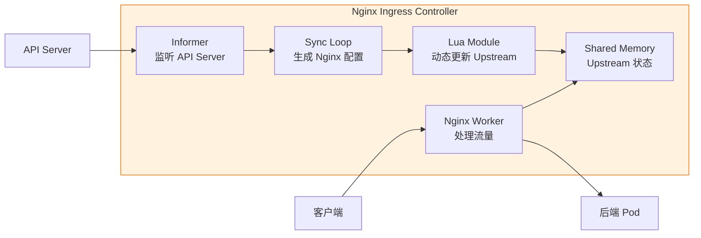
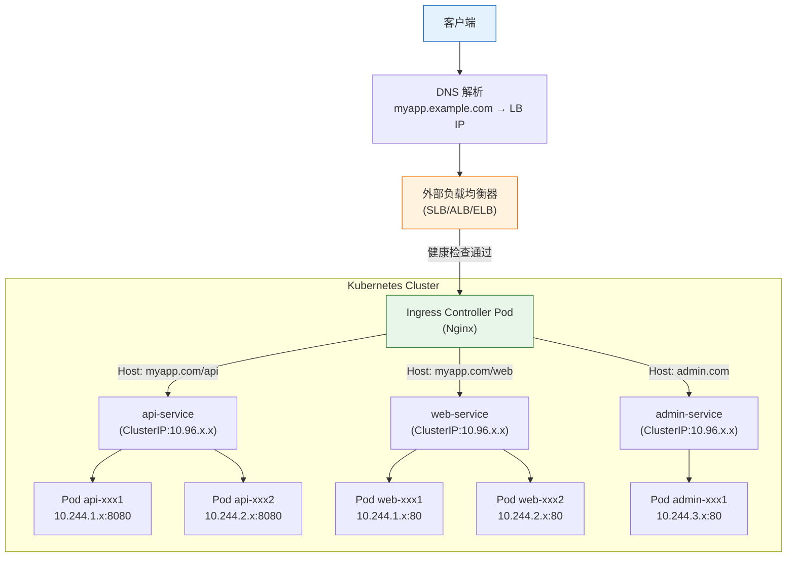
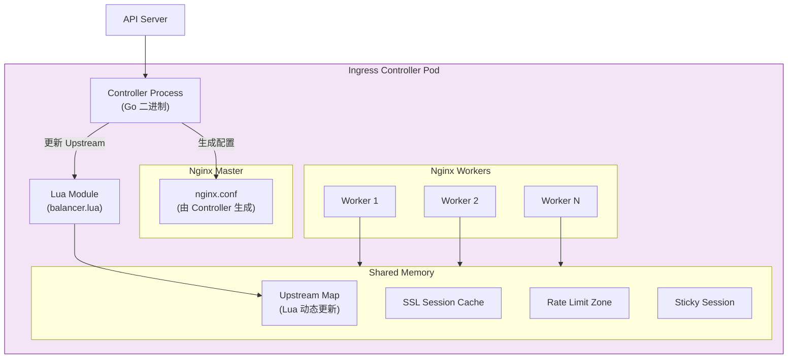
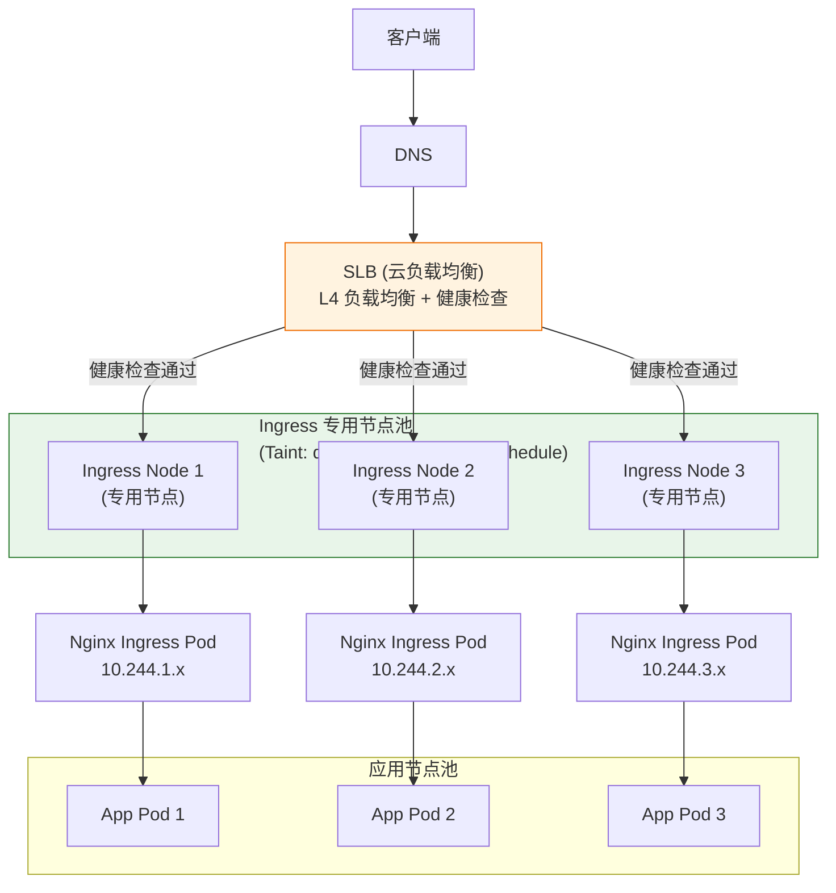

# [[Kubernetes|Kubernetes]] [[Ingress|Ingress]] 全栈进阶培训 (从入门到专家)

> **适用版本**: Kubernetes v1.28 - v1.32 | **文档类型**: 全栈技术实战指南
> **核心原则**: 掌握七层网关基础、实现精细化流量管控、构建高性能接入体系

---

<!-- chunk: 演讲概述 -->## 演讲概述

#<!-- chunk: 目标受众 -->## 目标受众

- 初级运维：理解 Ingress 在流量链路中的位置
- 流量治理专家：掌握高级路由、金丝雀发布、A/B 测试
- SRE 工程师：Ingress 高可用架构设计与故障排查
- 网络工程师：理解 Nginx Ingress Controller 的内部机制

#<!-- chunk: 预计时长 -->## 预计时长

| 阶段 | 内容 | 时长 |
|------|------|------|
| 第一阶段 | Ingress 基础概念与入门 | 25 分钟 |
| 第二阶段 | Ingress Controller 架构深度解析 | 35 分钟 |
| 第三阶段 | 高级路由与流量治理 | 35 分钟 |
| 第四阶段 | TLS 证书管理与安全 | 25 分钟 |
| 第五阶段 | 实战演示与动手实验 | 35 分钟 |
| 第六阶段 | 高可用与 SRE 运维 | 25 分钟 |
| Q&A | 互动问答 | 15 分钟 |
| **合计** | | **约 3 小时** |

#<!-- chunk: 核心学习目标 -->## 核心学习目标

完成本次培训后，学员能够：

1. 区分 [[Service|Service]]（L4）和 Ingress（L7）的功能差异
2. 部署 Nginx Ingress Controller 并配置路由规则
3. 实现金丝雀发布、A/B 测试等高级流量治理
4. 配置 Cert-Manager 实现 TLS 证书自动化管理
5. 排查 Ingress 502/504 等常见故障
6. 设计生产级高可用 Ingress 架构

#<!-- chunk: 核心要点 -->## 核心要点

1. Ingress 是集群 HTTP/HTTPS 的统一入口，提供域名和路径路由
2. Ingress 资源是"规则"，Ingress Controller 是"执行者"
3. Nginx Ingress Controller 是最主流的实现方案
4. 掌握 TLS 证书管理（Cert-Manager 自动化）
5. 性能调优的核心：长连接、缓冲区、内核参数
6. 金丝雀发布和 A/B 测试的 Ingress 实现

---

<!-- chunk: 课程大纲 -->## 课程大纲

| 序号 | 章节 | 关键知识点 | 时长 |
|------|------|-----------|------|
| 1 | 服务暴露方式对比 | ClusterIP/NodePort/LoadBalancer/Ingress | 10min |
| 2 | Ingress 资源定义 | 规则、路径匹配、IngressClass | 15min |
| 3 | Ingress Controller | Nginx IC 架构、Lua 动态更新、Shared Memory | 20min |
| 4 | TLS 证书管理 | Cert-Manager、Let's Encrypt、自动续签 | 15min |
| 5 | 高级路由 | 金丝雀发布、A/B 测试、基于 Header/Cookie 路由 | 20min |
| 6 | 性能调优 | 长连接、缓冲区、内核参数、HPA | 20min |
| 7 | 高可用架构 | 专用节点池、多副本、外部 LB 健康检查 | 15min |
| 8 | 实战演示 | 完整部署和配置流程 | 35min |

---

<!-- chunk: 核心概念讲解 -->## 核心概念讲解

#<!-- chunk: 什么是 Ingress？ -->## 什么是 Ingress？

在 Kubernetes 中暴露服务有多种方式，各有局限：

| 方式 | 层级 | 缺点 | 适用场景 |
|------|------|------|---------|
| **ClusterIP** | L4 | 仅集群内访问，外部无法触达 | 内部服务间调用 |
| **NodePort** | L4 | 端口范围有限（30000-32767），管理大量服务困难 | 临时测试 |
| **LoadBalancer** | L4 | 每个 Service 需要一个外部 LB，成本高 | 单服务暴露 |
| **Ingress** | L7 | 需要 Ingress Controller | 统一入口、多服务路由 |

**Ingress 的定位**：作为集群的 **HTTP/HTTPS 统一入口**，它提供基于**域名 (Host)** 和**路径 (Path)** 的智能路由，使得一个入口可以管理数十到数百个后端服务。

```
                     ┌──────────────────────────────────┐
                     │        Kubernetes Cluster         │
                     │                                    │
 客户端 ──────────>  │  Ingress Controller (Nginx)       │
                     │    ├── myapp.example.com/api  → API Service
                     │    ├── myapp.example.com/web  → Web Service
                     │    └── admin.example.com       → Admin Service
                     │                                    │
                     └──────────────────────────────────┘
```

**关键区分：Ingress 资源 vs Ingress Controller**

- **Ingress 资源**：一段 YAML 定义的"路由规则"，告诉系统"什么域名/路径应该转发到哪里"
- **Ingress Controller**：实际运行的网络代理程序（如 Nginx），它监听 Ingress 资源变化并实时更新代理配置

没有 Ingress Controller 的 Ingress 资源只是一段无用数据。

**Ingress 与 Gateway API 的关系：**

Kubernetes 社区正在推出 Gateway API 作为 Ingress 的下一代替代。Gateway API 提供更丰富的路由能力（如流量拆分、Header 匹配、重试策略）和更精细的角色分离。但目前 Ingress 仍然是生产环境最广泛使用的方案，Nginx Ingress Controller 生态最成熟。

#<!-- chunk: Ingress 资源类型 -->## Ingress 资源类型

```yaml
apiVersion: networking.k8s.io/v1
kind: Ingress
metadata:
  name: comprehensive-ingress
  annotations:
    nginx.ingress.kubernetes.io/ssl-redirect: "true"
    nginx.ingress.kubernetes.io/use-regex: "true"
    nginx.ingress.kubernetes.io/proxy-body-size: "50m"
    nginx.ingress.kubernetes.io/proxy-read-timeout: "60"
    nginx.ingress.kubernetes.io/proxy-send-timeout: "60"
spec:
  ingressClassName: nginx
  tls:
  - hosts:
    - myapp.example.com
    secretName: myapp-tls-secret
  rules:
  - host: myapp.example.com
    http:
      paths:
      - path: /api/v1
        pathType: Prefix
        backend:
          service:
            name: api-service
            port:
              number: 8080
      - path: /web
        pathType: Prefix
        backend:
          service:
            name: web-service
            port:
              number: 80
  - host: admin.example.com
    http:
      paths:
      - path: /
        pathType: Prefix
        backend:
          service:
            name: admin-service
            port:
              number: 80
```

**pathType 说明：**

| 类型 | 行为 | 示例 |
|------|------|------|
| `Exact` | 精确匹配路径 | `/api` 只匹配 `/api` |
| `Prefix` | 前缀匹配（按 `/` 分割） | `/api` 匹配 `/api`、`/api/v1`、`/api/` |
| `ImplementationSpecific` | 由 Controller 决定 | Nginx 支持正则（需启用 `use-regex`） |

**IngressClass 说明：**

```yaml
apiVersion: networking.k8s.io/v1
kind: IngressClass
metadata:
  name: nginx
  annotations:
    ingressclass.kubernetes.io/is-default-class: "true"
spec:
  controller: k8s.io/ingress-nginx
```

IngressClass 用于指定使用哪个 Ingress Controller 处理 Ingress 规则。当集群中部署了多个 Ingress Controller（如 Nginx + Traefik）时，通过 `spec.ingressClassName` 选择。

#<!-- chunk: Ingress Controller 工作原理 -->## Ingress Controller 工作原理

以 Nginx Ingress Controller 为例：



**动态更新机制（Nginx Ingress 的核心优化）：**

传统的 Nginx 配置更新需要 `reload`（重启 Worker 进程），这在高并发场景下会导致短暂丢连接。Nginx Ingress Controller 通过 Lua 模块直接修改 Shared Memory 中的 Upstream 列表，实现**无 Reload 的 Pod 更新**：

- **Pod Endpoints 变化**（最频繁）→ Lua 更新 Shared Memory → 下一个请求立即路由到新 IP → **零中断**
- **Ingress 规则变更**（添加/修改/删除 Ingress 资源）→ 生成新 Nginx 配置 → 需要 Reload → **极短暂中断（< 1ms）**

**Nginx Ingress Controller 内部架构：**

| 组件 | 职责 | 说明 |
|------|------|------|
| Controller Process (Go) | 监听 K8s 资源，生成 nginx.conf | 使用 client-go Informer |
| Nginx Master | 管理 Worker 进程 | 执行 reload 命令 |
| Nginx Worker | 处理 HTTP/HTTPS 流量 | 负责实际的代理转发 |
| Lua Module | 动态更新 Upstream | 不需要 reload 即可更新后端 |
| Shared Memory | 存储 Upstream 状态 | Worker 间共享数据 |
| SSL Session Cache | TLS 会话复用 | 减少 TLS 握手开销 |

#<!-- chunk: TLS 证书管理 (Cert-Manager) -->## TLS 证书管理 (Cert-Manager)

Cert-Manager 是 Kubernetes 的证书管理工具，可以自动化 Let's Encrypt 证书的申请和续签：

```yaml
apiVersion: cert-manager.io/v1
kind: ClusterIssuer
metadata:
  name: letsencrypt-prod
spec:
  acme:
    server: https://acme-v02.api.letsencrypt.org/directory
    email: admin@example.com
    privateKeySecretRef:
      name: letsencrypt-prod
    solvers:
    - http01:
        ingress:
          class: nginx
---
apiVersion: cert-manager.io/v1
kind: Certificate
metadata:
  name: myapp-cert
spec:
  secretName: myapp-tls-secret
  issuerRef:
    name: letsencrypt-prod
    kind: ClusterIssuer
  dnsNames:
  - myapp.example.com
  - admin.example.com
```

证书到期前 30 天自动续签，完全无需人工干预。

**Cert-Manager 工作流程：**

```
1. 创建 Certificate 资源
2. Cert-Manager 检测到新证书请求
3. 向 ACME Server (Let's Encrypt) 发起挑战
4. 创建 HTTP-01 挑战路由（临时 Ingress 规则）
5. ACME Server 验证域名所有权
6. 签发证书，存储为 Secret
7. Ingress Controller 使用 Secret 配置 TLS
8. 证书到期前 30 天自动重复以上流程
```

#<!-- chunk: 高级流量治理 -->## 高级流量治理

**金丝雀发布 (Canary Deployment)：**

```yaml
apiVersion: networking.k8s.io/v1
kind: Ingress
metadata:
  name: myapp-canary
  annotations:
    nginx.ingress.kubernetes.io/canary: "true"
    nginx.ingress.kubernetes.io/canary-weight: "20"
spec:
  rules:
  - host: myapp.example.com
    http:
      paths:
      - path: /
        pathType: Prefix
        backend:
          service:
            name: myapp-canary-service
            port:
              number: 80
```

**基于 Header 的 A/B 测试：**

```yaml
apiVersion: networking.k8s.io/v1
kind: Ingress
metadata:
  name: myapp-ab-test
  annotations:
    nginx.ingress.kubernetes.io/canary: "true"
    nginx.ingress.kubernetes.io/canary-by-header: "X-Canary"
    nginx.ingress.kubernetes.io/canary-by-header-value: "true"
spec:
  rules:
  - host: myapp.example.com
    http:
      paths:
      - path: /
        pathType: Prefix
        backend:
          service:
            name: myapp-v2-service
            port:
              number: 80
```

**金丝雀发布策略对比：**

| 策略 | 注解 | 效果 | 适用场景 |
|------|------|------|---------|
| 基于权重 | `canary-weight: "20"` | 20% 流量到新版本 | 渐进式放量 |
| 基于 Header | `canary-by-header: "X-Canary"` | 特定 Header 请求到新版本 | 内部测试 |
| 基于 Cookie | `canary-by-cookie: "canary"` | 特定 Cookie 请求到新版本 | 用户分批体验 |
| 组合策略 | Header + Weight | Header 匹配优先，其余按权重 | 精细控制 |

---

<!-- chunk: 架构图 -->## 架构图

#<!-- chunk: 完整流量路径 -->## 完整流量路径



#<!-- chunk: Nginx Ingress Controller 内部架构 -->## Nginx Ingress Controller 内部架构



#<!-- chunk: 高可用部署架构 -->## 高可用部署架构



---

<!-- chunk: 实战演示步骤 -->## 实战演示步骤

#<!-- chunk: 演示 1：部署 Nginx Ingress Controller -->## 演示 1：部署 Nginx Ingress Controller

```bash
# 步骤 1: 使用 Helm 部署
helm repo add ingress-nginx https://kubernetes.github.io/ingress-nginx
helm repo update
# 预期输出:
# Hang tight while we grab the latest...
# ...Successfully got an update from the "ingress-nginx" chart repository

helm install ingress-nginx ingress-nginx/ingress-nginx \
  --namespace ingress-nginx \
  --create-namespace \
  --set controller.replicaCount=3 \
  --set controller.resources.requests.cpu=200m \
  --set controller.resources.requests.memory=256Mi \
  --set controller.resources.limits.cpu=1 \
  --set controller.resources.limits.memory=512Mi \
  --set controller.service.type=LoadBalancer \
  --set controller.metrics.enabled=true \
  --set controller.config.enable-access-log=true

# 步骤 2: 验证部署
kubectl get pods -n ingress-nginx -o wide
# 预期输出:
# NAME                                       READY   STATUS    RESTARTS   AGE
# ingress-nginx-controller-xxxxxx-yyyy       1/1     Running   0          2m
# ingress-nginx-controller-xxxxxx-zzzz       1/1     Running   0          2m
# ingress-nginx-controller-xxxxxx-wwww       1/1     Running   0          2m

kubectl get svc -n ingress-nginx
# 预期输出:
# NAME                           TYPE           EXTERNAL-IP      PORT(S)
# ingress-nginx-controller       LoadBalancer   203.0.113.10     80:30080/TCP,443:30443/TCP

# 步骤 3: 查看外部 IP
kubectl get svc ingress-nginx-controller -n ingress-nginx
# 记录 EXTERNAL-IP，后续测试使用
```

#<!-- chunk: 演示 2：创建第一个 Ingress -->## 演示 2：创建第一个 Ingress

```bash
# 步骤 1: 部署后端应用
kubectl create deployment web-app --image=nginx --replicas=2
# 预期输出: deployment.apps/web-app created

kubectl expose deployment web-app --port=80 --target-port=80
# 预期输出: service/web-app exposed

kubectl create deployment api-app --image=nginx --replicas=2
kubectl expose deployment api-app --port=8080 --target-port=80

# 步骤 2: 创建 Ingress
cat <<EOF | kubectl apply -f -
apiVersion: networking.k8s.io/v1
kind: Ingress
metadata:
  name: myapp-ingress
  annotations:
    nginx.ingress.kubernetes.io/rewrite-target: /
spec:
  ingressClassName: nginx
  rules:
  - host: myapp.example.com
    http:
      paths:
      - path: /
        pathType: Prefix
        backend:
          service:
            name: web-app
            port:
              number: 80
      - path: /api
        pathType: Prefix
        backend:
          service:
            name: api-app
            port:
              number: 8080
EOF
# 预期输出: ingress.networking.k8s.io/myapp-ingress created

# 步骤 3: 验证 Ingress
kubectl get ingress
# 预期输出:
# NAME             CLASS   HOSTS                 ADDRESS         PORTS   AGE
# myapp-ingress    nginx   myapp.example.com     203.0.113.10    80      30s

kubectl describe ingress myapp-ingress
# 关注 Rules 部分的路由规则和 Backends

# 步骤 4: 测试访问（替换为实际 EXTERNAL-IP）
curl -H "Host: myapp.example.com" http://203.0.113.10/
# 预期输出: Nginx 欢迎页面

curl -H "Host: myapp.example.com" http://203.0.113.10/api
# 预期输出: Nginx 欢迎页面（来自 api-app）
```

#<!-- chunk: 演示 3：配置 TLS -->## 演示 3：配置 TLS

```bash
# 步骤 1: 创建自签名证书（测试用）
openssl req -x509 -nodes -days 365 \
  -newkey rsa:2048 \
  -keyout tls.key \
  -out tls.crt \
  -subj "/CN=myapp.example.com"

# 步骤 2: 创建 Secret
kubectl create secret tls myapp-tls \
  --key tls.key \
  --cert tls.crt
# 预期输出: secret/myapp-tls created

# 步骤 3: 更新 Ingress 添加 TLS
cat <<EOF | kubectl apply -f -
apiVersion: networking.k8s.io/v1
kind: Ingress
metadata:
  name: myapp-ingress-tls
  annotations:
    nginx.ingress.kubernetes.io/ssl-redirect: "true"
spec:
  ingressClassName: nginx
  tls:
  - hosts:
    - myapp.example.com
    secretName: myapp-tls
  rules:
  - host: myapp.example.com
    http:
      paths:
      - path: /
        pathType: Prefix
        backend:
          service:
            name: web-app
            port:
              number: 80
EOF

# 步骤 4: 测试 HTTPS 访问
curl -k https://myapp.example.com
# 预期输出: Nginx 欢迎页面

# 步骤 5: 测试 HTTP 重定向
curl -I http://myapp.example.com
# 预期输出: 308 Permanent Redirect → Location: https://myapp.example.com/
```

#<!-- chunk: 演示 4：金丝雀发布实战 -->## 演示 4：金丝雀发布实战

```bash
# 步骤 1: 部署 v1 版本（稳定版）
kubectl create deployment myapp-v1 --image=nginx:1.25 --replicas=2
kubectl expose deployment myapp-v1 --port=80 --target-port=80 --name=myapp-v1

# 步骤 2: 部署 v2 版本（金丝雀版）
kubectl create deployment myapp-v2 --image=nginx:1.26 --replicas=1
kubectl expose deployment myapp-v2 --port=80 --target-port=80 --name=myapp-v2

# 步骤 3: 创建稳定版 Ingress
cat <<EOF | kubectl apply -f -
apiVersion: networking.k8s.io/v1
kind: Ingress
metadata:
  name: myapp-stable
  annotations:
    nginx.ingress.kubernetes.io/rewrite-target: /
spec:
  ingressClassName: nginx
  rules:
  - host: myapp.example.com
    http:
      paths:
      - path: /
        pathType: Prefix
        backend:
          service:
            name: myapp-v1
            port:
              number: 80
EOF

# 步骤 4: 创建金丝雀 Ingress（20% 流量）
cat <<EOF | kubectl apply -f -
apiVersion: networking.k8s.io/v1
kind: Ingress
metadata:
  name: myapp-canary
  annotations:
    nginx.ingress.kubernetes.io/canary: "true"
    nginx.ingress.kubernetes.io/canary-weight: "20"
spec:
  ingressClassName: nginx
  rules:
  - host: myapp.example.com
    http:
      paths:
      - path: /
        pathType: Prefix
        backend:
          service:
            name: myapp-v2
            port:
              number: 80
EOF

# 步骤 5: 验证流量分配
for i in $(seq 1 20); do
  curl -s -H "Host: myapp.example.com" http://203.0.113.10/ | grep -o "nginx/[0-9.]*"
done | sort | uniq -c
# 预期输出: 大约 16 次 v1，4 次 v2（80%/20% 分配）
```

#<!-- chunk: 演示 5：性能调优配置 -->## 演示 5：性能调优配置

```bash
# 优化 Nginx Ingress ConfigMap
cat <<EOF | kubectl apply -f -
apiVersion: v1
kind: ConfigMap
metadata:
  name: ingress-nginx-controller
  namespace: ingress-nginx
data:
  upstream-keepalive-connections: "100"
  upstream-keepalive-timeout: "60"
  upstream-keepalive-requests: "1000"
  proxy-buffer-size: "16k"
  proxy-buffers-number: "4"
  proxy-connect-timeout: "5"
  proxy-read-timeout: "60"
  proxy-send-timeout: "60"
  client-body-buffer-size: "16k"
  client-max-body-size: "50m"
  access-log-params: "buffer=16k flush=5s"
  enable-metrics: "true"
  use-forwarded-headers: "true"
  compute-full-forwarded-for: "true"
  forwarded-for-header: "X-Forwarded-For"
EOF

# HPA 自动扩缩
cat <<EOF | kubectl apply -f -
apiVersion: autoscaling/v2
kind: HorizontalPodAutoscaler
metadata:
  name: ingress-nginx-hpa
  namespace: ingress-nginx
spec:
  scaleTargetRef:
    apiVersion: apps/v1
    kind: Deployment
    name: ingress-nginx-controller
  minReplicas: 3
  maxReplicas: 10
  metrics:
  - type: Resource
    resource:
      name: cpu
      target:
        type: Utilization
        averageUtilization: 70
  - type: Resource
    resource:
      name: memory
      target:
        type: Utilization
        averageUtilization: 80
EOF
```

---

<!-- chunk: 动手实验 -->## 动手实验

#<!-- chunk: 实验 1：完整的应用发布流程 -->## 实验 1：完整的应用发布流程

**目标**：从部署到 TLS 到金丝雀发布的完整流程

```bash
# 1. 部署应用
kubectl create deployment lab-app --image=nginx --replicas=2
kubectl expose deployment lab-app --port=80 --target-port=80

# 2. 创建 Ingress
cat <<EOF | kubectl apply -f -
apiVersion: networking.k8s.io/v1
kind: Ingress
metadata:
  name: lab-ingress
spec:
  ingressClassName: nginx
  rules:
  - host: lab.example.com
    http:
      paths:
      - path: /
        pathType: Prefix
        backend:
          service:
            name: lab-app
            port:
              number: 80
EOF

# 3. 验证路由
curl -H "Host: lab.example.com" http://<EXTERNAL-IP>/

# 4. 添加限流
kubectl annotate ingress lab-ingress \
  nginx.ingress.kubernetes.io/limit-connections=10 \
  nginx.ingress.kubernetes.io/limit-rps=100

# 5. 压测验证
# ab -n 1000 -c 50 -H "Host: lab.example.com" http://<EXTERNAL-IP>/
```

---

<!-- chunk: 常见问题与回答 -->## 常见问题与回答

#<!-- chunk: Q1: Ingress 和 Service 的区别是什么？ -->## Q1: Ingress 和 Service 的区别是什么？

**回答**: Service 工作在 L4（TCP/UDP 层），只支持 IP:Port 的转发。Ingress 工作在 L7（HTTP 层），支持域名路由、路径匹配、TLS 终结等高级功能。一个 Service 只能对应一个后端服务，而一个 Ingress 可以管理多个后端服务的路由规则。在生产环境中，通常是"外部 LB → Ingress Controller → Service → Pod"的链路。Ingress 不替代 Service，而是在 Service 之上提供 L7 路由能力。

#<!-- chunk: Q2: 应该选择哪个 Ingress Controller？ -->## Q2: 应该选择哪个 Ingress Controller？

**回答**: 取决于场景。**Nginx Ingress** 生态最成熟，社区活跃，适合大多数场景。**Kong** 插件丰富，适合 API 网关。**Traefik** 配置简单，适合中小规模。**Envoy/Istio Gateway** 适合服务网格场景。**APISIX** 高性能，支持动态配置。推荐新手从 Nginx Ingress 开始，生产环境根据功能需求选择。

#<!-- chunk: Q3: Ingress Controller 应该 DaemonSet 还是 Deployment？ -->## Q3: Ingress Controller 应该 DaemonSet 还是 Deployment？

**回答**: 推荐使用 **Deployment + HPA**，配合专用节点池和 Node Affinity。DaemonSet 的优势是每个节点一个 Pod，但在流量波动大的场景下无法动态扩缩。Deployment + HPA 可以根据 CPU/内存使用率自动增减副本数。同时使用 `nodeSelector` 或 `nodeAffinity` 将 Ingress Pod 调度到专用节点上，隔离 TLS 握手带来的 CPU 压力。

#<!-- chunk: Q4: 如何处理 WebSocket 长连接？ -->## Q4: 如何处理 WebSocket 长连接？

**回答**: Nginx Ingress 默认支持 WebSocket，但需要配置超时参数：

```yaml
annotations:
  nginx.ingress.kubernetes.io/proxy-read-timeout: "3600"
  nginx.ingress.kubernetes.io/proxy-send-timeout: "3600"
  nginx.ingress.kubernetes.io/websocket-services: "ws-service"
```

关键是将 `proxy-read-timeout` 设置为大于 WebSocket 最大空闲时间，否则连接会被 Nginx 断开。

#<!-- chunk: Q5: Ingress 的 502/504 错误如何排查？ -->## Q5: Ingress 的 502/504 错误如何排查？

**回答**: 排查步骤：(1) 检查后端 Service 和 Pod 是否正常：`kubectl get svc` 和 `kubectl get pods`；(2) 检查 Ingress 的 backend 配置是否正确：`kubectl describe ingress`；(3) 查看 Ingress Controller 日志：`kubectl logs -n ingress-nginx -l app.kubernetes.io/name=ingress-nginx --tail=100`；(4) 检查后端 Pod 的 Readiness Probe 是否通过；(5) 检查超时配置是否合理。502 通常是后端 Pod 不可用或未 Ready，504 通常是后端响应超时。

#<!-- chunk: Q6: 如何实现基于 IP 的访问控制？ -->## Q6: 如何实现基于 IP 的访问控制？

**回答**: 使用 `nginx.ingress.kubernetes.io/whitelist-source-range` 注解：

```yaml
annotations:
  nginx.ingress.kubernetes.io/whitelist-source-range: "10.0.0.0/8,192.168.1.0/24"
```

也可以使用 NetworkPolicy 在 Pod 级别限制。对于更复杂的访问控制，建议使用 OPA/Gatekeeper 等策略引擎。

#<!-- chunk: Q7: 生产环境 Ingress 需要多少资源？ -->## Q7: 生产环境 Ingress 需要多少资源？

**回答**: 标准配置建议：requests: cpu=200m, memory=256Mi; limits: cpu=1, memory=512Mi。实际资源消耗取决于 QPS、TLS 握手频率、规则数量。建议通过监控观察实际使用量后调整。TLS 卸载是最消耗 CPU 的操作，如果 QPS > 5000，建议考虑硬件加速或使用外部 TLS 终结。在高并发场景下，Worker 进程数建议设置为 CPU 核心数。

#<!-- chunk: Q8: 如何实现灰度发布/金丝雀发布？ -->## Q8: 如何实现灰度发布/金丝雀发布？

**回答**: Nginx Ingress 支持 Canary 注解：(1) 基于权重：`canary-weight: "20"`（20% 流量到新版本）；(2) 基于 Header：`canary-by-header: "X-Canary"`（特定 Header 请求到新版本）；(3) 基于 Cookie：`canary-by-cookie: "canary"`（特定 Cookie 请求到新版本）。配合 `weight` 和 `header` 组合使用可以实现精细的灰度策略。注意金丝雀 Ingress 必须和稳定版 Ingress 使用相同的 host。

#<!-- chunk: Q9: 如何监控 Ingress Controller？ -->## Q9: 如何监控 Ingress Controller？

**回答**: 关键指标：`nginx_ingress_controller_request_duration_seconds`（响应延迟 P99）、`nginx_ingress_controller_requests{status=~"5.."}`（5xx 错误率）、`nginx_ingress_controller_nginx_process_connections`（连接数）、`nginx_ingress_controller_config_last_reload_successful`（配置重载是否成功）、`nginx_ingress_controller_bytes`（吞吐量）。建议在 Grafana 中导入 Ingress 监控面板（Dashboard ID: 9614）。

#<!-- chunk: Q10: Ingress 规则变更会不会导致断连？ -->## Q10: Ingress 规则变更会不会导致断连？

**回答**: Nginx Ingress 区分两种更新：(1) **Pod Endpoints 变更**（最频繁）：通过 Lua 动态更新 Shared Memory，不需要 Reload，不会断连；(2) **Ingress 规则变更**（添加/修改/删除 Ingress 资源）：需要生成新配置并 Reload Nginx，会导致极短暂的连接中断（通常 < 1ms）。生产环境中 Ingress 规则变更频率远低于 Pod 变更频率，影响可忽略。

#<!-- chunk: Q11: 如何排查 Ingress 路由不生效？ -->## Q11: 如何排查 Ingress 路由不生效？

**回答**: (1) `kubectl describe ingress <name>` 查看 Backends 是否正确绑定；(2) `kubectl get endpoints <service>` 确认 Service 有健康的后端 Pod；(3) 检查 Ingress 的 `ingressClassName` 是否与 Controller 匹配；(4) 查看 Ingress Controller 日志中是否有配置错误；(5) 使用 `curl -vH "Host: xxx"` 测试，查看响应 Header 中的路由信息；(6) 检查注解拼写是否正确。

---

<!-- chunk: 要点总结 -->## 要点总结

#<!-- chunk: Ingress 知识图谱 -->## Ingress 知识图谱

```
Ingress
├── 核心概念
│   ├── Ingress Resource（路由规则 YAML）
│   ├── Ingress Controller（执行者：Nginx/Traefik/Kong）
│   ├── IngressClass（控制器选择）
│   └── TLS 证书管理（Cert-Manager 自动化）
├── 流量治理
│   ├── 基于域名路由 (Host)
│   ├── 基于路径路由 (Path: Prefix/Exact/Regex)
│   ├── 金丝雀发布 (canary-weight)
│   ├── A/B 测试 (canary-by-header/cookie)
│   ├── 限流 (limit-connections/limit-rps)
│   └── IP 白名单 (whitelist-source-range)
├── 高可用
│   ├── 专用节点池 (Taint + NodeAffinity)
│   ├── HPA 自动扩缩 (CPU/Memory)
│   ├── 外部 LB 健康检查
│   └── 多副本部署 (3+)
└── 性能调优
    ├── 长连接优化 (upstream-keepalive)
    ├── 缓冲区调整 (proxy-buffer-size)
    ├── 内核参数优化 (somaxconn/tcp_tw_reuse)
    ├── SSL 会话复用 (ssl-session-cache)
    └── 访问日志优化 (buffer + flush)
```

#<!-- chunk: 关键注解速查表 -->## 关键注解速查表

| 注解 | 用途 | 示例值 |
|------|------|--------|
| `ssl-redirect` | HTTP 重定向到 HTTPS | `"true"` |
| `rewrite-target` | 路径重写 | `/$2` |
| `canary` | 启用金丝雀 | `"true"` |
| `canary-weight` | 金丝雀流量比例 | `"20"` |
| `canary-by-header` | 基于 Header 路由 | `"X-Canary"` |
| `whitelist-source-range` | IP 白名单 | `"10.0.0.0/8"` |
| `proxy-body-size` | 请求体大小限制 | `"50m"` |
| `proxy-read-timeout` | 读超时 | `"60"` |
| `limit-connections` | 连接数限制 | `"10"` |
| `limit-rps` | 每秒请求数限制 | `"100"` |

#<!-- chunk: SRE 运维红线 -->## SRE 运维红线

| 红线 | 说明 | 违反后果 |
|------|------|---------|
| **红线 1** | 生产环境严禁在无 HPA 的情况下运行 Ingress Controller | 流量突增导致 Controller 过载 |
| **红线 2** | 任何 Ingress 配置变更必须经过语法校验 | 语法错误导致 Nginx 无法启动 |
| **红线 3** | 必须监控正则匹配逻辑，防止 CPU 正则回溯攻击 | 恶意请求导致 CPU 100% |
| **红线 4** | TLS 证书必须配置自动续签（Cert-Manager） | 证书过期导致服务不可达 |
| **红线 5** | Ingress Controller 必须部署在专用节点 | 业务 Pod 竞争资源导致网关不稳定 |
| **红线 6** | 必须配置访问日志持久化 | 安全事件和故障无法追溯 |

---

<!-- chunk: 延伸阅读 -->## 延伸阅读

#<!-- chunk: 官方文档 -->## 官方文档

| 资源 | 链接 | 说明 |
|------|------|------|
| Kubernetes Ingress | https://kubernetes.io/docs/concepts/services-networking/ingress/ | 官方概念 |
| Nginx Ingress | https://kubernetes.github.io/ingress-nginx/ | Nginx Controller 文档 |
| Cert-Manager | https://cert-manager.io/docs/ | 证书管理文档 |
| Ingress API | https://kubernetes.io/docs/reference/kubernetes-api/service-resources/ingress-v1/ | API 参考 |
| Gateway API | https://gateway-api.sigs.k8s.io/ | 下一代网关标准 |

#<!-- chunk: 关联培训专题 -->## 关联培训专题

- `kubernetes-service-presentation.md` — Service 四种类型与 Ingress 的协作
- `kubernetes-security-rbac-presentation.md` — Ingress 安全加固
- `kubernetes-observability-presentation.md` — Ingress 监控与告警
- `kubernetes-troubleshooting-methodology-presentation.md` — 流量链路排障

---

> **Kusheet Project** | 作者: Allen Galler (allengaller@gmail.com)

---

<!-- chunk: Obsidian 相关文档 -->## Obsidian 相关文档

- topic-presentations MOC
- Topic: Presentations（技术演示文稿）
- Kubernetes 架构与基础概念全栈培训
- Kubernetes CoreDNS 全栈进阶培训 (从入门到专家)
- Kubernetes 可观测性全栈培训 (监控、日志、追踪)
- Kubernetes 调度与编排策略全栈培训
- Kubernetes 安全与 RBAC 权限管理全栈培训
- Kubernetes Service 全栈进阶培训 (从入门到专家)
- Kubernetes 存储体系全栈进阶培训 (从入门到专家)
- Kubernetes Terway (Aliyun) 全栈进阶培训 (从入门到专家)
- Kubernetes 故障排查方法论全栈培训
- Kubernetes Workload 全栈进阶培训 (从入门到专家)

## See Also

- kubernetes-architecture-fundamentals-presentation
- kubernetes-coredns-presentation
- kubernetes-observability-presentation
- kubernetes-scheduling-presentation
