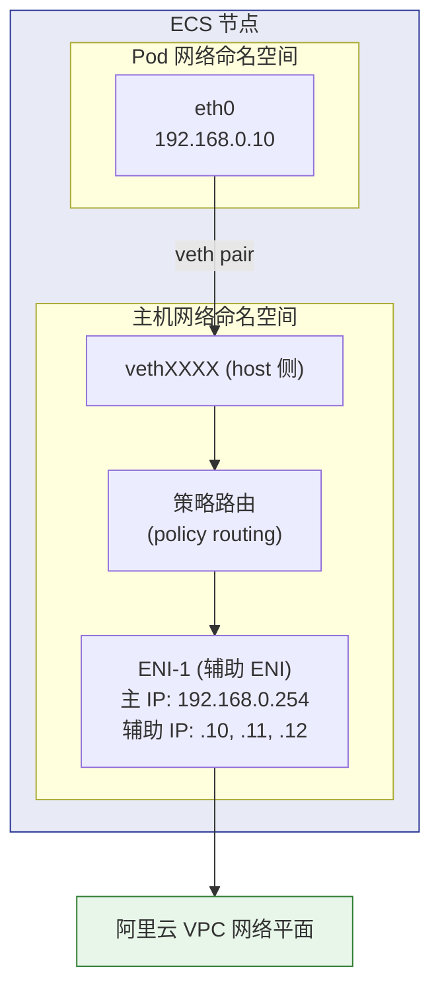
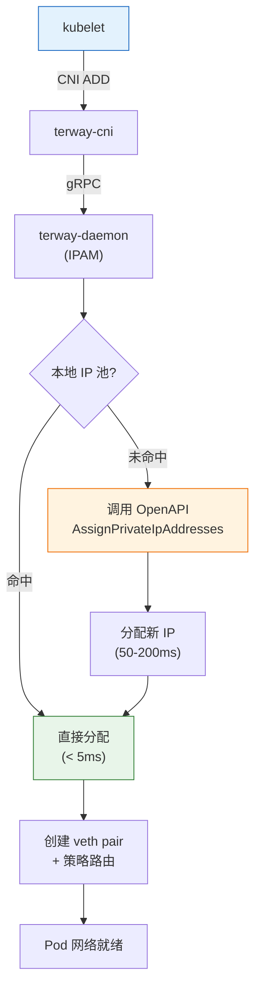
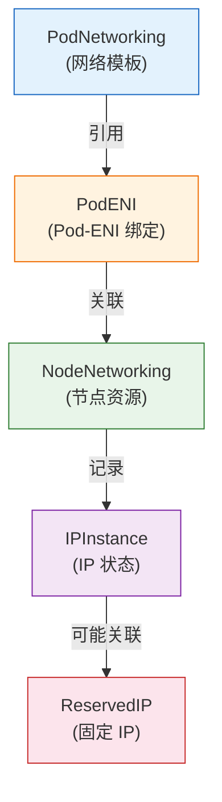
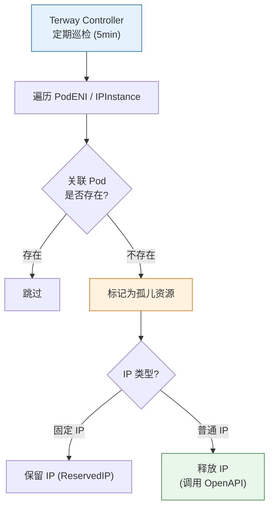

> **生产环境安全提示**
>
> 本文档包含可直接执行的运维命令。执行前请确认：当前目标集群与 Namespace 是否正确；是否具备足够的 RBAC 权限；是否已在非生产环境验证。命令风险等级标注：🔴 高风险（可能造成数据丢失或服务中断）、🟡 中风险（会修改集群状态，但通常可回滚）、🟢 低风险/只读（信息收集，无副作用）。


# [[Kubernetes|Kubernetes]] Terway (Aliyun) 全栈进阶培训 (从入门到专家)

> **适用版本**: 阿里云 ACK v1.26 - v1.32 | **Terway 版本**: v1.5+
> **核心原则**: 理解云原生网络架构、掌握高性能 ENI 策略

---

<!-- chunk: 演讲概述 -->## 演讲概述

## 目标受众

- 阿里云开发者：理解 Terway 的核心架构和模式选择
- 网络架构师：深入 ENI/IPAM 机制和性能调优
- SRE 工程师：Terway 故障排查与运维最佳实践

## 预计时长

| 阶段 | 内容 | 时长 |
|------|------|------|
| 第一阶段 | Terway 核心概念与模式对比 | 45 分钟 |
| 第二阶段 | 架构深度解析 (ENIIP/IPAM/CRD) | 60 分钟 |
| 第三阶段 | 生产部署与优化 | 45 分钟 |
| 第四阶段 | 排障与 SRE 运维 | 30 分钟 |
| Q&A | 互动问答 | 15 分钟 |
| **合计** | | **约 3 小时** |

## 核心要点

1. Terway 是阿里云 ACK 自研的 CNI 插件，Pod IP 直通 VPC
2. 三种核心模式：VPC 路由、ENI 独占、ENIIP（推荐默认）
3. IPAM 预热池机制减少 OpenAPI 调用延迟
4. 四层安全模型：节点安全组 → Pod 安全组 → [[NetworkPolicy|NetworkPolicy]] → RAM
5. 容量规划是 Terway 生产部署的第一步

---

<!-- chunk: 核心概念讲解 -->## 核心概念讲解

## 什么是 Terway？

Terway 是阿里云 ACK 自研的 Container Network Interface (CNI) 插件，深度集成阿里云 VPC/ENI 网络基础设施。核心特性：**Pod IP 即 VPC 内网 IP**，无需 NAT 即可被 VPC 内其他资源直接访问。

**与 Flannel 的关系：**

Flannel 是 ACK 早期默认 CNI，采用 Overlay (VXLAN) 方案。Terway 在 Pod 直通 VPC、性能、NetworkPolicy 支持上全面优于 Flannel。新建 ACK 集群默认安装 Terway；存量 Flannel 集群可按需迁移。

**Terway vs Flannel 核心对比：**

| 维度 | Terway | Flannel |
|:---|:---|:---|
| Pod 直通 VPC | 原生支持 | 不支持 (Overlay) |
| 性能损耗 | ~5% (ENI/ENIIP) | ~30% (VXLAN) |
| NetworkPolicy | 原生支持 (L3/L4) | 不支持 |
| SLB/ALB 联动 | 深度集成 | 需额外配置 |
| 安全组联动 | 节点级 + Pod 级 | 仅节点级 |

## 三种核心模式对比

**推荐默认使用 ENIIP 模式。**

| 模式 | Pod IP 来源 | 网络接口 | 性能 | 容量密度 | 适用场景 |
|:---|:---|:---|:---:|:---:|:---|
| **VPC 路由** | VPC 路由表条目 | veth pair + Node 网络栈 | ~70% | 低 | 小规模集群、Flannel 迁移过渡 |
| **ENI 独占** | 独占 ENI 主 IP | ENI 直通 | ~95% | 低 | 核心数据库、网关 |
| **ENIIP** | ENI 辅助 IP | veth pair + ENI | ~90% | 高 | 大规模通用场景（推荐） |

**扩展模式：**

| 模式 | 性能 | 密度 | 内核要求 | 适用场景 |
|:---|:---:|:---:|:---|:---|
| **ENIIP-Trunking** | ~88% | 最高 (200+ Pod/节点) | 4.19+ | 超大规模、Serverless |
| **IPVlan** | ~95% | 高 | 4.19+ 且 eBPF | 极致性能、低延迟 |

**模式选择决策树：**

```
是否需要 Pod 直通 VPC?
  -- 否 --> 考虑 Flannel / Calico / Cilium
  -- 是
      |-- 节点规模 < 50, Pod 密度 < 30/节点 --> VPC 模式
      |-- 需要极致性能 + 低密度 --> ENI 独占模式
      |-- 通用大规模场景 --> ENIIP 模式 (推荐默认)
      |-- 超大规模 / Serverless --> ENIIP-Trunking
      |-- 极致性能 + 高密度 --> IPVlan (内核 4.19+)
```

## Pod 直通 VPC 的意义

**网络拓扑简化：**
- Pod IP = VPC IP，VPC 内所有资源 (ECS、RDS、SLB) 可直接访问 Pod
- 消除 NAT 转发和 Overlay 封装，网络路径从 Pod 直达 VPC 网关
- 排障时直接 ping Pod IP，不需要穿透 Overlay 层

**安全组联动：**
- 节点级安全组：所有 Pod 共享节点安全组，统一管理出入站规则
- Pod 级安全组：每个 Pod 可绑定独立安全组，实现精细化访问控制

**SLB/ALB 集成：**
- LoadBalancer 类型 [[Service|Service]] 自动关联阿里云 SLB/ALB
- SLB 后端直接挂载 Pod IP (ENIIP 模式)，无需经过 NodePort 转发
- 流量路径：Client → SLB → Pod IP (直通)，减少一跳

## Terway 整体架构

**控制面组件：**

| 组件 | 形态 | 职责 |
|:---|:---|:---|
| **Terway [[DaemonSet|DaemonSet]]** | DaemonSet (每 Node 一个 Pod) | 运行 CNI 插件二进制, 执行 IPAM, 管理 ENI/IP 资源池 |
| **Terway Controller** | Deployment (1 副本, 可选 HA) | Watch CRD 变更, 管理 ENI 生命周期, GC |
| **eni-config ConfigMap** | ConfigMap | 全局网络配置: VPC ID, vSwitch ID, 安全组, 网络模式 |

**数据面资源：**

| 资源 | 来源 | 说明 |
|:---|:---|:---|
| **ENI (弹性网卡)** | 阿里云 ECS ENI | Pod 接入 VPC 的网络接口载体 |
| **ENIIP (辅助 IP)** | ENI Secondary IP | ENIIP 模式下 Pod 使用的 VPC IP 地址 |
| **veth pair** | Linux 网络设备 | 连接 Pod 网络命名空间与 ENI 的虚拟网线 |

## IPAM 机制

IP 地址管理 (IPAM) 是 Terway 的核心功能之一：

**IP 分配流程：**

```
Pod 创建请求 (kubelet)
    → CNI ADD 调用
    → terway-cni binary
    → gRPC 请求 → terway-daemon (IPAM 服务)
    → 本地 IP 池检查
        ├── 命中 → 直接分配 (< 5ms)
        └── 未命中 → 调用 OpenAPI (50-200ms) → 放入池后分配
    → 创建 veth pair + 策略路由
    → Pod 网络就绪
```

**IP 释放流程：**

```
Pod 删除请求 (kubelet)
    → CNI DEL 调用
    → terway-daemon
    → 回收 IP → 放回本地预热池
        ├── 池未满 → 保留在池中供下一个 Pod 复用
        └── 池满 → 调用 OpenAPI 释放
```

**IPAM 关键参数：**

| 参数 | 默认值 | 说明 |
|:---|:---|:---|
| `max_pool_size` | 5 | 本地 IP 预热池最大容量 |
| `min_pool_size` | 0 | 本地 IP 预热池最小容量 |
| `max_ip_per_eni` | 取决于实例规格 | 每个 ENI 可分配的辅助 IP 上限 |

**预热池设计**：提前分配好 IP 放入池中，Pod 创建时直接命中，减少 OpenAPI 调用。预热池命中时延迟 < 5ms，OpenAPI 调用延迟 50-200ms。

## CRD 资源模型

Terway 定义的 CRD 资源用于声明式管理网络状态：

| CRD | 作用 | 关键字段 |
|:---|:---|:---|
| **PodENI** | Pod 与 ENI/IP 的绑定关系 | `status.eniID`, `status.ipv4Addr` |
| **NodeNetworking** | 节点的 ENI 资源清单 | `status.eniInfos[]` |
| **PodNetworking** | Pod 级网络配置模板 | `spec.securityGroupIDs`, `spec.vSwitchIDs` |
| **ReservedIP** | 保留固定 IP (StatefulSet) | `spec.ipAddress` |
| **IPInstance** | IP 实例生命周期状态 | `status.pod`, `status.phase` |

## 安全模型四层体系

| 层级 | 机制 | 粒度 |
|:---|:---|:---|
| 第一层 | 节点安全组 | 节点级 (粗) |
| 第二层 | Pod 安全组 (PodNetworking) | Pod 级 (中) |
| 第三层 | NetworkPolicy (iptables/eBPF) | Pod 级 (细) |
| 第四层 | RAM 权限控制 | API 级 (最细) |

## 容量规划

**单节点最大 Pod 数计算公式：**

```
ENIIP 模式单节点最大 Pod 数 = (最大 ENI 数 - 1) × 单 ENI 最大辅助 IP 数
```

**常用规格速查：**

| ECS 规格 | 最大 ENI | 单 ENI 辅助 IP | 理论最大 Pod | 推荐上限 (80%) |
|:---|:---:|:---:|:---:|:---:|
| ecs.g7.xlarge (4C16G) | 4 | 10 | 30 | 24 |
| ecs.g7.2xlarge (8C32G) | 6 | 15 | 75 | 60 |
| ecs.g7.4xlarge (16C64G) | 8 | 30 | 210 | 168 |
| ecs.g7.8xlarge (32C128G) | 16 | 30 | 450 | 360 |

**vSwitch CIDR 规划：**

| 集群规模 | 推荐 CIDR | IP 数量 |
|:---|:---|:---:|
| 小型 (< 50 节点) | /20 | 4,096 |
| 中型 (50-200 节点) | /18 | 16,384 |
| 大型 (200-500 节点) | /17 | 32,768 |
| 超大 (500+ 节点) | /16 | 65,536 |

---

<!-- chunk: 架构图 -->## 架构图

## Terway ENIIP 模式数据流



## IPAM 分配流程



## CRD 关联关系



## GC 机制工作流程



---

<!-- chunk: 实战演示步骤 -->## 实战演示步骤

## 演示 1：验证 Terway 状态

``` bash
# 🟢 低风险：只读/信息收集，通常无副作用
# 步骤 1: 确认 Terway DaemonSet 运行状态
kubectl -n kube-system get ds terway-eniip -o wide

# 步骤 2: 查看 eni-config ConfigMap
kubectl -n kube-system get cm eni-config -o yaml

# 步骤 3: 查看 Pod IP 属于 VPC CIDR
kubectl get pods -o wide --all-namespaces | head -20

# 步骤 4: 检查 Node 网络资源注解
kubectl get node <node-name> -o jsonpath='{.metadata.annotations}' | jq .

# 步骤 5: 查看 Terway CRD 资源
kubectl get podeni -A
kubectl get nodenetworking -A
```
## 演示 2：Pod 安全组配置

> ⚠️ **🟡 中危变更** — 变更集群资源状态，建议先 --dry-run 或 diff 确认
> - `kubectl apply/create/replace`：创建/变更集群资源

``` bash
# 🟡 中风险：会修改集群/资源状态，执行前请确认目标、影响范围与授权
# 步骤 1: 创建 PodNetworking (指定安全组和 vSwitch)
cat <<EOF | kubectl apply -f -
apiVersion: network.alibabacloud.com/v1beta1
kind: PodNetworking
metadata:
  name: db-pod-net
spec:
  securityGroupIDs:
    - sg-db-xxxxx
  vSwitchIDs:
    - vsw-2zexxxxx
  eniType: eniip
EOF

# 步骤 2: 创建使用该网络的 Pod
cat <<EOF | kubectl apply -f -
apiVersion: v1
kind: Pod
metadata:
  name: db-pod
  annotations:
    k8s.v1.cni.cncf.io/networks: db-pod-net
spec:
  containers:
  - name: postgres
    image: postgres:15
EOF

# 步骤 3: 验证 Pod 使用了指定安全组
kubectl get podeni -A | grep db-pod
```
## 演示 3：NetworkPolicy 实战

> ⚠️ **🟡 中危变更** — 变更集群资源状态，建议先 --dry-run 或 diff 确认
> - `kubectl apply/create/replace`：创建/变更集群资源

``` bash
# 🟡 中风险：会修改集群/资源状态，执行前请确认目标、影响范围与授权
# 步骤 1: 部署默认拒绝策略
cat <<EOF | kubectl apply -f -
apiVersion: networking.k8s.io/v1
kind: NetworkPolicy
metadata:
  name: default-deny-ingress
  namespace: production
spec:
  podSelector: {}
  policyTypes:
    - Ingress
EOF

# 步骤 2: 放通 monitoring 命名空间
cat <<EOF | kubectl apply -f -
apiVersion: networking.k8s.io/v1
kind: NetworkPolicy
metadata:
  name: allow-monitoring
  namespace: production
spec:
  podSelector: {}
  ingress:
    - from:
        - namespaceSelector:
            matchLabels:
              name: monitoring
      ports:
        - protocol: TCP
          port: 9090
EOF

# 步骤 3: 放通 api → db
cat <<EOF | kubectl apply -f -
apiVersion: networking.k8s.io/v1
kind: NetworkPolicy
metadata:
  name: allow-api-to-db
  namespace: production
spec:
  podSelector:
    matchLabels:
      app: postgres
  ingress:
    - from:
        - podSelector:
            matchLabels:
              app: api-server
      ports:
        - protocol: TCP
          port: 5432
EOF

# 步骤 4: 验证 NetworkPolicy
kubectl get networkpolicy -A
```
## 演示 4：StatefulSet 固定 IP

> ⚠️ **🟡 中危变更** — 变更集群资源状态，建议先 --dry-run 或 diff 确认
> - `kubectl apply/create/replace`：创建/变更集群资源
> - `kubectl delete`：删除资源（可由声明式清单重建）

``` bash
# 🟡 中风险：会修改集群/资源状态，执行前请确认目标、影响范围与授权
# 步骤 1: 创建 PodNetworking
cat <<EOF | kubectl apply -f -
apiVersion: network.alibabacloud.com/v1beta1
kind: PodNetworking
metadata:
  name: fixed-ip-net
spec:
  securityGroupIDs:
    - sg-2zexxxxx
  vSwitchIDs:
    - vsw-2zexxxxx
  eniType: eniip
EOF

# 步骤 2: 创建带注解的 StatefulSet
cat <<EOF | kubectl apply -f -
apiVersion: apps/v1
kind: StatefulSet
metadata:
  name: postgres
spec:
  replicas: 3
  serviceName: postgres-headless
  selector:
    matchLabels:
      app: postgres
  template:
    metadata:
      labels:
        app: postgres
      annotations:
        k8s.v1.cni.cncf.io/networks: fixed-ip-net
    spec:
      containers:
        - name: postgres
          image: postgres:15
          env:
          - name: POSTGRES_PASSWORD
            value: "test"
EOF

# 步骤 3: 查看 Pod IP
kubectl get pods -l app=postgres -o wide

# 步骤 4: 删除 Pod 后验证 IP 不变
kubectl delete pod postgres-0
kubectl get pod postgres-0 -o wide

# 步骤 5: 查看 ReservedIP 记录
kubectl get reservedip -A
```
## 演示 5：故障排查

> ⚠️ **🟡 中危变更** — 变更集群资源状态，建议先 --dry-run 或 diff 确认
> - `kubectl delete`：删除资源（可由声明式清单重建）

``` bash
# 🟢 低风险：只读/信息收集，通常无副作用
# 场景: Pod 卡在 ContainerCreating

# 步骤 1: 查看 Pod 事件
kubectl describe pod <pod-name> -n <ns>

# 步骤 2: 检查 Terway 日志
kubectl -n kube-system logs terway-eniip-xxxxx --tail=100

# 步骤 3: 检查 IP 资源
kubectl get podeni -A | grep <node>
kubectl get nodenetworking <node> -o yaml

# 步骤 4: 检查 vSwitch IP 使用情况
# 登录阿里云控制台 → VPC → 交换机 → 查看 IP 使用率

# 步骤 5: 检查 ECS ENI 配额
# 登录阿里云控制台 → ECS → 实例 → 查看网卡配额

# 紧急处理: 手动清理泄漏 IP
kubectl get ipinstance -A | grep -v Running
kubectl delete ipinstance <leaked-ip-instance> -n <ns>

```
---

<!-- chunk: 常见问题与回答 -->## 常见问题与回答

## Q1: Terway 和 Flannel 应该怎么选？

**回答**: 新建集群推荐 Terway，除非是 Windows 节点或不支持 ENI 的场景。Terway 的 Pod 直通 VPC、NetworkPolicy 支持、SLB 联动是 Flannel 无法提供的。存量 Flannel 集群可以按需迁移，但迁移过程需要规划（涉及 Pod 重建）。

## Q2: 为什么 ENIIP 模式需要策略路由？

**回答**: 一个节点可能有多张辅助 ENI，每个 Pod 绑定在不同 ENI 的辅助 IP 上。策略路由 (policy routing) 确保不同 Pod 的流量走正确的 ENI 出去。例如 Pod A 绑定在 ENI-1 的辅助 IP，Pod B 绑定在 ENI-2 的辅助 IP，策略路由根据源 IP 选择对应的 ENI 发送数据。

## Q3: IP 预热池大小应该设置多少？

**回答**: 默认 `max_pool_size=5`，适合大多数场景。建议设置：突发扩容场景设为 5-10，超大规模集群设为 10-20。预热池越大，Pod 创建越快，但占用更多 vSwitch IP。注意 OpenAPI 速率限制约 100 QPS，大规模扩容时预热池是关键缓冲。

## Q4: 如何排查 IP 耗尽问题？

**回答**: (1) 检查 vSwitch IP 使用率（阿里云控制台）；(2) `kubectl get ipinstance -A` 查看所有 IP 状态；(3) 检查是否有泄漏 IP（Pod 已不存在但 IP 未释放）；(4) 手动清理：`kubectl delete ipinstance <leaked-ip>`；(5) 长期解决：扩大 vSwitch CIDR 或新增 vSwitch。

## Q5: NetworkPolicy 的 iptables 和 eBPF 实现有什么区别？

**回答**: iptables 是 Terway 默认实现，成熟稳定但大规模策略（1000+ 规则）性能下降。eBPF 是 v1.5+ 可选实现，规则更新毫秒级，规模无关 (O(1) 查找)。如果集群 NetworkPolicy 数量超过 500，建议评估 eBPF 模式。eBPF 需要内核 4.19+（推荐 5.10+）。

## Q6: 跨 VPC 场景 Pod 如何通信？

**回答**: Pod IP 仅在本 VPC 内可路由。跨 VPC 访问必须通过 CEN（云企业网）或 VPN 网关打通 VPC 网络。禁止依赖公网 NAT，因为：(1) 延迟高；(2) 带宽有限；(3) 安全风险。配置 CEN 后，不同 VPC 的 Pod 可以直接通过 IP 互通。

## Q7: eni-config 修改后为什么不生效？

**回答**: eni-config 修改后必须执行 `kubectl rollout restart ds terway-eniip -n kube-system` 滚动重启 DaemonSet，否则旧的 terway-eniip Pod 仍然使用旧配置。这是最常见的"配了不生效"问题。

## Q8: 如何监控 Terway 的健康状态？

**回答**: 关键指标：`terway_alloc_ip_duration_ms`（IP 分配延迟）、`terway_ip_pool_size`（预热池 IP 数）、`terway_eni_count`（ENI 数量）、`terway_gc_total/errors`（GC 运行状态）、`terway_openapi_errors_total`（OpenAPI 错误率）。建议配置：IP 分配 P95 > 500ms 警告，预热池耗尽严重，OpenAPI 错误率 > 10% 警告。

## Q9: 固定 IP 有什么限制？

**回答**: (1) 仅支持 StatefulSet，Deployment 的 Pod 重建后 IP 会变化；(2) 固定 IP 占用 vSwitch IP 池，需纳入容量规划；(3) 节点下线时固定 IP 的 Pod 迁移到新节点后 IP 保持不变（跨节点固定）；(4) 删除 StatefulSet 时固定 IP 不会自动释放，需要手动清理 ReservedIP。

## Q10: 如何处理 OpenAPI 限流？

**回答**: (1) 增大预热池 (`max_pool_size`) 减少实时调用；(2) 申请提升 API 配额；(3) 避免在短时间内大规模扩缩 Pod（使用分批扩缩）；(4) 检查是否有异常组件频繁调用 API（如不断创建删除 Pod 的 CronJob）。Terway 日志中 `Throttling` 关键字表示触发限流。

---

<!-- chunk: 要点总结 -->## 要点总结

## Terway 知识图谱

```
Terway
├── 核心概念
│   ├── Pod 直通 VPC (Pod IP = VPC IP)
│   ├── ENI/IPAM 机制
│   └── CRD 声明式管理
├── 网络模式
│   ├── VPC 路由 (小规模)
│   ├── ENI 独占 (高性能)
│   ├── ENIIP (推荐默认)
│   ├── ENIIP-Trunking (超大规模)
│   └── IPVlan (极致性能)
├── 安全模型
│   ├── 节点安全组 (粗粒度)
│   ├── Pod 安全组 (中粒度)
│   ├── NetworkPolicy (细粒度)
│   └── RAM 权限 (最细)
├── 运维
│   ├── 容量规划 (vSwitch CIDR)
│   ├── IP 预热池调优
│   ├── GC 垃圾回收
│   └── 监控告警
└── 高级特性
    ├── 固定 IP (StatefulSet)
    ├── eBPF NetworkPolicy
    └── SLB 直通挂载
```

## SRE 运维红线

| 红线 | 说明 | 违反后果 |
|------|------|---------|
| **红线 1** | IP 资源规划必须预留 20% 余量 | vSwitch IP 耗尽导致 Pod 无法创建 |
| **红线 2** | 高并发业务必须评估 ECS 规格 | ENI 配额不足限制 Pod 密度 |
| **红线 3** | 核心数据库必须使用 ENI 独占或 IPVlan 模式 | 网络性能不足影响业务 |
| **红线 4** | 生产环境必须配置 Terway 监控告警 | 无监控等于盲飞 |
| **红线 5** | 严禁修改 eni-config 后不重启 DaemonSet | 配置不生效 |
| **红线 6** | 跨 VPC 必须通过 CEN 打通 | 依赖公网 NAT 存在安全和性能风险 |
| **红线 7** | NetworkPolicy 变更必须先测试 | 误配导致业务大面积不可用 |

---

<!-- chunk: 延伸阅读 -->## 延伸阅读

## 推荐阅读

| 序号 | 文件路径 | 内容说明 |
|:---|:---|:---|
| 1 | `网络/40-terway-product-overview.md` | 产品概览: 定位、版本历史、模式总览 |
| 2 | `网络/41-terway-architecture-deep-dive.md` | 架构原理: 控制面/数据面详解、IPAM |
| 3 | `网络/42-terway-usage-guide.md` | 使用指南: 安装配置、模式切换 |
| 4 | `网络/43-terway-crd-operations.md` | CRD 操作: PodENI/ReservedIP CRUD |
| 5 | `网络/44-terway-operations-manual.md` | 运维手册: 健康检查、GC、升级 |
| 6 | `网络/45-terway-testing-validation.md` | 测试验证: 网络连通性、NetworkPolicy 测试 |
| 7 | `网络/46-terway-performance-tuning.md` | 性能调优: 模式对比、内核调优 |
| 8 | `网络/47-terway-troubleshooting-fta.md` | 故障树分析: 结构化排障方法 |

## 通用网络知识

| 序号 | 文件路径 | 内容说明 |
|:---|:---|:---|
| 1 | `网络/05-terway-advanced-guide.md` | Terway 高级指南 |
| 2 | `网络/37-terway-resources-crud-operations.md` | CRD CRUD 操作 |
| 3 | `网络/38-terway-gc-mechanism.md` | GC 垃圾回收机制 |

## 关联培训专题

- `kubernetes-service-presentation.md` — Service 与 Terway 网络的协作
- `kubernetes-coredns-presentation.md` — DNS 解析与 Terway 的关系
- `kubernetes-ingress-presentation.md` — Ingress 与 SLB 的集成
- `kubernetes-troubleshooting-methodology-presentation.md` — 网络排障方法

---

> **Kusheet Project** | 作者: Allen Galler (allengaller@gmail.com)

---

<!-- chunk: Obsidian 相关文档 -->## Obsidian 相关文档

- topic-presentations MOC
- Topic: Presentations（技术演示文稿）
- Kubernetes 架构与基础概念全栈培训
- Kubernetes CoreDNS 全栈进阶培训 (从入门到专家)
- Kubernetes Ingress 全栈进阶培训 (从入门到专家)
- Kubernetes 可观测性全栈培训 (监控、日志、追踪)
- Kubernetes 调度与编排策略全栈培训
- Kubernetes 安全与 RBAC 权限管理全栈培训
- Kubernetes Service 全栈进阶培训 (从入门到专家)
- Kubernetes 存储体系全栈进阶培训 (从入门到专家)
- Kubernetes 故障排查方法论全栈培训
- Kubernetes Workload 全栈进阶培训 (从入门到专家)

## See Also

- kubernetes-service-presentation
- kubernetes-storage-presentation
- kubernetes-troubleshooting-methodology-presentation
- kubernetes-workload-presentation

## Related

- [[生态参考/topic-index/terway-index.md|Terway 知识图谱索引]]

```

<!-- risk-assessed -->
