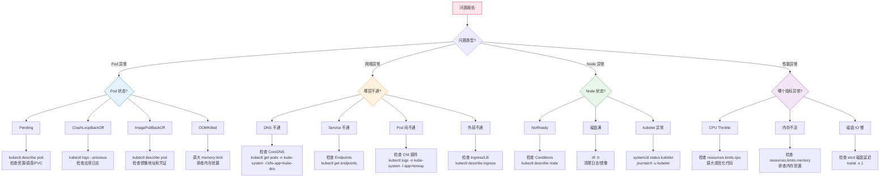
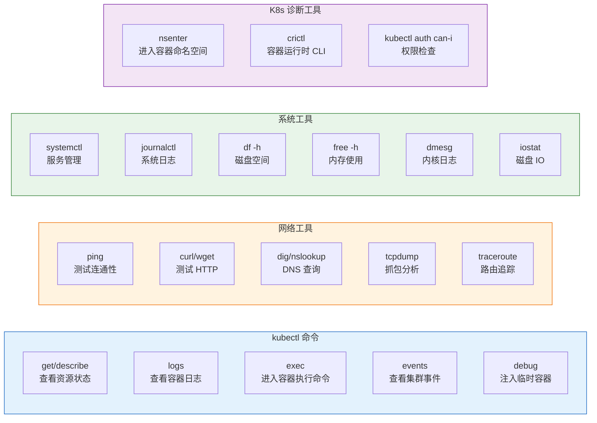

# [[Kubernetes|Kubernetes]] 故障排查方法论全栈培训

> **适用版本**: 所有 Kubernetes 版本 | **文档类型**: 实战排障专项
> **核心原则**: 分层排查、证据驱动、快速止损

---

<!-- chunk: 演讲概述 -->## 演讲概述

## 目标受众

- SRE 工程师：掌握系统化的故障排查方法论
- 架构师：设计可观测性和应急响应体系
- 高级运维：处理生产环境复杂问题
- 开发人员：理解应用在 K8s 上的故障模式

## 预计时长

| 阶段 | 内容 | 时长 |
|------|------|------|
| 第一阶段 | 排障心法与工具箱 | 25 分钟 |
| 第二阶段 | 分层排障模型 | 40 分钟 |
| 第三阶段 | 常见故障模式与排查流程 | 35 分钟 |
| 第四阶段 | 实战演练与动手实验 | 35 分钟 |
| 第五阶段 | 应急响应 SOP | 25 分钟 |
| 第六阶段 | 根因分析与复盘 | 20 分钟 |
| Q&A | 互动问答 | 15 分钟 |
| **合计** | | **约 3 小时** |

## 核心学习目标

完成本次培训后，学员能够：

1. 运用排障五步法系统化地定位和解决问题
2. 按照分层模型从应用层到基础设施层逐层排查
3. 使用 kubectl、系统工具和网络工具进行故障诊断
4. 编写标准的应急响应 SOP 和问题复盘报告
5. 使用 5-Whys 方法进行根因分析
6. 建立自动化的故障检测和响应机制

## 核心要点

1. 排障五步走：确认现象 → 信息收集 → 假设验证 → 快速止损 → 根因分析
2. 分层排查：从应用层到基础设施层逐层定位
3. 证据驱动：用数据说话，不靠猜测
4. 快速止损优先：先恢复服务，再找根因
5. 每次问题都是改进系统的机会

---

<!-- chunk: 课程大纲 -->## 课程大纲

| 序号 | 章节 | 关键知识点 | 时长 |
|------|------|-----------|------|
| 1 | 排障心法 | 五步法、黄金法则、现场保护 | 15min |
| 2 | 分层模型 | 6 层排查、工具矩阵 | 25min |
| 3 | Pod 问题 | Pending/CrashLoop/ImagePull/OOM | 20min |
| 4 | 网络问题 | DNS/Service/Pod-to-Pod/Ingress | 20min |
| 5 | Node 问题 | NotReady/磁盘满/kubelet 异常 | 15min |
| 6 | Control Plane | API Server/etcd/Scheduler | 15min |
| 7 | 应急响应 | SOP、止损策略、问题复盘 | 20min |
| 8 | 实战演练 | 综合故障排查 | 35min |

---

<!-- chunk: 核心概念讲解 -->## 核心概念讲解

## 排障心法

**排障五步法：**

| 步骤 | 核心问题 | 关键动作 | 产出 |
|------|---------|---------|------|
| **1. 确认现象** | 谁坏了？坏到什么程度？ | 明确影响范围、复现路径、错误信息 | 问题影响范围文档 |
| **2. 信息收集** | 发生了什么？ | Logs、Events、Metrics、Traces | 关键日志和指标快照 |
| **3. 假设验证** | 可能是什么原因？ | 列出可能原因，逐一验证排除 | 排除列表和验证结果 |
| **4. 快速止损** | 怎么先恢复服务？ | 重启、扩容、回滚、切流 | 服务恢复确认 |
| **5. 根因分析** | 为什么会发生？如何防止？ | 5-Whys 分析、改进措施、复盘 | 改进措施列表 |

**排障黄金法则：**

1. **先止血，后治病**：恢复服务优先于查找根因
2. **保留现场**：在做任何操作前先收集日志、截图、快照
3. **一次只改一个变量**：同时改多个东西会让你无法判断哪个有效
4. **二元分治法**：将问题空间一分为二，逐步缩小范围
5. **记录所有操作**：每个操作和时间戳都要记录，便于复盘

## 分层排查模型

Kubernetes 问题可以从多个层级排查，建议从上到下（应用层 → 基础设施层）或根据问题现象从最可能的层开始：

> ⚠️ **🟡 中危变更** — 变更集群资源状态，建议先 --dry-run 或 diff 确认
> - `kubectl exec`：进入容器执行命令，可能改变容器状态

```
┌────────────────────────────────────────────────┐
│  Layer 5: 应用层 (Application)                   │  代码 Bug、配置错误、依赖超时
│  排查工具: kubectl logs, kubectl exec           │
├────────────────────────────────────────────────┤
│  Layer 4: Service/Ingress 层                     │  DNS 解析失败、Service 无 Endpoints
│  排查工具: dig, curl, kubectl describe svc/ing  │
├────────────────────────────────────────────────┤
│  Layer 3: Pod 层                                 │  ImagePullBackOff、CrashLoopBackOff
│  排查工具: kubectl describe pod, logs --previous│
├────────────────────────────────────────────────┤
│  Layer 2: 调度层 (Scheduling)                    │  Pending、资源不足、亲和性冲突
│  排查工具: kubectl describe pod (Events)        │
├────────────────────────────────────────────────┤
│  Layer 1: Node 层 (Infrastructure)               │  NotReady、磁盘满、CPU Throttle
│  排查工具: kubectl describe node, ssh, dmesg    │
├────────────────────────────────────────────────┤
│  Layer 0: Control Plane                          │  etcd 慢、API Server 不可用
│  排查工具: kubectl -n kube-system, etcdctl      │
└────────────────────────────────────────────────┘
```

## Pod 层常见问题

**Pod 生命周期与问题点：**

| 阶段 | 状态 | 可能原因 | 排查命令 | 预期输出 |
|------|------|---------|---------|---------|
| 调度 | `Pending` | 资源不足 | `kubectl describe pod` | `Insufficient cpu/memory` |
| 调度 | `Pending` | PVC 无法挂载 | `kubectl describe pvc` | `storageclass not found` |
| 调度 | `Pending` | 亲和性冲突 | `kubectl describe pod` | `node(s) didn't match node selector` |
| 拉取镜像 | `ImagePullBackOff` | 镜像不存在 | `kubectl describe pod` | `Failed to pull image: not found` |
| 拉取镜像 | `ImagePullBackOff` | 凭证错误 | `kubectl describe pod` | `authentication required` |
| 启动容器 | `CrashLoopBackOff` | 应用崩溃 | `kubectl logs --previous` | 应用错误日志 |
| 启动容器 | `CrashLoopBackOff` | 环境变量缺失 | `kubectl logs --previous` | `config not found` |
| 运行中 | `OOMKilled` | 内存 Limit 过小 | `kubectl describe pod` | `Last State: Terminated, Reason: OOMKilled` |
| 运行中 | 探针失败 | Liveness/Readiness 检查不通过 | `kubectl describe pod` | `Liveness probe failed` |
| 就绪 | 不接流量 | ReadinessProbe 失败 | `kubectl get endpoints` | Endpoints 列表为空 |

**CrashLoopBackOff 排查决策树：**

```
CrashLoopBackOff
    ↓
kubectl logs <pod> --previous
    ↓
┌─────────────────────────────────────────────┐
│ 日志显示什么？                                │
├─────────────────────────────────────────────┤
│ "connection refused"   → 依赖服务未就绪       │
│   解决: 检查依赖的 Service 和 Pod 状态        │
│                                              │
│ "config not found"     → ConfigMap/Secret 缺失│
│   解决: kubectl get configmap/secret         │
│                                              │
│ "permission denied"    → 文件权限问题          │
│   解决: 检查 SecurityContext 和 Volume 挂载   │
│                                              │
│ "out of memory"        → OOM → 调大 Limit    │
│   解决: 调大 resources.limits.memory          │
│                                              │
│ "port already in use"  → 端口冲突             │
│   解决: 检查 containerPort 配置               │
│                                              │
│ 无日志                  → 入口命令错误         │
│   解决: 检查 command/args 配置                │
└─────────────────────────────────────────────┘
```

## 网络层排查

**网络排障五步法：**

> ⚠️ **🟡 中危变更** — 变更集群资源状态，建议先 --dry-run 或 diff 确认
> - `kubectl exec`：进入容器执行命令，可能改变容器状态

```bash
# Step 1: DNS 是否正常？
kubectl exec <pod> -- nslookup kubernetes.default
# 不通 → 检查 CoreDNS: kubectl get pods -n kube-system -l k8s-app=kube-dns

# Step 2: Service 是否有 Endpoints？
kubectl get endpoints <service>
# 无 Endpoints → 检查 Label Selector 和 Pod Ready 状态

# Step 3: Pod 到 Pod 是否通？
kubectl exec <pod-a> -- ping <pod-b-ip>
# 不通 → 检查 CNI 插件: kubectl logs -n kube-system -l app=<cni-name>

# Step 4: Pod 到 Service 是否通？
kubectl exec <pod> -- curl -v http://<service-ip>:<port>
# 不通 → 检查 kube-proxy 规则: iptables -L -n | grep KUBE-SVC

# Step 5: 外部到 Ingress 是否通？
curl -H "Host: xxx" http://<ingress-ip>
# 不通 → 检查 Ingress Controller: kubectl describe ingress <name>
```

## Node 层排查

**Node NotReady 排查清单：**

```bash
# 步骤 1: 查看 Node 状态
kubectl describe node <node-name>
# 关注 Conditions 部分

# 步骤 2: 检查 Conditions 含义
# MemoryPressure=True  → 内存不足，需要清理或扩容
# DiskPressure=True    → 磁盘不足，需要清理日志/镜像
# PIDPressure=True     → 进程数不足，检查是否有进程泄漏
# Ready=False          → kubelet 无法与 API Server 通信

# 步骤 3: SSH 到节点检查
ssh <node-ip>

# 检查 kubelet 状态
systemctl status kubelet
# 预期: active (running)
journalctl -u kubelet --since "1 hour ago" --no-pager | tail -50

# 检查磁盘空间
df -h
# 预期: 使用率 < 85%

# 检查内存
free -h
# 预期: available > 20%

# 检查进程数
ps aux | wc -l

# 检查内核日志（OOM、网络异常等）
dmesg | tail -50
# 关注: Out of memory, NIC Link is Down

# 检查容器运行时
crictl ps
crictl logs <container-id>
```

## Control Plane 排查

**API Server 不可用的症状：**

- `kubectl` 命令超时或返回 connection refused
- 所有控制器停止工作（无法调度、无法自愈）
- etcd 写入延迟升高

**排查步骤：**

```bash
# 检查 API Server Pod
kubectl get pods -n kube-system -l component=kube-apiserver
# 预期输出:
# NAME                                 READY   STATUS    RESTARTS   AGE
# kube-apiserver-master                1/1     Running   0          30d

# 检查 etcd 健康
kubectl -n kube-system exec etcd-<master> -- \
  etcdctl endpoint health \
  --cacert=/etc/kubernetes/pki/etcd/ca.crt \
  --cert=/etc/kubernetes/pki/etcd/server.crt \
  --key=/etc/kubernetes/pki/etcd/server.key
# 预期输出: 127.0.0.1:2379 is healthy

# 检查 API Server 日志
kubectl logs -n kube-system kube-apiserver-<master> --tail=100
# 关注: etcd connection refused, certificate expired, storage backend

# 常见原因：
# 1. etcd 不可用（磁盘慢、网络分区、quorum 丢失）
# 2. 证书过期（检查证书有效期: openssl x509 -in /etc/kubernetes/pki/apiserver.crt -noout -dates）
# 3. 内存不足（API Server OOM）
# 4. 防火墙规则变更
```

---

<!-- chunk: 架构图 -->## 架构图

## 故障排查决策树



## 排障工具矩阵



---

<!-- chunk: 实战演示步骤 -->## 实战演示步骤

## 演示 1：Pod 故障排查全流程

> ⚠️ **🟡 中危变更** — 变更集群资源状态，建议先 --dry-run 或 diff 确认
> - `kubectl exec`：进入容器执行命令，可能改变容器状态

```bash
# 场景: Pod 处于 CrashLoopBackOff

# 步骤 1: 查看 Pod 状态
kubectl get pods
# 输出: my-app-xxx   0/1   CrashLoopBackOff   5   3m

# 步骤 2: 查看详细信息
kubectl describe pod my-app-xxx
# 关注 Events 部分:
#   Warning  BackOff    2m   kubelet  Back-off restarting failed container
#   Normal   Pulling    3m   kubelet  Pulling image "my-app:v1.0"
#   Normal   Pulled     3m   kubelet  Successfully pulled image
#   Normal   Created    3m   kubelet  Created container app
#   Normal   Started    3m   kubelet  Started container app

# 步骤 3: 查看上一次容器日志（最关键）
kubectl logs my-app-xxx --previous
# 可能的输出:
# "Failed to connect to database: connection refused"
# → 依赖服务未就绪，检查数据库连接配置

# 步骤 4: 查看当前容器日志
kubectl logs my-app-xxx --tail=50

# 步骤 5: 进入容器排查（如果 Pod 还在运行）
kubectl exec -it my-app-xxx -- /bin/sh
# 在容器内检查: env, cat /etc/config/*, netstat -tlnp

# 步骤 6: 使用 kubectl debug 注入临时容器
kubectl debug my-app-xxx -it --image=busybox
# 在临时容器中检查网络和文件系统
```

## 演示 2：网络故障排查

> ⚠️ **🟡 中危变更** — 变更集群资源状态，建议先 --dry-run 或 diff 确认
> - `kubectl exec`：进入容器执行命令，可能改变容器状态

```bash
# 场景: Pod A 无法访问 Pod B

# 步骤 1: 确认两个 Pod 都在运行
kubectl get pods -o wide
# 预期: 两个 Pod 都是 Running，记录 IP 和所在 Node

# 步骤 2: 测试 DNS
kubectl exec -it <pod-a> -- nslookup kubernetes.default
# 成功 → DNS 正常，继续排查
# 失败 → DNS 问题，跳转到 DNS 排查

# 步骤 3: 测试 Pod 到 Pod 连通性
kubectl exec -it <pod-a> -- ping <pod-b-ip> -c 3
# 成功 → 网络层通，问题在应用层
# 失败 → CNI 问题，检查网络插件

# 步骤 4: 测试 Service 连通性
kubectl exec -it <pod-a> -- curl -v http://<service-name>:<port>/healthz
# 成功 → Service 正常
# 失败 → 检查 Service 和 Endpoints

# 步骤 5: 检查 Endpoints
kubectl get endpoints <service-name>
# 无 Endpoints → Pod 的 Label 不匹配或 Pod Not Ready
# 有 Endpoints → 检查 kube-proxy 规则

# 步骤 6: 检查 NetworkPolicy
kubectl get networkpolicy -A
# 可能有 NetworkPolicy 阻止了流量

# 步骤 7: 抓包分析（高级）
kubectl exec -it <pod-a> -- tcpdump -i any -nn port <port> -c 10
```

## 演示 3：Node 故障排查

> ⚠️ **🟠 高危操作** — 影响业务流量或节点状态，需变更工单+影响评估+计划回滚
> - `kubectl drain`：驱逐节点所有 Pod，业务流量受影响

```bash
# 场景: Node NotReady

# 步骤 1: 查看 Node 详细状态
kubectl describe node <node-name>
# 关注 Conditions 部分:
# Ready              False   Tue, 18 May 2026 10:00:00 +0800   Tue, 18 May 2026 10:05:00 +0800   NodeStatusUnknown
# 这表示 kubelet 5 分钟未上报状态

# 步骤 2: 查看 Node 上的 Pod 分布
kubectl get pods --all-namespaces --field-selector spec.nodeName=<node-name>
# 确认影响范围

# 步骤 3: SSH 到节点
ssh <node-ip>

# 步骤 4: 检查 kubelet（最常见的原因）
systemctl status kubelet
# 如果 inactive → systemctl start kubelet
# 如果 running 但 Node NotReady → 检查日志

journalctl -u kubelet --since "30 minutes ago" --no-pager | tail -50
# 关注: certificate expired, connection refused, eviction

# 步骤 5: 检查资源
df -h          # 磁盘使用率，> 85% 可能触发 DiskPressure
free -h        # 内存使用率
top -bn1 | head -20  # CPU 使用率
dmesg | tail   # 内核日志，关注 OOM、NIC Link Down

# 步骤 6: 检查容器运行时
crictl ps      # 查看容器列表
crictl logs <container-id>  # 查看容器日志
systemctl status containerd  # 检查 containerd 状态

# 步骤 7: 驱赶 Pod（如果需要维修）
kubectl drain <node-name> --ignore-daemonsets --delete-emptydir-data
```

## 演示 4：DNS 故障排查

> ⚠️ **🟡 中危变更** — 变更集群资源状态，建议先 --dry-run 或 diff 确认
> - `kubectl exec`：进入容器执行命令，可能改变容器状态

```bash
# 场景: DNS 解析失败

# 步骤 1: 创建调试 Pod
kubectl run dns-debug --image=busybox --command -- sleep 3600

# 步骤 2: 测试内部 DNS
kubectl exec dns-debug -- nslookup kubernetes.default.svc.cluster.local
# 成功 → CoreDNS 正常
# 失败 → CoreDNS 问题

# 步骤 3: 测试外部 DNS
kubectl exec dns-debug -- nslookup www.google.com
# 内部成功 + 外部失败 → forward 插件问题
# 内部失败 + 外部失败 → CoreDNS 整体问题

# 步骤 4: 查看 CoreDNS 状态
kubectl get pods -n kube-system -l k8s-app=kube-dns
# 如果 Pod 不在 Running → 重启 CoreDNS

kubectl logs -n kube-system -l k8s-app=kube-dns --tail=50
# 关注: SERVFAIL, loop detected, i/o timeout

# 步骤 5: 检查 CoreDNS 配置
kubectl get configmap coredns -n kube-system -o yaml
# 检查 forward 和 cache 配置是否正确

# 步骤 6: 直接查询 CoreDNS
kubectl exec dns-debug -- dig @10.96.0.10 <domain> +short +timeout=2
```

## 演示 5：应急响应演练

> ⚠️ **🟠 高危操作** — 影响业务流量或节点状态，需变更工单+影响评估+计划回滚
> - `kubectl drain`：驱逐节点所有 Pod，业务流量受影响
> - `kubectl rollout undo/restart`：触发滚动变更，影响副本

```bash
# 场景: 大量 5xx 错误，需要快速恢复

# 步骤 1: 确认影响范围
kubectl get pods -l app=my-critical-app
kubectl get events --sort-by=.lastTimestamp | tail -20

# 步骤 2: 收集现场信息（止损前！）
kubectl logs deployment/my-critical-app --tail=100 > /tmp/crash-logs.txt
kubectl describe deployment/my-critical-app > /tmp/deploy-describe.txt
kubectl get events --sort-by=.lastTimestamp > /tmp/events.txt
kubectl get pods -l app=my-critical-app -o yaml > /tmp/pods-state.txt

# 步骤 3: 快速止损 — 回滚到上一版本
kubectl rollout undo deployment/my-critical-app
# 预期输出: deployment.apps/my-critical-app rolled back

kubectl rollout status deployment/my-critical-app
# 等待回滚完成

# 步骤 4: 验证恢复
kubectl get pods -l app=my-critical-app
# 确认所有 Pod 都是 Running

# 步骤 5: 如果回滚不成功，扩容
kubectl scale deployment/my-critical-app --replicas=10

# 步骤 6: 如果节点有问题，驱赶 Pod
kubectl drain <problem-node> --ignore-daemonsets --delete-emptydir-data

# 步骤 7: 验证服务恢复
curl -s http://my-critical-app.example.com/healthz
```

---

<!-- chunk: 动手实验 -->## 动手实验

## 实验 1：综合故障排查演练

**目标**：在限定时间内排查并解决模拟的复合问题

```bash
# 问题场景模拟（讲师执行）:
# 1. 将一个 Deployment 的镜像改为不存在的版本
# 2. 给一个 Node 添加 NoSchedule 污点
# 3. 删除一个 Service 的 Label

# 学员排查流程:

# 1. 发现问题
kubectl get pods -A | grep -v Running

# 2. Pod 故障排查
kubectl describe pod <problem-pod>
# 发现: ImagePullBackOff
# 解决: 修正镜像版本

# 3. Service 故障排查
kubectl get endpoints <service>
# 发现: 无 Endpoints
# 解决: 修复 Service Label Selector

# 4. 调度问题排查
kubectl describe pod <pending-pod>
# 发现: 0/3 nodes are available: 3 node(s) had taints
# 解决: kubectl taint node <node> <taint-key>-

```

---

<!-- chunk: 常见问题与回答 -->## 常见问题与回答

## Q1: 如何快速判断是应用问题还是基础设施问题？

**回答**: 检查其他应用是否正常：(1) 如果只有你的应用异常 → 大概率是应用问题；(2) 如果多个应用同时异常 → 大概率是基础设施问题；(3) 检查 Node 状态：`kubectl get nodes`，如果有 NotReady → 基础设施问题；(4) 检查核心组件：`kubectl get pods -n kube-system`，如果有异常 → 控制平面问题；(5) 检查 DNS：`kubectl exec <pod> -- nslookup kubernetes.default`。

## Q2: kubectl debug 和 kubectl exec 有什么区别？

**回答**: `kubectl exec` 在现有容器内执行命令，要求容器有 shell 且正在运行。`kubectl debug` 可以：(1) 注入一个全新的临时容器到 Pod 中（Ephemeral Container），即使原容器没有 shell 或已崩溃；(2) 创建一个调试副本 Pod（`--copy-to`）；(3) 使用不同的镜像和工具集。调试完毕后临时容器会随 Pod 删除而消失。

## Q3: 如何排查间歇性问题？

**回答**: 间歇性问题是最难排查的，关键是要捕获问题发生时的状态：(1) 配置持续监控，关注 P99/P95 指标而非平均值；(2) 增加应用日志的详细程度；(3) 检查是否有资源 Throttle（CPU limit 导致，监控 `container_cpu_cfs_throttled_periods_total`）；(4) 检查 GC（垃圾回收）暂停；(5) 检查 DNS 5 秒超时（conntrack 竞态）；(6) 使用自动化脚本在异常时自动收集信息。

## Q4: 什么时候应该重启？什么时候不应该？

**回答**: **应该重启**：(1) 已确认是单次问题（如临时资源不足）；(2) 有自动恢复机制（Deployment 会自动重建 Pod）；(3) 已收集了必要的现场信息。**不应该重启**：(1) 还没收集日志和现场信息——重启会清除容器日志；(2) 重启可能破坏问题现场导致无法复现；(3) 问题可能是系统性的，重启只是推迟问题。原则：**先保留现场，再止损**。

## Q5: 如何做根因分析 (RCA)？

**回答**: 推荐使用 5-Whys 方法（连续问 5 次"为什么"）。例如：
- 为什么服务不可用？→ Pod OOMKilled
- 为什么 OOM？→ 内存使用超过 Limit
- 为什么超过 Limit？→ 内存泄漏
- 为什么有内存泄漏？→ 新版本引入了未关闭的数据库连接
- 为什么未关闭的连接没被测试发现？→ 缺乏内存泄漏测试
最终改进措施：添加内存泄漏测试、在 CI 中加入内存使用断言。

## Q6: 如何设计问题复盘 (Post-Mortem)？

**回答**: 问题复盘模板：(1) **问题概述**：发生时间、持续时间、影响范围（用户数、请求量）；(2) **时间线**：分钟级的事件记录（检测 → 响应 → 止血 → 恢复）；(3) **根因分析**：5-Whys 分析结果；(4) **改进措施**：每个措施有负责人和截止日期；(5) **经验教训**：做得好的和需要改进的。关键原则：**无 blame 文化**——目标是改进系统，不是追究个人。

## Q7: 如何排查 etcd 性能问题？

**回答**: 关键指标：`etcd_disk_wal_fsync_duration_seconds`（WAL 写入延迟，应 < 10ms）、`etcd_mvcc_db_total_size_in_bytes`（数据库大小，应 < 2GB）、`etcd_server_leader_changes_seen_total`（Leader 变更次数）。如果 WAL 延迟 > 10ms，检查磁盘性能。如果数据库过大，检查是否有大量 ConfigMap 或 Secret。使用 `etcdctl endpoint status -w table` 查看详细状态。

## Q8: 如何处理集群级别的问题？

**回答**: 集群级问题的应急流程：(1) **确认影响**：是否所有节点都受影响？(2) **保留现场**：SSH 到 Master 节点收集日志；(3) **尝试恢复**：重启 API Server/etcd Pod；(4) **降级方案**：如果 API Server 无法恢复，使用 `kubectl --kubeconfig` 连接备用 API Server；(5) **灾备切换**：如果有灾备集群，执行 DNS 切换。关键：提前演练灾备切换流程。

## Q9: 如何排查 CPU Throttle 问题？

**回答**: CPU Throttle 发生在容器的 CPU 使用超过 limits.cpu 时（CFS 调度器）。排查：(1) `kubectl describe pod <name>` 查看 limits；(2) 监控 `container_cpu_cfs_throttled_periods_total`；(3) 检查是否 limits 设置过低（CPU 密集型应用建议至少 2 核）；(4) 检查是否是 GC（垃圾回收）导致的 CPU 峰值；(5) 解决方案：调大 limits 或优化代码减少 CPU 使用。注意：CPU 是可压缩资源，Throttle 不会导致 Pod 被杀，但会导致延迟升高。

## Q10: 如何建立自动化的故障检测和响应？

**回答**: (1) **告警体系**：基于黄金指标（延迟、流量、错误率、饱和度）配置告警；(2) **自动诊断**：使用 Runbook 自动化执行常见排障步骤；(3) **自动恢复**：配置 HPA（自动扩缩）、PDB（防止驱逐过多 Pod）、自愈控制器（如 Deployment 自动重建 Pod）；(4) **On-Call 轮值**：结合 PagerDuty/Alertmanager 实现告警升级；(5) **混沌工程**：使用 Chaos Mesh 定期演练，验证系统的容错能力。

## Q11: 如何排查 PVC 挂载失败？

**回答**: (1) `kubectl describe pvc <name>` 查看 Events；(2) 检查 StorageClass 是否存在；(3) 检查 CSI Driver 是否正常；(4) 检查是否是 Multi-Attach 错误（RWO 卷被多个节点挂载）；(5) 检查云商配额是否充足；(6) 如果使用 WaitForFirstConsumer，确认有 Pod 引用了该 PVC。

---

<!-- chunk: 要点总结 -->## 要点总结

## 排障知识图谱

```
故障排查方法论
├── 心法
│   ├── 排障五步法 (确认→收集→假设→止损→根因)
│   ├── 分层排查模型 (6 层)
│   ├── 证据驱动 (用数据说话)
│   ├── 一次只改一个变量
│   └── 先止血后治病
├── 分层模型
│   ├── Layer 5: 应用层 (代码/配置) → kubectl logs/exec
│   ├── Layer 4: Service/Ingress 层 → dig/curl/describe
│   ├── Layer 3: Pod 层 → describe pod/logs --previous
│   ├── Layer 2: 调度层 → describe pod (Events)
│   ├── Layer 1: Node 层 → describe node/ssh/dmesg
│   └── Layer 0: Control Plane → etcdctl/logs
├── 工具箱
│   ├── kubectl (get/describe/logs/exec/debug/events)
│   ├── 网络 (ping/curl/dig/tcpdump/traceroute)
│   ├── 系统 (systemctl/df/free/dmesg/iostat)
│   └── 诊断 (nsenter/crictl/kubectl debug)
└── 应急响应
    ├── 快速止损 (回滚/扩容/驱赶/降级)
    ├── 保留现场 (日志/事件/状态快照)
    ├── 根因分析 (5-Whys)
    ├── 问题复盘 (Post-Mortem)
    └── 改进跟踪 (Action Items)

```

## 排障命令速查表

| 场景 | 命令 | 关注点 |
|------|------|--------|
| Pod 异常 | `kubectl describe pod <name>` | Events, State, Last State |
| 容器崩溃 | `kubectl logs <pod> --previous` | 退出前的日志 |
| Pod Pending | `kubectl describe pod <name>` | Events 中的调度失败原因 |
| OOMKilled | `kubectl describe pod <name>` | Last State: OOMKilled |
| DNS 问题 | `kubectl exec <pod> -- nslookup <svc>` | 是否能解析 |
| Service 不通 | `kubectl get endpoints <svc>` | 是否有健康的后端 |
| Node NotReady | `kubectl describe node <name>` | Conditions |
| 磁盘问题 | `ssh node; df -h` | 使用率 > 85% |
| etcd 慢 | `etcdctl endpoint status` | DB size, WAL latency |
| 回滚 | `kubectl rollout undo deploy/<name>` | 快速止损 |

## SRE 运维红线

| 红线 | 说明 | 违反后果 |
|------|------|---------|
| **红线 1** | 严禁在未保留现场的情况下盲目重启 | 丢失关键日志，无法根因分析 |
| **红线 2** | 任何排障操作必须记录在案（时间戳+操作） | 无法复盘，重复犯同样的错误 |
| **红线 3** | 核心链路组件必须有备用紧急方案 | 单点问题导致全局不可用 |
| **红线 4** | 生产变更必须有回滚方案 | 回滚失败导致问题扩大 |
| **红线 5** | 问题必须进行复盘并跟踪改进措施 | 根因未消除，问题反复发生 |
| **红线 6** | 所有告警必须有 Runbook 对应 | 响应人员不知道如何处理 |

---

<!-- chunk: 延伸阅读 -->## 延伸阅读

## 官方文档

| 资源 | 链接 | 说明 |
|------|------|------|
| 应用故障排查 | https://kubernetes.io/docs/tasks/debug/debug-application/ | 官方排障指南 |
| 集群故障排查 | https://kubernetes.io/docs/tasks/debug/debug-cluster/ | 集群级排障 |
| kubectl debug | https://kubernetes.io/docs/tasks/debug/debug-application/debug-running-pod/ | 临时容器调试 |
| Windows 排障 | https://kubernetes.io/docs/tasks/debug/debug-cluster/windows/ | Windows 节点排障 |

## 推荐书籍

| 书籍 | 说明 |
|------|------|
| Google SRE Book | SRE 方法论和实践 |
| Site Reliability Engineering | Google SRE 团队的经验 |
| The Phoenix Project | DevOps 小说，理解运维文化 |
| Observability Engineering | 可观测性工程实践 |

## 关联培训专题

- `kubernetes-observability-presentation.md` — 监控与告警体系
- `kubernetes-coredns-presentation.md` — DNS 故障排查
- `kubernetes-service-presentation.md` — 网络排障
- `kubernetes-workload-presentation.md` — Pod 故障排查
- `kubernetes-storage-presentation.md` — 存储故障排查
- `kubernetes-scheduling-presentation.md` — 调度失败排障

---

> **Kusheet Project** | 作者: Allen Galler (allengaller@gmail.com)

---

<!-- chunk: Obsidian 相关文档 -->## Obsidian 相关文档

- topic-presentations MOC
- Topic: Presentations（技术演示文稿）
- Kubernetes 架构与基础概念全栈培训
- Kubernetes CoreDNS 全栈进阶培训 (从入门到专家)
- Kubernetes Ingress 全栈进阶培训 (从入门到专家)
- Kubernetes 可观测性全栈培训 (监控、日志、追踪)
- Kubernetes 调度与编排策略全栈培训
- Kubernetes 安全与 RBAC 权限管理全栈培训
- Kubernetes Service 全栈进阶培训 (从入门到专家)
- Kubernetes 存储体系全栈进阶培训 (从入门到专家)
- Kubernetes Terway (Aliyun) 全栈进阶培训 (从入门到专家)
- Kubernetes Workload 全栈进阶培训 (从入门到专家)
- [[domain-10-troubleshooting-diagnostics/topic-fta/list/apiserver-fta.md|API Server 异常故障树分析]]
- [[domain-10-troubleshooting-diagnostics/topic-fta/list/backup-restore-fta.md|备份/恢复异常故障树分析]]
- [[domain-10-troubleshooting-diagnostics/topic-fta/list/calico-fta.md|calico FTA 树：Calico CNI 故障诊断]]

## See Also

- kubernetes-storage-presentation
- kubernetes-terway-presentation
- kubernetes-workload-presentation
- presentation-template

```