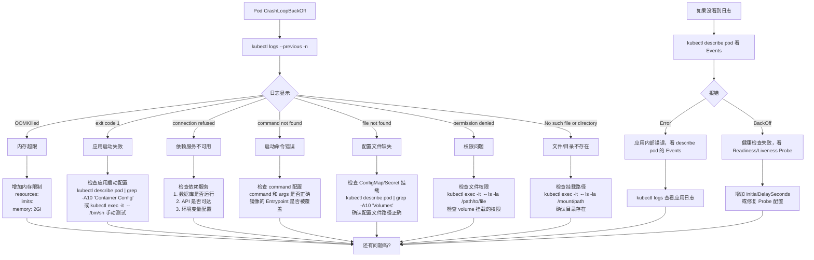
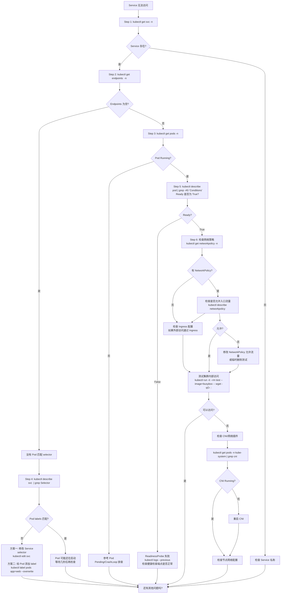
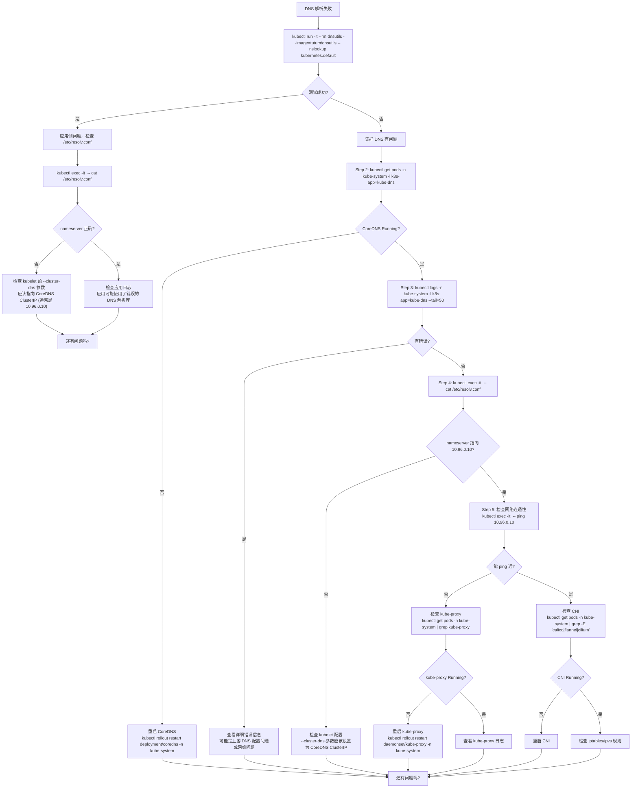
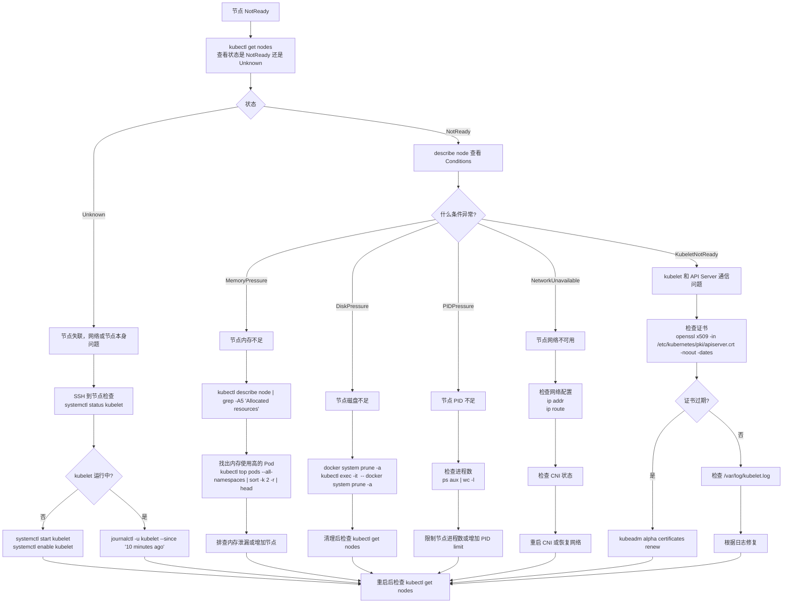
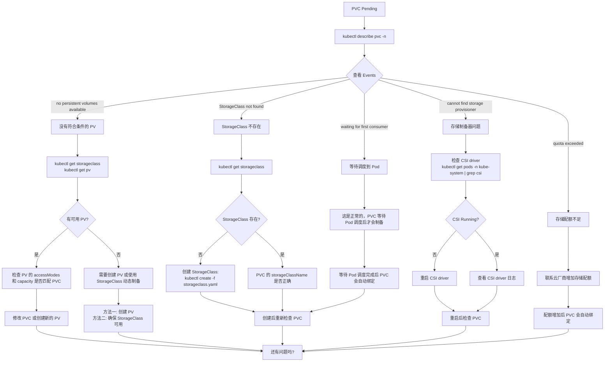
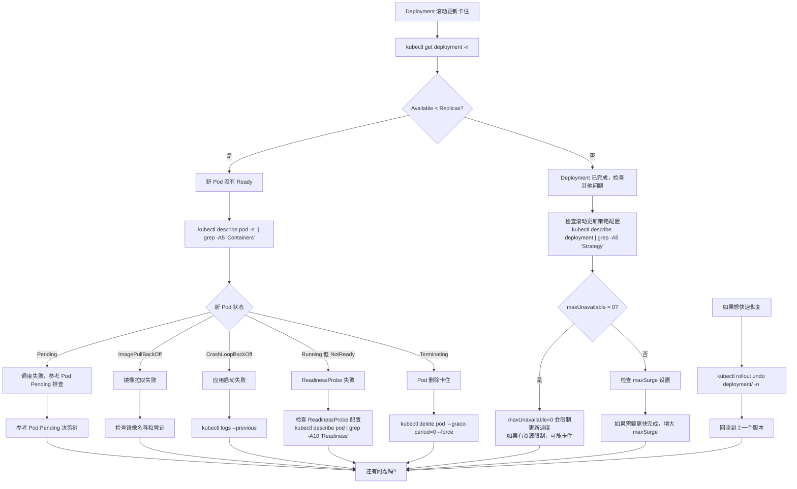
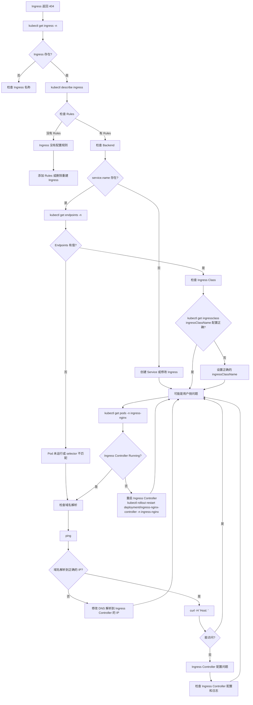
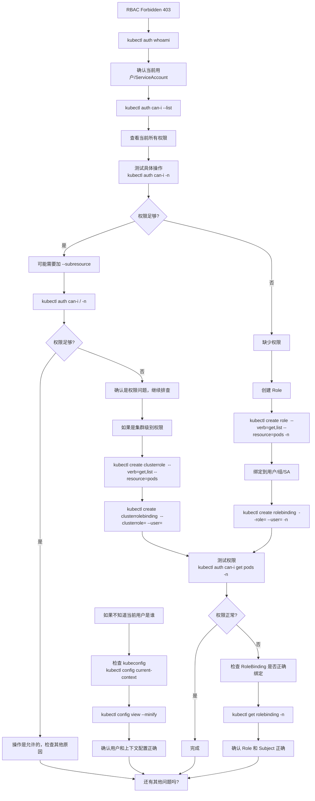
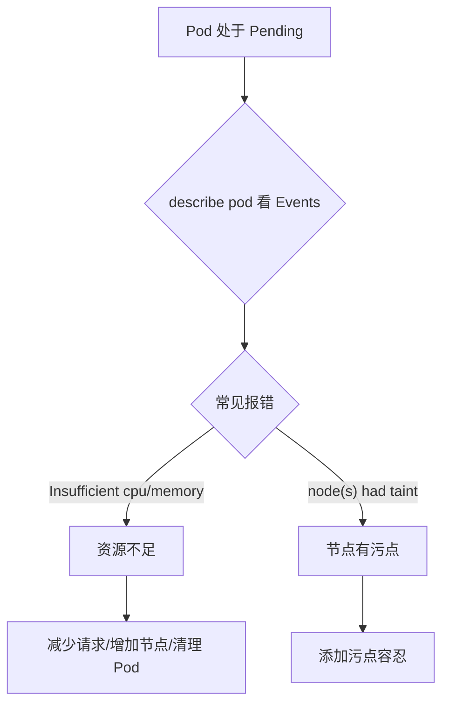
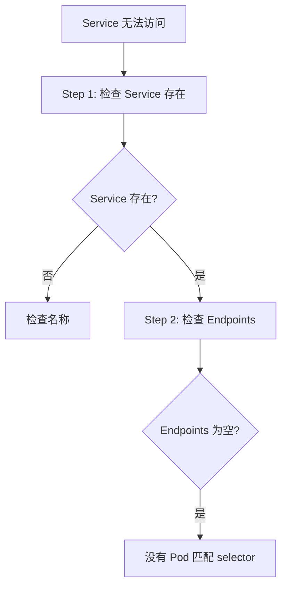

---
title: 故障排查决策树 - Mermaid 可视化版
description: '# 故障排查决策树 - Mermaid 可视化版'
category: learning
tags:
- tutorial
- k8s
- training
- lecturer
- apiserver
- [[kubelet|kubelet]]
- [[Cilium|cilium]]
- flannel
- calico
- [[CoreDNS|coredns]]
- docker
last_updated: 2026-05
difficulty: intermediate
reading_level: intermediate
audience:
- SRE 工程师
- 运维工程师
- 值班工程师
estimated_read_time: 5min
intent_queries:
- 故障排查决策树 - Mermaid 可视化版 是什么
- 如何 故障排查决策树 - Mermaid 可视化版
trigger_keywords:
- 故障排查决策树
- Mermaid
- 可视化版
- k8s
- learning
authors:
- name: KUDIG Team
  role: contributor
k8s_versions:
- '1.28'
- '1.29'
- '1.30'
- '1.31'
- '1.32'

tier: peripheral---

# 故障排查决策树 - Mermaid 可视化版

> **章节**: 工单场景 | **难度**: 入门/进阶 | **用途**: 快速诊断

---

## 使用说明

```
【Mermaid 决策树】

每个决策树都是 Mermaid flowchart 格式。
可以直接复制到以下工具查看：
• Mermaid Live Editor: https://mermaid.live
• VS Code Mermaid 插件（安装后按 Cmd+K 再按 V 预览）
• Notion、Miro 等支持 Mermaid 的工具

【复制方法】

选中 ```mermaid 和 ``` 之间的代码，粘贴到 Mermaid Live Editor。

【推荐工作流】

1. 用户描述问题 → 数字人识别问题类型
2. 数字人选择对应决策树
3. 按照决策树步骤排查
4. 每一步给出具体命令
```

---

## 1. Pod 处于 Pending

```mermaid
flowchart TD
    A["Pod 处于 Pending"] --> B["kubectl describe pod <name> -n <namespace>"]
    B --> C{查看 Events}
    C -->|"Insufficient cpu"| D["CPU 资源不足"]
    C -->|"Insufficient memory"| E["内存资源不足"]
    C -->|"node(s) had taint"| F["节点有污点"]
    C -->|"no nodes available"| G["无匹配节点"]
    C -->|"pvc not found"| H["PVC 未找到或 Pending"]
    C -->|"region constraint"| I["可用区约束"]
    D --> J["解决方案"]
    E --> J
    F --> J
    G --> J
    H --> J
    I --> J
    J --> K{选择方案}
    K -->|"减少资源请求"| L["kubectl edit pod 修改 resources.requests\n或 Deployment 的 spec.template.spec.containers[].resources"]
    K -->|"增加集群节点"| M["联系云厂商或运维扩容节点"]
    K -->|"清理不需要的 Pod"| N["kubectl delete pod <old-pod> --now"]
    K -->|"添加污点容忍"| O["在 Pod spec 添加:\ntolerations:\n- key: \"node.kubernetes.io/not-ready\"\n  operator: \"Exists\"\n  effect: \"NoSchedule\""]
    F --> O
    I --> P["检查节点的 label\nkubectl label nodes <node> topology.kubernetes.io/region=xxx\n或修改 Pod 的 nodeAffinity"]
    H --> Q["kubectl get pvc\nkubectl describe pvc <pvc-name>"]
    Q --> Q1{"PVC 状态"}
    Q1 -->|"Pending"| Q2["参考 PVC Pending 决策树"]
    Q1 -->|"Bound"| Q3["可能是 Attach 问题，检查 CSI"]
    Q2 --> R["还有问题吗?"]
    Q3 --> R
    L --> R
    M --> R
    N --> R
    O --> R
    P --> R
```

---

## 2. Pod 处于 CrashLoopBackOff



---

## 3. Service 无法访问



---

## 4. DNS 解析失败



---

## 5. 节点 NotReady



---

## 6. HPA 不触发扩容

```mermaid
flowchart TD
    A["HPA 不触发扩容"] --> B["kubectl get hpa -n <namespace>"]
    B --> C{"Metrics Available?"}
    C -->|Unknown/Unable| D["Metrics Server 问题"]
    C -->|Available| E["检查 target 是否达到"]
    D --> D1["kubectl get pods -n kube-system | grep metrics"]
    D1 --> D2{Metrics Server Running?}
    D2 -->|否| D3["重启 Metrics Server\nkubectl rollout restart deployment/metrics-server -n kube-system"]
    D2 -->|是| D4["查看 Metrics Server 日志\nkubectl logs -n kube-system -l k8s-app=k8s-dashboard-metrics-server --tail=50"]
    D4 --> D5["检查是否有错误，如 'context deadline exceeded'"]
    E --> E1{"当前 CPU > Target?"}
    E1 -->|否| E2["负载还没达到扩容阈值\n继续观察"]
    E1 -->|是| F["检查 Pod 资源请求"]
    F --> F1{kubectl describe pod <pod> | grep -A5 "Requests"}
    F1 -->|"没有 requests"| G["HPA 需要 Pod 设置 resources.requests 才能计算使用率"]
    F1 -->|"有 requests"| H["检查 HPA 配置"]
    G --> G1["kubectl edit deployment 添加:\nresources:\n  requests:\n    cpu: 100m\n    memory: 128Mi"]
    H --> H1["kubectl describe hpa <name> | grep -A20 'Conditions'"]
    H1 --> H2{AbleToScale?}
    H1 --> H3{ScalingActive?}
    H2 -->|"False"| H4["HPA 无法扩展，检查 Conditions"]
    H3 -->|"False"| H5["HPA 被禁用，可能在冷却期"]
    H4 --> H6["kubectl get events -n <namespace> --sort-by=.lastTimestamp | grep HPA"]
    H5 --> H7["等待冷却期结束或调整 behavior 配置"]
    H6 --> H8["解决阻止扩展的问题"]
    G1 --> H9["还有问题吗?"]
    H8 --> H9
    H7 --> H9
    E2 --> H9
    D3 --> D6["重启后检查 HPA"]
    D6 --> D7["还有问题吗?"]
    D5 --> D6
```

---

## 7. PVC Pending



---

## 8. Deployment 滚动更新卡住



---

## 9. Ingress 404



---

## 10. RBAC Forbidden



---

## 快速复制区

```markdown
## Pod Pending 决策树



## Service 无法访问决策树


```

---

## 一页速查表

| 问题 | 第一步命令 | 关键检查点 |
|------|-----------|-----------|
| Pod Pending | `describe pod` | Events 的报错信息 |
| CrashLoopBackOff | `logs --previous` | 上一容器日志 |
| Service 不通 | `get endpoints` | Endpoints 是否为空 |
| DNS 失败 | `nslookup kubernetes.default` | CoreDNS 是否 Running |
| 节点 NotReady | `describe node` | Conditions 部分 |
| HPA 不工作 | `get hpa` | Metrics Server 是否运行 |
| PVC Pending | `describe pvc` | Events 报错 |
| Ingress 404 | `describe ingress` | Rules 和 Backend |
| RBAC Forbidden | `auth can-i --list` | 当前用户权限 |

---

**关联文档**:
- [../README.md](../README.md) — 讲师完整台词设计
- [../oncall-qa/oncall-quick-qa.md](../oncall-qa/oncall-quick-qa.md) — On-Call 快速问答
- [../../P1-4-decision-tree-mermaid-visualization.md](../../P1-4-decision-tree-mermaid-visualization.md) — 完整决策树库
- [../../domain-10-troubleshooting-diagnostics/](../../domain-10-troubleshooting-diagnostics/) — 故障排查文档

## See Also

- kubernetes-workload-presentation
- presentation-template
- 01-what-is-kubernetes
- 02-pod-basics


## 参见

- [[skills/training-lecturer/12-decision-tree/decision-tree-mermaid.md|讲师版]]
