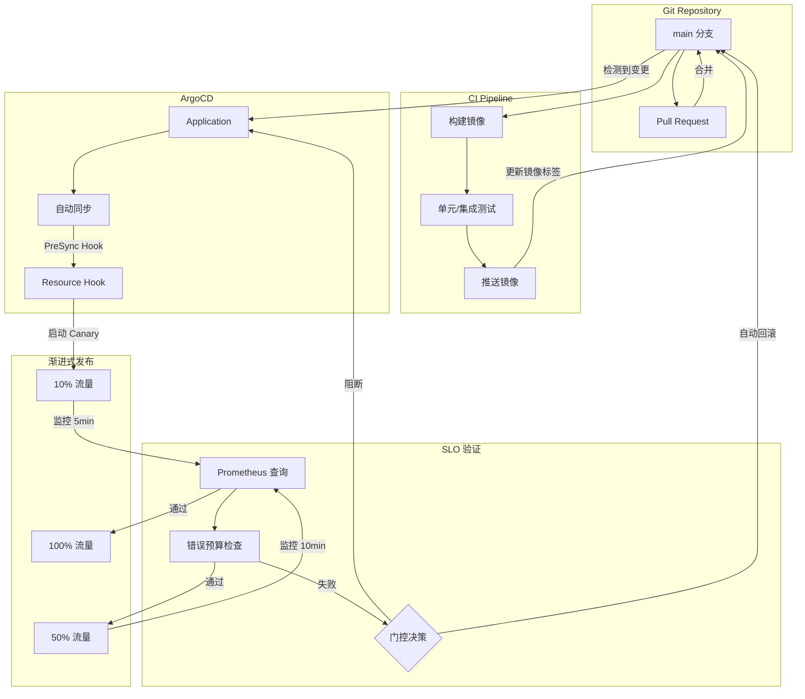
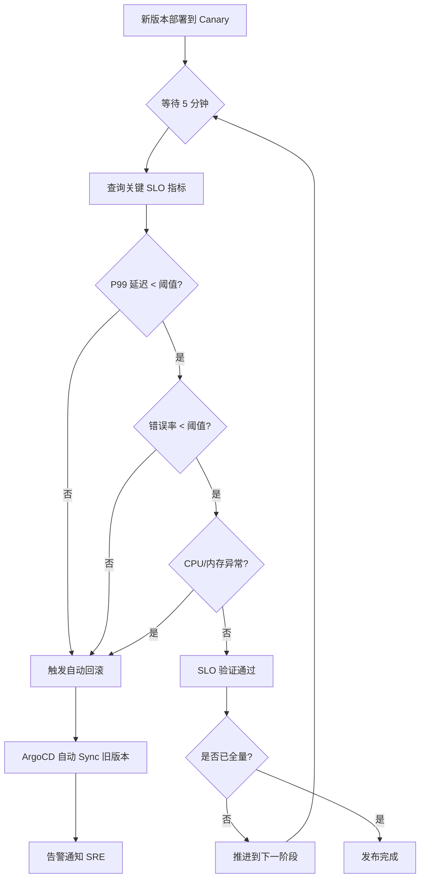
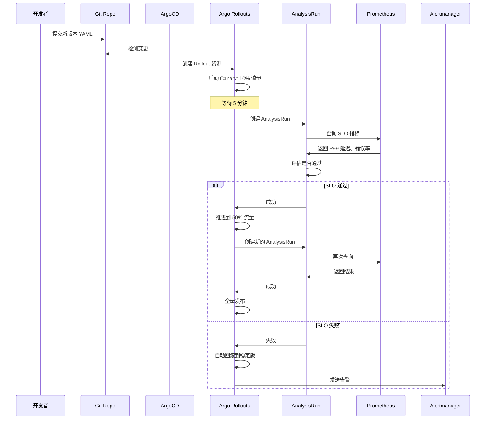
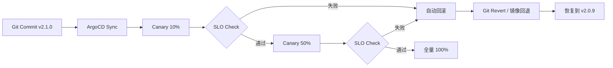
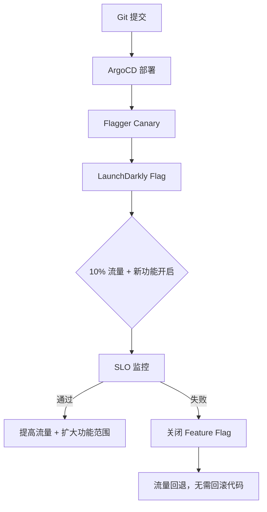

# [[domain-17-system-foundation/topic-cheat-sheet/gitops|GitOps]] SRE 发布门控

## 概述

GitOps 将基础设施和应用的期望状态声明在 Git 中，由 [[entities/argocd|ArgoCD]]/[[entities/flux|Flux]] 自动同步到集群。但"自动同步"不等于"安全发布"——一次错误的提交可能直接破坏生产环境。SRE 的 SLO 驱动方法论为 GitOps 提供了"发布门控"（Release Gate）机制：在变更真正影响用户之前，用可观测性数据验证其健康度，不通过则自动阻断或回滚。本页连接 domain-08-release-change-management 的 GitOps 发布流水线与 domain-09-reliability-engineering 的 SLO 门控实践，展示如何将 SRE 的可靠性工程注入 GitOps 的每一次变更。

## 核心连接

| 域 | 核心能力 | 发布门控的桥接作用 |
|---|---|---|
| **GitOps (domain-08)** | 声明式配置、自动同步、版本控制 | GitOps 提供变更的"入口"和"回退能力"（Git revert = 自动回滚） |
| **SRE (domain-09)** | SLO 定义、错误预算、自动回滚 | SRE 提供变更的"验证标准"和"阻断机制"（SLO 违反 = 停止发布） |

**关键洞察：GitOps 解决了"如何发布"，SRE 解决了"是否该发布"。** 两者结合形成闭环：Git 提交 → 渐进式发布 → SLO 验证 → 自动推进或回滚。

## 架构图

### 发布门控整体架构



### SLO 门控决策流程



### [[entities/argo|Argo]] Rollouts + Prometheus 集成



## 核心机制

### 发布门控的三种模式

| 模式 | 实现 | 延迟 | 适用场景 |
|---|---|---|---|
| **AnalysisRun 门控** | Argo Rollouts + Prometheus | 5-15 min | 标准微服务 |
| **Webhook 门控** | ArgoCD PreSync Hook | 1-5 min | 简单场景 |
| **外部系统门控** | Flagger + 自定义指标 | 10-30 min | 复杂多指标 |

### Argo Rollouts + SLO Analysis

```yaml
# Rollout 配置：带 SLO 验证的 Canary 发布
apiVersion: argoproj.io/v1alpha1
kind: Rollout
metadata:
  name: payment-service
  namespace: production
spec:
  replicas: 10
  strategy:
    canary:
      steps:
        - setWeight: 10
        - pause: { duration: 5m }
        - analysis:
            templates:
              - templateName: slo-check
            args:
              - name: service-name
                value: payment-service
        - setWeight: 50
        - pause: { duration: 10m }
        - analysis:
            templates:
              - templateName: slo-check
        - setWeight: 100
      analysis:
        startingStep: 1
        templates:
          - templateName: slo-check
---
# SLO 分析模板
apiVersion: argoproj.io/v1alpha1
kind: AnalysisTemplate
metadata:
  name: slo-check
spec:
  metrics:
    - name: p99-latency
      interval: 1m
      failureLimit: 2
      provider:
        prometheus:
          address: http://prometheus:9090
          query: |
            histogram_quantile(0.99,
              sum(rate(http_request_duration_seconds_bucket{
                service="{{ args.service-name }}"
              }[5m])) by (le)
            )
      successCondition: result[0] < 0.2  # P99 < 200ms

    - name: error-rate
      interval: 1m
      failureLimit: 1
      provider:
        prometheus:
          address: http://prometheus:9090
          query: |
            sum(rate(http_requests_total{
              service="{{ args.service-name }}",
              status=~"5.."
            }[5m]))
            /
            sum(rate(http_requests_total{
              service="{{ args.service-name }}"
            }[5m]))
      successCondition: result[0] < 0.001  # 错误率 < 0.1%

    - name: cpu-usage
      interval: 1m
      failureLimit: 2
      provider:
        prometheus:
          address: http://prometheus:9090
          query: |
            avg(
              rate(container_cpu_usage_seconds_total{
                pod=~"{{ args.service-name }}-.*"
              }[5m])
            )
      successCondition: result[0] < 0.8  # CPU < 80%
```

### 基于错误预算的门控

```promql
# 7 天错误预算消耗速率
(
  sum(increase(http_requests_total{status=~"5.."}[1h]))
  /
  sum(increase(http_requests_total[1h]))
)
/
(
  (1 - 0.999)  # SLO = 99.9%
  *
  (1 / 168)    # 1 小时的预算比例
)

# 解读：
# 值 > 1  →  错误预算消耗过快，禁止发布
# 值 < 0.5 →  预算健康，允许发布
```

```yaml
# 错误预算门控 AnalysisTemplate
apiVersion: argoproj.io/v1alpha1
kind: AnalysisTemplate
metadata:
  name: error-budget-gate
spec:
  metrics:
    - name: error-budget-burn
      interval: 1m
      failureLimit: 1
      provider:
        prometheus:
          address: http://prometheus:9090
          query: |
            (
              sum(increase(http_requests_total{service="payment-service",status=~"5.."}[1h]))
              /
              sum(increase(http_requests_total{service="payment-service"}[1h]))
            )
            /
            ((1 - 0.999) * (1 / 168))
      successCondition: result[0] < 1.0
```

### 自动回滚机制



**回滚策略：**

| 触发条件 | 回滚动作 | 恢复时间 |
|---|---|---|
| Canary Analysis 失败 | Argo Rollouts 自动回滚 | 30s - 2min |
| 全量后 SLO 违反 | ArgoCD 手动 Sync 旧版本 | 1-5min |
| 严重问题（P0） | Git revert + 强制同步 | 5-10min |
| 数据损坏 | Velero 恢复 + 数据库回滚 | 15-60min |

## 最佳实践

### 1. 分层门控策略

```
发布门控分层:
┌─────────────────────────────────────────┐
│  层1: 构建门控                          │
│  → CI 通过（测试、lint、安全扫描）       │
│  → 镜像签名（Cosign）                   │
├─────────────────────────────────────────┤
│  层2: 部署门控                          │
│  → ArgoCD Sync Hook 预检                │
│  → 资源配额检查                         │
│  → 依赖服务健康检查                      │
├─────────────────────────────────────────┤
│  层3: Canary 门控                       │
│  → 10% 流量 SLO 验证（5min）            │
│  → 50% 流量 SLO 验证（10min）           │
├─────────────────────────────────────────┤
│  层4: 全量后门控                        │
│  → 持续监控 30min                       │
│  → 自动回滚触发器                        │
└─────────────────────────────────────────┘
```

### 2. 关键 SLO 指标选择

不是所有指标都适合作为门控。选择标准：

| 指标类型 | 示例 | 门控适用性 | 原因 |
|---|---|---|---|
| **用户感知延迟** | P99 HTTP 延迟 | ⭐⭐⭐ | 直接反映用户体验 |
| **错误率** | HTTP 5xx 比例 | ⭐⭐⭐ | 直接反映服务健康 |
| **吞吐量** | RPS/QPS | ⭐⭐ | 辅助指标，突变需关注 |
| **资源使用** | CPU/内存 | ⭐⭐ | 间接指标，阈值难定 |
| **业务指标** | 订单成功率 | ⭐⭐⭐ | 最贴近业务，但采集延迟高 |

**门控指标清单（最小可用集）：**
- P99 延迟 < 阈值
- 错误率 < SLO 预算
- CPU/内存使用率 < 80%
- 下游依赖健康（可选）

### 3. 渐进式发布参数

```yaml
# 生产级 Canary 配置
strategy:
  canary:
    maxSurge: 25%
    maxUnavailable: 0
    steps:
      - setWeight: 5
      - pause: { duration: 3m }
      - analysis: { templates: [ { templateName: quick-check } ] }
      - setWeight: 25
      - pause: { duration: 5m }
      - analysis: { templates: [ { templateName: slo-check } ] }
      - setWeight: 50
      - pause: { duration: 10m }
      - analysis: { templates: [ { templateName: slo-check } ] }
      - setWeight: 75
      - pause: { duration: 10m }
      - analysis: { templates: [ { templateName: slo-check } ] }
      - setWeight: 100
    trafficRouting:
      istio:
        virtualService:
          name: payment-vs
        destinationRule:
          name: payment-dr
          canarySubsetName: canary
          stableSubsetName: stable
```

### 4. 与 Feature Flag 的结合



Feature Flag 门控 vs 发布门控：
- **发布门控**：验证新版本代码是否健康
- **Feature Flag**：控制功能是否对用户可见
- **组合使用**：先发布门控验证代码，再 Feature Flag 灰度功能

### 5. 告警与通知

```yaml
# Argo Rollouts 通知配置
apiVersion: argoproj.io/v1alpha1
kind: NotificationConfig
metadata:
  name: rollout-notifications
spec:
  triggers:
    - name: rollout-aborted
      condition: rollout.status.phase == "Aborted"
      template: rollout-aborted-template
    - name: rollout-completed
      condition: rollout.status.phase == "Healthy"
      template: rollout-completed-template
  templates:
    - name: rollout-aborted-template
      slack:
        text: |
          :x: *发布失败自动回滚*
          服务: {{ rollout.metadata.name }}
          版本: {{ rollout.status.currentPodHash }}
          原因: {{ rollout.status.message }}
          SRE 请检查 Prometheus  dashboard
```

## 工具推荐

| 工具 | 角色 | 与 GitOps SRE 门控的集成 |
|---|---|---|
| **Argo Rollouts** | 渐进式发布引擎 | 核心工具，提供 Canary/Blue-Green + Analysis |
| **ArgoCD** | GitOps 同步 | 触发 Rollouts，提供 Sync Hook |
| **Flagger** | 渐进式交付 | 替代方案，与 Istio/Linkerd 深度集成 |
| **Prometheus** | 指标存储 | AnalysisRun 的数据源 |
| **Grafana** | 可视化 | 发布过程的可视化监控 |
| **LaunchDarkly** | Feature Flag | 功能级灰度，与发布门控互补 |
| **PagerDuty** | On-call | 发布失败自动通知 |
| **Sentry** | 错误追踪 | 门控中的异常检测数据源 |

## 张力与权衡

| 张力 | 详情 |
|---|---|
| **门控严格度 vs 发布速度** | 越严格的 SLO 门控（更多指标、更长观察期）意味着更慢的发布节奏。在快速迭代场景（如电商大促期间），团队可能倾向放宽门控，增加风险。 |
| **自动回滚 vs 人工判断** | 自动回滚在明确问题时有效，但某些 SLO 波动是"预期内"的（如依赖服务升级导致的临时延迟）。过度自动回滚会阻止正常发布。 |
| **指标延迟 vs 响应速度** | Prometheus 的指标通常有 1-5 分钟的 scrape 延迟。在问题快速扩散的场景（如级联失败），门控可能在检测到问题之前就已经造成广泛影响。 |
| **单服务 vs 全局 SLO** | Rollout Analysis 通常只检查单个服务的 SLO，但新版本的发布可能影响下游服务的 SLO（如增加其负载）。全局 SLO 门控的实现复杂度更高。 |
| **Git 回滚 vs 运行时回滚** | GitOps 的哲学是"Git 是唯一的真实来源"，但运行时回滚（如 Argo Rollouts 的自动回滚）可能不修改 Git。这导致 Git 状态与实际集群状态不一致。 |

## 开放问题

- **多服务同时发布：** 微服务架构中，一次业务需求可能涉及 5-10 个服务的协同发布。如何设计跨服务的联合门控？
- **数据库 Schema 变更门控：** Schema 变更无法通过回滚快速恢复。如何对数据库变更设计门控？
- **SLO 基线漂移：** 服务长期处于"刚好通过门控"的状态，门控阈值是否需要动态调整？如何防止"阈值通胀"？
- **冷启动与预热：** 新 Pod 的冷启动延迟可能触发门控失败。门控是否需要考虑预热期？

## 相关 Domain

- domain-08-release-change-management/01-gitops
- domain-08-release-change-management/03-change-management
- domain-09-reliability-engineering/04-slo-sli
- domain-09-reliability-engineering/07-sre-practices
- GitOps x 平台工程.md|GitOps x 平台工程]]

> *This page synthesizes patterns across multiple sources and domains.* ^[inferred]
