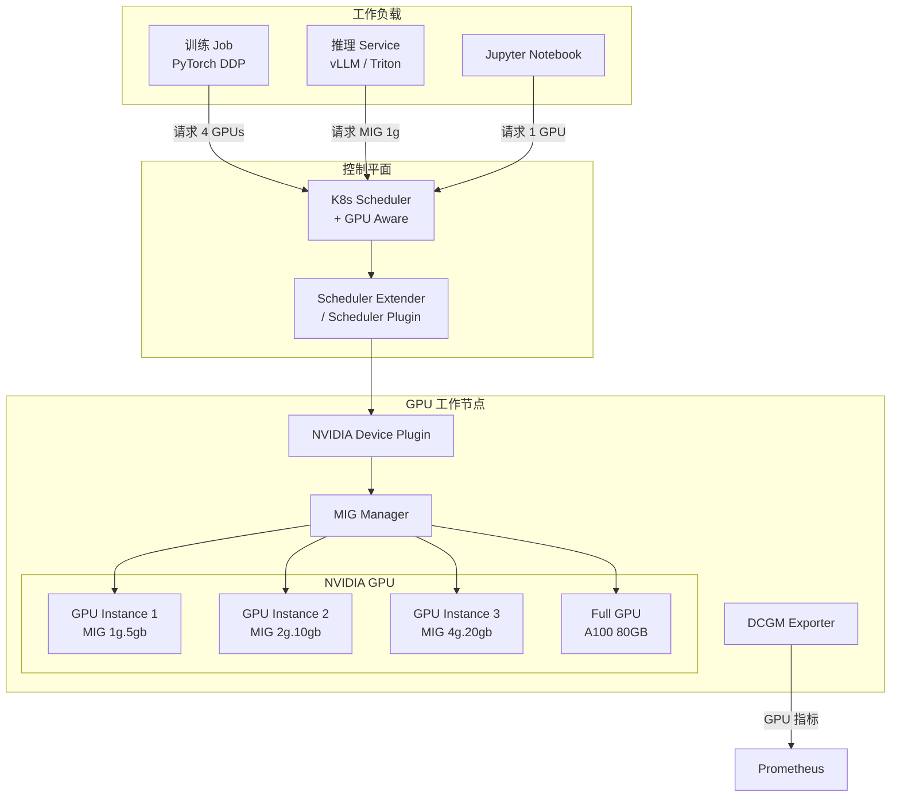
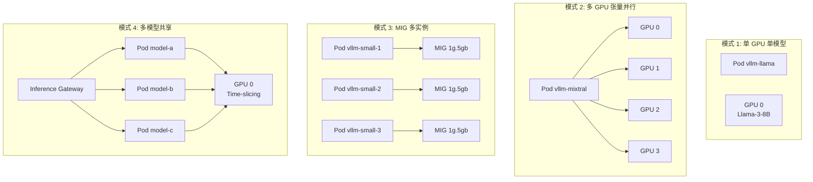
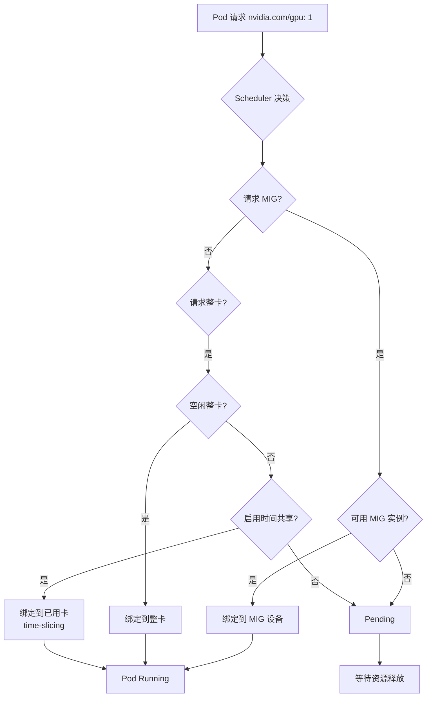
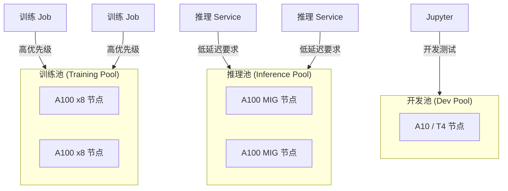

# GPU 调度与 AI 工作负载

## 概述

AI/ML 工作负载对 [[entities/kubernetes|Kubernetes]] 调度提出了独特挑战：GPU 是昂贵的异构资源，推理和训练的工作负载特征截然不同，而传统的 CPU 调度策略（如基于 request/limit 的 Bin Packing）无法有效处理 GPU 的"不可分性"和"时间共享"需求。本页连接 domain-02-workloads-applications 的调度能力与 domain-14-ai-ml-infra 的 GPU 基础设施，展示 K8s 生态中 GPU 调度的完整技术栈——从 NVIDIA Device Plugin 到 MIG 虚拟化，再到 vLLM 推理引擎的部署模式。

## 核心连接

| 域 | 核心能力 | GPU 调度的桥接作用 |
|---|---|---|
| **Workloads (domain-02)** | Pod 调度、资源配额、节点亲和、优先级抢占 | 调度层负责将 GPU 工作负载分配到正确的节点和 GPU 设备 |
| **AI/ML Infra (domain-14)** | GPU 集群管理、推理服务、训练框架、模型仓库 | AI 层定义 GPU 工作负载的需求（显存、带宽、多 GPU 并行） |

**关键洞察：GPU 调度的核心矛盾是"资源稀缺性"与"工作负载多样性"的冲突。** 一块 A100 80GB 可能运行一个占据全部显存的大模型训练任务，也可能通过 MIG 切分为 7 个独立的推理实例。调度器必须在不牺牲性能的前提下最大化 GPU 利用率。

## 架构图

### GPU 调度架构全景



### vLLM 推理服务部署模式



### GPU 调度决策流程



## 核心机制

### GPU 资源抽象层次

```
物理 GPU (A100 80GB)
  ├── 模式 A: 整卡分配 (nvidia.com/gpu: 1)
  │     └── 1 Pod 独占全部 80GB 显存 + 全部计算单元
  │
  ├── 模式 B: MIG 虚拟化
  │     ├── MIG 1g.5gb  → 1 个计算单元 + 5GB 显存
  │     ├── MIG 2g.10gb → 2 个计算单元 + 10GB 显存
  │     ├── MIG 3g.20gb → 3 个计算单元 + 20GB 显存
  │     └── MIG 7g.40gb → 7 个计算单元 + 40GB 显存
  │
  └── 模式 C: 时间共享 (Time-slicing)
        └── 多个 Pod 分时复用同一块 GPU
            （上下文切换开销，无显存隔离）
```

### MIG 配置与管理

```yaml
# MIG 配置策略 (NVIDIA MIG Manager)
apiVersion: v1
kind: ConfigMap
metadata:
  name: mig-config
  namespace: nvidia-device-plugin
data:
  config.yaml: |
    version: v1
    sharing:
      timeSlicing:
        renameByDefault: false
        resources:
          - name: nvidia.com/gpu
            replicas: 4  # 1 块物理 GPU 虚拟为 4 个可调度单元
    # MIG 策略配置
    mig-strategy: mixed  # mixed | single | none
```

```bash
# 查看节点上的 MIG 设备
kubectl describe node gpu-node-1 | grep -A 20 "Allocated resources"
# nvidia.com/gpu:          0/1
# nvidia.com/mig-1g.5gb:   3/7
# nvidia.com/mig-2g.10gb:  1/3
```

```yaml
# Pod 请求 MIG 资源
apiVersion: v1
kind: Pod
metadata:
  name: vllm-inference
spec:
  containers:
    - name: vllm
      image: vllm/vllm-openai:latest
      resources:
        limits:
          nvidia.com/mig-1g.5gb: 1  # 请求 1 个 MIG 1g 实例
      env:
        - name: CUDA_VISIBLE_DEVICES
          value: "MIG-12345678-1234-1234-1234-123456789abc"
```

### vLLM 部署配置

```yaml
# vLLM + KServe 推理服务
apiVersion: serving.kserve.io/v1beta1
kind: InferenceService
metadata:
  name: llama-3-8b
  annotations:
    serving.kserve.io/deploymentMode: RawDeployment
spec:
  predictor:
    model:
      modelFormat:
        name: huggingface
      storageUri: s3://models/llama-3-8b
      resources:
        limits:
          nvidia.com/gpu: 1
          memory: "32Gi"
        requests:
          nvidia.com/gpu: 1
          memory: "32Gi"
      args:
        - --model=/mnt/models
        - --tensor-parallel-size=1
        - --max-model-len=8192
        - --dtype=half
        - --gpu-memory-utilization=0.9
      env:
        - name: VLLM_WORKER_MULTIPROC_METHOD
          value: spawn
---
# 多 GPU 张量并行 (大模型)
apiVersion: serving.kserve.io/v1beta1
kind: InferenceService
metadata:
  name: mixtral-8x7b
spec:
  predictor:
    model:
      modelFormat:
        name: huggingface
      storageUri: s3://models/mixtral-8x7b
      resources:
        limits:
          nvidia.com/gpu: 4  # 4 卡张量并行
          memory: "128Gi"
      args:
        - --model=/mnt/models
        - --tensor-parallel-size=4
        - --max-model-len=32768
```

### GPU 调度器扩展

```yaml
# NVIDIA GPU Operator 启用 Scheduler Extension
apiVersion: nvidia.com/v1
kind: ClusterPolicy
metadata:
  name: gpu-cluster-policy
spec:
  devicePlugin:
    enabled: true
  migManager:
    enabled: true
  gfd:
    enabled: true  # GPU Feature Discovery，自动标注节点 GPU 属性
  dcgmExporter:
    enabled: true
  # 启用 GPU 感知调度
  sandboxDevicePlugin:
    enabled: true
```

```yaml
# GPU 节点亲和性：调度到特定 GPU 类型
apiVersion: apps/v1
kind: Deployment
metadata:
  name: training-job
spec:
  template:
    spec:
      affinity:
        nodeAffinity:
          requiredDuringSchedulingIgnoredDuringExecution:
            nodeSelectorTerms:
              - matchExpressions:
                  - key: nvidia.com/gpu.product
                    operator: In
                    values:
                      - NVIDIA-A100-SXM4-80GB
                  - key: nvidia.com/gpu.memory
                    operator: Gt
                    values:
                      - "40000"  # 40GB+
      tolerations:
        - key: nvidia.com/gpu
          operator: Exists
          effect: NoSchedule
      containers:
        - name: training
          resources:
            limits:
              nvidia.com/gpu: 8  # 8 卡 DDP 训练
```

### GPU 监控指标

```promql
# GPU 利用率
DCGM_FI_DEV_GPU_UTIL{exported_pod="vllm-llama-3"}

# GPU 显存使用
DCGM_FI_DEV_FB_USED{exported_pod="vllm-llama-3"}
DCGM_FI_DEV_FB_FREE{exported_pod="vllm-llama-3"}

# GPU 温度
DCGM_FI_DEV_GPU_TEMP{exported_pod="vllm-llama-3"}

# GPU 功耗
DCGM_FI_DEV_POWER_USAGE{exported_pod="vllm-llama-3"}

# 推理服务延迟（vLLM 暴露）
vllm:e2e_request_latency_seconds{quantile="0.99"}
vllm:time_to_first_token_seconds{quantile="0.99"}
vllm:token_generation_time_seconds{quantile="0.99"}
```

## 最佳实践

### 1. GPU 工作负载分类与调度策略

| 工作负载类型 | GPU 需求 | 推荐部署模式 | 调度策略 |
|---|---|---|---|
| **大模型训练** | 4-8 卡，NVLink | 整卡分配，Pod 亲和 | gang-scheduling |
| **推理服务（高吞吐）** | 1 卡，显存敏感 | vLLM + 整卡 | nodeSelector + 反亲和 |
| **推理服务（低延迟）** | MIG 1g/2g | MIG 多实例 | MIG 感知调度 |
| **Jupyter/开发** | 1 卡，共享 | 时间共享或 MIG | 低优先级抢占 |
| **模型微调** | 1-2 卡，中等 | 整卡或 MIG 4g | 优先级队列 |

### 2. 训练与推理混合调度



**节点池隔离策略：**

```yaml
# 训练池：禁止推理 Pod
apiVersion: v1
kind: Node
metadata:
  labels:
    gpu-pool: training
    nvidia.com/gpu.product: NVIDIA-A100-SXM4-80GB
taints:
  - key: gpu-pool
    value: training
    effect: NoSchedule
---
# 推理池：禁止训练 Job
apiVersion: v1
kind: Node
metadata:
  labels:
    gpu-pool: inference
    nvidia.com/gpu.product: NVIDIA-A100-SXM4-80GB
taints:
  - key: gpu-pool
    value: inference
    effect: NoSchedule
```

### 3. 显存碎片化管理

GPU 显存碎片化是大模型部署的常见问题：

```
场景: 2 块 A100 80GB
   Pod A 请求 50GB → 分配到 GPU 0（剩余 30GB）
  Pod B 请求 50GB → GPU 0 不足，分配到 GPU 1（剩余 30GB）
  Pod C 请求 40GB → GPU 0 和 GPU 1 都不足 → Pending
  
问题: 总空闲 60GB，但无法分配 40GB 请求
解决方案:  bin-packing 调度 + 显存预留
```

**优化策略：**
- 使用 GPU 感知调度器（如 Volcano、Yunikorn）的 bin-packing 策略
- vLLM 的 `--gpu-memory-utilization=0.9` 预留 10% 缓冲
- 大模型使用张量并行拆分到多卡，降低单卡显存需求

### 4. 弹性推理：HPA + GPU

```yaml
# GPU 推理服务的 HPA
apiVersion: autoscaling/v2
kind: HorizontalPodAutoscaler
metadata:
  name: vllm-hpa
spec:
  scaleTargetRef:
    apiVersion: apps/v1
    kind: Deployment
    name: vllm-llama-3
  minReplicas: 2
  maxReplicas: 20
  metrics:
    - type: Pods
      pods:
        metric:
          name: vllm:gpu_cache_usage_perc
        target:
          type: AverageValue
          averageValue: "80"  # KV Cache 使用率 > 80% 扩容
    - type: Pods
      pods:
        metric:
          name: vllm:e2e_request_latency_seconds
        target:
          type: AverageValue
          averageValue: "0.5"  # P99 延迟 > 500ms 扩容
  behavior:
    scaleUp:
      stabilizationWindowSeconds: 60
      policies:
        - type: Percent
          value: 100
          periodSeconds: 60  # 每分钟最多翻倍
    scaleDown:
      stabilizationWindowSeconds: 300
      policies:
        - type: Percent
          value: 10
          periodSeconds: 60  # 每分钟最多缩容 10%
```

### 5. 成本优化：Spot GPU + [[skills/training-public/inner-training/week-3-node-workload/checkpoint|Checkpoint]]

```yaml
# 使用 Spot 实例的 Training Job
apiVersion: kubeflow.org/v1
kind: PyTorchJob
metadata:
  name: spot-training
spec:
  pytorchReplicaSpecs:
    Worker:
      replicas: 4
      template:
        spec:
          nodeSelector:
            cloud.google.com/gke-spot: "true"  # Spot 实例
          containers:
            - name: pytorch
              env:
                - name: CHECKPOINT_INTERVAL
                  value: "300"  # 每 5 分钟 checkpoint
                - name: CHECKPOINT_PATH
                  value: "gs://checkpoints/spot-training"
              resources:
                limits:
                  nvidia.com/gpu: 2
```

## 工具推荐

| 工具 | 角色 | 与 GPU 调度的集成 |
|---|---|---|
| **NVIDIA GPU Operator** | GPU 驱动管理 | 一键部署 Device Plugin + MIG + DCGM |
| **NVIDIA Device Plugin** | GPU 设备发现 | 向 [[entities/kubelet|Kubelet]] 报告 GPU/MIG 资源 |
| **MIG Manager** | MIG 配置 | 动态配置 MIG 实例 |
| **GPU Feature Discovery** | 节点标注 | 自动标注 GPU 型号、显存、架构 |
| **DCGM Exporter** | GPU 监控 | Prometheus GPU 指标 |
| **Volcano** | 批量调度 | Gang-scheduling、队列、优先级 |
| **Yunikorn** | 资源调度 | 队列、抢占、公平共享 |
| **vLLM** | 推理引擎 | PagedAttention 高效显存利用 |
| **KServe** | 模型服务 | 推理服务自动扩缩容 |
| **Triton Inference Server** | 推理引擎 | 多框架支持，多模型并发 |
| **Ray** | 分布式计算 | 训练 + 推理的统一调度 |

## 张力与权衡

| 张力 | 详情 |
|---|---|
| **整卡独占 vs MIG 共享** | 整卡提供最佳性能（无虚拟化开销），但利用率低；MIG 提高利用率，但 MIG 实例间有 5-10% 性能损失，且不支持 NVLink 跨实例通信。 |
| **时间共享 vs 空间共享** | 时间共享（time-slicing）让多个 Pod 轮流使用 GPU，简单但上下文切换开销大；空间共享（MIG）隔离性好但灵活性差。 |
| **训练优先级 vs 推理 SLA** | 训练 Job 通常占用 GPU 数小时，推理服务需要持续可用。共享 GPU 池时，训练可能挤占推理资源。节点池隔离是常用方案。 |
| **显存预留 vs 利用率** | 预留更多显存缓冲可以减少 OOM，但降低利用率。vLLM 的 PagedAttention 通过显存分页缓解了这一矛盾。 |
| **云 GPU vs 自建 GPU** | 云 GPU（AWS p4d, GCP A2）弹性好但贵 3-5 倍；自建 GPU 成本低但需要管理硬件生命周期。混合策略（训练自建 + 推理云端弹性）越来越流行。 |

## 开放问题

- **MIG 的动态重配置：** MIG 实例在运行时无法重新划分。如果推理负载从"需要 7 个 MIG 1g"变为"需要 1 个 MIG 7g"，必须重启节点。动态 MIG 重配置是 NVIDIA 正在开发的方向。
- **GPU 调度与拓扑感知：** 多 GPU 训练对 PCIe/NVLink 拓扑敏感。当前 K8s 调度器不感知 GPU 间拓扑，可能导致训练性能损失 20-30%。
- **vLLM 的 KV Cache 管理：** vLLM 的 PagedAttention 显著提高了显存效率，但在长上下文（> 32K）场景下，KV Cache 管理仍是挑战。
- **异构 GPU 调度：** 集群中混合 A100、H100、A10 等不同 GPU 时，调度器如何根据模型需求选择最优 GPU？

## 相关 Domain

- domain-02-workloads-applications/00-core-workloads
- domain-14-ai-ml-infra/01-ai-infra
- domain-14-ai-ml-infra/03-mlops
- [[synthesis/ai-agent-ops-patterns.md|ai-agent-ops-patterns]]

> *This page synthesizes patterns across multiple sources and domains.* ^[inferred]
## Related

- [[entities/kserve|KServe (entities)]]
- [[domain-17-system-foundation/topic-dictionary/fundamentals/nodes|Nodes（节点）]]
