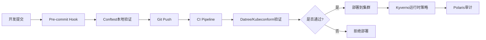

# 策略校验工具

> **适用版本**: v1.25 - v1.32 | **最后更新**: 2026-01 | **参考**: [Conftest](https://conftest.dev/) | [Datree](https://datree.io/)

## 工具对比

| 工具 | 策略语言 | K8s原生 | CI/CD集成 | 预置规则 | 学习曲线 | 生产推荐 |
|------|---------|---------|----------|---------|---------|---------|
| **Conftest** | OPA Rego | ❌ | ⭐⭐⭐⭐⭐ | ❌ | 高 | 强烈推荐 |
| **Datree** | 内置+自定义 | ❌ | ⭐⭐⭐⭐ | ⭐⭐⭐⭐⭐ | 低 | 推荐 |
| **Kubeconform** | JSON Schema | ❌ | ⭐⭐⭐⭐⭐ | ⭐⭐⭐ | 低 | 快速验证 |
| **Kubeval** | JSON Schema | ❌ | ⭐⭐⭐⭐ | ⭐⭐⭐ | 低 | 已停维护 |
| **Kyverno** | YAML策略 | ✅ | ⭐⭐⭐ | ⭐⭐⭐⭐⭐ | 中 | 集群运行时 |
| **Polaris** | 内置规则 | ✅ | ⭐⭐⭐⭐ | ⭐⭐⭐⭐ | 低 | 快速审计 |

---

## Conftest - OPA Rego策略

### 核心优势

```
Conftest应用范围
├── Kubernetes YAML
├── Dockerfile
├── Terraform
├── Helm Charts
├── Kustomize输出
└── 任意JSON/YAML/TOML配置
```

### 安装与基础使用

```bash
# 安装Conftest
brew install conftest
# 或
curl -L https://github.com/open-policy-agent/conftest/releases/download/v0.48.0/conftest_0.48.0_Linux_x86_64.tar.gz | tar xz

# 测试Kubernetes YAML
conftest test deployment.yaml

# 测试Helm Chart
helm template ./mychart | conftest test -

# 测试Kustomize
kubectl kustomize overlays/prod | conftest test -

# 指定策略目录
conftest test -p ./policies deployment.yaml

# 输出格式
conftest test deployment.yaml -o json
```

### Rego 策略示例

#### policy/deployment.rego

```rego
package main

import future.keywords.contains
import future.keywords.if

# 拒绝使用latest标签
deny[msg] {
  input.kind == "Deployment"
  container := input.spec.template.spec.containers[_]
  endswith(container.image, ":latest")
  msg := sprintf("容器 %v 禁止使用 :latest 标签", [container.name])
}

# 要求配置资源限制
deny[msg] {
  input.kind == "Deployment"
  container := input.spec.template.spec.containers[_]
  not container.resources.limits
  msg := sprintf("容器 %v 必须配置 resources.limits", [container.name])
}

# 要求配置健康检查
warn[msg] {
  input.kind == "Deployment"
  container := input.spec.template.spec.containers[_]
  not container.livenessProbe
  msg := sprintf("容器 %v 建议配置 livenessProbe", [container.name])
}

# 禁止特权容器
deny[msg] {
  input.kind == "Deployment"
  container := input.spec.template.spec.containers[_]
  container.securityContext.privileged == true
  msg := sprintf("容器 %v 禁止使用特权模式", [container.name])
}

# 要求配置Pod反亲和性(生产)
deny[msg] {
  input.kind == "Deployment"
  input.metadata.namespace == "production"
  not input.spec.template.spec.affinity.podAntiAffinity
  msg := "生产环境Deployment必须配置podAntiAffinity"
}

# 限制副本数范围
deny[msg] {
  input.kind == "Deployment"
  replicas := input.spec.replicas
  replicas < 2
  msg := sprintf("Deployment副本数不能少于2个，当前: %v", [replicas])
}

# 检查标签规范
deny[msg] {
  input.kind == "Deployment"
  required_labels := {"app", "team", "environment"}
  existing_labels := {label | input.metadata.labels[label]}
  missing := required_labels - existing_labels
  count(missing) > 0
  msg := sprintf("缺少必需标签: %v", [missing])
}
```

#### policy/service.rego

```rego
package main

# 禁止NodePort类型(生产环境)
deny[msg] {
  input.kind == "Service"
  input.metadata.namespace == "production"
  input.spec.type == "NodePort"
  msg := "生产环境禁止使用NodePort Service"
}

# LoadBalancer必须配置白名单
deny[msg] {
  input.kind == "Service"
  input.spec.type == "LoadBalancer"
  not input.spec.loadBalancerSourceRanges
  msg := "LoadBalancer Service必须配置loadBalancerSourceRanges"
}
```

### CI/CD 集成

```yaml
# GitLab CI
policy-check:
  stage: validate
  image: openpolicyagent/conftest:latest
  script:
    - conftest test -p policy/ manifests/*.yaml
  only:
    - merge_requests

# GitHub Actions
- name: Conftest Policy Check
  uses: instrumenta/conftest-action@master
  with:
    files: manifests/
    policy: policy/
    fail-on-warn: true
```

---

## Datree - 开箱即用策略平台

### 核心特点

- **700+ 预置规则**: 覆盖安全、可靠性、最佳实践
- **中心化管理**: Web控制台配置策略
- **智能建议**: 提供修复方案

### 快速开始

```bash
# 安装Datree
curl https://get.datree.io | /bin/bash

# 注册获取Token
datree config set token <YOUR_TOKEN>

# 测试文件
datree test deployment.yaml

# 测试Helm Chart
datree test ~/.datree/k8s-demo.yaml --schema-version 1.28.0

# 测试Kustomize
kubectl kustomize . | datree test -

# CI模式(不交互)
datree test *.yaml --output json --no-record
```

### 策略配置示例

```yaml
# .datree.yaml
apiVersion: v1
policies:
  - name: production-policy
    enabled: true
    rules:
      # 容器安全
      - identifier: CONTAINERS_MISSING_IMAGE_VALUE_VERSION
        messageOnFailure: 必须指定镜像版本标签
      - identifier: CONTAINERS_INCORRECT_PRIVILEGED_VALUE_TRUE
        messageOnFailure: 禁止特权容器
      - identifier: CONTAINERS_MISSING_READINESSPROBE_KEY
        messageOnFailure: 必须配置readinessProbe
      
      # 资源管理
      - identifier: CONTAINERS_MISSING_CPU_LIMIT_KEY
        messageOnFailure: 必须配置CPU限制
      - identifier: CONTAINERS_MISSING_MEMORY_LIMIT_KEY
        messageOnFailure: 必须配置内存限制
      
      # 高可用
      - identifier: DEPLOYMENT_INCORRECT_REPLICAS_VALUE
        messageOnFailure: 生产环境副本数至少2个
        params:
          min: 2

customRules:
  - identifier: CUSTOM_LABEL_CHECK
    name: 检查必需标签
    failureMessage: 缺少标签 app, team, environment
    schema:
      properties:
        metadata:
          properties:
            labels:
              required: ["app", "team", "environment"]
```

### CI/CD 集成

```yaml
# GitHub Actions
- name: Run Datree Policy Check
  uses: datreeio/action-datree@main
  with:
    path: './manifests/'
    cliArguments: '--schema-version 1.28.0'
  env:
    DATREE_TOKEN: ${{ secrets.DATREE_TOKEN }}

# GitLab CI
datree-check:
  image: datree/datree-cli:latest
  script:
    - datree test manifests/*.yaml --output json
  variables:
    DATREE_TOKEN: $CI_DATREE_TOKEN
```

---

## Kubeconform - 高性能验证器

### 核心优势

- **极速验证**: Kubeval的后继者，性能提升10x
- **自定义CRD**: 支持本地和远程CRD Schema
- **严格模式**: 检测多余字段

### 使用方法

```bash
# 安装
go install github.com/yannh/kubeconform/cmd/kubeconform@latest

# 基础验证
kubeconform deployment.yaml

# 指定K8s版本
kubeconform -kubernetes-version 1.28.0 deployment.yaml

# 严格模式(拒绝额外字段)
kubeconform -strict deployment.yaml

# 批量验证
kubeconform -summary manifests/

# 验证CRD
kubeconform -schema-location default \
  -schema-location 'https://raw.githubusercontent.com/argoproj/argo-cd/master/manifests/crds/{{.ResourceKind}}_{{.ResourceAPIVersion}}.yaml' \
  application.yaml
```

### CI集成

```bash
# 验证多个文件并输出摘要
find manifests/ -name '*.yaml' | xargs kubeconform -summary -output json
```

---

## Polaris - Kubernetes审计工具

### 安装与使用

```bash
# CLI模式
kubectl apply -f https://github.com/FairwindsOps/polaris/releases/latest/download/dashboard.yaml

# 访问Dashboard
kubectl port-forward -n polaris svc/polaris-dashboard 8080:80

# 命令行审计
polaris audit --audit-path ./manifests/ --format pretty

# JSON输出
polaris audit --audit-path ./manifests/ --format json > audit-report.json
```

### 自定义配置

```yaml
# polaris-config.yaml
checks:
  # 镜像相关
  tagNotSpecified: warning
  pullPolicyNotAlways: warning
  
  # 健康检查
  readinessProbeMissing: warning
  livenessProbeMissing: warning
  
  # 资源管理
  cpuRequestsMissing: warning
  cpuLimitsMissing: warning
  memoryRequestsMissing: warning
  memoryLimitsMissing: warning
  
  # 安全配置
  runAsRootAllowed: danger
  runAsPrivileged: danger
  notReadOnlyRootFilesystem: warning
  
exemptions:
  - namespace: kube-system
    controllerNames:
      - kube-apiserver
      - kube-scheduler
  - namespace: monitoring
    rules:
      - runAsRootAllowed

customChecks:
  requiredLabels:
    successMessage: 包含必需标签
    failureMessage: 缺少标签
    category: Best Practices
    target: Controller
    schema:
      '$schema': http://json-schema.org/draft-07/schema
      type: object
      required: ["metadata"]
      properties:
        metadata:
          required: ["labels"]
          properties:
            labels:
              type: object
              required: ["app", "team"]
```

---

## 策略执行流程



---

## Pre-commit Hook 集成

```yaml
# .pre-commit-config.yaml
repos:
  - repo: https://github.com/open-policy-agent/conftest
    rev: v0.48.0
    hooks:
      - id: conftest
        name: Conftest Kubernetes
        files: ^manifests/.*\.yaml$
        args: ['test', '-p', 'policy/']

  - repo: https://github.com/yannh/kubeconform
    rev: v0.6.4
    hooks:
      - id: kubeconform
        name: Validate Kubernetes YAML
        files: ^manifests/.*\.yaml$
        args: ['-strict', '-summary']
```

---

## 策略即代码实践

### 目录结构

```
policies/
├── base/
│   ├── security.rego       # 安全策略
│   ├── resources.rego      # 资源策略
│   └── reliability.rego    # 可靠性策略
├── environments/
│   ├── dev.rego            # 开发环境策略
│   ├── staging.rego        # 预发环境策略
│   └── production.rego     # 生产环境策略
├── custom/
│   └── company-rules.rego  # 企业自定义规则
└── tests/
    └── deployment_test.rego
```

### 策略测试

```rego
# tests/deployment_test.rego
package main

test_deny_latest_tag {
  deny["容器 nginx 禁止使用 :latest 标签"] with input as {
    "kind": "Deployment",
    "spec": {
      "template": {
        "spec": {
          "containers": [{
            "name": "nginx",
            "image": "nginx:latest"
          }]
        }
      }
    }
  }
}

test_allow_versioned_tag {
  count(deny) == 0 with input as {
    "kind": "Deployment",
    "spec": {
      "template": {
        "spec": {
          "containers": [{
            "name": "nginx",
            "image": "nginx:1.25"
          }]
        }
      }
    }
  }
}
```

```bash
# 运行策略测试
conftest verify -p policy/
```

---

## 工具选型建议

| 场景 | 推荐方案 | 原因 |
|------|---------|------|
| **快速启动** | Datree + Kubeconform | 预置规则丰富、易上手 |
| **高度定制** | Conftest (OPA Rego) | 灵活性最强 |
| **CI/CD验证** | Kubeconform + Conftest | 性能好、覆盖全 |
| **可视化审计** | Polaris Dashboard | 直观、易理解 |
| **运行时策略** | Kyverno (见表50) | Kubernetes原生 |

---

## 最佳实践

```yaml
# 1. 分层策略
layers:
  - 基础层: Schema验证 (Kubeconform)
  - 安全层: 安全策略 (Conftest)
  - 合规层: 企业规则 (Datree/Conftest)
  - 运行时: 准入控制 (Kyverno)

# 2. 渐进式执行
phases:
  - 开发: warn模式，提示但不阻断
  - CI: 部分deny，阻止明显错误
  - 生产: 严格deny，完全阻止违规

# 3. 策略版本化
versioning:
  - Git管理策略代码
  - 语义化版本号
  - 变更审计日志

# 4. 反馈循环
feedback:
  - 提供修复建议
  - 关联文档链接
  - 统计违规趋势
```

---

## 常见问题

**Q: Conftest vs Datree如何选择?**  
A: Datree适合快速启动(预置规则)，Conftest适合复杂定制(Rego编程)。可组合使用。

**Q: 如何处理CRD验证?**  
A: Kubeconform支持自定义Schema，或使用Kyverno的validate规则。

**Q: 策略过于严格导致开发受阻?**  
A: 使用warn模式、配置豁免列表、分环境策略。
