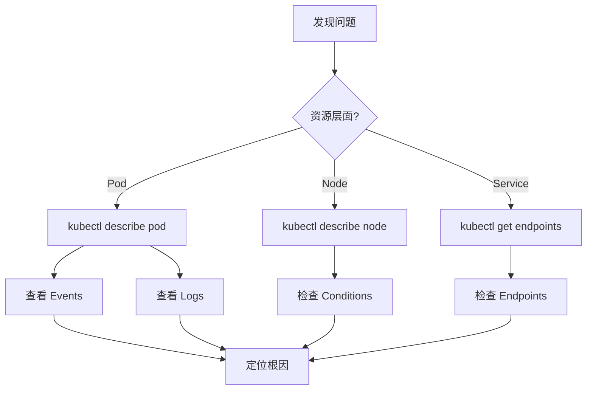

# 108 - 故障排查增强工具 (Troubleshooting Tools)

> **适用版本**: v1.25 - v1.32 | **最后更新**: 2026-01

## 诊断工具箱

| 工具 (Tool) | 类型 (Type) | 核心场景 (Scenario) | 学习曲线 |
|------------|-----------|-------------------|---------|
| **K9s** | TUI 界面 | 实时集群管理 | 低 |
| **Netshoot** | 调试镜像 | 网络连通性诊断 | 低 |
| **kubectl-debug** | kubectl 插件 | 注入临时容器 | 中 |
| **Telepresence** | 本地调试 | 本地连接远程集群 | 中 |
| **Stern** | 日志聚合 | 多 Pod 日志查看 | 低 |

## K9s 高效运维

### 快捷键速查
| 快捷键 | 功能 |
|-------|------|
| `:pod` | 切换到 Pod 视图 |
| `/` | 过滤资源 |
| `d` | 查看详情 (describe) |
| `l` | 查看日志 |
| `s` | 进入 Shell |
| `Ctrl-D` | 删除资源 |
| `?` | 帮助 |

### 自定义视图
```yaml
# ~/.k9s/views.yml
k9s:
  views:
    v1/pods:
      columns:
        - AGE
        - NAMESPACE
        - NAME
        - READY
        - STATUS
        - RESTARTS
        - CPU
        - MEM
```

## Netshoot 网络诊断

### 快速启动
```bash
# 临时 Pod
kubectl run netshoot --rm -it --image=nicolaka/netshoot -- bash

# Ephemeral Container (v1.25+)
kubectl debug -it <pod-name> --image=nicolaka/netshoot --target=<container-name>
```

### 常用诊断命令
```bash
# DNS 测试
nslookup kubernetes.default
dig @10.96.0.10 myservice.default.svc.cluster.local

# 连通性测试
ping <pod-ip>
nc -zv <service-name> <port>
curl -v http://<service>:<port>

# 路由追踪
traceroute <target-ip>
mtr <target-ip>

# 抓包分析
tcpdump -i eth0 -nn port 80 -w capture.pcap
```

## kubectl-debug 深度调试

### 安装与使用
```bash
# 安装插件
kubectl krew install debug

# 调试 Distroless 镜像
kubectl debug <pod-name> -it --image=busybox --target=<container-name>

# 调试节点
kubectl debug node/<node-name> -it --image=ubuntu
```

### 调试场景
- **无 Shell 镜像**: Distroless, Scratch
- **节点问题**: 文件系统、内核参数
- **网络问题**: iptables 规则、路由表

## Stern 多 Pod 日志

### 实时查看
```bash
# 查看所有 Pod
stern -n production myapp

# 正则匹配
stern -n production "^myapp-.*"

# 多命名空间
stern --all-namespaces -l app=nginx

# 输出 JSON
stern myapp --output json

# 时间范围
stern myapp --since 1h
```

## Telepresence 本地调试

### 拦截远程服务
```bash
# 连接集群
telepresence connect

# 拦截服务流量到本地
telepresence intercept myapp --port 8080:80

# 本地运行服务
./myapp --port 8080
```

## 故障排查流程




---

**表格底部标记**: Kusheet Project, 作者 Allen Galler (allengaller@gmail.com)