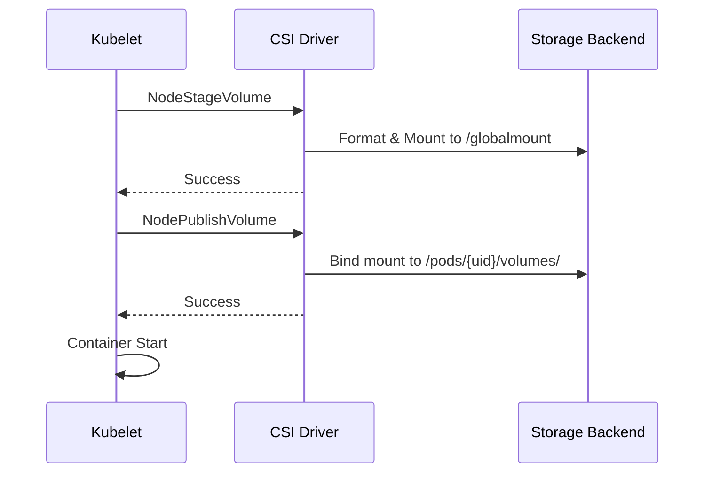

# Kubernetes 存储(PV/PVC/StorageClass)ACK实战技术指南

> **适用版本**: Kubernetes v1.25 - v1.32 | **环境**: 阿里云专有云 & 公共云 | **重点产品**: ACK  
> **文档类型**: 技术实践指南 | **目标读者**: 运维工程师、架构师、DevOps工程师  

---

## 目录

1. [存储核心原理深度解析](#1-存储核心原理深度解析)
2. [生产级配置模板](#2-生产级配置模板)
3. [阿里云ACK集成详解](#3-阿里云ack集成详解)
4. [性能优化实践](#4-性能优化实践)
5. [安全加固配置](#5-安全加固配置)
6. [高可用架构设计](#6-高可用架构设计)
7. [备份恢复策略](#7-备份恢复策略)
8. [故障诊断手册](#8-故障诊断手册)

---

## 1. 存储核心原理深度解析

### 1.1 PV/PVC控制器工作机制

```
[PVC创建] → [PersistentVolumeController]
               │
               ├── 1. 查找匹配的PV
               │   ├── 静态绑定: 按volumeName精确匹配
               │   └── 动态绑定: 按StorageClass匹配
               │
               ├── 2. 绑定操作
               │   ├── PV.spec.claimRef = PVC引用
               │   ├── PVC.status.phase = Bound
               │   └── PV.status.phase = Bound
               │
               └── 3. 状态同步
                   └── 定期检查绑定状态一致性
```

### 1.2 CSI驱动架构详解

#### CSI Sidecar容器组件

| 组件 | 功能 | 部署位置 |
|------|------|----------|
| **external-provisioner** | 监听PVC创建，调用CreateVolume | Controller |
| **external-attacher** | 管理卷挂载/卸载到节点 | Controller |
| **external-resizer** | 处理卷扩容请求 | Controller |
| **external-snapshotter** | 管理快照创建/删除 | Controller |
| **node-driver-registrar** | 注册CSI驱动到kubelet | Node |
| **livenessprobe** | 健康检查 | Node |

#### CSI调用链路分析

```
Pod创建 → Kubelet → VolumeManager → CSI Plugin
    ↓
[NodeStageVolume]  # 格式化并挂载到全局路径
    ↓
[NodePublishVolume]  # bind mount到Pod目录
    ↓
容器启动完成
```

### 1.3 存储卷挂载流程



### 1.4 存储性能影响因素

| 因素 | 影响程度 | 优化建议 |
|------|----------|----------|
| **存储类型** | ⭐⭐⭐⭐⭐ | ESSD > SSD > 普通云盘 |
| **网络延迟** | ⭐⭐⭐⭐ | 同AZ部署，避免跨区域 |
| **文件系统** | ⭐⭐⭐ | XFS适合大文件，ext4兼容性好 |
| **挂载参数** | ⭐⭐ | noatime, nodiratime优化 |
| **I/O模式** | ⭐⭐⭐⭐ | 顺序读写 > 随机读写 |

---

## 2. 生产级配置模板

### 2.1 标准Web应用存储配置

```yaml
# StorageClass配置
apiVersion: storage.k8s.io/v1
kind: StorageClass
metadata:
  name: web-app-storage
  annotations:
    storageclass.kubernetes.io/is-default-class: "false"
provisioner: diskplugin.csi.alibabacloud.com
parameters:
  type: cloud_essd
  performanceLevel: PL1
  fsType: ext4
  encrypted: "true"
reclaimPolicy: Delete
allowVolumeExpansion: true
volumeBindingMode: WaitForFirstConsumer
mountOptions:
  - noatime
  - nodiratime
  - discard

---
# PVC配置
apiVersion: v1
kind: PersistentVolumeClaim
metadata:
  name: web-app-data
  namespace: production
  labels:
    app: web-application
    tier: frontend
    backup: enabled
spec:
  accessModes:
    - ReadWriteOnce
  storageClassName: web-app-storage
  resources:
    requests:
      storage: 50Gi
  # 添加容量限制(可选)
  resources:
    limits:
      storage: 100Gi

---
# Deployment配置
apiVersion: apps/v1
kind: Deployment
metadata:
  name: web-application
  namespace: production
spec:
  replicas: 3
  selector:
    matchLabels:
      app: web-application
  template:
    metadata:
      labels:
        app: web-application
    spec:
      # 反亲和配置，避免单点故障
      affinity:
        podAntiAffinity:
          preferredDuringSchedulingIgnoredDuringExecution:
          - weight: 100
            podAffinityTerm:
              labelSelector:
                matchLabels:
                  app: web-application
              topologyKey: kubernetes.io/hostname
      containers:
      - name: web-app
        image: nginx:1.24
        ports:
        - containerPort: 80
        volumeMounts:
        - name: app-data
          mountPath: /usr/share/nginx/html
        resources:
          requests:
            cpu: "100m"
            memory: "128Mi"
          limits:
            cpu: "500m"
            memory: "512Mi"
      volumes:
      - name: app-data
        persistentVolumeClaim:
          claimName: web-app-data
```

### 2.2 数据库高可用存储配置

```yaml
# 高性能数据库StorageClass
apiVersion: storage.k8s.io/v1
kind: StorageClass
metadata:
  name: database-storage
provisioner: diskplugin.csi.alibabacloud.com
parameters:
  type: cloud_essd
  performanceLevel: PL2  # 高性能
  fsType: xfs  # 适合数据库大文件
  encrypted: "true"
  kmsKeyId: "alias/database-key"
reclaimPolicy: Retain  # 生产数据保留
allowVolumeExpansion: true
volumeBindingMode: WaitForFirstConsumer
mountOptions:
  - noatime
  - nodiratime
  - logbufs=8
  - logbsize=256k

---
# MySQL StatefulSet
apiVersion: apps/v1
kind: StatefulSet
metadata:
  name: mysql-primary
  namespace: database
spec:
  serviceName: mysql
  replicas: 3
  selector:
    matchLabels:
      app: mysql
      role: primary
  template:
    metadata:
      labels:
        app: mysql
        role: primary
    spec:
      # 节点亲和，确保分布在不同AZ
      affinity:
        nodeAffinity:
          requiredDuringSchedulingIgnoredDuringExecution:
            nodeSelectorTerms:
            - matchExpressions:
              - key: topology.kubernetes.io/zone
                operator: In
                values:
                - cn-hangzhou-a
                - cn-hangzhou-b
                - cn-hangzhou-c
        podAntiAffinity:
          requiredDuringSchedulingIgnoredDuringExecution:
          - labelSelector:
              matchLabels:
                app: mysql
            topologyKey: kubernetes.io/hostname
      containers:
      - name: mysql
        image: mysql:8.0
        env:
        - name: MYSQL_ROOT_PASSWORD
          valueFrom:
            secretKeyRef:
              name: mysql-secret
              key: root-password
        ports:
        - containerPort: 3306
        volumeMounts:
        - name: data
          mountPath: /var/lib/mysql
        - name: logs
          mountPath: /var/log/mysql
        resources:
          requests:
            cpu: "2"
            memory: "4Gi"
          limits:
            cpu: "4"
            memory: "8Gi"
        # 健康检查
        livenessProbe:
          exec:
            command:
            - mysqladmin
            - ping
            - -h
            - localhost
          initialDelaySeconds: 30
          periodSeconds: 10
        readinessProbe:
          exec:
            command:
            - mysql
            - -h
            - 127.0.0.1
            - -e
            - SELECT 1
          initialDelaySeconds: 5
          periodSeconds: 2
  volumeClaimTemplates:
  - metadata:
      name: data
      labels:
        type: mysql-data
        backup: daily
    spec:
      accessModes: ["ReadWriteOnce"]
      storageClassName: database-storage
      resources:
        requests:
          storage: 200Gi
  - metadata:
      name: logs
      labels:
        type: mysql-logs
    spec:
      accessModes: ["ReadWriteOnce"]
      storageClassName: alicloud-disk-efficiency  # 日志用普通盘
      resources:
        requests:
          storage: 50Gi
```

### 2.3 共享文件存储配置

```yaml
# NAS共享存储StorageClass
apiVersion: storage.k8s.io/v1
kind: StorageClass
metadata:
  name: shared-file-storage
provisioner: nasplugin.csi.alibabacloud.com
parameters:
  volumeAs: subpath  # 子目录模式
  server: "xxx.cn-hangzhou.nas.aliyuncs.com:/share"
  path: "/"
  vers: "4.0"
reclaimPolicy: Retain
mountOptions:
  - nolock
  - proto=tcp
  - rsize=1048576
  - wsize=1048576
  - timeo=600
  - retrans=2

---
# 共享PVC
apiVersion: v1
kind: PersistentVolumeClaim
metadata:
  name: application-shared-storage
  namespace: shared
spec:
  accessModes:
    - ReadWriteMany  # 多Pod共享读写
  storageClassName: shared-file-storage
  resources:
    requests:
      storage: 1Ti

---
# 使用共享存储的Deployment
apiVersion: apps/v1
kind: Deployment
metadata:
  name: file-processor
  namespace: shared
spec:
  replicas: 5
  selector:
    matchLabels:
      app: file-processor
  template:
    metadata:
      labels:
        app: file-processor
    spec:
      containers:
      - name: processor
        image: file-processor:latest
        volumeMounts:
        - name: shared-data
          mountPath: /data/input
          subPath: input  # 挂载子目录
        - name: shared-data
          mountPath: /data/output
          subPath: output
      volumes:
      - name: shared-data
        persistentVolumeClaim:
          claimName: application-shared-storage
```

### 2.4 临时存储配置

```yaml
# 临时卷配置(适合CI/CD、批处理)
apiVersion: batch/v1
kind: Job
metadata:
  name: data-processing-job
  namespace: processing
spec:
  template:
    spec:
      containers:
      - name: processor
        image: data-processor:latest
        command: ["/process-data.sh"]
        volumeMounts:
        - name: temp-storage
          mountPath: /tmp/workspace
      volumes:
      - name: temp-storage
        ephemeral:
          volumeClaimTemplate:
            metadata:
              labels:
                type: temporary
            spec:
              accessModes: ["ReadWriteOnce"]
              storageClassName: "alicloud-disk-efficiency"
              resources:
                requests:
                  storage: 100Gi
      restartPolicy: Never
```

---

## 3. 阿里云ACK集成详解

### 3.1 ACK托管版CSI驱动配置

```yaml
# ACK默认提供的StorageClass
apiVersion: storage.k8s.io/v1
kind: StorageClass
metadata:
  name: alicloud-disk-available
  annotations:
    storageclass.kubernetes.io/is-default-class: "true"
provisioner: diskplugin.csi.alibabacloud.com
parameters:
  type: available  # 自动选择最优类型
  regionId: cn-hangzhou
  zoneId: cn-hangzhou-a,cn-hangzhou-b,cn-hangzhou-c
  fsType: ext4
reclaimPolicy: Delete
allowVolumeExpansion: true
volumeBindingMode: WaitForFirstConsumer

---
# 专有云ACK特殊配置
apiVersion: storage.k8s.io/v1
kind: StorageClass
metadata:
  name: apsara-disk-standard
provisioner: diskplugin.csi.alibabacloud.com
parameters:
  type: cloud_ssd
  zoneId: cn-beijing-a
  # 专有云可能需要额外参数
  accessToken: "${ACCESS_TOKEN}"
  accountId: "${ACCOUNT_ID}"
mountOptions:
  - _netdev  # 网络存储标识
  - nofail   # 挂载失败不阻塞启动
```

### 3.2 多可用区高可用部署

```yaml
# 跨AZ MySQL集群
apiVersion: apps/v1
kind: StatefulSet
metadata:
  name: mysql-cross-az
  namespace: database
spec:
  serviceName: mysql
  replicas: 3
  template:
    metadata:
      labels:
        app: mysql
    spec:
      # 强制分布在不同AZ
      affinity:
        podAntiAffinity:
          requiredDuringSchedulingIgnoredDuringExecution:
          - labelSelector:
              matchLabels:
                app: mysql
            topologyKey: topology.kubernetes.io/zone
      containers:
      - name: mysql
        image: mysql:8.0
        volumeMounts:
        - name: data
          mountPath: /var/lib/mysql
  volumeClaimTemplates:
  - metadata:
      name: data
    spec:
      accessModes: ["ReadWriteOnce"]
      storageClassName: alicloud-disk-essd-pl1
      resources:
        requests:
          storage: 200Gi
```

### 3.3 存储加密配置

```yaml
# KMS加密存储配置
apiVersion: storage.k8s.io/v1
kind: StorageClass
metadata:
  name: encrypted-database-storage
provisioner: diskplugin.csi.alibabacloud.com
parameters:
  type: cloud_essd
  performanceLevel: PL1
  encrypted: "true"
  kmsKeyId: "key-12345678-1234-1234-1234-123456789012"  # 具体KMS密钥ARN
  regionId: cn-hangzhou
mountOptions:
  - noatime
  - nodiratime

---
# 使用加密存储的PVC
apiVersion: v1
kind: PersistentVolumeClaim
metadata:
  name: encrypted-mysql-data
  namespace: production
spec:
  accessModes:
    - ReadWriteOnce
  storageClassName: encrypted-database-storage
  resources:
    requests:
      storage: 500Gi
```

### 3.4 ACK特定监控集成

```yaml
# Prometheus监控配置
apiVersion: monitoring.coreos.com/v1
kind: ServiceMonitor
metadata:
  name: storage-monitor
  namespace: monitoring
spec:
  selector:
    matchLabels:
      app: csi-driver
  endpoints:
  - port: metrics
    interval: 30s
    path: /metrics

---
# Grafana仪表板配置(存储指标)
dashboard:
  title: "Kubernetes Storage Metrics"
  panels:
  - title: "PVC使用率"
    targets:
    - expr: kubelet_volume_stats_used_bytes / kubelet_volume_stats_capacity_bytes * 100
  - title: "存储IOPS"
    targets:
    - expr: rate(node_disk_reads_completed_total[5m])
    - expr: rate(node_disk_writes_completed_total[5m])
  - title: "存储带宽"
    targets:
    - expr: rate(node_disk_read_bytes_total[5m])
    - expr: rate(node_disk_written_bytes_total[5m])
```

---

## 4. 性能优化实践

### 4.1 文件系统优化

```yaml
# XFS优化配置
apiVersion: storage.k8s.io/v1
kind: StorageClass
metadata:
  name: xfs-optimized-storage
provisioner: diskplugin.csi.alibabacloud.com
parameters:
  type: cloud_essd
  performanceLevel: PL2
  fsType: xfs
mountOptions:
  - noatime
  - nodiratime
  - logbufs=8      # 日志缓冲区数量
  - logbsize=256k  # 日志缓冲区大小
  - nobarrier      # 禁用barrier(需要UPS保护)
  - largeio        # 大IO优化
```

### 4.2 挂载参数优化

```bash
# 针对不同场景的挂载优化

# 数据库场景(低延迟优先)
mountOptions:
  - noatime
  - nodiratime
  - barrier=0      # 禁用写屏障
  - data=ordered   # 数据一致性模式

# 大文件场景(吞吐量优先)
mountOptions:
  - noatime
  - nodiratime
  - nobarrier
  - largeio

# 日志场景(可靠性优先)
mountOptions:
  - defaults       # 使用默认安全参数
  - relatime       # 相对访问时间
```

### 4.3 I/O调度器优化

```yaml
# 通过initContainer设置I/O调度器
apiVersion: apps/v1
kind: StatefulSet
metadata:
  name: mysql-optimized
spec:
  template:
    spec:
      initContainers:
      - name: tune-io-scheduler
        image: busybox
        command:
        - sh
        - -c
        - |
          # 设置deadline调度器(低延迟)
          echo deadline > /sys/block/$(lsblk --nodeps -no NAME /dev/sd*)/queue/scheduler
          # 设置队列深度
          echo 1024 > /sys/block/$(lsblk --nodeps -no NAME /dev/sd*)/queue/nr_requests
        volumeMounts:
        - name: host-sys
          mountPath: /sys
        securityContext:
          privileged: true
      containers:
      # ... 主容器配置
      volumes:
      - name: host-sys
        hostPath:
          path: /sys
```

### 4.4 容量规划工具

```bash
#!/bin/bash
# 存储容量预测脚本

NAMESPACE=${1:-default}
DAYS_TO_PREDICT=${2:-30}

echo "=== 存储增长预测报告 ==="
echo "命名空间: $NAMESPACE"
echo "预测周期: $DAYS_TO_PREDICT 天"
echo

# 获取当前PVC使用情况
kubectl get pvc -n $NAMESPACE -o json | jq -r '
  .items[] | 
  select(.status.capacity.storage != null) |
  "\(.metadata.name):\(.status.capacity.storage)"
' | while read line; do
  PVC_NAME=$(echo $line | cut -d: -f1)
  CURRENT_SIZE=$(echo $line | cut -d: -f2)
  
  echo "PVC: $PVC_NAME"
  echo "当前容量: $CURRENT_SIZE"
  
  # 模拟增长(实际应基于历史数据)
  GROWTH_RATE=0.1  # 10%每月增长率
  PREDICTED_SIZE=$(echo "$CURRENT_SIZE * (1 + $GROWTH_RATE * $DAYS_TO_PREDICT / 30)" | bc)
  echo "预测容量($DAYS_TO_PREDICT天后): ${PREDICTED_SIZE}Gi"
  echo "---"
done
```

---

## 5. 安全加固配置

### 5.1 存储访问控制

```yaml
# RBAC配置 - 限制PVC操作权限
apiVersion: rbac.authorization.k8s.io/v1
kind: Role
metadata:
  name: pvc-operator
  namespace: production
rules:
- apiGroups: [""]
  resources: ["persistentvolumeclaims"]
  verbs: ["get", "list", "create", "delete"]
- apiGroups: ["storage.k8s.io"]
  resources: ["storageclasses"]
  verbs: ["get", "list"]

---
apiVersion: rbac.authorization.k8s.io/v1
kind: RoleBinding
metadata:
  name: pvc-operator-binding
  namespace: production
subjects:
- kind: ServiceAccount
  name: app-service-account
  namespace: production
roleRef:
  kind: Role
  name: pvc-operator
  apiGroup: rbac.authorization.k8s.io
```

### 5.2 网络策略限制

```yaml
# NetworkPolicy限制存储访问
apiVersion: networking.k8s.io/v1
kind: NetworkPolicy
metadata:
  name: storage-access-policy
  namespace: database
spec:
  podSelector:
    matchLabels:
      app: mysql
  policyTypes:
  - Egress
  egress:
  # 只允许访问存储后端
  - to:
    - ipBlock:
        cidr: 100.100.0.0/16  # 阿里云存储网段
    ports:
    - protocol: TCP
      port: 443
  # 允许集群内部通信
  - to:
    - namespaceSelector: {}
```

### 5.3 存储加密强化

```yaml
# 完整的加密存储配置
apiVersion: storage.k8s.io/v1
kind: StorageClass
metadata:
  name: security-hardened-storage
provisioner: diskplugin.csi.alibabacloud.com
parameters:
  type: cloud_essd
  performanceLevel: PL1
  encrypted: "true"
  kmsKeyId: "key-secure-key-id"
  # 启用多重加密
  encryptionAtRest: "AES256"
  # 启用传输加密
  enableTls: "true"
mountOptions:
  - noexec    # 禁止执行
  - nosuid    # 禁止setuid
  - nodev     # 禁止设备文件
  - noatime
  - nodiratime
```

### 5.4 审计日志配置

```yaml
# 启用存储操作审计
apiVersion: audit.k8s.io/v1
kind: Policy
rules:
- level: RequestResponse
  resources:
  - group: ""
    resources: ["persistentvolumes", "persistentvolumeclaims"]
  - group: "storage.k8s.io"
    resources: ["storageclasses", "csinodes", "volumeattachments"]
  verbs: ["create", "update", "delete", "patch"]
  userGroups: ["system:authenticated"]
```

---

## 6. 高可用架构设计

### 6.1 数据库主从复制架构

```yaml
# MySQL主从高可用架构
apiVersion: apps/v1
kind: StatefulSet
metadata:
  name: mysql-master
  namespace: database
spec:
  serviceName: mysql-master
  replicas: 1
  selector:
    matchLabels:
      app: mysql
      role: master
  template:
    metadata:
      labels:
        app: mysql
        role: master
    spec:
      containers:
      - name: mysql
        image: mysql:8.0
        env:
        - name: MYSQL_REPLICATION_MODE
          value: master
        volumeMounts:
        - name: data
          mountPath: /var/lib/mysql
  volumeClaimTemplates:
  - metadata:
      name: data
    spec:
      accessModes: ["ReadWriteOnce"]
      storageClassName: alicloud-disk-essd-pl2
      resources:
        requests:
          storage: 500Gi

---
apiVersion: apps/v1
kind: StatefulSet
metadata:
  name: mysql-slave
  namespace: database
spec:
  serviceName: mysql-slave
  replicas: 2
  selector:
    matchLabels:
      app: mysql
      role: slave
  template:
    metadata:
      labels:
        app: mysql
        role: slave
    spec:
      affinity:
        podAntiAffinity:
          requiredDuringSchedulingIgnoredDuringExecution:
          - labelSelector:
              matchLabels:
                app: mysql
            topologyKey: kubernetes.io/hostname
      containers:
      - name: mysql
        image: mysql:8.0
        env:
        - name: MYSQL_REPLICATION_MODE
          value: slave
        - name: MYSQL_MASTER_HOST
          value: mysql-master-0.mysql-master
        volumeMounts:
        - name: data
          mountPath: /var/lib/mysql
  volumeClaimTemplates:
  - metadata:
      name: data
    spec:
      accessModes: ["ReadWriteOnce"]
      storageClassName: alicloud-disk-essd-pl1
      resources:
        requests:
          storage: 500Gi
```

### 6.2 跨区域灾难恢复

```yaml
# 跨区域备份策略
apiVersion: batch/v1
kind: CronJob
metadata:
  name: cross-region-backup
  namespace: backup
spec:
  schedule: "0 1 * * *"  # 每天凌晨1点
  jobTemplate:
    spec:
      template:
        spec:
          containers:
          - name: backup
            image: backup-tool:latest
            command:
            - /backup-script.sh
            env:
            - name: SOURCE_REGION
              value: "cn-hangzhou"
            - name: TARGET_REGION
              value: "cn-shanghai"  # 备份到另一个region
            - name: OSS_BUCKET
              value: "backup-bucket-shanghai"
            volumeMounts:
            - name: service-account
              mountPath: /var/run/secrets/kubernetes.io/serviceaccount
          volumes:
          - name: service-account
            projected:
              sources:
              - serviceAccountToken:
                  path: token
                  expirationSeconds: 3600
                  audience: sts.amazonaws.com
          restartPolicy: OnFailure
```

### 6.3 存储故障转移

```yaml
# 存储故障自动切换
apiVersion: apps/v1
kind: Deployment
metadata:
  name: storage-failover-controller
  namespace: kube-system
spec:
  replicas: 1
  selector:
    matchLabels:
      app: storage-failover
  template:
    metadata:
      labels:
        app: storage-failover
    spec:
      containers:
      - name: controller
        image: storage-failover-controller:latest
        command:
        - /controller
        - --check-interval=30s
        - --failure-threshold=3
        env:
        - name: STORAGE_HEALTH_ENDPOINT
          value: "http://storage-health-service:8080/health"
        volumeMounts:
        - name: config
          mountPath: /etc/controller
      volumes:
      - name: config
        configMap:
          name: storage-failover-config
```

---

## 7. 备份恢复策略

### 7.1 快照备份策略

```yaml
# 自动化快照策略
apiVersion: snapshot.storage.k8s.io/v1
kind: VolumeSnapshotClass
metadata:
  name: automated-snapshot-class
  annotations:
    snapshot.storage.kubernetes.io/is-default-class: "true"
driver: diskplugin.csi.alibabacloud.com
deletionPolicy: Retain  # 保留快照

---
# 快照生命周期管理
apiVersion: batch/v1
kind: CronJob
metadata:
  name: snapshot-management
  namespace: backup
spec:
  schedule: "0 2 * * *"  # 每天凌晨2点
  jobTemplate:
    spec:
      template:
        spec:
          containers:
          - name: snapshot-manager
            image: kubectl:latest
            command:
            - /bin/sh
            - -c
            - |
              # 创建每日快照
              DATE=$(date +%Y%m%d)
              kubectl get pvc -n production -l backup=daily -o jsonpath='{.items[*].metadata.name}' | \
              xargs -I {} kubectl apply -f - <<EOF
              apiVersion: snapshot.storage.k8s.io/v1
              kind: VolumeSnapshot
              metadata:
                name: {}-snapshot-$DATE
                namespace: production
                labels:
                  type: daily
                  date: $DATE
              spec:
                volumeSnapshotClassName: automated-snapshot-class
                source:
                  persistentVolumeClaimName: {}
              EOF
              
              # 清理7天前的快照
              kubectl delete volumesnapshot -n production -l type=daily,date.lt=$(date -d '7 days ago' +%Y%m%d)
            env:
            - name: TZ
              value: Asia/Shanghai
          restartPolicy: OnFailure
```

### 7.2 应用级备份(Velero)

```yaml
# Velero备份配置
apiVersion: velero.io/v1
kind: Backup
metadata:
  name: full-application-backup
  namespace: velero
spec:
  includedNamespaces:
  - production
  - database
  includedResources:
  - deployments
  - services
  - persistentvolumeclaims
  - configmaps
  - secrets
  storageLocation: default
  volumeSnapshotLocations:
  - default
  ttl: 168h  # 7天保留期

---
# 定期备份CronJob
apiVersion: batch/v1
kind: CronJob
metadata:
  name: velero-scheduled-backup
  namespace: velero
spec:
  schedule: "0 3 * * 0"  # 每周日凌晨3点
  jobTemplate:
    spec:
      template:
        spec:
          containers:
          - name: velero-backup
            image: velero/velero:latest
            command:
            - /velero
            - create
            - backup
            - weekly-backup-$(date +%Y%m%d-%H%M%S)
            - --include-namespaces=production,database
            - --ttl=168h
          restartPolicy: OnFailure
```

### 7.3 恢复演练流程

```bash
#!/bin/bash
# 存储恢复演练脚本

BACKUP_NAME=${1:?"Usage: $0 <backup-name>"}
TARGET_NAMESPACE=${2:-restore-test}

echo "=== 存储恢复演练 ==="
echo "备份名称: $BACKUP_NAME"
echo "目标命名空间: $TARGET_NAMESPACE"
echo

# 1. 创建测试命名空间
kubectl create namespace $TARGET_NAMESPACE

# 2. 执行恢复
velero restore create restore-test-$(date +%Y%m%d-%H%M%S) \
  --from-backup $BACKUP_NAME \
  --include-namespaces production \
  --namespace-mappings production:$TARGET_NAMESPACE

# 3. 验证恢复状态
echo "等待恢复完成..."
kubectl wait --for=condition=completed restore/restore-test-* --timeout=300s

# 4. 验证数据完整性
echo "验证恢复的数据..."
kubectl get pvc -n $TARGET_NAMESPACE
kubectl get pods -n $TARGET_NAMESPACE

# 5. 清理测试环境
echo "清理测试环境..."
kubectl delete namespace $TARGET_NAMESPACE
```

---

## 8. 故障诊断手册

### 8.1 系统化诊断流程

```
存储故障诊断树状图:

存储问题?
├── PVC相关
│   ├── PVC状态异常?
│   │   ├── Pending → 检查StorageClass和CSI驱动
│   │   ├── Lost → 检查PV和后端存储
│   │   └── Failed → 检查事件日志
│   └── 挂载失败?
│       ├── 权限问题 → 检查fsGroup和SecurityContext
│       ├── 路径冲突 → 检查mountPath配置
│       └── 网络问题 → 检查网络连通性
├── PV相关
│   ├── PV绑定失败?
│   │   ├── 静态绑定 → 检查volumeName匹配
│   │   └── 动态绑定 → 检查StorageClass配置
│   └── PV回收异常?
│       ├── Delete失败 → 检查后端存储状态
│       └── Retain残留 → 手动清理或修改策略
└── 性能问题?
    ├── IOPS不足 → 检查存储类型和性能等级
    ├── 延迟高 → 检查网络和AZ分布
    └── 吞吐量低 → 检查文件系统和挂载参数
```

### 8.2 常用诊断命令集合

```bash
#!/bin/bash
# 存储综合诊断脚本

NAMESPACE=${1:-default}

echo "=== Kubernetes 存储诊断报告 ==="
echo "命名空间: $NAMESPACE"
echo "诊断时间: $(date)"
echo

# 1. 基础信息收集
echo "[1] StorageClass状态"
kubectl get sc -o wide
echo

echo "[2] PVC状态概览"
kubectl get pvc -n $NAMESPACE -o wide
echo

echo "[3] PV状态概览"
kubectl get pv -o wide | head -10
echo

# 2. 问题资源识别
echo "[4] 异常PVC列表"
kubectl get pvc -n $NAMESPACE --field-selector=status.phase!=Bound
echo

echo "[5] 异常PV列表"
kubectl get pv --field-selector=status.phase=Failed,Status.phase=Released
echo

# 3. 详细信息获取
echo "[6] Pending PVC详情"
kubectl get pvc -n $NAMESPACE --field-selector=status.phase=Pending -o name | \
xargs -I {} kubectl describe {} -n $NAMESPACE
echo

# 4. CSI驱动状态检查
echo "[7] CSI驱动Pod状态"
kubectl get pods -n kube-system | grep -E "(csi|provisioner|attacher)"
echo

echo "[8] CSI控制器日志(最近50行)"
kubectl logs -n kube-system -l app=csi-provisioner --tail=50 2>/dev/null || echo "无日志"
echo

# 5. 事件检查
echo "[9] 存储相关事件(最近1小时)"
kubectl get events -n $NAMESPACE --field-selector involvedObject.kind=PersistentVolumeClaim \
  --sort-by=.lastTimestamp | tail -20
echo

# 6. 阿里云特定检查
echo "[10] 阿里云存储检查"
if command -v aliyun >/dev/null 2>&1; then
  echo "✓ aliyun CLI可用"
  # 检查云盘状态示例
  # aliyun ecs DescribeDisks --RegionId cn-hangzhou | jq '.Disks.Disk[] | select(.Status=="In_use") | {DiskId, Size, ZoneId}'
else
  echo "✗ aliyun CLI未安装"
fi
```

### 8.3 常见故障及解决方案

| 故障现象 | 可能原因 | 诊断方法 | 解决方案 |
|----------|----------|----------|----------|
| **PVC一直Pending** | StorageClass不存在 | `kubectl get sc` | 创建正确的StorageClass |
| **PVC一直Pending** | CSI驱动未就绪 | `kubectl get pods -n kube-system \| grep csi` | 检查CSI Pod状态 |
| **PVC绑定后Pod挂载失败** | 跨AZ挂载问题 | `kubectl describe node <node>` | 使用WaitForFirstConsumer |
| **存储性能差** | IOPS配置不足 | `kubectl get pvc -o yaml` | 升级到更高性能等级 |
| **扩容后容量不变** | 文件系统未刷新 | `df -h`检查 | 重启Pod或手动扩容 |
| **快照创建失败** | CSI不支持快照 | `kubectl get volumesnapshotclass` | 检查CSI驱动版本 |

### 8.4 性能基准测试

```bash
#!/bin/bash
# 存储性能测试脚本

TEST_PVC=${1:?"Usage: $0 <pvc-name>"}
NAMESPACE=${2:-default}

echo "=== 存储性能基准测试 ==="
echo "测试PVC: $TEST_PVC"
echo "命名空间: $NAMESPACE"
echo

# 创建测试Pod
cat <<EOF | kubectl apply -f -
apiVersion: v1
kind: Pod
metadata:
  name: storage-benchmark
  namespace: $NAMESPACE
spec:
  containers:
  - name: benchmark
    image: ljishen/fio:latest
    command: ["sleep", "3600"]
    volumeMounts:
    - name: test-volume
      mountPath: /data
  volumes:
  - name: test-volume
    persistentVolumeClaim:
      claimName: $TEST_PVC
EOF

# 等待Pod就绪
kubectl wait --for=condition=Ready pod/storage-benchmark -n $NAMESPACE --timeout=300s

# 执行性能测试
echo "[1] 顺序读取测试"
kubectl exec -n $NAMESPACE storage-benchmark -- fio \
  --name=seq-read \
  --directory=/data \
  --rw=read \
  --bs=1M \
  --size=1G \
  --numjobs=1 \
  --runtime=60 \
  --time_based \
  --group_reporting

echo "[2] 顺序写入测试"
kubectl exec -n $NAMESPACE storage-benchmark -- fio \
  --name=seq-write \
  --directory=/data \
  --rw=write \
  --bs=1M \
  --size=1G \
  --numjobs=1 \
  --runtime=60 \
  --time_based \
  --group_reporting

echo "[3] 随机读取测试"
kubectl exec -n $NAMESPACE storage-benchmark -- fio \
  --name=rand-read \
  --directory=/data \
  --rw=randread \
  --bs=4k \
  --size=1G \
  --numjobs=4 \
  --runtime=60 \
  --time_based \
  --group_reporting

echo "[4] 随机写入测试"
kubectl exec -n $NAMESPACE storage-benchmark -- fio \
  --name=rand-write \
  --directory=/data \
  --rw=randwrite \
  --bs=4k \
  --size=1G \
  --numjobs=4 \
  --runtime=60 \
  --time_based \
  --group_reporting

# 清理测试资源
kubectl delete pod storage-benchmark -n $NAMESPACE
```

---