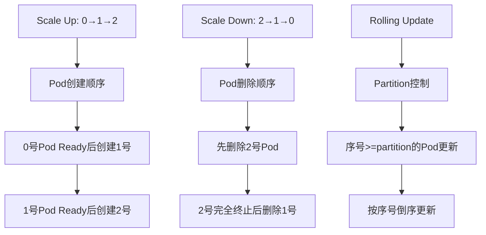

# Kubernetes 工作负载(Workload)ACK实战技术指南

> **适用版本**: Kubernetes v1.25 - v1.32 | **环境**: 阿里云专有云 & 公共云 | **重点产品**: ACK  
> **文档类型**: 技术实践指南 | **目标读者**: 运维工程师、架构师、DevOps工程师  

---

## 目录

1. [控制器工作机制深度解析](#1-控制器工作机制深度解析)
2. [生产级配置模板](#2-生产级配置模板)
3. [阿里云ACK集成详解](#3-阿里云ack集成详解)
4. [性能优化实践](#4-性能优化实践)
5. [安全加固配置](#5-安全加固配置)
6. [高可用架构设计](#6-高可用架构设计)
7. [自动扩缩容策略](#7-自动扩缩容策略)
8. [故障诊断手册](#8-故障诊断手册)

---

## 1. 控制器工作机制深度解析

### 1.1 控制器调和循环原理

```
[期望状态] → [控制器] → [实际状态] → [差异检测] → [调和操作] → [新状态]
     ↑                                                    ↓
     └─────────────────── 状态收敛 ←───────────────────────┘
```

**核心组件**
- **Informer**: 监听API Server资源变化
- **WorkQueue**: 事件队列，去重和排序
- **Reconcile Loop**: 调和循环，执行状态同步
- **Rate Limiter**: 速率限制，防止过度调用

### 1.2 Deployment控制器详细分析

#### 控制循环流程
```
1. Watch Deployment/ReplicaSet/Pod变化
2. 同步Deployment状态
   │
   ├─▶ 检查是否需要创建新ReplicaSet
   │   └─ PodTemplateSpec发生变化时创建新RS
   │
   ├─▶ 根据更新策略执行滚动更新
   │   ├─ RollingUpdate: 逐步替换Pod
   │   │   ├─ maxSurge: 最大超出副本数
   │   │   └─ maxUnavailable: 最大不可用数
   │   └─ Recreate: 先删后建
   │
   └─▶ 更新Deployment Status
       ├─ replicas: 当前副本数
       ├─ updatedReplicas: 已更新副本数
       ├─ readyReplicas: 就绪副本数
       ├─ availableReplicas: 可用副本数
       └─ conditions: 状态条件
```

#### ReplicaSet控制器协同工作
```yaml
# Deployment创建的ReplicaSet示例
apiVersion: apps/v1
kind: ReplicaSet
metadata:
  name: web-app-7d5f8c9b4
  ownerReferences:
  - apiVersion: apps/v1
    kind: Deployment
    name: web-app
    uid: xxxxxxxx-xxxx-xxxx-xxxx-xxxxxxxxxxxx
spec:
  replicas: 6
  selector:
    matchLabels:
      app: web-app
      pod-template-hash: 7d5f8c9b4
  template:
    metadata:
      labels:
        app: web-app
        pod-template-hash: 7d5f8c9b4
    spec:
      containers:
      - name: web
        image: web-app:v1.0
```

### 1.3 StatefulSet控制器机制

#### 身份管理机制
```
Pod命名规则: {StatefulSetName}-{序号}
持久化标识: {PVCName}-{序号}
网络标识: {PodName}.{HeadlessService}
```

#### 有序操作保证


### 1.4 控制器源码关键结构

```go
// Deployment控制器核心逻辑
type DeploymentController struct {
    kubeClient clientset.Interface
    workqueue  workqueue.RateLimitingInterface
    informers  informers.SharedInformerFactory
}

func (dc *DeploymentController) syncDeployment(key string) error {
    // 1. 获取Deployment对象
    deployment, err := dc.deploymentsLister.Deployments(namespace).Get(name)
    if err != nil {
        return err
    }
    
    // 2. 计算期望状态
    desiredReplicas := *(deployment.Spec.Replicas)
    
    // 3. 获取当前状态
    currentReplicas := deployment.Status.Replicas
    updatedReplicas := deployment.Status.UpdatedReplicas
    availableReplicas := deployment.Status.AvailableReplicas
    
    // 4. 执行调和逻辑
    if currentReplicas < desiredReplicas {
        // 扩容逻辑
        dc.scaleUp(deployment, desiredReplicas-currentReplicas)
    } else if currentReplicas > desiredReplicas {
        // 缩容逻辑
        dc.scaleDown(deployment, currentReplicas-desiredReplicas)
    }
    
    // 5. 检查更新进度
    if deployment.Spec.Template.Generation > deployment.Status.ObservedGeneration {
        dc.rollout(deployment)
    }
    
    return nil
}
```

---

## 2. 生产级配置模板

### 2.1 标准Web应用Deployment

```yaml
# 生产级Web应用配置
apiVersion: apps/v1
kind: Deployment
metadata:
  name: web-application
  namespace: production
  labels:
    app: web-application
    version: v1.0.0
    environment: production
    team: frontend
  annotations:
    # 部署元数据
    deployment.kubernetes.io/revision: "1"
    kubernetes.io/change-cause: "Release v1.0.0 - Initial deployment"
spec:
  replicas: 12
  revisionHistoryLimit: 20  # 保留更多历史版本
  strategy:
    type: RollingUpdate
    rollingUpdate:
      maxSurge: 25%         # 最大超出25%
      maxUnavailable: 0     # 零停机更新
  minReadySeconds: 30      # 新Pod就绪后等待30秒
  progressDeadlineSeconds: 600  # 更新超时10分钟
  selector:
    matchLabels:
      app: web-application
  template:
    metadata:
      labels:
        app: web-application
        version: v1.0.0
        environment: production
      annotations:
        # Prometheus注解
        prometheus.io/scrape: "true"
        prometheus.io/port: "8080"
        prometheus.io/path: "/metrics"
    spec:
      # 调度优化
      priorityClassName: high-priority
      topologySpreadConstraints:
      - maxSkew: 1
        topologyKey: topology.kubernetes.io/zone
        whenUnsatisfiable: ScheduleAnyway
        labelSelector:
          matchLabels:
            app: web-application
      affinity:
        podAntiAffinity:
          preferredDuringSchedulingIgnoredDuringExecution:
          - weight: 100
            podAffinityTerm:
              labelSelector:
                matchLabels:
                  app: web-application
              topologyKey: kubernetes.io/hostname
      # 容忍污点
      tolerations:
      - key: dedicated
        value: web
        effect: NoSchedule
      # 安全上下文
      securityContext:
        runAsNonRoot: true
        runAsUser: 1000
        fsGroup: 2000
      containers:
      - name: web-app
        image: registry.aliyuncs.com/company/web-app:v1.0.0
        imagePullPolicy: IfNotPresent
        ports:
        - name: http
          containerPort: 8080
          protocol: TCP
        # 资源配置
        resources:
          requests:
            cpu: "500m"
            memory: "1Gi"
          limits:
            cpu: "2"
            memory: "4Gi"
        # 环境变量
        env:
        - name: PORT
          value: "8080"
        - name: LOG_LEVEL
          value: "info"
        - name: DATABASE_URL
          valueFrom:
            secretKeyRef:
              name: web-app-secrets
              key: database-url
        # 健康检查
        startupProbe:
          httpGet:
            path: /health/startup
            port: 8080
          initialDelaySeconds: 10
          periodSeconds: 5
          failureThreshold: 60  # 给应用足够启动时间
        readinessProbe:
          httpGet:
            path: /health/ready
            port: 8080
          initialDelaySeconds: 5
          periodSeconds: 5
          timeoutSeconds: 3
          successThreshold: 1
          failureThreshold: 3
        livenessProbe:
          httpGet:
            path: /health/live
            port: 8080
          initialDelaySeconds: 60
          periodSeconds: 10
          timeoutSeconds: 5
          successThreshold: 1
          failureThreshold: 3
        # 生命周期钩子
        lifecycle:
          postStart:
            exec:
              command: ["/bin/sh", "-c", "echo 'Application Started' >> /var/log/app.log"]
          preStop:
            exec:
              command: ["/bin/sh", "-c", "sleep 30 && /graceful-shutdown"]
        # 卷挂载
        volumeMounts:
        - name: logs
          mountPath: /var/log/app
        - name: tmp
          mountPath: /tmp
      volumes:
      - name: logs
        emptyDir: {}
      - name: tmp
        emptyDir: {}
```

### 2.2 高可用数据库StatefulSet

```yaml
# 生产级数据库配置
apiVersion: apps/v1
kind: StatefulSet
metadata:
  name: postgresql-cluster
  namespace: database
  labels:
    app: postgresql
    cluster: production
spec:
  serviceName: postgresql-headless
  replicas: 3
  podManagementPolicy: Parallel  # 并行创建提升部署速度
  updateStrategy:
    type: RollingUpdate
    rollingUpdate:
      partition: 0  # 0表示全部更新，>0用于金丝雀发布
  persistentVolumeClaimRetentionPolicy:
    whenDeleted: Retain    # 删除时保留数据
    whenScaled: Retain     # 缩容时保留数据
  selector:
    matchLabels:
      app: postgresql
  template:
    metadata:
      labels:
        app: postgresql
        cluster: production
    spec:
      # 节点亲和性 - 确保分布在不同AZ
      affinity:
        nodeAffinity:
          requiredDuringSchedulingIgnoredDuringExecution:
            nodeSelectorTerms:
            - matchExpressions:
              - key: topology.kubernetes.io/zone
                operator: In
                values:
                - cn-hangzhou-a
                - cn-hangzhou-b
                - cn-hangzhou-c
        podAntiAffinity:
          requiredDuringSchedulingIgnoredDuringExecution:
          - labelSelector:
              matchLabels:
                app: postgresql
            topologyKey: kubernetes.io/hostname
      # 优雅终止
      terminationGracePeriodSeconds: 120
      # 初始化容器
      initContainers:
      - name: init-permissions
        image: busybox:1.35
        command: ['sh', '-c', 'chown -R 70:70 /var/lib/postgresql/data']
        volumeMounts:
        - name: postgresql-data
          mountPath: /var/lib/postgresql/data
      containers:
      - name: postgresql
        image: postgres:15.2-alpine
        ports:
        - containerPort: 5432
          name: postgresql
        # 资源配置
        resources:
          requests:
            cpu: "2"
            memory: "4Gi"
          limits:
            cpu: "4"
            memory: "8Gi"
        # 环境变量
        env:
        - name: POSTGRES_DB
          value: "production_db"
        - name: POSTGRES_USER
          valueFrom:
            secretKeyRef:
              name: postgresql-secrets
              key: username
        - name: POSTGRES_PASSWORD
          valueFrom:
            secretKeyRef:
              name: postgresql-secrets
              key: password
        - name: PGDATA
          value: "/var/lib/postgresql/data/pgdata"
        # 健康检查
        startupProbe:
          exec:
            command: ["pg_isready", "-U", "$(POSTGRES_USER)"]
          initialDelaySeconds: 30
          periodSeconds: 10
          failureThreshold: 20
        readinessProbe:
          exec:
            command: ["pg_isready", "-U", "$(POSTGRES_USER)"]
          initialDelaySeconds: 5
          periodSeconds: 5
          timeoutSeconds: 3
        livenessProbe:
          exec:
            command: ["pg_isready", "-U", "$(POSTGRES_USER)"]
          initialDelaySeconds: 60
          periodSeconds: 10
          timeoutSeconds: 5
        # 卷挂载
        volumeMounts:
        - name: postgresql-data
          mountPath: /var/lib/postgresql/data
        - name: postgresql-config
          mountPath: /etc/postgresql/postgresql.conf
          subPath: postgresql.conf
        - name: postgresql-logs
          mountPath: /var/log/postgresql
  # 持久化存储
  volumeClaimTemplates:
  - metadata:
      name: postgresql-data
      labels:
        type: database-storage
        backup: daily
    spec:
      accessModes: ["ReadWriteOnce"]
      storageClassName: alicloud-disk-essd-pl2
      resources:
        requests:
          storage: 500Gi
  # 配置卷
  - metadata:
      name: postgresql-config
    spec:
      accessModes: ["ReadWriteOnce"]
      storageClassName: alicloud-disk-efficiency
      resources:
        requests:
          storage: 1Gi
  # 日志卷
  - metadata:
      name: postgresql-logs
    spec:
      accessModes: ["ReadWriteOnce"]
      storageClassName: alicloud-disk-efficiency
      resources:
        requests:
          storage: 100Gi
```

### 2.3 节点级守护DaemonSet

```yaml
# 生产级监控代理配置
apiVersion: apps/v1
kind: DaemonSet
metadata:
  name: node-monitoring-agent
  namespace: monitoring
  labels:
    app: monitoring
    component: agent
spec:
  selector:
    matchLabels:
      name: node-monitoring-agent
  updateStrategy:
    type: RollingUpdate
    rollingUpdate:
      maxUnavailable: 1  # 每次最多更新1个节点
  template:
    metadata:
      labels:
        name: node-monitoring-agent
        version: v2.1.0
      annotations:
        prometheus.io/scrape: "true"
        prometheus.io/port: "9100"
    spec:
      # 节点容忍 - 允许调度到各种节点
      tolerations:
      # 允许调度到master节点
      - key: node-role.kubernetes.io/master
        effect: NoSchedule
      # 允许调度到not-ready节点
      - key: node.kubernetes.io/not-ready
        effect: NoSchedule
      # 允许调度到unschedulable节点
      - key: node.kubernetes.io/unschedulable
        effect: NoSchedule
      # 优先级设置
      priorityClassName: system-node-critical
      # 安全上下文
      securityContext:
        runAsNonRoot: true
        runAsUser: 65534
        fsGroup: 65534
      containers:
      - name: node-exporter
        image: prom/node-exporter:v1.6.1
        args:
        - --web.listen-address=:9100
        - --collector.filesystem.mount-points-exclude=^/(dev|proc|sys|var/lib/docker/.+)($|/)
        - --collector.filesystem.fs-types-exclude=^(autofs|binfmt_misc|bpf|cgroup2?|configfs|debugfs|devpts|devtmpfs|fusectl|hugetlbfs|iso9660|mqueue|nsfs|overlay|proc|procfs|pstore|rpc_pipefs|securityfs|selinuxfs|squashfs|sysfs|tracefs)$
        ports:
        - name: metrics
          containerPort: 9100
          protocol: TCP
        resources:
          requests:
            cpu: 100m
            memory: 128Mi
          limits:
            cpu: 250m
            memory: 256Mi
        volumeMounts:
        - name: proc
          mountPath: /host/proc
          readOnly: true
        - name: sys
          mountPath: /host/sys
          readOnly: true
        - name: root
          mountPath: /rootfs
          readOnly: true
      - name: cadvisor
        image: gcr.io/cadvisor/cadvisor:v0.47.1
        args:
        - --housekeeping_interval=10s
        - --max_housekeeping_interval=15s
        - --event_storage_event_limit=default=0
        - --event_storage_age_limit=default=0
        - --disable_metrics=accelerator,cpu_topology,disk,memory_numa,tcp,udp,percpu,sched,process,hugetlb,referenced_memory,resctrl,cpuset,advtcp,memory_numa
        ports:
        - name: cadvisor
          containerPort: 8080
          protocol: TCP
        resources:
          requests:
            cpu: 200m
            memory: 256Mi
          limits:
            cpu: 500m
            memory: 512Mi
        volumeMounts:
        - name: root
          mountPath: /rootfs
          readOnly: true
        - name: var-run
          mountPath: /var/run
          readOnly: true
        - name: sys
          mountPath: /sys
          readOnly: true
        - name: docker
          mountPath: /var/lib/docker
          readOnly: true
      volumes:
      - name: proc
        hostPath:
          path: /proc
      - name: sys
        hostPath:
          path: /sys
      - name: root
        hostPath:
          path: /
      - name: var-run
        hostPath:
          path: /var/run
      - name: docker
        hostPath:
          path: /var/lib/docker
```

### 2.4 批处理Job配置

```yaml
# 生产级数据处理Job
apiVersion: batch/v1
kind: Job
metadata:
  name: data-processing-job-v20260130
  namespace: data-processing
  labels:
    app: data-processor
    version: v2.0
    batch: daily
spec:
  completions: 10        # 完成10个Pod
  parallelism: 5         # 并发5个Pod
  backoffLimit: 6        # 最多重试6次
  activeDeadlineSeconds: 7200  # 2小时超时
  ttlSecondsAfterFinished: 86400  # 完成后24小时自动清理
  template:
    metadata:
      labels:
        app: data-processor
        version: v2.0
    spec:
      # 重启策略
      restartPolicy: OnFailure
      # 优先级
      priorityClassName: batch-processing
      # 节点选择
      nodeSelector:
        node-pool: batch-processing
      # 容忍污点
      tolerations:
      - key: dedicated
        value: batch
        effect: NoSchedule
      containers:
      - name: processor
        image: data-processor:v2.0
        command: ["/app/process-data"]
        args:
        - "--input=s3://data-bucket/input/"
        - "--output=s3://data-bucket/output/"
        - "--date=$(PROCESS_DATE)"
        env:
        - name: PROCESS_DATE
          valueFrom:
            fieldRef:
              fieldPath: metadata.creationTimestamp
        - name: AWS_ACCESS_KEY_ID
          valueFrom:
            secretKeyRef:
              name: aws-credentials
              key: access-key-id
        - name: AWS_SECRET_ACCESS_KEY
          valueFrom:
            secretKeyRef:
              name: aws-credentials
              key: secret-access-key
        resources:
          requests:
            cpu: "2"
            memory: "4Gi"
          limits:
            cpu: "4"
            memory: "8Gi"
        volumeMounts:
        - name: scratch
          mountPath: /scratch
        - name: config
          mountPath: /app/config
          readOnly: true
      volumes:
      - name: scratch
        emptyDir:
          sizeLimit: 10Gi
      - name: config
        configMap:
          name: data-processor-config
```

---

## 3. 阿里云ACK集成详解

### 3.1 ACK托管版优化配置

```yaml
# ACK托管集群工作负载优化
apiVersion: apps/v1
kind: Deployment
metadata:
  name: ack-optimized-workload
  namespace: production
  annotations:
    # ACK特定注解
    ack.aliyun.com/node-pool: "general-purpose"
    ack.aliyun.com/scheduling-strategy: "spread"
    ack.aliyun.com/deployment-mode: "standard"
spec:
  replicas: 15
  selector:
    matchLabels:
      app: ack-optimized
  template:
    metadata:
      labels:
        app: ack-optimized
        ack.aliyun.com/instance-type: "ecs.c6.xlarge"
    spec:
      # ACK推荐的调度策略
      topologySpreadConstraints:
      - maxSkew: 1
        topologyKey: topology.kubernetes.io/zone
        whenUnsatisfiable: ScheduleAnyway
        labelSelector:
          matchLabels:
            app: ack-optimized
      - maxSkew: 2
        topologyKey: kubernetes.io/hostname
        whenUnsatisfiable: ScheduleAnyway
        labelSelector:
          matchLabels:
            app: ack-optimized
      # 节点亲和性
      affinity:
        nodeAffinity:
          requiredDuringSchedulingIgnoredDuringExecution:
            nodeSelectorTerms:
            - matchExpressions:
              - key: ack.aliyun.com/node-pool-id
                operator: In
                values:
                - np-xxxxxxxxx
      containers:
      - name: app
        image: ack-app:v1.0
        # ACK监控集成
        env:
        - name: ACK_CLUSTER_NAME
          valueFrom:
            fieldRef:
              fieldPath: metadata.annotations['ack.aliyun.com/cluster-name']
        - name: ACK_NODE_POOL
          valueFrom:
            fieldRef:
              fieldPath: metadata.annotations['ack.aliyun.com/node-pool-id']
```

### 3.2 专有云ACK特殊配置

```yaml
# 专有云环境特殊配置
apiVersion: apps/v1
kind: StatefulSet
metadata:
  name: apsara-workload
  namespace: production
spec:
  serviceName: apsara-service
  replicas: 3
  template:
    spec:
      # 专有云DNS配置
      dnsConfig:
        nameservers:
        - 100.100.2.136  # 专有云DNS服务器
        - 100.100.2.138
        searches:
        - svc.cluster.local
        - cluster.local
        options:
        - name: ndots
          value: "5"
        - name: timeout
          value: "2"
      # 专有云安全配置
      securityContext:
        runAsUser: 1000
        runAsGroup: 3000
        fsGroup: 2000
      containers:
      - name: app
        image: apsara-app:v1.0
        # 专有云存储配置
        volumeMounts:
        - name: data
          mountPath: /data
        - name: logs
          mountPath: /var/log/app
      volumes:
      - name: data
        persistentVolumeClaim:
          claimName: apsara-data-pvc
      - name: logs
        hostPath:
          path: /var/log/apsara-app
          type: DirectoryOrCreate
```

### 3.3 多可用区高可用部署

```yaml
# 跨AZ高可用部署策略
apiVersion: apps/v1
kind: Deployment
metadata:
  name: multi-az-ha-app
  namespace: production
spec:
  replicas: 12  # 4个AZ，每AZ3个副本
  selector:
    matchLabels:
      app: multi-az-ha
  template:
    metadata:
      labels:
        app: multi-az-ha
    spec:
      # 强制跨AZ分布
      affinity:
        nodeAffinity:
          requiredDuringSchedulingIgnoredDuringExecution:
            nodeSelectorTerms:
            - matchExpressions:
              - key: topology.kubernetes.io/zone
                operator: In
                values:
                - cn-hangzhou-a
                - cn-hangzhou-b
                - cn-hangzhou-c
                - cn-hangzhou-d
        podAntiAffinity:
          requiredDuringSchedulingIgnoredDuringExecution:
          - labelSelector:
              matchLabels:
                app: multi-az-ha
            topologyKey: topology.kubernetes.io/zone
      containers:
      - name: app
        image: multi-az-app:v1.0
        resources:
          requests:
            cpu: "1"
            memory: "2Gi"
          limits:
            cpu: "2"
            memory: "4Gi"
```

### 3.4 ACK节点池管理

```yaml
# 节点池选择配置
apiVersion: apps/v1
kind: Deployment
metadata:
  name: compute-intensive-app
  namespace: production
spec:
  replicas: 8
  template:
    spec:
      # 节点池选择
      nodeSelector:
        ack.aliyun.com/node-pool-id: "np-compute-optimized"  # 计算优化型节点池
        beta.kubernetes.io/arch: "amd64"
      # Spot实例容忍
      tolerations:
      - key: alibabacloud.com/spot-instance
        value: "true"
        effect: NoSchedule
      containers:
      - name: compute-app
        image: compute-app:v1.0
        resources:
          requests:
            cpu: "8"
            memory: "32Gi"
          limits:
            cpu: "16"
            memory: "64Gi"
```

---

## 4. 性能优化实践

### 4.1 资源请求和限制优化

```yaml
# 性能优化资源配置
apiVersion: apps/v1
kind: Deployment
metadata:
  name: performance-optimized-app
spec:
  replicas: 6
  template:
    spec:
      containers:
      - name: app
        image: perf-app:v1.0
        # 精确的资源配置
        resources:
          requests:
            cpu: "1500m"      # 1.5核CPU
            memory: "3Gi"     # 3GB内存
            ephemeral-storage: "10Gi"  # 临时存储
          limits:
            cpu: "2"          # 2核CPU上限
            memory: "4Gi"     # 4GB内存上限
            ephemeral-storage: "20Gi"
        # QoS等级优化
        startupProbe:
          httpGet:
            path: /health
            port: 8080
          initialDelaySeconds: 30
          periodSeconds: 10
          failureThreshold: 10
        # 性能调优参数
        env:
        - name: GOGC
          value: "20"         # Go垃圾回收调优
        - name: GOMAXPROCS
          valueFrom:
            resourceFieldRef:
              resource: limits.cpu
        - name: JAVA_OPTS
          value: "-XX:+UseG1GC -XX:MaxGCPauseMillis=200"
```

### 4.2 调度优化配置

```yaml
# 高级调度优化
apiVersion: apps/v1
kind: Deployment
metadata:
  name: scheduling-optimized-app
spec:
  replicas: 10
  template:
    spec:
      # 优先级类
      priorityClassName: high-priority
      
      # 拓扑分布约束
      topologySpreadConstraints:
      # 跨可用区均匀分布
      - maxSkew: 1
        topologyKey: topology.kubernetes.io/zone
        whenUnsatisfiable: DoNotSchedule
        labelSelector:
          matchLabels:
            app: scheduling-optimized
      # 节点间负载均衡
      - maxSkew: 2
        topologyKey: kubernetes.io/hostname
        whenUnsatisfiable: ScheduleAnyway
        labelSelector:
          matchLabels:
            app: scheduling-optimized
      
      # 亲和性配置
      affinity:
        nodeAffinity:
          preferredDuringSchedulingIgnoredDuringExecution:
          - weight: 100
            preference:
              matchExpressions:
              - key: node.kubernetes.io/instance-type
                operator: In
                values:
                - ecs.c6.2xlarge
                - ecs.c6.4xlarge
        podAffinity:
          preferredDuringSchedulingIgnoredDuringExecution:
          - weight: 50
            podAffinityTerm:
              labelSelector:
                matchLabels:
                  app: cache-service
              topologyKey: kubernetes.io/hostname
        podAntiAffinity:
          requiredDuringSchedulingIgnoredDuringExecution:
          - labelSelector:
              matchLabels:
                app: scheduling-optimized
            topologyKey: kubernetes.io/hostname
```

### 4.3 容器运行时优化

```yaml
# 容器运行时优化配置
apiVersion: apps/v1
kind: Deployment
metadata:
  name: runtime-optimized-app
spec:
  replicas: 4
  template:
    spec:
      # 容器运行时配置
      runtimeClassName: containerd  # 使用containerd运行时
      
      # 安全上下文优化
      securityContext:
        runAsNonRoot: true
        runAsUser: 10001
        runAsGroup: 10001
        fsGroup: 10001
        supplementalGroups: [20001]
        
      containers:
      - name: app
        image: runtime-optimized:v1.0
        # 容器优化参数
        securityContext:
          allowPrivilegeEscalation: false
          readOnlyRootFilesystem: true
          capabilities:
            drop:
            - ALL
            add:
            - NET_BIND_SERVICE
        # 性能相关环境变量
        env:
        - name: CONTAINER_CPU_REQUEST
          valueFrom:
            resourceFieldRef:
              resource: requests.cpu
        - name: CONTAINER_MEMORY_LIMIT
          valueFrom:
            resourceFieldRef:
              resource: limits.memory
```

---

## 5. 安全加固配置

### 5.1 网络策略配置

```yaml
# 完整的网络安全策略
apiVersion: networking.k8s.io/v1
kind: NetworkPolicy
metadata:
  name: secure-workload-policy
  namespace: production
spec:
  podSelector:
    matchLabels:
      app: secure-app
  policyTypes:
  - Ingress
  - Egress
  
  # 入站流量控制
  ingress:
  # 只允许来自特定应用的流量
  - from:
    - podSelector:
        matchLabels:
          app: frontend
    - namespaceSelector:
        matchLabels:
          name: frontend
    ports:
    - protocol: TCP
      port: 8080
  # 允许监控流量
  - from:
    - namespaceSelector:
        matchLabels:
          name: monitoring
    ports:
    - protocol: TCP
      port: 9090
  
  # 出站流量控制
  egress:
  # 只允许访问必要的外部服务
  - to:
    - ipBlock:
        cidr: 100.100.0.0/16  # 阿里云内网
    ports:
    - protocol: TCP
      port: 443
    - protocol: TCP
      port: 5432
  # 允许DNS查询
  - to:
    - namespaceSelector: {}
      podSelector:
        matchLabels:
          k8s-app: kube-dns
    ports:
    - protocol: UDP
      port: 53
    - protocol: TCP
      port: 53
```

### 5.2 RBAC权限控制

```yaml
# 工作负载RBAC配置
apiVersion: rbac.authorization.k8s.io/v1
kind: Role
metadata:
  name: deployment-manager
  namespace: production
rules:
- apiGroups: ["apps"]
  resources: ["deployments", "statefulsets", "daemonsets"]
  verbs: ["get", "list", "watch", "create", "update", "patch", "delete"]
- apiGroups: [""]
  resources: ["pods", "pods/log", "pods/exec"]
  verbs: ["get", "list", "watch"]
- apiGroups: ["batch"]
  resources: ["jobs", "cronjobs"]
  verbs: ["get", "list", "watch", "create", "update", "delete"]

---
apiVersion: rbac.authorization.k8s.io/v1
kind: RoleBinding
metadata:
  name: deployment-manager-binding
  namespace: production
subjects:
- kind: ServiceAccount
  name: app-deployer
  namespace: production
roleRef:
  kind: Role
  name: deployment-manager
  apiGroup: rbac.authorization.k8s.io
```

### 5.3 安全上下文配置

```yaml
# 完整的安全上下文配置
apiVersion: apps/v1
kind: Deployment
metadata:
  name: secure-app
  namespace: production
spec:
  replicas: 3
  template:
    spec:
      # Pod安全上下文
      securityContext:
        runAsNonRoot: true
        runAsUser: 1000
        runAsGroup: 3000
        fsGroup: 2000
        supplementalGroups: [1001]
        seccompProfile:
          type: RuntimeDefault
        sysctls:
        - name: net.ipv4.tcp_syncookies
          value: "1"
      
      containers:
      - name: app
        image: secure-app:v1.0
        # 容器安全上下文
        securityContext:
          allowPrivilegeEscalation: false
          readOnlyRootFilesystem: true
          runAsNonRoot: true
          runAsUser: 1000
          runAsGroup: 3000
          capabilities:
            drop:
            - ALL
            add:
            - NET_BIND_SERVICE
            - SYS_TIME
          seLinuxOptions:
            level: "s0:c123,c456"
        
        # 只读文件系统挂载
        volumeMounts:
        - name: tmp
          mountPath: /tmp
        - name: var-tmp
          mountPath: /var/tmp
        - name: app-config
          mountPath: /app/config
          readOnly: true
        
      volumes:
      - name: tmp
        emptyDir: {}
      - name: var-tmp
        emptyDir: {}
      - name: app-config
        configMap:
          name: app-config
```

---

## 6. 高可用架构设计

### 6.1 多层高可用设计

```yaml
# 完整的高可用架构
apiVersion: apps/v1
kind: Deployment
metadata:
  name: ha-architecture-app
  namespace: production
spec:
  replicas: 12
  strategy:
    type: RollingUpdate
    rollingUpdate:
      maxSurge: 2
      maxUnavailable: 0
  selector:
    matchLabels:
      app: ha-app
  template:
    metadata:
      labels:
        app: ha-app
        version: v1.0
    spec:
      # 多层故障域分布
      affinity:
        nodeAffinity:
          requiredDuringSchedulingIgnoredDuringExecution:
            nodeSelectorTerms:
            - matchExpressions:
              - key: topology.kubernetes.io/zone
                operator: In
                values:
                - cn-hangzhou-a
                - cn-hangzhou-b
                - cn-hangzhou-c
        podAntiAffinity:
          requiredDuringSchedulingIgnoredDuringExecution:
          - labelSelector:
              matchLabels:
                app: ha-app
            topologyKey: kubernetes.io/hostname
          preferredDuringSchedulingIgnoredDuringExecution:
          - weight: 100
            podAffinityTerm:
              labelSelector:
                matchLabels:
                  app: ha-app
              topologyKey: topology.kubernetes.io/zone
      
      # 优雅终止配置
      terminationGracePeriodSeconds: 120
      
      # Pod中断预算
      containers:
      - name: app
        image: ha-app:v1.0
        ports:
        - containerPort: 8080
        # 资源预留
        resources:
          requests:
            cpu: "1"
            memory: "2Gi"
          limits:
            cpu: "2"
            memory: "4Gi"
        # 健康检查
        readinessProbe:
          httpGet:
            path: /ready
            port: 8080
          initialDelaySeconds: 10
          periodSeconds: 5
        livenessProbe:
          httpGet:
            path: /health
            port: 8080
          initialDelaySeconds: 60
          periodSeconds: 10
        # 优雅关闭
        lifecycle:
          preStop:
            exec:
              command: ["/bin/sh", "-c", "sleep 30 && /graceful-shutdown"]
```

### 6.2 数据库主从架构

```yaml
# 数据库主从高可用配置
apiVersion: apps/v1
kind: StatefulSet
metadata:
  name: mysql-master
  namespace: database
spec:
  serviceName: mysql-master
  replicas: 1
  selector:
    matchLabels:
      app: mysql
      role: master
  template:
    metadata:
      labels:
        app: mysql
        role: master
    spec:
      containers:
      - name: mysql
        image: mysql:8.0
        env:
        - name: MYSQL_ROOT_PASSWORD
          valueFrom:
            secretKeyRef:
              name: mysql-secret
              key: root-password
        ports:
        - containerPort: 3306
        volumeMounts:
        - name: data
          mountPath: /var/lib/mysql
  volumeClaimTemplates:
  - metadata:
      name: data
    spec:
      accessModes: ["ReadWriteOnce"]
      storageClassName: alicloud-disk-essd-pl2
      resources:
        requests:
          storage: 500Gi

---
apiVersion: apps/v1
kind: StatefulSet
metadata:
  name: mysql-slave
  namespace: database
spec:
  serviceName: mysql-slave
  replicas: 2
  selector:
    matchLabels:
      app: mysql
      role: slave
  template:
    metadata:
      labels:
        app: mysql
        role: slave
    spec:
      affinity:
        podAntiAffinity:
          requiredDuringSchedulingIgnoredDuringExecution:
          - labelSelector:
              matchLabels:
                app: mysql
            topologyKey: kubernetes.io/hostname
      containers:
      - name: mysql
        image: mysql:8.0
        env:
        - name: MYSQL_ROOT_PASSWORD
          valueFrom:
            secretKeyRef:
              name: mysql-secret
              key: root-password
        - name: MYSQL_MASTER_HOST
          value: "mysql-master-0.mysql-master"
        ports:
        - containerPort: 3306
        volumeMounts:
        - name: data
          mountPath: /var/lib/mysql
  volumeClaimTemplates:
  - metadata:
      name: data
    spec:
      accessModes: ["ReadWriteOnce"]
      storageClassName: alicloud-disk-essd-pl1
      resources:
        requests:
          storage: 500Gi
```

---

## 7. 自动扩缩容策略

### 7.1 HPA配置详解

```yaml
# 高级HPA配置
apiVersion: autoscaling/v2
kind: HorizontalPodAutoscaler
metadata:
  name: advanced-hpa
  namespace: production
spec:
  scaleTargetRef:
    apiVersion: apps/v1
    kind: Deployment
    name: scalable-app
  minReplicas: 3
  maxReplicas: 50
  metrics:
  # CPU使用率指标
  - type: Resource
    resource:
      name: cpu
      target:
        type: Utilization
        averageUtilization: 70
  # 内存使用率指标
  - type: Resource
    resource:
      name: memory
      target:
        type: Utilization
        averageUtilization: 80
  # 自定义指标
  - type: Pods
    pods:
      metric:
        name: http_requests_per_second
      target:
        type: AverageValue
        averageValue: "100"
  # 外部指标
  - type: External
    external:
      metric:
        name: queue_length
      target:
        type: Value
        value: "30"
  
  # 扩缩容行为控制
  behavior:
    scaleDown:
      stabilizationWindowSeconds: 300
      policies:
      - type: Percent
        value: 10
        periodSeconds: 60
      - type: Pods
        value: 2
        periodSeconds: 60
      selectPolicy: Min  # 选择较保守的策略
    scaleUp:
      stabilizationWindowSeconds: 0
      policies:
      - type: Percent
        value: 100
        periodSeconds: 15
      - type: Pods
        value: 4
        periodSeconds: 15
      selectPolicy: Max  # 选择较激进的策略
```

### 7.2 VPA配置详解

```yaml
# VPA配置
apiVersion: autoscaling.k8s.io/v1
kind: VerticalPodAutoscaler
metadata:
  name: app-vpa
  namespace: production
spec:
  targetRef:
    apiVersion: apps/v1
    kind: Deployment
    name: vpa-app
  updatePolicy:
    updateMode: "Auto"  # Auto/Initial/Off
  resourcePolicy:
    containerPolicies:
    - containerName: app
      maxAllowed:
        cpu: "4"
        memory: "8Gi"
      minAllowed:
        cpu: "100m"
        memory: "128Mi"
      controlledResources: ["cpu", "memory"]
  # 推荐配置
  recommendations:
    containerRecommendations:
    - containerName: app
      lowerBound:
        cpu: "200m"
        memory: "256Mi"
      upperBound:
        cpu: "2"
        memory: "4Gi"
      target:
        cpu: "500m"
        memory: "1Gi"
```

### 7.3 CA配置示例

```yaml
# Cluster Autoscaler配置
apiVersion: apps/v1
kind: Deployment
metadata:
  name: cluster-autoscaler
  namespace: kube-system
spec:
  replicas: 1
  selector:
    matchLabels:
      app: cluster-autoscaler
  template:
    metadata:
      labels:
        app: cluster-autoscaler
    spec:
      serviceAccountName: cluster-autoscaler
      containers:
      - name: cluster-autoscaler
        image: registry.k8s.io/autoscaling/cluster-autoscaler:v1.25.0
        command:
        - ./cluster-autoscaler
        - --v=4
        - --stderrthreshold=info
        - --cloud-provider=alicloud
        - --skip-nodes-with-local-storage=false
        - --expander=least-waste
        - --node-group-auto-discovery=magpie:tag=k8s.io/cluster-autoscaler/enabled,k8s.io/cluster-autoscaler/cluster-name
        - --balance-similar-node-groups=true
        - --scale-down-delay-after-add=10m
        - --scale-down-unneeded-time=10m
        - --scale-down-utilization-threshold=0.5
        - --max-node-provision-time=15m
        env:
        - name: ARM_CLIENT_ID
          valueFrom:
            secretKeyRef:
              name: cloud-credentials
              key: arm-client-id
        - name: ARM_CLIENT_SECRET
          valueFrom:
            secretKeyRef:
              name: cloud-credentials
              key: arm-client-secret
        - name: ARM_SUBSCRIPTION_ID
          valueFrom:
            secretKeyRef:
              name: cloud-credentials
              key: arm-subscription-id
        - name: ARM_TENANT_ID
          valueFrom:
            secretKeyRef:
              name: cloud-credentials
              key: arm-tenant-id
```

---

## 8. 故障诊断手册

### 8.1 系统化诊断流程

```
工作负载异常诊断树:

应用异常?
├── Pod状态异常?
│   ├── Pending → 检查资源配额和节点资源
│   ├── CrashLoopBackOff → 检查应用日志和健康检查
│   ├── ImagePullBackOff → 检查镜像仓库访问
│   └── Unknown → 检查节点状态
├── 副本数不符?
│   ├── 少于期望值 → 检查控制器状态和节点资源
│   └── 多于期望值 → 检查是否有手动创建的Pod
├── 更新失败?
│   ├── Rollout卡住 → 检查新Pod状态和健康检查
│   └── 回滚失败 → 检查历史版本和权限
└── 性能问题?
    ├── 资源不足 → 检查资源请求和限制
    ├── 调度问题 → 检查节点亲和性和污点
    └── 网络问题 → 检查网络策略和服务
```

### 8.2 常用诊断命令集合

```bash
#!/bin/bash
# 工作负载综合诊断脚本

NAMESPACE=${1:-default}

echo "=== Kubernetes 工作负载诊断报告 ==="
echo "命名空间: $NAMESPACE"
echo "诊断时间: $(date)"
echo

# 1. 基础信息收集
echo "[1] Deployment状态概览"
kubectl get deployments -n $NAMESPACE -o wide
echo

echo "[2] Pod状态概览"
kubectl get pods -n $NAMESPACE -o wide
echo

echo "[3] ReplicaSet状态"
kubectl get rs -n $NAMESPACE -o wide
echo

# 2. 异常资源识别
echo "[4] 异常Pod列表"
kubectl get pods -n $NAMESPACE --field-selector=status.phase!=Running
echo

echo "[5] Pending状态Pod详情"
kubectl get pods -n $NAMESPACE --field-selector=status.phase=Pending -o name | \
xargs -I {} kubectl describe {} -n $NAMESPACE
echo

# 3. 控制器状态检查
echo "[6] Deployment详细状态"
kubectl get deployments -n $NAMESPACE -o json | jq -r '
  .items[] | 
  "\(.metadata.name): \(.status.replicas)/\(.status.availableReplicas)/\(.status.readyReplicas)"
'
echo

# 4. 更新状态检查
echo "[7] 滚动更新状态"
kubectl get deployments -n $NAMESPACE -o json | jq -r '
  .items[] | 
  select(.status.updatedReplicas != .status.replicas) |
  "\(.metadata.name): \(.status.updatedReplicas)/\(.status.replicas) updated"
'
echo

# 5. 资源使用情况
echo "[8] Pod资源使用"
kubectl top pods -n $NAMESPACE 2>/dev/null || echo "Metrics server不可用"
echo

# 6. 事件检查
echo "[9] 最近事件(1小时内)"
kubectl get events -n $NAMESPACE --sort-by=.lastTimestamp | \
tail -20 | grep -E "(Warning|Error)"
echo

# 7. 阿里云特定检查
echo "[10] 节点池状态"
kubectl get nodes -o custom-columns='NODE:.metadata.name,POOL:.metadata.labels.alibabacloud\.com/nodepool-id,STATUS:.status.conditions[?(@.type=="Ready")].status'
echo

# 8. 健康检查状态
echo "[11] Pod健康检查状态"
kubectl get pods -n $NAMESPACE -o json | jq -r '
  .items[] |
  "\(.metadata.name): 
   Ready=\(.status.containerStatuses[0].ready)
   Restart=\(.status.containerStatuses[0].restartCount)
   State=\(.status.containerStatuses[0].state)"
'
```

### 8.3 常见故障及解决方案

| 故障现象 | 可能原因 | 诊断方法 | 解决方案 |
|----------|----------|----------|----------|
| **Pod一直Pending** | 资源不足 | `kubectl describe pod <pod>` | 增加节点或调整资源请求 |
| **Pod频繁重启** | 健康检查失败 | `kubectl logs <pod> --previous` | 修复应用或调整探针配置 |
| **Deployment更新卡住** | 新Pod无法就绪 | `kubectl rollout status deploy/<name>` | 检查健康检查和资源限制 |
| **副本数异常** | 控制器故障 | `kubectl get rs` | 重启控制器或手动清理RS |
| **调度失败** | 节点亲和性冲突 | `kubectl describe pod` | 调整调度策略或节点标签 |

### 8.4 性能基准测试

```bash
#!/bin/bash
# 工作负载性能基准测试

DEPLOYMENT_NAME=${1:?"Usage: $0 <deployment-name>"}
NAMESPACE=${2:-default}

echo "=== 工作负载性能基准测试 ==="
echo "Deployment: $DEPLOYMENT_NAME"
echo "Namespace: $NAMESPACE"
echo

# 创建测试Deployment
cat <<EOF | kubectl apply -f -
apiVersion: apps/v1
kind: Deployment
metadata:
  name: benchmark-deployment
  namespace: $NAMESPACE
spec:
  replicas: 10
  selector:
    matchLabels:
      app: benchmark
  template:
    metadata:
      labels:
        app: benchmark
    spec:
      containers:
      - name: stress-ng
        image: progrium/stress-ng:latest
        command: ["stress-ng"]
        args: ["--cpu", "1", "--timeout", "300s"]
        resources:
          requests:
            cpu: "500m"
            memory: "256Mi"
          limits:
            cpu: "1"
            memory: "512Mi"
EOF

# 等待部署完成
echo "等待部署完成..."
kubectl rollout status deployment/benchmark-deployment -n $NAMESPACE --timeout=300s

# 执行性能测试
echo "执行性能测试..."
kubectl top pods -n $NAMESPACE -l app=benchmark

# 清理测试资源
echo "清理测试资源..."
kubectl delete deployment benchmark-deployment -n $NAMESPACE
```

---
