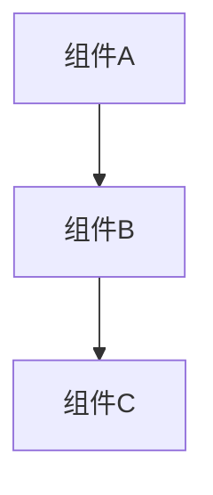

# {{TITLE}}

> {{一句话摘要：描述本文核心主题和价值}}

---

## 1. 概述

{{概述段落：
- 该技术/组件是什么
- 在 Kubernetes 生态中的定位
- 为什么重要（生产环境视角）
}}

### 适用版本

| 组件 | 版本范围 |
|:---|:---|
| Kubernetes | v1.25 - v1.32 |
| {{相关组件}} | {{版本}} |

---

## 2. 架构与原理

{{核心架构说明，建议包含：
- 架构图（Mermaid 或文字描述）
- 核心组件及职责
- 工作流程
}}



---

## 3. 核心概念

### 3.1 {{概念1}}

{{详细说明}}

### 3.2 {{概念2}}

{{详细说明}}

---

## 4. 配置与部署

### 4.1 基本配置

```yaml
# {{配置说明}} - K8s {{版本}}+
apiVersion: {{API版本}}
kind: {{资源类型}}
metadata:
  name: {{名称}}
spec:
  {{spec字段}}:
    {{值}}    # {{中文注释说明}}
```

### 4.2 生产级配置

```yaml
# 生产环境推荐配置
# 包含：高可用、资源限制、监控注解
{{生产级完整配置}}
```

---

## 5. 最佳实践

| 实践 | 说明 | 优先级 |
|:---|:---|:---:|
| {{实践1}} | {{说明}} | 🔴 必须 |
| {{实践2}} | {{说明}} | 🟡 推荐 |
| {{实践3}} | {{说明}} | 🟢 可选 |

---

## 6. 监控与告警

### 关键指标

| 指标 | 含义 | 告警阈值 |
|:---|:---|:---|
| {{metric_name}} | {{说明}} | {{阈值}} |

### Prometheus 告警规则

```yaml
groups:
- name: {{component}}-alerts
  rules:
  - alert: {{AlertName}}
    expr: {{PromQL表达式}}
    for: 5m
    labels:
      severity: warning
    annotations:
      summary: "{{告警摘要}}"
```

---

## 7. 故障排查

### 常见问题

| 现象 | 可能原因 | 排查命令 | 解决方案 |
|:---|:---|:---|:---|
| {{现象1}} | {{原因}} | `{{命令}}` | {{方案}} |

### 诊断命令集

```bash
# 基础检查
kubectl get {{resource}} -n {{namespace}}
kubectl describe {{resource}} {{name}}

# 日志检查
kubectl logs {{pod}} -n {{namespace}} --tail=100

# 高级诊断
{{特定诊断命令}}
```

---

## 8. 参考资料

- [Kubernetes 官方文档](https://kubernetes.io/docs/)
- {{其他参考链接}}

---

## 相关文档

| 类型 | 文档 | 说明 |
|:---|:---|:---|
| 前置阅读 | [{{文档名}}]({{路径}}) | {{说明}} |
| 深入阅读 | [{{文档名}}]({{路径}}) | {{说明}} |
| 速查参考 | [{{速查卡}}]({{路径}}) | {{说明}} |
| 故障排查 | [{{排障文档}}]({{路径}}) | {{说明}} |
