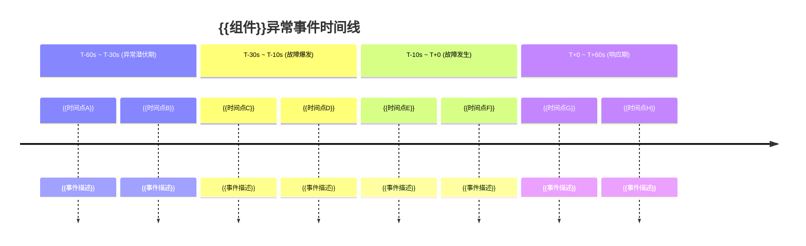

---

## YAML Front Matter

```yaml
created: "2026-05-23"
updated: "2026-05-23"
---# {{主题名称}} FEBM 法医取证分析

> **文档类型**: FEBM 取证分析
> **适用版本**: Kubernetes v1.28 - v1.32
> **最后更新**: {{日期}}
> **关联主文档**: [FEBM 方法论深度剖析](../domain-10-troubleshooting-diagnostics/topic-febm/febm-methodology-deep-dive.md)

---

## YAML Front Matter

```yaml
---
febm_id: "FEBM-{SEQ}"
title: {{主题名称}} [templates]
component: "{{组件名称}}"
severity: "P{0-3}"
k8s_versions: ["1.28", "1.29", "1.30", "1.31", "1.32"]
evidence_collector: "{{采集工具，如 falco/container-explorer}}"
last_updated: "{{YYYY-MM}}"
authors:
  - name: "{{姓名}}"
    role: "{{角色}}"
reviewers: []
tags: [febm, forensics, k8s, {{component}}]
related_docs:
  fta_ref: "../domain-10-troubleshooting-diagnostics/topic-fta/list/{{component}}-fta.md"
  skill_ref: "../domain-10-troubleshooting-diagnostics/topic-skills/{{NN}}-{{scenario}}.md"
---
```

---

## 0. 摘要

> 一句话概括本取证分析的核心问题、方法和结论。

---

## 1. 取证目标与范围

### 1.1 问题定义

**顶事件（TE）**：`{{组件}}服务异常/不可用`

| 属性 | 详情 |
|:---|:---|
| **TE 编号** | TE-{{序号}} |
| **严重性** | P{{0-3}} |
| **SLO 关联** | {{SLO 名称}}: {{目标值}} |
| **影响范围** | 用户：{{范围}} / 服务：{{列表}} / 业务：{{描述}} |

### 1.2 调查范围边界

**纳入范围**：
- {{组件}}的控制平面与数据平面交互
- 相关联的 Kubernetes 事件（Events）、审计日志、指标
- 节点层（kubelet、容器运行时）与网络层证据

**排除范围**：
- 上游网络基础设施（非 K8s 层）
- 应用层业务逻辑（仅关注 K8s 层）
- 硬件/物理层问题

---

## 2. 证据采集方案

### 2.1 证据易失性分级（RFC 3227）

> 按易失性从高到低排序，优先采集高优先级证据。

| 等级 | 证据类型 | 示例 | 采集优先级 |
|:---:|:---|:---|:---:|
| L0 | 寄存器/缓存 | CPU 寄存器状态（CRIU） | 🔴 极高 |
| L1 | 内存 | 进程内存映射、网络连接 | 🔴 极高 |
| L2 | 运行时状态 | 系统调用序列、文件描述符 | 🔴 高 |
| L3 | 临时存储 | emptyDir、容器层文件系统 | 🟡 中 |
| L4 | 日志缓冲 | 未转发的 stdout/stderr | 🟡 中 |
| L5 | Kubernetes Events | 默认 1h TTL | 🟢 低 |
| L6 | 持久化日志 | Loki/ES/云存储日志 | 🟢 低 |
| L7 | 审计记录 | API Server 审计日志 | 🟢 低 |
| L8 | 配置历史 | GitOps 仓库、etcd 快照 | ⚪ 永久 |

### 2.2 证据来源层级模型

```
Kubernetes 证据来源层级 (L1-L7):

L7: 业务层  ────────── 业务指标、用户行为数据
L6: 应用层  ────────── 应用日志、分布式追踪 Spans、自定义 Metrics
L5: Service Mesh ──── Istio/Linkerd 遥测、mTLS 日志
L4: K8s 控制平面 ──── API Server 审计、etcd 操作、Scheduler 决策
L3: Pod/容器层 ────── 容器日志、cAdvisor 指标、CRIU 检查点
L2: 节点层   ───────── kubelet 日志、内核日志、node_exporter、eBPF
L1: 基础设施层 ─────── 物理/虚拟资源、网络设备、云服务商 API
```

### 2.3 证据采集命令集

> 按顺序执行，采集顺序遵循易失性优先级。

```bash
# === L1 极高优先级：内存与运行时状态 ===

# 1. 容器内存转储（需 CRIU 支持，K8s 1.25+）
kubectl debug node/{{node-name}} -it --image=busybox -- crictl checkpoint {{container-id}}

# 2. 进程树与网络连接快照
kubectl exec -n {{namespace}} {{pod-name}} -- cat /proc/1/net/tcp
kubectl exec -n {{namespace}} {{pod-name}} -- ls -la /proc/1/fd/

# 3. eBPF 追踪事件（如果可用）
kubectl exec -n {{namespace}} {{pod-name}} -- cat /sys/kernel/debug/tracing/trace_pipe

# === L2 高优先级：系统调用与文件描述符 ===

# 4. 容器文件系统快照
kubectl exec -n {{namespace}} {{pod-name}} -- tar -czf - /var/log/ | base64

# 5. 网络连接详情
kubectl exec -n {{namespace}} {{pod-name}} -- ss -tunapl

# === L4 中优先级：Kubernetes 事件与日志 ===

# 6. 获取相关 Events（最近 1 小时）
kubectl get events -A --sort-by='.lastTimestamp' | grep -E '{{namespace}}|{{pod-name}}'

# 7. Pod 日志（如果容器还在运行）
kubectl logs -n {{namespace}} {{pod-name}} --previous --tail=200
kubectl describe pod -n {{namespace}} {{pod-name}}

# === L5 低优先级：审计日志与配置历史 ===

# 8. API Server 审计日志查询
kubectl get --raw /log/apiserver/audit/v1/events?watch=false

# 9. etcd 快照（如有权限）
etcdctl snapshot save /tmp/etcd-snap-$(date +%Y%m%d%H%M%S).db
```

### 2.4 证据 Chain of Custody 记录表

> 每条证据必须记录完整的保管链，确保可审计性和可辩护性。

```yaml
chain_of_custody:
  evidence_id: "EV-{{YYYY}}-{{MM}}-{{SEQ}}"
  total_items: {{N}}

  # 格式: {编号}|{时间戳}|{操作者}|{操作}|{存储位置}|{SHA256}
  records:
    - seq: "001"
      timestamp: "{{YYYY-MM-DD HH:MM:SS UTC}}"
      operator: "{{身份标识}}"
      action: "{{操作描述}}"
      destination: "{{存储路径/位置}}"
      hash_sha256: "{{哈希值}}"
      verification: "{{验证方式}}"

    - seq: "002"
      timestamp: "{{YYYY-MM-DD HH:MM:SS UTC}}"
      operator: "{{身份标识}}"
      action: "{{操作描述}}"
      destination: "{{存储路径/位置}}"
      hash_sha256: "{{哈希值}}"
      verification: "{{验证方式}}"
```

---

## 3. 时间线重建

### 3.1 证据时间线格式

> 将所有证据按时间轴排列，重建故障前后的事件序列。

```
时间线格式:
[时间戳] [来源] [事件/数据] [详细信息]

示例:
2026-05-09 10:32:15.234 L4-kube-apiserver Pod {{pod-name}} 状态变更 Running → Failed
2026-05-09 10:32:15.456 L2-kubelet      Node {{node}} 报告容器 exit，exitCode=137
2026-05-09 10:32:16.001 L3-falco        Security event: anomaly process spawn
2026-05-09 10:33:02.118 L6-loki         日志流中断，开始积压
```

### 3.2 异常模式识别

> 时间线重建后，识别以下异常模式：

| 模式类型 | 描述 | 识别信号 |
|:---|:---|:---|
| 时序异常 | 事件顺序不符合正常依赖 | 后续事件先于前置事件完成 |
| 频率异常 | 短时间内大量重复事件 | 同一事件在秒级窗口内出现 >10 次 |
| 关联断链 | 预期存在的中间事件缺失 | 顶事件发生但无中间步骤记录 |
| 资源耗尽 | 资源指标与事件时间点吻合 | CPU/Memory 峰值恰好在故障前 |
| 配置漂移 | 配置变更后立即出现异常 | ConfigMap/Secret 更新触发 |

### 3.3 时间线 Mermaid 图



---

## 4. 根因分析与证据链

### 4.1 证据强度分级

| 等级 | 描述 | 示例 | 可信度 |
|:---:|:---|:---|:---:|
| 🔴 直接证据 | 直接观测到的事实 | eBPF 捕获的完整 syscall 序列 | 极高 |
| 🟠 实物证据 | 系统产生的原始数据 | CRIU 检查点文件、内存转储 | 高 |
| 🟡 记录证据 | 系统自动记录 | 审计日志、应用日志 | 中高 |
| 🟢 间接证据 | 需要推理的关联 | 指标趋势、时间关联 | 中 |
| ⚪ 传闻证据 | 二手描述 | 用户工单描述、口头报告 | 低 |

### 4.2 根因假设与验证

> 使用归纳法：从证据出发，生成假设，验证假设。

| 假设编号 | 根因假设 | 证据支撑 | 验证方法 | 验证结果 | 置信度 |
|:---:|:---|:---|:---|:---:|:---:|
| H1 | {{假设内容}} | {{证据ID列表}} | {{验证命令/方法}} | 通过/不通过/不确定 | {{0.0-1.0}} |
| H2 | {{假设内容}} | {{证据ID列表}} | {{验证命令/方法}} | 通过/不通过/不确定 | {{0.0-1.0}} |

### 4.3 最终证据链

> 最终确认的根因，需要多条独立证据链指向同一结论。

```
最终根因: {{根因描述}}

证据链 A:
  [证据A-1] → [证据A-2] → [证据A-3]
  证明路径: {{路径描述}}

证据链 B:
  [证据B-1] → [证据B-2]
  证明路径: {{路径描述}}

交叉验证:
  证据链 A 与 证据链 B 在 {{公共节点}} 处交汇
  → 结论置信度: {{置信度}}%
```

### 4.4 替代假设排除

> 列出主要替代假设及排除理由。

| 替代假设 | 排除理由 | 排除证据 |
|:---|:---|:---|
| {{替代假设1}} | {{排除理由}} | {{排除证据}} |
| {{替代假设2}} | {{排除理由}} | {{排除证据}} |

---

## 5. FEBM-OODA 推理循环

> 将本案例的推理过程映射到 FEBM-OODA 循环。

```
FEBM-OODA 循环:

  Observe (观察)
  ┌──────────────┐
  │ 多源证据采集   │  → 采集了 L1-L7 共 {{N}} 类证据
  │ eBPF/日志/    │
  │ 指标/追踪     │
  └──────┬───────┘
         │
         ▼
  Orient (定向)
  ┌──────────────┐
  │ 时间线重建    │  → 重构了 T-60s ~ T+60s 事件序列
  │ 模式识别      │  → 识别到 {{异常模式}} 类型
  │ 上下文关联    │  → 跨 {{M}} 层证据关联
  └──────┬───────┘
         │
         ▼
  Decide (决策)
  ┌──────────────┐
  │ 假设生成      │  → 生成 {{N}} 个候选假设
  │ 假设验证      │  → 验证通过 {{M}} 个假设
  │ 根因确认      │  → 置信度 {{X}}%
  └──────┬───────┘
         │
         ▼
  Act (行动)
  ┌──────────────┐
  │ 遏制措施      │  → {{措施内容}}
  │ 修复操作      │  → {{操作内容}}
  │ 恢复验证      │  → {{验证结果}}
  │ 经验沉淀      │  → 更新 FTA/Skill
  └──────────────┘
```

---

## 6. 认知偏差审查

> 对照检查本分析过程中是否出现以下认知偏差，并记录防范措施。

| 认知偏差 | 是否出现 | 本案例中的表现 | 防范措施 |
|:---|:---:|:---|:---|
| 确认偏误 | 是/否/轻微 | {{描述}} | {{措施}} |
| 锚定效应 | 是/否/轻微 | {{描述}} | {{措施}} |
| 可得性偏差 | 是/否/轻微 | {{描述}} | {{措施}} |
| 近因效应 | 是/否/轻微 | {{描述}} | {{措施}} |
| 叙事偏差 | 是/否/轻微 | {{描述}} | {{措施}} |
| 权威偏差 | 是/否/轻微 | {{描述}} | {{措施}} |

---

## 7. 修复操作记录

### 7.1 即时修复

| 操作 ID | 操作 | 风险等级 | 执行者 | 执行时间 | 结果 |
|:---:|:---|:---:|:---:|:---:|:---|
| ACT-001 | {{操作}} | 🟢低/🟡中/🔴高 | {{身份}} | {{时间}} | {{结果}} |

### 7.2 回滚方案

> 每个修复操作必须有对应的回滚方案。

```bash
# 回滚命令（如果修复无效）
{{回滚命令}}
```

### 7.3 修复后验证

```bash
# V1: {{验证项}}
{{验证命令}}
# 预期: {{结果}}

# V2: {{验证项}}
{{验证命令}}
# 预期: {{结果}}
```

---

## 8. 结论可辩护性声明

> 本章是 FEBM 分析的最终输出，必须满足可辩护性要求。

### 8.1 方法可靠性

| 检查项 | 状态 | 说明 |
|:---|:---:|:---|
| 分析方法有已发表的理论基础 | ✅/❌ | {{说明}} |
| 使用的工具经过验证 (NIST CFTT) | ✅/❌ | {{说明}} |
| 分析流程符合 ISO/IEC 27042 | ✅/❌ | {{说明}} |

### 8.2 证据完整性

| 检查项 | 状态 | 说明 |
|:---|:---:|:---|
| Chain of Custody 完整无缺 | ✅/❌ | {{说明}} |
| 证据哈希值采集后未变化 | ✅/❌ | {{说明}} |
| 采集时间和方式有详细记录 | ✅/❌ | {{说明}} |

### 8.3 推理透明性

| 检查项 | 状态 | 说明 |
|:---|:---:|:---|
| 每步推理有明确记录 | ✅/❌ | {{说明}} |
| 假设和前提条件已明确说明 | ✅/❌ | {{说明}} |
| 分析过程可被独立复现 | ✅/❌ | {{说明}} |

### 8.4 局限性声明

> 明确说明分析的时间范围、数据覆盖度、已知证据缺失和置信度。

- **分析时间范围**: T-{{X}}s ~ T+{{Y}}s
- **数据覆盖度**: {{覆盖率}}%
- **已知证据缺失**: {{缺失描述}}
- **结论置信度**: {{置信度}}%
- **可能影响结论的已知偏差**: {{偏差描述}}

---

## 9. 知识进化记录

### 9.1 误诊模式

> 本案例中出现或排除的典型误诊模式。

| 误诊场景 | 表面现象 | 实际根因 | 避免方法 |
|:---|:---|:---|:---|
| {{场景}} | {{现象}} | {{根因}} | {{方法}} |

### 9.2 版本差异说明

> 记录不同 K8s 版本间的关键差异。

| 功能/行为 | v1.28 | v1.29 | v1.30 | v1.31 | v1.32 |
|:---|:---:|:---:|:---:|:---:|:---:|
| {{功能}} | {{状态}} | {{状态}} | {{状态}} | {{状态}} | {{状态}} |

---

## 10. 相关文档索引

| 类型 | 文档 | 说明 |
|:---|:---|:---|
| FTA 故障树 | [../domain-10-troubleshooting-diagnostics/topic-fta/list/{{component}}-fta.md](../domain-10-troubleshooting-diagnostics/topic-fta/list/{{component}}-fta.md) | {{说明}} |
| Skill 技能 | [../domain-10-troubleshooting-diagnostics/topic-skills/{{NN}}-{{scenario}}.md](../domain-10-troubleshooting-diagnostics/topic-skills/{{NN}}-{{scenario}}.md) | {{说明}} |
| 速查卡 | [../domain-17-system-foundation/topic-cheat-sheet/k8s.md](../domain-17-system-foundation/topic-cheat-sheet/k8s.md) | {{说明}} |
| 深度学习 | [../domain-{{N}}-{{name}}/{{doc}}.md](../domain-{{N}}-{{name}}/{{doc}}.md) | {{说明}} |

---

## 附录 A：完整证据清单

| 证据 ID | 类型 | 来源层级 | 采集时间 | 哈希值 | 存储位置 |
|:---|:---:|:---:|:---:|:---:|:---|
| EV-001 | {{类型}} | L{{N}} | {{时间}} | {{hash}} | {{路径}} |
| EV-002 | {{类型}} | L{{N}} | {{时间}} | {{hash}} | {{路径}} |

---

> **导航**: [<< FEBM 方法论深度剖析](../febm-methodology-deep-dive.md) | [返回主索引](../domain-10-troubleshooting-diagnostics/[[domain-04-storage-data/README|README]].md)