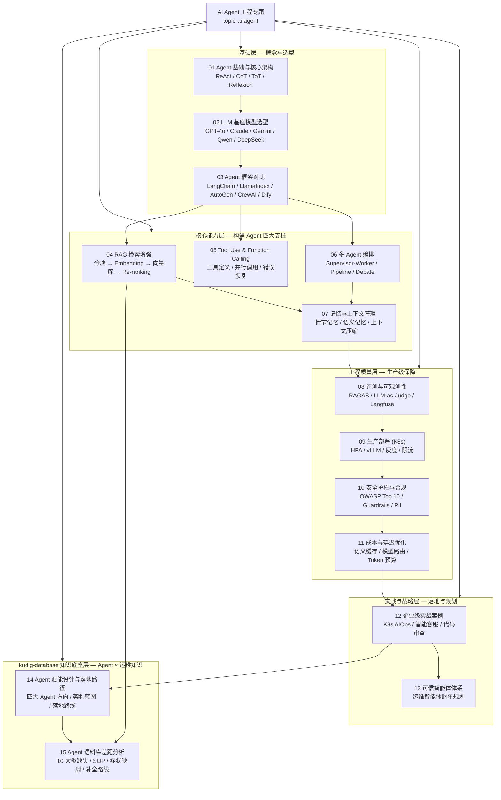

# AI Agent 工程专题

> **文档类型**: 专题索引 | **最后更新**: 2026-03 | **关键词**: AI Agent, LLM, RAG, 多 Agent 编排, 生产部署, 企业级应用, Function Calling, Agent 安全

---

## 概述

本专题系统性地覆盖 **AI Agent 工程**的全生命周期：从基础概念与架构设计，到 LLM 选型、RAG 构建、工具调用规范、多 Agent 编排，再到生产部署、安全治理、成本优化与企业实战案例。

所有内容以**生产环境真实需求**为导向，提供可直接落地的架构方案、配置示例和最佳实践，避免停留在理论层面。本专题与 `domain-11-ai-infra` 等相关知识域深度联动，形成从 AI 基础设施到 Agent 应用层的完整知识闭环。

> 注：原 `topic-agent` 专题（Agent 赋能设计与语料库差距分析）已整合至本专题，参见 14、15 篇。

---

## 文档目录

| 序号 | 文档 | 内容概要 | 适用角色 | 阅读耗时 |
|:---:|------|---------|---------|---------|
| 01 | [AI Agent 基础与核心架构](./01-ai-agent-fundamentals.md) | Agent 定义、分类、ReAct/CoT/ToT 推理模式、Agent Loop 解析 | 所有工程师 | 30min |
| 02 | [LLM 基座模型选型与评估](./02-llm-foundation-models.md) | 主流模型全矩阵对比、场景选型决策、微调 vs RAG 判断树 | 架构师、AI 工程师 | 25min |
| 03 | [主流 Agent 框架对比](./03-agent-frameworks-comparison.md) | LangChain/LlamaIndex/AutoGen/CrewAI/Dify 深度对比 | 研发工程师 | 30min |
| 04 | [RAG 检索增强生成深度指南](./04-rag-knowledge-retrieval.md) | 分块策略、Embedding 选型、向量库对比、混合检索、Re-ranking | AI 工程师 | 40min |
| 05 | [Tool Use & Function Calling 设计规范](./05-tool-use-function-calling.md) | 工具定义规范、并行调用、错误恢复、工具链设计 | 研发工程师 | 25min |
| 06 | [多 Agent 编排与协作架构](./06-multi-agent-orchestration.md) | Supervisor/Worker 模式、事件驱动编排、冲突解决策略 | 架构师 | 35min |
| 07 | [记忆管理与上下文窗口工程](./07-memory-context-management.md) | 短期/长期记忆、情节记忆 vs 语义记忆、上下文压缩技术 | AI 工程师 | 25min |
| 08 | [Agent 评测体系与可观测性](./08-agent-evaluation-observability.md) | LLM-as-Judge、轨迹评估、RAGAS 指标、LangSmith/Langfuse | AI 工程师、SRE | 30min |
| 09 | [生产部署指南：K8s 上的 Agent 服务](./09-production-deployment-guide.md) | K8s Deployment、HPA、GPU 调度、限流、灰度发布 | SRE、平台工程师 | 35min |
| 10 | [安全护栏、提示注入防护与合规](./10-security-guardrails.md) | OWASP LLM Top 10、Guardrails 框架、PII 处理、合规审计 | 安全工程师、架构师 | 30min |
| 11 | [成本与延迟优化策略](./11-cost-latency-optimization.md) | Token 预算、语义缓存、模型路由、批处理策略 | SRE、AI 工程师 | 25min |
| 12 | [企业级实战案例](./12-enterprise-case-studies.md) | K8s 运维 Agent、智能客服、代码审查 Agent 真实案例与指标 | 技术决策者、架构师 | 40min |
| 13 | [可信智能体体系 — 运维智能体财年规划](./13-trusted-agent-system-fiscal-plan.md) | 五大产品线智能体基线建设、评测体系、能力提升路线 | 运维专家组、技术决策者 | 60min |
| 14 | [Agent 赋能设计与落地路径](./14-agent-kudig-design-strategy.md) | kudig-database 知识底座、四大 Agent 方向、架构蓝图、落地路线 | 架构师、技术决策者 | 20min |
| 15 | [Agent 语料库差距分析](./15-agent-corpus-gap-analysis.md) | 10 大类缺失分析、症状→原因映射、SOP 规范、补全路线图 | 架构师、内容工程师 | 25min |

---

## 内容结构全景

---

## 快速入口

**初学者 / 技术决策者**：
1. [01 - Agent 基础](./01-ai-agent-fundamentals.md) → [02 - LLM 选型](./02-llm-foundation-models.md) → [12 - 企业案例](./12-enterprise-case-studies.md) → [14 - 赋能设计](./14-agent-kudig-design-strategy.md)

**AI 应用工程师**：
1. [03 - 框架对比](./03-agent-frameworks-comparison.md) → [04 - RAG 指南](./04-rag-knowledge-retrieval.md) → [05 - 工具调用](./05-tool-use-function-calling.md) → [07 - 记忆管理](./07-memory-context-management.md)

**架构师 / 平台工程师**：
1. [06 - 多 Agent 编排](./06-multi-agent-orchestration.md) → [09 - 生产部署](./09-production-deployment-guide.md) → [08 - 评测观测](./08-agent-evaluation-observability.md)

**安全 / 合规工程师**：
1. [10 - 安全护栏](./10-security-guardrails.md) → [11 - 成本优化](./11-cost-latency-optimization.md)

**内容工程师 / 知识运营**：
1. [15 - 语料库差距分析](./15-agent-corpus-gap-analysis.md) → [14 - 赋能设计](./14-agent-kudig-design-strategy.md) → [04 - RAG 指南](./04-rag-knowledge-retrieval.md)

---

## 关联专题

| 专题/领域 | 与本专题的关系 |
|---------|--------------|
| [domain-11-ai-infra](../domain-11-ai-infra/) | GPU 调度、LLM 推理服务、MLOps 基础设施 |
| [domain-12-troubleshooting](../domain-12-troubleshooting/) | K8s 运维 Agent 的核心知识语料 |
| [domain-7-security](../domain-7-security/) | 安全最佳实践在 Agent 安全中的应用 |
| [domain-9-platform-ops](../domain-9-platform-ops/) | 平台工程视角的 Agent 服务运维 |
| [domain-32-yaml-manifests](../domain-32-yaml-manifests/) | Agent 生产部署 YAML 模板参考 |
| [topic-fta](../topic-fta/) | 故障树分析作为 Agent 推理骨架 |

---

## 覆盖的关键技术

| 技术领域 | 覆盖内容 |
|---------|---------|
| **推理框架** | ReAct, CoT, ToT, Plan-and-Execute, Reflexion |
| **LLM 模型** | GPT-4o, Claude 3.5 Sonnet, Gemini 1.5 Pro, Llama-3, Qwen-2.5, DeepSeek-R1 |
| **Agent 框架** | LangChain, LlamaIndex, AutoGen, CrewAI, Dify, Semantic Kernel |
| **向量数据库** | Chroma, Weaviate, Qdrant, Milvus, pgvector |
| **Embedding 模型** | text-embedding-3-large, BGE-M3, Jina Embeddings v3 |
| **可观测性** | LangSmith, Langfuse, Phoenix (Arize), OpenTelemetry |
| **安全框架** | Guardrails AI, NeMo Guardrails, Llama Guard |
| **部署平台** | Kubernetes, vLLM, TGI, Ray Serve, Triton |

---

*本专题为 kudig-database 项目原创内容，所有方案经生产环境验证。原 `topic-agent` 专题已整合至此。*
