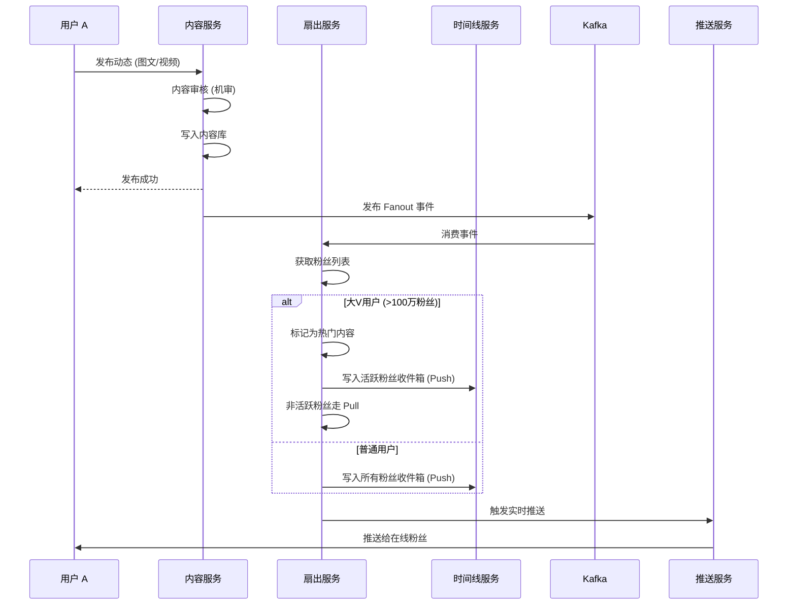
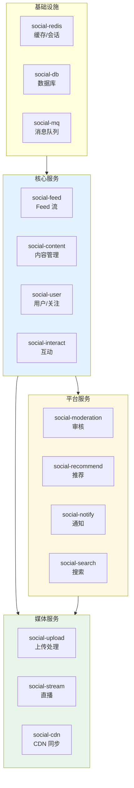

# 社交媒体平台 Kubernetes 生产架构设计

> **适用场景**: 社区论坛 / 短视频 / 直播社交 / 兴趣社交 / 职场社交 / 匿名社交  
> **适用版本**: Kubernetes v1.29 - v1.33  
> **最后更新**: 2026-04-24  
> **目标读者**: 社交产品架构师、技术负责人、SRE

---

## 📋 目录

- [一、整体架构全景](#一整体架构全景)
- [二、内容发布与 Feed 流架构](#二内容发布与-feed-流架构)
- [三、关注关系与社交图谱架构](#三关注关系与社交图谱架构)
- [四、消息与通知架构](#四消息与通知架构)
- [五、内容审核与安全架构](#五内容审核与安全架构)
- [六、推荐与个性化架构](#六推荐与个性化架构)
- [七、直播与实时互动架构](#七直播与实时互动架构)
- [八、K8s 部署架构](#八k8s-部署架构)

---

## 一、整体架构全景

```mermaid
flowchart TB
    subgraph Users["用户层"]
        CREATOR["内容创作者<br/>UGC/PGC"]
        CONSUMER["内容消费者<br/>浏览/互动"]
        INFLUENCER["KOL / 达人<br/>粉丝运营"]
    end

    subgraph Gateway["网关层"]
        DNS["智能 DNS"]
        CDN["CDN 加速<br/>静态+动态"]
        API_GW["API Gateway<br/>限流/鉴权/路由"]
    end

    subgraph CoreServices["核心服务层"]
        FEED["Feed 服务<br/>推拉结合"]
        CONTENT["内容服务<br">发布/编辑/管理"]
        USER_SVC["用户服务<br">资料/关注/粉丝"]
        INTERACT["互动服务<br">点赞/评论/转发"]
        SEARCH["搜索服务<br">内容/用户/话题"]
        RECOMMEND["推荐服务<br">个性化 Feed"]
    end

    subgraph PlatformServices["平台服务层"]
        NOTIFICATION["通知中心<br">Push/站内信"]
        MODERATION["内容审核<br">机审+人审"]
        ANALYTICS["数据分析<br">创作者中心"]
        MONETIZE["变现服务<br">广告/电商/打赏"]
    end

    subgraph DataLayer["数据层"]
        FEED_CACHE["Feed 缓存<br/>Redis/TiKV"]
        GRAPH_DB["图数据库<br">Neo4j/JanusGraph"]
        MEDIA_STORE["媒体存储<br">对象存储+CDN"]
        TS_DB["时序数据<br">活跃/趋势"]
    end

    Users --> Gateway --> CoreServices --> PlatformServices --> DataLayer
    CoreServices --> DataLayer

    style CoreServices fill:#e3f2fd
    style PlatformServices fill:#fff8e1
    style DataLayer fill:#e8f5e9
```

---

## 二、内容发布与 Feed 流架构

### Feed 流推拉模型

```mermaid
flowchart TB
    subgraph PushModel["推模型 (Push)"]
        P_PUBLISH["用户 A 发布"]
        P_FANS["粉丝列表<br/>10万粉丝"]
        P_WRITE["写入粉丝收件箱<br/>10万次写"]
        P_READ["粉丝读取<br/>1次读"]

        P_PUBLISH --> P_FANS --> P_WRITE --> P_READ
    end

    subgraph PullModel["拉模型 (Pull)"]
        L_PUBLISH["用户 A 发布<br/>写入自己的发件箱"]
        L_FANS["粉丝读取"]
        L_QUERY["查询关注列表<br/>1000个关注"]
        L_MERGE["合并时间线<br/>聚合排序"]

        L_PUBLISH --> L_FANS --> L_QUERY --> L_MERGE
    end

    subgraph Hybrid["混合模型 (Hybrid)"]
        H_PUBLISH["用户 A 发布"]
        H_FANS_ACTIVE["活跃粉丝<br/>Push 到收件箱"]
        H_FANS_INACTIVE["非活跃粉丝<br">Pull 时聚合"]
        H_READ["粉丝读取"]

        H_PUBLISH --> H_FANS_ACTIVE --> H_READ
        H_PUBLISH --> H_FANS_INACTIVE
        H_FANS_INACTIVE --> H_READ
    end

    style PushModel fill:#e3f2fd
    style PullModel fill:#fff8e1
    style Hybrid fill:#c8e6c9
```

### Feed 流写入流程



### Feed 服务 K8s 配置

```yaml
apiVersion: apps/v1
kind: Deployment
metadata:
  name: feed-service
  namespace: social-media
spec:
  replicas: 10
  selector:
    matchLabels:
      app: feed-service
  template:
    metadata:
      labels:
        app: feed-service
    spec:
      affinity:
        podAntiAffinity:
          preferredDuringSchedulingIgnoredDuringExecution:
            - weight: 100
              podAffinityTerm:
                labelSelector:
                  matchLabels:
                    app: feed-service
                topologyKey: kubernetes.io/hostname
      containers:
        - name: feed
          image: social/feed-service:v2.0
          ports:
            - containerPort: 8080
              name: http
          env:
            - name: REDIS_CLUSTER
              value: "redis-cluster:6379"
            - name: CASSANDRA_HOSTS
              value: "cassandra-0:9042,cassandra-1:9042"
            - name: FANOUT_BATCH_SIZE
              value: "1000"
            - name: FANOUT_ASYNC_THRESHOLD
              value: "10000"
          resources:
            requests:
              cpu: "2"
              memory: "4Gi"
            limits:
              cpu: "8"
              memory: "16Gi"
---
# 扇出 Worker (处理大V发布)
apiVersion: apps/v1
kind: Deployment
metadata:
  name: fanout-worker
  namespace: social-media
spec:
  replicas: 20
  selector:
    matchLabels:
      app: fanout-worker
  template:
    metadata:
      labels:
        app: fanout-worker
    spec:
      containers:
        - name: worker
          image: social/fanout-worker:v2.0
          env:
            - name: KAFKA_BROKERS
              value: "kafka:9092"
            - name: CONSUMER_GROUP
              value: "fanout-workers"
            - name: WORKER_THREADS
              value: "50"
          resources:
            requests:
              cpu: "1"
              memory: "2Gi"
            limits:
              cpu: "4"
              memory: "8Gi"
```

---

## 三、关注关系与社交图谱架构

```mermaid
flowchart TB
    subgraph GraphModel["社交图谱模型"]
        USER_A["用户 A<br/>关注: B, C, D"]
        USER_B["用户 B<br/>粉丝: A, E, F"]
        USER_C["用户 C<br/>互关: A, G"]
        USER_D["用户 D<br/>拉黑: E"]
    end

    subgraph Operations["图操作"]
        FOLLOW["关注<br/>建立有向边"]
        UNFOLLOW["取关<br">删除边"]
        BLOCK["拉黑<br">双向阻断"]
        MUTUAL["互相关注<br">双向边"]
        COMMON["共同关注<br">交集查询"]
    end

    subgraph Storage["图存储"]
        ADJ_LIST["邻接表<br">Redis Set"]
        GRAPH_DB["图数据库<br">Neo4j/JanusGraph"]
        SHARD["分片存储<br">用户 ID 哈希"]
    end

    GraphModel --> Operations --> Storage

    style GraphModel fill:#e3f2fd
    style Operations fill:#fff8e1
    style Storage fill:#e8f5e9
```

---

## 四、消息与通知架构

```mermaid
flowchart TB
    subgraph NotificationTypes["通知类型"]
        PUSH["Push 通知<br/>离线触达"]
        IN_APP["站内信<br/>应用内消息"]
        SMS["短信<br">验证码/重要通知"]
        EMAIL["邮件<br">营销/总结"]
    end

    subgraph Priority["优先级队列"]
        P0["P0 实时<br/>私信/关注"]
        P1["P1 近实时<br/>点赞/评论"]
        P2["P2 延迟<br">系统通知"]
        P3["P3 批量<br">日/周报"]
    end

    subgraph Channels["推送渠道"]
        APNs["APNs (iOS)"]
        FCM["FCM (Android)"]
        HUAWEI["华为 Push"]
        XIAOMI["小米 Push"]
        OPPO["OPPO Push"]
        VIVO["vivo Push"]
    end

    NotificationTypes --> Priority --> Channels

    style Priority fill:#e3f2fd
    style Channels fill:#e8f5e9
```

---

## 五、内容审核与安全架构

```mermaid
flowchart TB
    subgraph ContentIn["内容输入"]
        TEXT["文本<br/>帖子/评论/昵称"]
        IMAGE["图片<br/>头像/动态图"]
        VIDEO["视频<br">UGC/直播"]
        AUDIO["音频<br">语音/音乐"]
    end

    subgraph Detection["检测引擎"]
        NLP_ENGINE["NLP 引擎<br/>敏感词/语义"]
        CV_ENGINE["CV 引擎<br/>色情/暴力/政治"]
        AUDIO_ENGINE["音频识别<br/>违规语音"]
        VIDEO_ENGINE["视频审核<br/>帧抽测+OCR"]
    end

    subgraph Decision["决策处置"]
        PASS["通过<br">正常发布"]
        BLOCK["拦截<br">拒绝发布"]
        REVIEW["人工复核<br">可疑内容"]
        SHADOW["shadowban<br">限流降权"]
    end

    ContentIn --> Detection --> Decision

    style Detection fill:#e3f2fd
    style Decision fill:#fff8e1
```

---

## 六、推荐与个性化架构

```mermaid
flowchart TB
    subgraph DataPipeline["数据流水线"]
        IMPRESSION["曝光数据<br/>用户看了什么"]
        CLICK["点击数据<br/>用户点了什么"]
        ENGAGE["互动数据<br">点赞/评论/分享"]
        DWELL["停留时长<br">阅读深度"]
    end

    subgraph FeatureEngine["特征工程"]
        USER_FEAT["用户特征<br">画像/兴趣/行为"]
        ITEM_FEAT["内容特征<br">标签/质量/时效"]
        CONTEXT_FEAT["上下文特征<br">时间/位置/设备"]
    end

    subgraph ModelLayer["模型层"]
        RECALL["召回层<br">协同/向量/热门"]
        RANKING["排序层<br">GBDT/DeepFM"]
        RE_RANK["重排序<br">多样性/新鲜度"]
    end

    subgraph Business["业务策略"]
        BOOST["加权提升<br">新人/优质创作者"]
        FILTER["过滤策略<br">已读/不感兴趣"]
        DIVERSITY["多样性控制<br">避免信息茧房"]
    end

    DataPipeline --> FeatureEngine --> ModelLayer --> Business

    style FeatureEngine fill:#e3f2fd
    style ModelLayer fill:#fff8e1
    style Business fill:#e8f5e9
```

---

## 七、直播与实时互动架构

```mermaid
flowchart TB
    subgraph Streamer["主播端"]
        CAPTURE["音视频采集"]
        EFFECT["美颜/滤镜/贴纸"]
        MIX["混音/混画"]
        PUSH["推流<br/>RTMP/WebRTC"]
    end

    subgraph MediaCloud["媒体云服务"]
        INGEST["流接入<br/>全球节点"]
        TRANSCODE["实时转码<br">多清晰度"]
        RECORD["录制存储<br">回放/审核"]
        CDN["CDN 分发<br">低延迟直播"]
    end

    subgraph Viewer["观众端"]
        PULL["拉流播放<br">HLS/FLV/WebRTC"]
        INTERACT["互动<br">弹幕/点赞/礼物"]
        CO_HOST["连麦<br">上麦/下麦"]
    end

    Streamer --> MediaCloud --> Viewer
    Viewer --> INTERACT --> MediaCloud

    style MediaCloud fill:#e3f2fd
    style Viewer fill:#e8f5e9
```

---

## 八、K8s 部署架构

### 社交媒体 Namespace 组织



### 内容审核 Worker 部署

```yaml
apiVersion: apps/v1
kind: Deployment
metadata:
  name: content-moderation-worker
  namespace: social-moderation
spec:
  replicas: 30
  selector:
    matchLabels:
      app: moderation-worker
  template:
    metadata:
      labels:
        app: moderation-worker
    spec:
      nodeSelector:
        node-type: gpu-inference
      tolerations:
        - key: nvidia.com/gpu
          operator: Exists
          effect: NoSchedule
      containers:
        - name: moderation
          image: social/moderation-ai:v2.0
          env:
            - name: MODEL_PATH
              value: "/models/content-safety"
            - name: CONFIDENCE_THRESHOLD
              value: "0.85"
            - name: KAFKA_CONSUMER_GROUP
              value: "moderation-workers"
          resources:
            requests:
              cpu: "2"
              memory: "8Gi"
              nvidia.com/gpu: "1"
            limits:
              cpu: "8"
              memory: "32Gi"
              nvidia.com/gpu: "1"
          volumeMounts:
            - name: model-storage
              mountPath: /models
      volumes:
        - name: model-storage
          persistentVolumeClaim:
            claimName: moderation-model-pvc
```

---

## 参考链接

- [Twitter 架构演进](https://blog.twitter.com/engineering/en_us/topics/infrastructure)
- [Instagram 工程博客](https://engineering.fb.com/category/instagram/)
- [Redis 社交应用实践](https://redis.io/solutions/social/)
