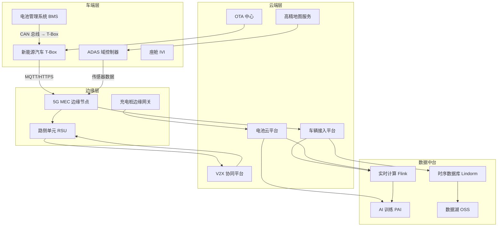
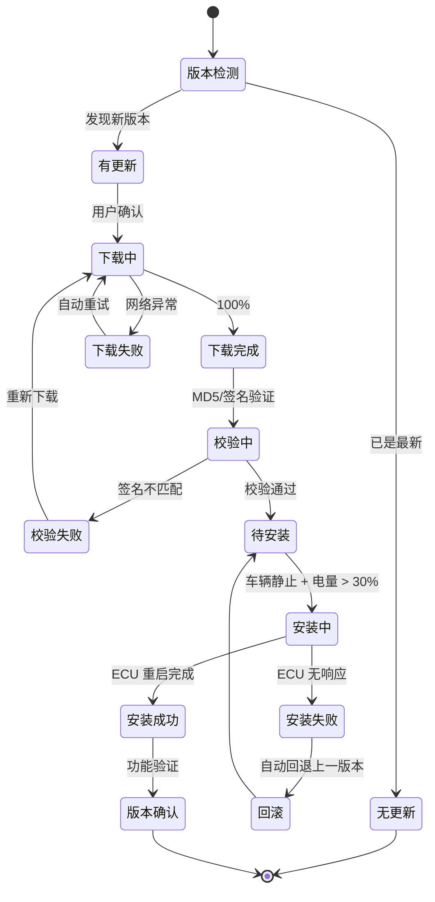
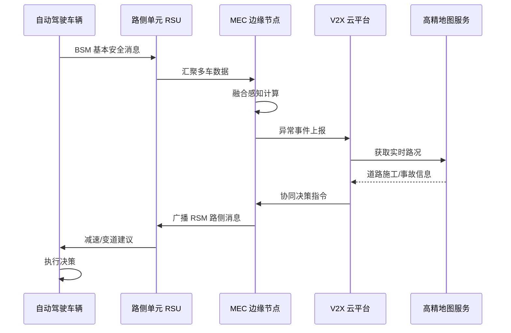
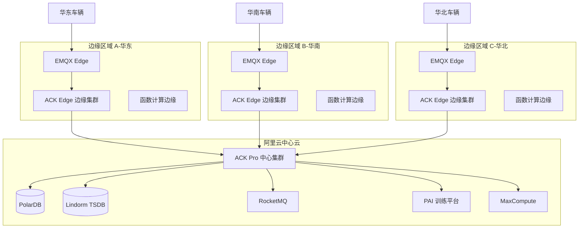
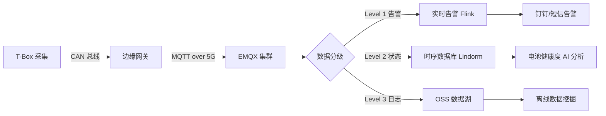
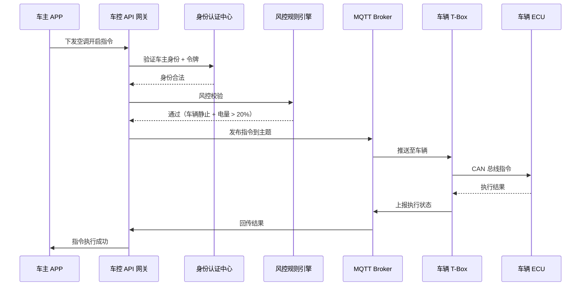
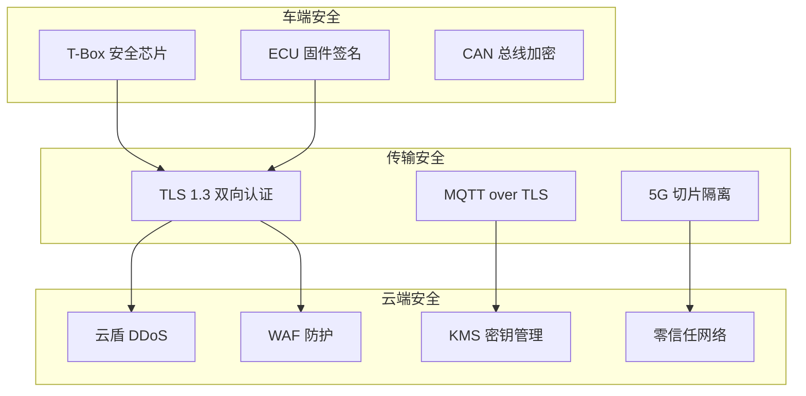

# 新能源车联网架构设计 — 阿里云视角

> **适用版本**: Kubernetes v1.29 - v1.33 | **最后更新**: 2026-04-24
> **作者**: 阿里云解决方案架构师 | **标签**: `#车联网` `#新能源` `#边缘计算` `#V2X` `#阿里云`

---

## 目录

1. [行业背景](#1-行业背景)
2. [业务架构](#2-业务架构)
3. [技术架构](#3-技术架构)
4. [核心数据流](#4-核心数据流)
5. [安全与合规](#5-安全与合规)
6. [可观测性](#6-可观测性)
7. [阿里云组件映射](#7-阿里云组件映射)
8. [生产检查清单](#8-生产检查清单)

---

## 1. 行业背景

### 1.1 业务特点

新能源汽车车联网是"车-路-云-网-图"一体化的复杂系统：

| 挑战 | 说明 | 架构影响 |
|:---|:---|:---|
| 海量车端接入 | 百万级车辆 T-Box 实时在线 | 高并发 MQTT 连接 + 边缘分流 |
| 低延迟指令 | 远程控制/OTA 指令 < 200ms | 边缘计算节点就近部署 |
| 数据洪流 | 单车 1-10GB/天传感器数据 | 分级存储 + 冷热分离 |
| 功能安全 | ASIL-D 等级要求 | 冗余架构 + 故障隔离 |
| 地理分布 | 车辆全国流动 | 云边协同 + 就近接入 |

### 1.2 核心场景

- **T-Box 接入**: 车辆实时状态上报与远程控制
- **电池管理 BMS**: 实时监控、故障预警、寿命预测
- **智能驾驶 ADAS**: 感知数据融合、决策下发
- **OTA 升级**: 整车固件差分升级
- **V2X 车路协同**: 路侧单元 RSU 协同

---

## 2. 业务架构

### 2.1 车路云一体化架构



### 2.2 OTA 升级状态机



### 2.3 V2X 车路协同时序



---

## 3. 技术架构

### 3.1 边缘-云协同 K8s 架构



### 3.2 K8s YAML 配置

```yaml
# 车辆接入服务 Deployment
apiVersion: apps/v1
kind: Deployment
metadata:
  name: vehicle-gateway
  namespace: connected-vehicle
spec:
  replicas: 5
  selector:
    matchLabels:
      app: vehicle-gateway
  template:
    metadata:
      labels:
        app: vehicle-gateway
    spec:
      affinity:
        podAntiAffinity:
          requiredDuringSchedulingIgnoredDuringExecution:
            - labelSelector:
                matchExpressions:
                  - key: app
                    operator: In
                    values: [vehicle-gateway]
              topologyKey: topology.kubernetes.io/zone
      containers:
        - name: gateway
          image: registry.cn-hangzhou.aliyuncs.com/nev/vehicle-gateway:v3.2.1
          ports:
            - containerPort: 8883
              name: mqtt-tls
            - containerPort: 8080
              name: http-api
          env:
            - name: MQTT_MAX_CONNECTIONS
              value: "100000"
            - name: EMQX_CLUSTER_DISCOVERY
              value: "k8s"
            - name: REDIS_CLUSTER_ADDR
              value: "redis-cluster:6379"
          resources:
            requests:
              memory: "2Gi"
              cpu: "1000m"
            limits:
              memory: "4Gi"
              cpu: "2000m"
          livenessProbe:
            tcpSocket:
              port: 8883
            initialDelaySeconds: 30
            periodSeconds: 10
```

```yaml
# 边缘节点设备管理 DaemonSet
apiVersion: apps/v1
kind: DaemonSet
metadata:
  name: edge-device-agent
  namespace: connected-vehicle
spec:
  selector:
    matchLabels:
      app: edge-device-agent
  template:
    metadata:
      labels:
        app: edge-device-agent
    spec:
      hostNetwork: true
      nodeSelector:
        node-type: edge-gateway
      tolerations:
        - key: "dedicated"
          operator: "Equal"
          value: "edge"
          effect: "NoSchedule"
      containers:
        - name: device-agent
          image: registry.cn-hangzhou.aliyuncs.com/nev/edge-agent:v2.0.0
          securityContext:
            privileged: true
          volumeMounts:
            - name: can-bus
              mountPath: /dev/can0
            - name: device-config
              mountPath: /etc/edge-agent
          resources:
            requests:
              memory: "256Mi"
              cpu: "250m"
      volumes:
        - name: can-bus
          hostPath:
            path: /dev/can0
        - name: device-config
          configMap:
            name: edge-device-config
```

```yaml
# 电池数据分析 CronJob
apiVersion: batch/v1
kind: CronJob
metadata:
  name: battery-health-analysis
  namespace: connected-vehicle
spec:
  schedule: "0 2 * * *"
  concurrencyPolicy: Forbid
  jobTemplate:
    spec:
      template:
        spec:
          containers:
            - name: analyzer
              image: registry.cn-hangzhou.aliyuncs.com/nev/battery-analyzer:v1.5.0
              env:
                - name: LINDORM_ENDPOINT
                  value: "ld-bp1xxxxxxxxx Lindorm.hbase.rds.aliyuncs.com"
                - name: ANALYSIS_WINDOW_DAYS
                  value: "30"
                - name: ML_MODEL_PATH
                  value: "/models/battery-soh-v2.pkl"
              resources:
                requests:
                  memory: "4Gi"
                  cpu: "2000m"
              volumeMounts:
                - name: model-volume
                  mountPath: /models
          volumes:
            - name: model-volume
              persistentVolumeClaim:
                claimName: battery-model-pvc
          restartPolicy: OnFailure
```

---

## 4. 核心数据流

### 4.1 车辆实时数据上报流



### 4.2 远程控制指令下发



---

## 5. 安全与合规

### 5.1 车联网安全体系



### 5.2 网络安全策略

```yaml
apiVersion: networking.k8s.io/v1
kind: NetworkPolicy
metadata:
  name: vehicle-data-isolation
  namespace: connected-vehicle
spec:
  podSelector:
    matchLabels:
      tier: vehicle-data
  policyTypes:
    - Ingress
    - Egress
  ingress:
    - from:
        - namespaceSelector:
            matchLabels:
              name: connected-vehicle
        - podSelector:
            matchLabels:
              app: vehicle-gateway
      ports:
        - protocol: TCP
          port: 8080
  egress:
    - to:
        - podSelector:
            matchLabels:
              app: lindorm-proxy
      ports:
        - protocol: TCP
          port: 30020
    - to:
        - podSelector:
            matchLabels:
              app: rocketmq-broker
      ports:
        - protocol: TCP
          port: 10911
```

---

## 6. 可观测性

### 6.1 监控架构

- **车辆在线率**: ARMS 自定义指标，实时展示各区域车辆在线比例
- **MQTT 连接质量**: EMQX 内置指标 + Prometheus Exporter
- **电池告警**: Lindorm 时序数据异常检测 + 钉钉告警
- **OTA 成功率**: 按车型/版本维度的升级成功率仪表盘

---

## 7. 阿里云组件映射

| 功能域 | 自建/开源方案 | **阿里云云原生方案** | 选型理由 |
|:---|:---|:---|:---|
| 容器平台 | 自建 K8s | **ACK Pro + ACK Edge** | 云边一体管理 |
| 车辆接入 | EMQX 自建 | **IoT 平台 + EMQX 企业版** | 百万级并发连接 |
| 时序数据库 | InfluxDB/TDengine | **Lindorm 时序引擎** | PB 级时序数据、冷热分层 |
| 实时计算 | Flink 自建 | **Flink Serverless** | 弹性扩缩、按量付费 |
| AI 训练 | Kubeflow | **PAI 平台** | 分布式训练、模型管理 |
| 对象存储 | Ceph | **OSS 低频/归档** | 车载视频长期存储 |
| 消息队列 | Kafka | **RocketMQ 5.0** | 金融级可靠、顺序消息 |
| 关系数据库 | MySQL | **PolarDB** | 高并发写入、读写分离 |
| 边缘计算 | 自建边缘节点 | **ENS 边缘节点服务** | 5G MEC 集成、就近计算 |
| 可观测性 | Prometheus + ELK | **ARMS + SLS** | 链路追踪、日志分析 |
| 安全 | Vault + Falco | **云盾 + KMS + WAF** | 等保合规、国密支持 |
| 网络 | IPSec | **CEN 云企业网 + 5G 切片** | 低延迟、高可靠 |

---

## 8. 生产检查清单

- [ ] T-Box 与云端双向 TLS 证书配置正确
- [ ] 边缘节点 5G 网络 QoS 策略配置
- [ ] 车辆数据分级策略（L1/L2/L3）验证
- [ ] OTA 升级回滚机制端到端测试
- [ ] 电池告警阈值调优（SOH/SOC/温度）
- [ ] 百万级 MQTT 连接压测通过
- [ ] 等保三级/ISO 26262 合规审计
- [ ] 灾备演练：单区域故障车辆切换验证

---

**维护者**: 阿里云解决方案架构师团队 | **许可证**: MIT
