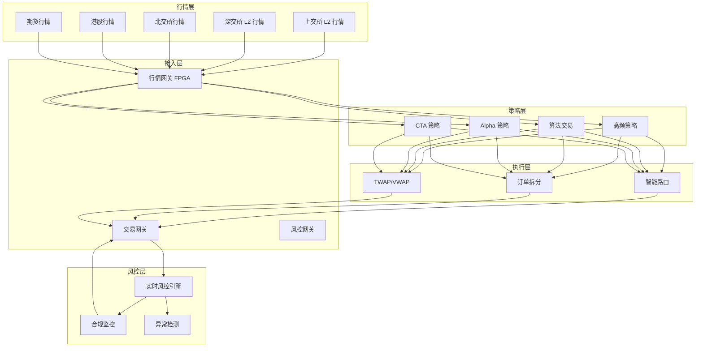
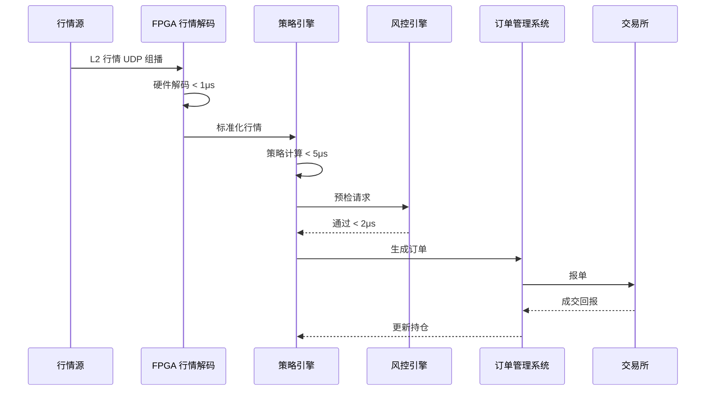
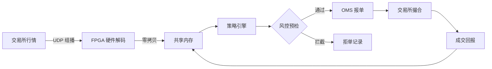

# 证券量化交易架构设计 — 阿里云视角

> **适用版本**: Kubernetes v1.29 - v1.33 | **最后更新**: 2026-04-24
> **作者**: 阿里云解决方案架构师 | **标签**: `#量化交易` `#低延迟` `#FPGA` `#高频交易` `#阿里云`

---

## 目录

1. [行业背景](#1-行业背景)
2. [业务架构](#2-业务架构)
3. [技术架构](#3-技术架构)
4. [核心数据流](#4-核心数据流)
5. [安全与合规](#5-安全与合规)
6. [可观测性](#6-可观测性)
7. [阿里云组件映射](#7-阿里云组件映射)
8. [生产检查清单](#8-生产检查清单)

---

## 1. 行业背景

### 1.1 业务特点

量化交易对系统延迟、吞吐量、稳定性有极致要求：

| 挑战 | 说明 | 架构影响 |
|:---|:---|:---|
| 超低延迟 | 端到端 < 10μs（高频） | FPGA/DPDK/内核旁路 |
| 行情 burst | 开盘/收盘 10x 流量突增 | 弹性伸缩 + 预热 |
| 策略保密 | 量化模型是核心资产 | 代码加密 + 沙箱执行 |
| 回测验证 | 历史数据海量回测 | 并行计算 + GPU 加速 |
| 合规风控 | 异常交易实时监控 | 流式计算 + 规则引擎 |

### 1.2 核心场景

- **行情接收**: L1/L2 行情极速接入
- **策略执行**: 算法交易/高频交易
- **实时风控**: 交易行为监控与拦截
- **回测平台**: 历史数据策略验证
- **清算结算**: T+1 自动化处理

---

## 2. 业务架构

### 2.1 量化交易系统全景



### 2.2 高频交易时序



---

## 3. 技术架构

### 3.1 低延迟 K8s 部署

```yaml
# 行情处理 DaemonSet（FPGA 节点）
apiVersion: apps/v1
kind: DaemonSet
metadata:
  name: market-data-processor
  namespace: quant
spec:
  selector:
    matchLabels:
      app: market-data-processor
  template:
    metadata:
      labels:
        app: market-data-processor
    spec:
      hostNetwork: true
      nodeSelector:
        hardware: fpga-alibaba-f3
      tolerations:
        - key: "dedicated"
          operator: "Equal"
          value: "fpga"
          effect: "NoSchedule"
      containers:
        - name: md-processor
          image: registry.cn-hangzhou.aliyuncs.com/quant/md-processor:v5.0.0
          securityContext:
            privileged: true
            capabilities:
              add: ["NET_ADMIN", "IPC_LOCK"]
          resources:
            requests:
              memory: "32Gi"
              cpu: "16000m"
              alibabacloud.com/fpga: 1
            limits:
              memory: "64Gi"
              cpu: "32000m"
              alibabacloud.com/fpga: 1
          volumeMounts:
            - name: hugepage
              mountPath: /dev/hugepages
            - name: fpga-bitstream
              mountPath: /fpga
      volumes:
        - name: hugepage
          emptyDir:
            medium: HugePages
        - name: fpga-bitstream
          configMap:
            name: fpga-bitstream-v3
```

```yaml
# 策略执行 StatefulSet（有状态，持仓内存）
apiVersion: apps/v1
kind: StatefulSet
metadata:
  name: strategy-engine
  namespace: quant
spec:
  serviceName: strategy-engine
  replicas: 2
  selector:
    matchLabels:
      app: strategy-engine
  template:
    metadata:
      labels:
        app: strategy-engine
    spec:
      nodeSelector:
        latency: ultra-low
      containers:
        - name: engine
          image: registry.cn-hangzhou.aliyuncs.com/quant/strategy-engine:v7.2.1
          ports:
            - containerPort: 8080
            - containerPort: 9090
              name: metrics
          env:
            - name: STRATEGY_MODE
              value: "production"
            - name: RISK_CHECK_URL
              value: "http://risk-engine:8080/pretrade"
            - name: SHARED_MEMORY_SIZE
              value: "8589934592"  # 8GB
          resources:
            requests:
              memory: "64Gi"
              cpu: "32000m"
            limits:
              memory: "128Gi"
              cpu: "64000m"
          volumeMounts:
            - name: shared-mem
              mountPath: /dev/shm/strategy
      volumes:
        - name: shared-mem
          emptyDir:
            medium: Memory
            sizeLimit: 8Gi
```

---

## 4. 核心数据流

### 4.1 行情处理流水线



---

## 5. 安全与合规

- **策略隔离**: 不同策略沙箱运行，防止信息泄露
- **交易监控**: 异常交易行为实时告警
- **代码安全**: 策略代码加密存储，运行时不落盘

---

## 6. 可观测性

- **延迟监控**: 行情到成交全链路延迟 P99 < 50μs
- **吞吐量**: 单节点 100万笔/秒
- **系统可用性**: 交易时段 99.999%

---

## 7. 阿里云组件映射

| 功能域 | **阿里云云原生方案** |
|:---|:---|
| 容器平台 | **ACK Pro + FPGA 节点池** |
| FPGA | **f3 实例 + 阿里云 FPGA 开发套件** |
| 低延迟网络 | **eRDMA + 神龙架构** |
| 行情接入 | **阿里云金融云行情接入** |
| 实时计算 | **Flink + Hologres** |
| 对象存储 | **OSS** |
| 可观测性 | **ARMS + SLS** |

---

## 8. 生产检查清单

- [ ] FPGA  bitstream 版本校验
- [ ] 行情端到端延迟 < 10μs
- [ ] 交易时段零中断演练
- [ ] 风控规则实时性验证
- [ ] 等保三级/证监会合规审计

---

**维护者**: 阿里云解决方案架构师团队 | **许可证**: MIT
