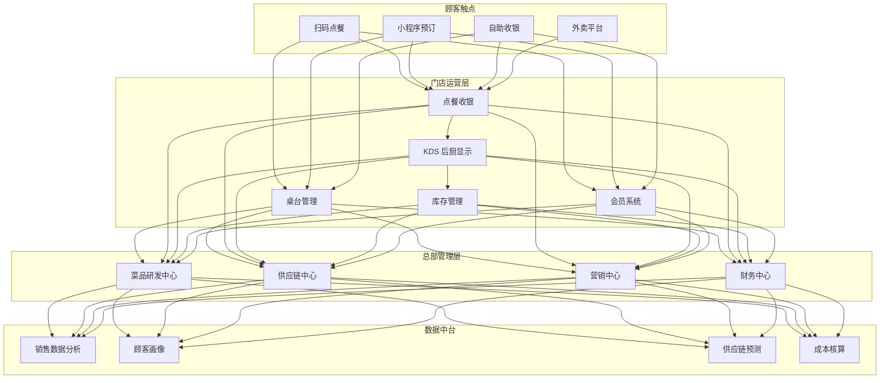
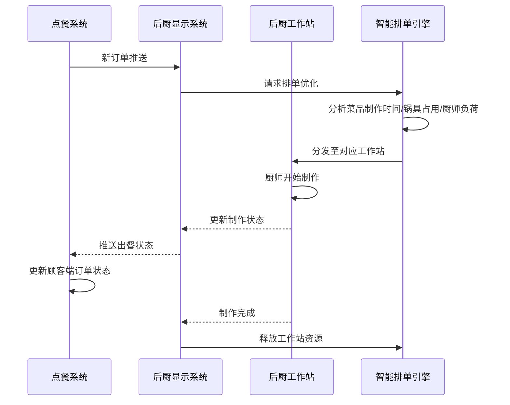
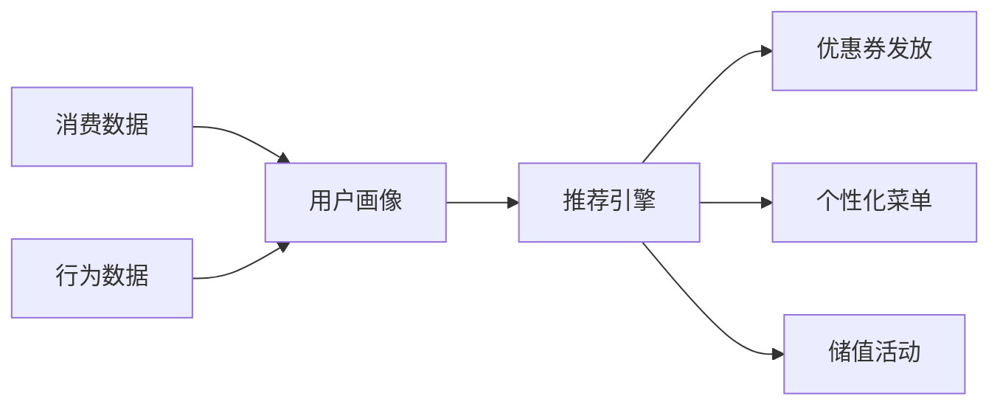

# 智慧餐饮架构设计 — 阿里云视角

> **适用版本**: Kubernetes v1.29 - v1.33 | **最后更新**: 2026-04-24
> **作者**: 阿里云解决方案架构师 | **标签**: `#智慧餐饮` `#点餐系统` `#后厨管理` `#阿里云`

---

## 目录

1. [行业背景](#1-行业背景)
2. [业务架构](#2-业务架构)
3. [技术架构](#3-技术架构)
4. [核心数据流](#4-核心数据流)
5. [安全与合规](#5-安全与合规)
6. [可观测性](#6-可观测性)
7. [阿里云组件映射](#7-阿里云组件映射)
8. [生产检查清单](#8-生产检查清单)

---

## 1. 行业背景

### 1.1 业务特点

智慧餐饮涵盖点餐、后厨、供应链、会员运营全链路：

| 挑战 | 说明 | 架构影响 |
|:---|:---|:---|
| 高峰并发 | 午晚高峰订单集中爆发 | 弹性伸缩 + 队列削峰 |
| 后厨协同 | 多菜品并行制作 | 智能排单 + KDS |
| 桌台管理 | 翻台率优化 | 实时状态同步 |
| 会员运营 | 精准营销与储值 | 大数据 + 推荐 |
| 供应链 | 食材采购与库存 | 预测 + 自动补货 |

### 1.2 核心场景

- **扫码点餐**: 顾客自助点餐与支付
- **后厨管理 KDS**:  Kitchen Display System 智能排单
- **桌台管理**: 预定/排队/叫号/翻台
- **会员营销**: 积分/储值/优惠券/精准推送
- **供应链管理**: 采购/库存/成本分析

---

## 2. 业务架构

### 2.1 智慧餐饮全景架构



### 2.2 后厨智能排单时序



---

## 3. 技术架构

### 3.1 K8s 部署

```yaml
# 点餐服务 Deployment
apiVersion: apps/v1
kind: Deployment
metadata:
  name: order-service
  namespace: smart-restaurant
spec:
  replicas: 5
  selector:
    matchLabels:
      app: order-service
  template:
    metadata:
      labels:
        app: order-service
    spec:
      containers:
        - name: order
          image: registry.cn-hangzhou.aliyuncs.com/restaurant/order:v2.1.0
          ports:
            - containerPort: 8080
          env:
            - name: REDIS_HOST
              value: "redis-cluster:6379"
            - name: KDS_WEBSOCKET_URL
              value: "ws://kds-service:8080/ws"
          resources:
            requests:
              memory: "1Gi"
              cpu: "500m"
            limits:
              memory: "2Gi"
              cpu: "1000m"
```

---

## 4. 核心数据流

### 4.1 会员精准营销



---

## 5. 安全与合规

- **食品安全**: 明厨亮灶视频留存
- **支付安全**: PCI-DSS 合规
- **数据安全**: 会员信息加密

---

## 6. 可观测性

- **点餐响应**: P99 < 200ms
- **后厨出餐**: P99 < 15min
- **系统可用性**: 99.9%

---

## 7. 阿里云组件映射

| 功能域 | **阿里云云原生方案** |
|:---|:---|
| 容器平台 | **ACK Pro** |
| 数据库 | **PolarDB MySQL** |
| 缓存 | **Redis 企业版** |
| 消息队列 | **RocketMQ** |
| 对象存储 | **OSS** |
| 视频 | **阿里云视频直播** |
| AI | **视觉智能** |
| 可观测性 | **ARMS + SLS** |

---

## 8. 生产检查清单

- [ ] 高峰期弹性伸缩验证
- [ ] 后厨 KDS 实时性 < 1s
- [ ] 会员支付安全性验证
- [ ] 供应链库存同步准确性
- [ ] 明厨亮灶视频存储合规

---

**维护者**: 阿里云解决方案架构师团队 | **许可证**: MIT
