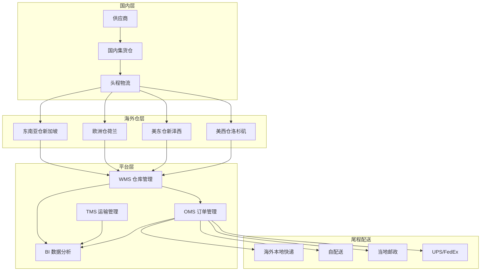
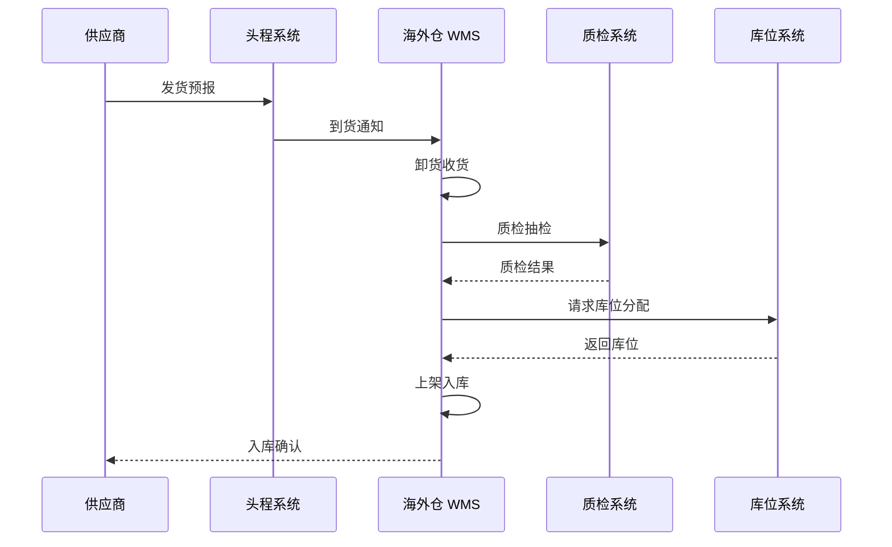
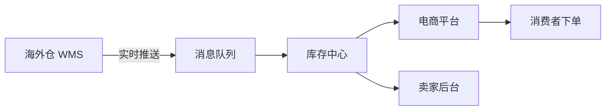

# 跨境电商海外仓架构设计 — 阿里云视角

> **适用版本**: Kubernetes v1.29 - v1.33 | **最后更新**: 2026-04-24
> **作者**: 阿里云解决方案架构师 | **标签**: `#海外仓` `#跨境物流` `#WMS` `#阿里云`

---

## 目录

1. [行业背景](#1-行业背景)
2. [业务架构](#2-业务架构)
3. [技术架构](#3-技术架构)
4. [核心数据流](#4-核心数据流)
5. [安全与合规](#5-安全与合规)
6. [可观测性](#6-可观测性)
7. [阿里云组件映射](#7-阿里云组件映射)
8. [生产检查清单](#8-生产检查清单)

---

## 1. 行业背景

### 1.1 业务特点

海外仓是跨境电商的关键基础设施，直接影响物流时效和成本：

| 挑战 | 说明 | 架构影响 |
|:---|:---|:---|
| 多仓协同 | 美东/美西/欧洲/东南亚多仓 | 分布式 WMS |
| 库存精准 | SKU 多、批次管理复杂 | 实时库存同步 |
| 订单履约 | B2C 一件代发 + B2B 转运 | 灵活履约模式 |
| 海关合规 | 各国进口税务要求 | 合规申报系统 |
| 退货处理 | 跨境退货成本高 | 本地退货仓 |

### 1.2 核心场景

- **入库管理**: 收货/质检/上架/库位分配
- **库存管理**: 实时盘点/批次/效期管理
- **订单履约**: 拣货/打包/贴标/出库
- **退货处理**: 质检/换标/重新上架
- **头程物流**: 国内集货至海外仓

---

## 2. 业务架构

### 2.1 海外仓全景架构



### 2.2 入库上架流程



---

## 3. 技术架构

### 3.1 K8s 部署

```yaml
# WMS 服务 Deployment
apiVersion: apps/v1
kind: Deployment
metadata:
  name: wms-core
  namespace: crossborder-warehouse
spec:
  replicas: 4
  selector:
    matchLabels:
      app: wms-core
  template:
    metadata:
      labels:
        app: wms-core
    spec:
      containers:
        - name: wms
          image: registry.cn-hangzhou.aliyuncs.com/cbwms/wms-core:v3.0.0
          ports:
            - containerPort: 8080
          env:
            - name: WAREHOUSE_CODE
              value: "US-WEST-LAX"
            - name: DB_HOST
              value: "polardb-crossborder.rds.aliyuncs.com"
          resources:
            requests:
              memory: "2Gi"
              cpu: "1000m"
            limits:
              memory: "4Gi"
              cpu: "2000m"
```

---

## 4. 核心数据流

### 4.1 库存实时同步



---

## 5. 安全与合规

- **海关合规**: 各国进口数据准确申报
- **税务合规**: VAT/销售税计算与缴纳
- **数据安全**: 跨境数据传输合规

---

## 6. 可观测性

- **库存准确率**: > 99.9%
- **订单履约时效**: P99 < 24h
- **系统可用性**: 99.9%

---

## 7. 阿里云组件映射

| 功能域 | **阿里云云原生方案** |
|:---|:---|
| 容器平台 | **ACK Pro** |
| 数据库 | **PolarDB MySQL** |
| 缓存 | **Redis 企业版** |
| 消息队列 | **RocketMQ** |
| 对象存储 | **OSS** |
| 实时计算 | **Flink** |
| 可观测性 | **ARMS + SLS** |

---

## 8. 生产检查清单

- [ ] 多仓库存数据一致性校验
- [ ] 海关申报数据准确性验证
- [ ] 头程物流追踪完整性
- [ ] 退货处理流程端到端测试
- [ ] 各国税务合规审计

---

**维护者**: 阿里云解决方案架构师团队 | **许可证**: MIT
