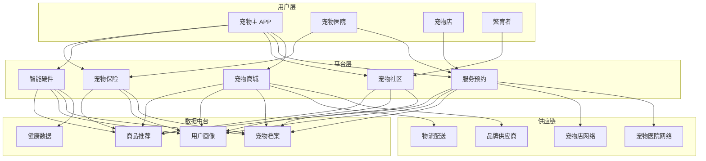
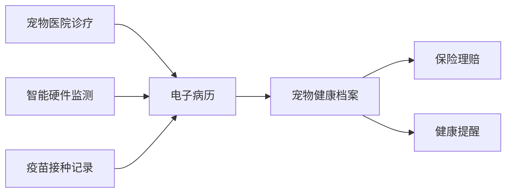

# 宠物经济架构设计 — 阿里云视角

> **适用版本**: Kubernetes v1.29 - v1.33 | **最后更新**: 2026-04-24
> **作者**: 阿里云解决方案架构师 | **标签**: `#宠物经济` `#宠物电商` `#宠物服务` `#阿里云`

---

## 目录

1. [行业背景](#1-行业背景)
2. [业务架构](#2-业务架构)
3. [技术架构](#3-技术架构)
4. [核心数据流](#4-核心数据流)
5. [安全与合规](#5-安全与合规)
6. [可观测性](#6-可观测性)
7. [阿里云组件映射](#7-阿里云组件映射)
8. [生产检查清单](#8-生产检查清单)

---

## 1. 行业背景

### 1.1 业务特点

宠物经济涵盖宠物电商、服务预约、社交社区、智能硬件：

| 挑战 | 说明 | 架构影响 |
|:---|:---|:---|
| 商品非标 | 宠物食品/用品规格多样 | 灵活商品体系 |
| 服务预约 | 洗护/医疗/寄养预约 | 日历调度引擎 |
| 内容社区 | UGC 宠物短视频/图文 | 内容审核 + 推荐 |
| 智能硬件 | 喂食器/饮水机/定位器 | IoT 平台接入 |
| 即时配送 | 宠物食品小时达 | 同城配送体系 |

### 1.2 核心场景

- **宠物电商**: 主粮/零食/用品/药品
- **服务预约**: 宠物医院/洗护/美容/寄养
- **宠物社区**: 晒宠/问答/知识/领养
- **智能硬件**: 智能设备连接与数据
- **宠物保险**: 宠物医疗险/意外险

---

## 2. 业务架构

### 2.1 宠物经济全景架构



---

## 3. 技术架构

### 3.1 K8s 部署

```yaml
# 宠物商城服务 Deployment
apiVersion: apps/v1
kind: Deployment
metadata:
  name: pet-shop
  namespace: pet-economy
spec:
  replicas: 5
  selector:
    matchLabels:
      app: pet-shop
  template:
    metadata:
      labels:
        app: pet-shop
    spec:
      containers:
        - name: shop
          image: registry.cn-hangzhou.aliyuncs.com/pet/shop:v1.5.0
          ports:
            - containerPort: 8080
          env:
            - name: RECOMMEND_API
              value: "http://recommend-service:8080"
          resources:
            requests:
              memory: "1Gi"
              cpu: "500m"
            limits:
              memory: "2Gi"
              cpu: "1000m"
```

---

## 4. 核心数据流

### 4.1 宠物健康档案



---

## 5. 安全与合规

- **兽药合规**: 处方药销售资质
- **活体运输**: 动物福利法规
- **数据安全**: 宠物主隐私保护

---

## 6. 可观测性

- **订单履约**: P99 < 24h
- **服务预约**: 爽约率 < 5%
- **系统可用性**: 99.9%

---

## 7. 阿里云组件映射

| 功能域 | **阿里云云原生方案** |
|:---|:---|
| 容器平台 | **ACK Pro** |
| 数据库 | **PolarDB MySQL** |
| 缓存 | **Redis 企业版** |
| IoT | **IoT 平台** |
| AI | **视觉智能** |
| 可观测性 | **ARMS + SLS** |
| 对象存储 | **OSS + CDN** |

---

## 8. 生产检查清单

- [ ] 兽药销售资质校验
- [ ] 活体运输合规验证
- [ ] 宠物智能硬件接入测试
- [ ] UGC 内容审核准确率
- [ ] 同城配送时效验证

---

**维护者**: 阿里云解决方案架构师团队 | **许可证**: MIT
