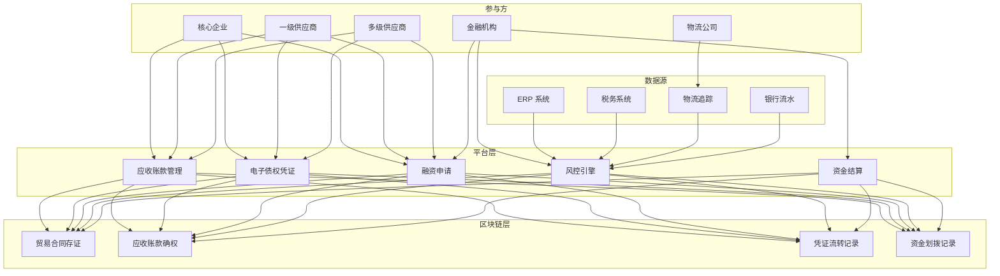
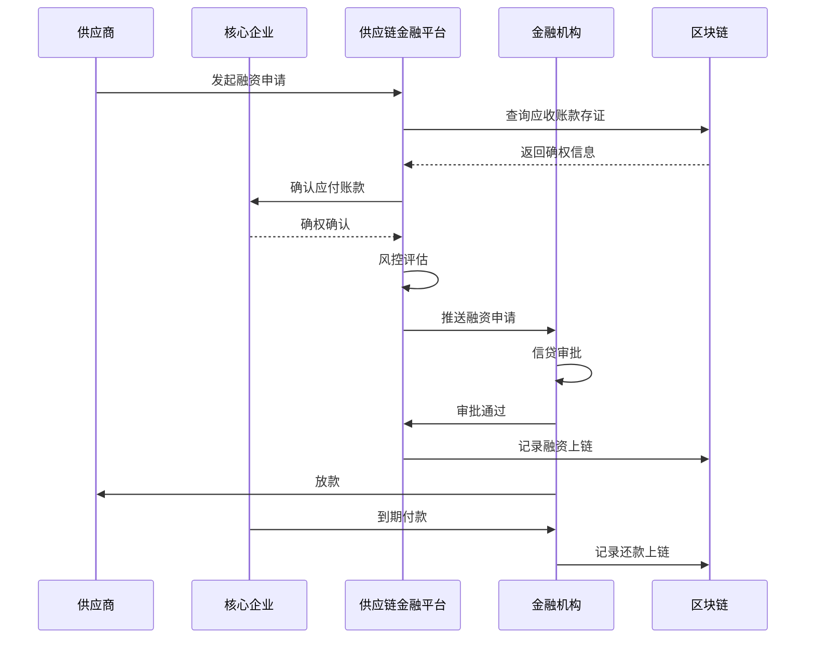
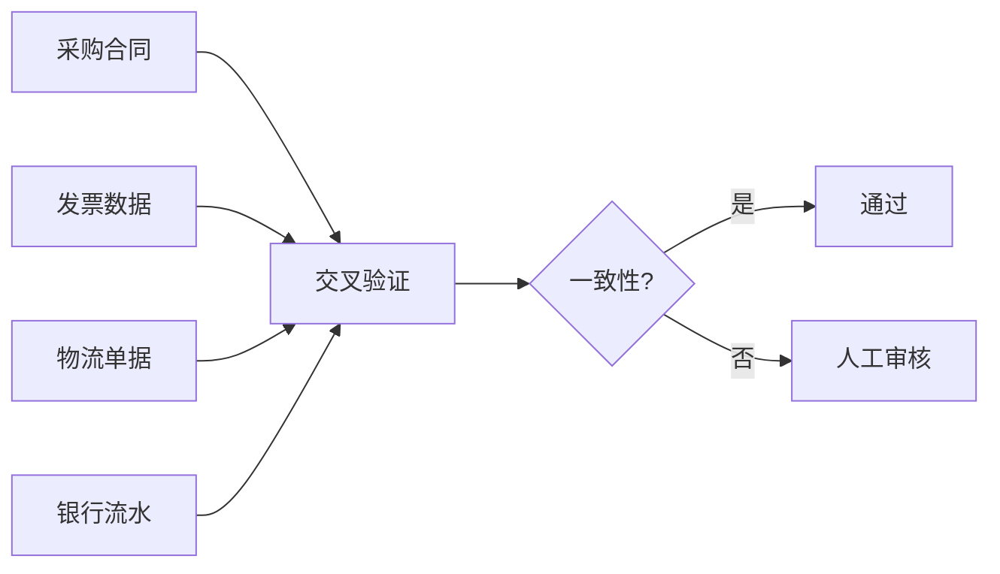

# 供应链金融架构设计 — 阿里云视角

> **适用版本**: Kubernetes v1.29 - v1.33 | **最后更新**: 2026-04-24
> **作者**: 阿里云解决方案架构师 | **标签**: `#供应链金融` `#区块链` `#保理` `#阿里云`

---

## 目录

1. [行业背景](#1-行业背景)
2. [业务架构](#2-业务架构)
3. [技术架构](#3-技术架构)
4. [核心数据流](#4-核心数据流)
5. [安全与合规](#5-安全与合规)
6. [可观测性](#6-可观测性)
7. [阿里云组件映射](#7-阿里云组件映射)
8. [生产检查清单](#8-生产检查清单)

---

## 1. 行业背景

### 1.1 业务特点

供应链金融解决中小微企业融资难题，核心企业信用传递：

| 挑战 | 说明 | 架构影响 |
|:---|:---|:---|
| 信任传递 | 核心企业信用多级传导 | 区块链存证 |
| 贸易真实性 | 虚假贸易/重复融资 | 物流/税务/资金流交叉验证 |
| 资金效率 | 账期长、周转慢 | 自动化放款 |
| 风险管控 | 供应链风险传导 | 实时监控 + 预警 |
| 多方协同 | 核心企业/供应商/金融机构 | 联盟链 |

### 1.2 核心场景

- **应收账款融资**: 基于核心企业应付账款的保理
- **订单融资**: 基于采购订单的预付款融资
- **存货质押**: 基于库存商品的质押融资
- **信用流转**: 电子债权凭证拆分流转
- **风控监控**: 供应链实时风险预警

---

## 2. 业务架构

### 2.1 供应链金融全景架构



### 2.2 应收账款融资时序



---

## 3. 技术架构

### 3.1 K8s 部署

```yaml
# 供应链金融平台 Deployment
apiVersion: apps/v1
kind: Deployment
metadata:
  name: scf-platform
  namespace: supply-chain-finance
spec:
  replicas: 4
  selector:
    matchLabels:
      app: scf-platform
  template:
    metadata:
      labels:
        app: scf-platform
    spec:
      containers:
        - name: platform
          image: registry.cn-hangzhou.aliyuncs.com/scf/platform:v3.0.0
          ports:
            - containerPort: 8080
          env:
            - name: BLOCKCHAIN_NODE
              value: "http://antchain-baas:8080"
            - name: RISK_ENGINE_URL
              value: "http://risk-engine:8080"
          resources:
            requests:
              memory: "2Gi"
              cpu: "1000m"
            limits:
              memory: "4Gi"
              cpu: "2000m"
```

---

## 4. 核心数据流

### 4.1 贸易真实性验证



---

## 5. 安全与合规

- **区块链存证**: 贸易数据不可篡改
- **隐私保护**: 供应商信息加密共享
- **金融监管**: 符合银保监会要求

---

## 6. 可观测性

- **融资审批**: P99 < 4h
- **放款成功率**: > 95%
- **系统可用性**: 99.9%

---

## 7. 阿里云组件映射

| 功能域 | **阿里云云原生方案** |
|:---|:---|
| 容器平台 | **ACK Pro** |
| 区块链 | **蚂蚁链 BaaS** |
| 数据库 | **PolarDB MySQL** |
| 缓存 | **Redis 企业版** |
| 消息队列 | **RocketMQ** |
| AI | **PAI** |
| 可观测性 | **ARMS + SLS** |

---

## 8. 生产检查清单

- [ ] 区块链存证节点共识验证
- [ ] 贸易真实性交叉校验
- [ ] 电子债权凭证防重复
- [ ] 资金划拨安全性测试
- [ ] 金融监管合规审计

---

**维护者**: 阿里云解决方案架构师团队 | **许可证**: MIT
