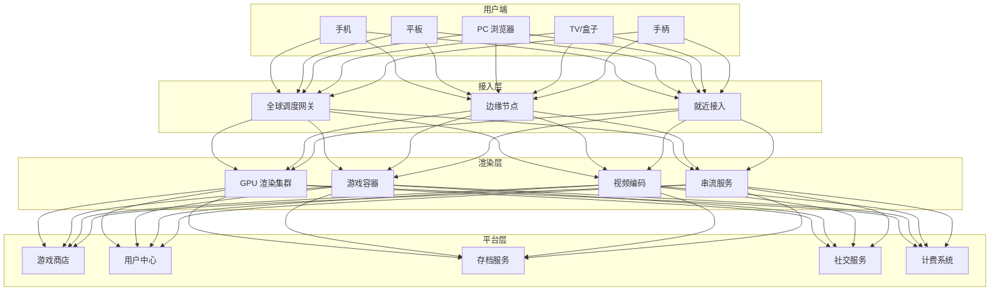
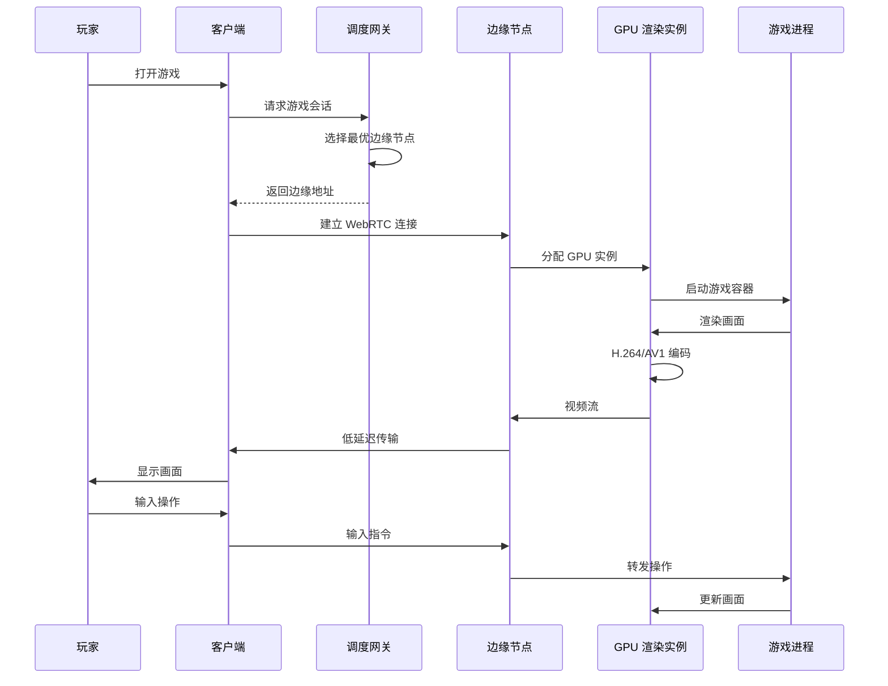
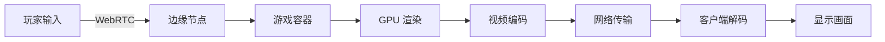

# 云游戏架构设计 — 阿里云视角

> **适用版本**: Kubernetes v1.29 - v1.33 | **最后更新**: 2026-04-24
> **作者**: 阿里云解决方案架构师 | **标签**: `#云游戏` `#串流` `#GPU` `#阿里云`

---

## 目录

1. [行业背景](#1-行业背景)
2. [业务架构](#2-业务架构)
3. [技术架构](#3-技术架构)
4. [核心数据流](#4-核心数据流)
5. [安全与合规](#5-安全与合规)
6. [可观测性](#6-可观测性)
7. [阿里云组件映射](#7-阿里云组件映射)
8. [生产检查清单](#8-生产检查清单)

---

## 1. 行业背景

### 1.1 业务特点

云游戏将游戏渲染放在云端，用户通过视频流游玩：

| 挑战 | 说明 | 架构影响 |
|:---|:---|:---|
| 低延迟串流 | 端到端 < 50ms | 边缘节点 + 网络优化 |
| GPU 成本高 | 每路一个 GPU 实例 | 共享 GPU + 分时复用 |
| 编码带宽 | 1080p60 需 15Mbps | 动态码率 + 压缩 |
| 游戏兼容性 | 数千款游戏适配 | 容器化游戏环境 |
| 存档同步 | 跨设备无缝续玩 | 云存档 + 状态同步 |

### 1.2 核心场景

- **游戏串流**: 云端渲染 + 视频推流
- **游戏商店**: 游戏分发与版本管理
- **社交互动**: 语音/文字/观战
- **存档云同步**: 跨平台进度同步
- **手柄/触控**: 多输入设备适配

---

## 2. 业务架构

### 2.1 云游戏全景架构



### 2.2 游戏串流时序



---

## 3. 技术架构

### 3.1 K8s GPU 渲染集群

```yaml
# 游戏渲染 Pod（每路游戏一个 Pod）
apiVersion: v1
kind: Pod
metadata:
  name: game-session-uuid-1234
  namespace: cloud-gaming
  labels:
    app: game-session
    game-id: "genshin-impact"
    user-id: "user-5678"
spec:
  nodeSelector:
    accelerator: nvidia-a10
  runtimeClassName: nvidia
  containers:
    - name: game-renderer
      image: registry.cn-hangzhou.aliyuncs.com/cloud-gaming/genshin:v3.2.0-gpu
      ports:
        - containerPort: 8080
          name: webrtc
        - containerPort: 3478
          name: stun
      env:
        - name: STREAM_RESOLUTION
          value: "1920x1080"
        - name: STREAM_FPS
          value: "60"
        - name: VIDEO_CODEC
          value: "h264"
        - name: MAX_BITRATE_MBPS
          value: "20"
      resources:
        requests:
          nvidia.com/gpu: 1
          memory: "8Gi"
          cpu: "4000m"
        limits:
          nvidia.com/gpu: 1
          memory: "16Gi"
          cpu: "8000m"
      volumeMounts:
        - name: game-assets
          mountPath: /game/assets
        - name: user-save
          mountPath: /game/saves
  volumes:
    - name: game-assets
      persistentVolumeClaim:
        claimName: game-assets-pvc
    - name: user-save
      persistentVolumeClaim:
        claimName: user-saves-pvc
```

```yaml
# 自动伸缩（基于活跃会话数）
apiVersion: autoscaling/v2
kind: HorizontalPodAutoscaler
metadata:
  name: game-session-hpa
  namespace: cloud-gaming
spec:
  scaleTargetRef:
    apiVersion: apps/v1
    kind: Deployment
    name: game-session-controller
  minReplicas: 10
  maxReplicas: 1000
  metrics:
    - type: Pods
      pods:
        metric:
          name: active_game_sessions
        target:
          type: AverageValue
          averageValue: "8"
```

---

## 4. 核心数据流

### 4.1 输入-渲染-编码-传输流水线



---

## 5. 安全与合规

- **游戏版权**: 游戏内容 DRM 保护
- **外挂防护**: 服务端渲染防作弊
- **未成年人**: 实名认证 + 防沉迷

---

## 6. 可观测性

- **串流延迟**: P99 < 50ms
- **画面质量**: 1080p60 稳定
- **会话可用性**: 99.9%

---

## 7. 阿里云组件映射

| 功能域 | **阿里云云原生方案** |
|:---|:---|
| 容器平台 | **ACK Pro + GPU 节点池** |
| GPU | **GN7/GN10 实例** |
| 边缘节点 | **ENS 边缘节点服务** |
| 实时传输 | **阿里云 RTC** |
| 对象存储 | **OSS** |
| 数据库 | **PolarDB** |
| CDN | **阿里云 CDN** |
| 可观测性 | **ARMS + SLS** |

---

## 8. 生产检查清单

- [ ] GPU 实例负载均衡
- [ ] 边缘节点网络延迟 < 20ms
- [ ] 游戏容器启动时间 < 10s
- [ ] 云存档同步完整性
- [ ] 防沉迷系统合规验证

---

**维护者**: 阿里云解决方案架构师团队 | **许可证**: MIT
