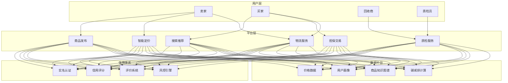
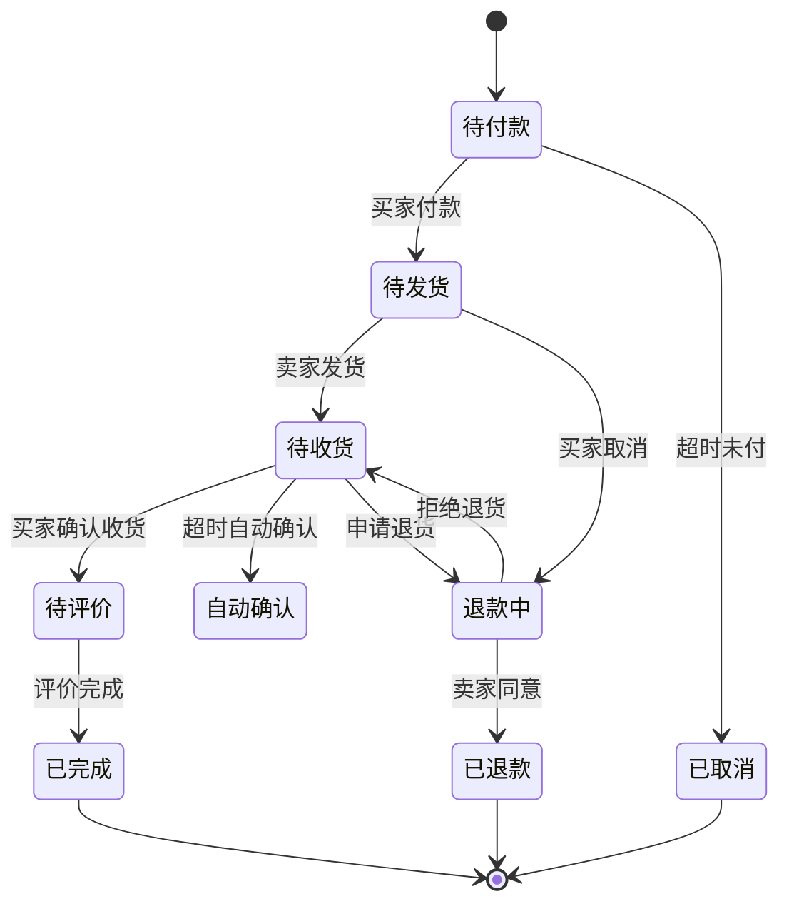
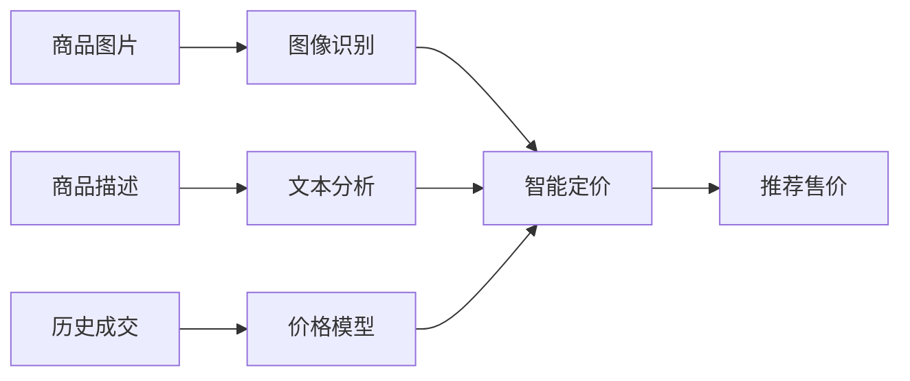

# 二手交易与循环经济架构设计 — 阿里云视角

> **适用版本**: Kubernetes v1.29 - v1.33 | **最后更新**: 2026-04-24
> **作者**: 阿里云解决方案架构师 | **标签**: `#二手交易` `#循环经济` `#C2C` `#阿里云`

---

## 目录

1. [行业背景](#1-行业背景)
2. [业务架构](#2-业务架构)
3. [技术架构](#3-技术架构)
4. [核心数据流](#4-核心数据流)
5. [安全与合规](#5-安全与合规)
6. [可观测性](#6-可观测性)
7. [阿里云组件映射](#7-阿里云组件映射)
8. [生产检查清单](#8-生产检查清单)

---

## 1. 行业背景

### 1.1 业务特点

二手交易平台连接海量个人卖家与买家，信任机制是关键：

| 挑战 | 说明 | 架构影响 |
|:---|:---|:---|
| C2C 信任 | 陌生人交易信任建立 | 信用体系 + 担保交易 |
| 商品非标 | 二手商品状态差异大 | AI 定价 + 质检标准 |
| 欺诈风险 | 虚假商品/诈骗 | 风控 + 实名认证 |
| 搜索匹配 | 长尾商品检索 | 图像搜索 + 语义匹配 |
| 环保价值 | 碳减排量计算 | 绿色积分体系 |

### 1.2 核心场景

- **商品发布**: AI 辅助定价/描述生成
- **智能搜索**: 以图搜图/相似商品推荐
- **信用交易**: 担保交易/评价体系
- **质检服务**: 官方验机/验货
- **回收服务**: 以旧换新/上门回收

---

## 2. 业务架构

### 2.1 二手交易全景架构



### 2.2 担保交易状态机



---

## 3. 技术架构

### 3.1 K8s 部署

```yaml
# 图像搜索服务 GPU Deployment
apiVersion: apps/v1
kind: Deployment
metadata:
  name: image-search
  namespace: secondhand
spec:
  replicas: 3
  selector:
    matchLabels:
      app: image-search
  template:
    metadata:
      labels:
        app: image-search
    spec:
      nodeSelector:
        accelerator: nvidia-t4
      runtimeClassName: nvidia
      containers:
        - name: search
          image: registry.cn-hangzhou.aliyuncs.com/secondhand/image-search:v2.0.0-gpu
          ports:
            - containerPort: 8080
          env:
            - name: VECTOR_DB_URL
              value: "http://milvus-cluster:19530"
          resources:
            requests:
              nvidia.com/gpu: 1
              memory: "8Gi"
              cpu: "4000m"
            limits:
              nvidia.com/gpu: 1
              memory: "16Gi"
              cpu: "8000m"
```

---

## 4. 核心数据流

### 4.1 AI 智能定价



---

## 5. 安全与合规

- **实名认证**: 买卖双实名
- **资金安全**: 担保交易资金托管
- **内容合规**: 违禁品识别与拦截

---

## 6. 可观测性

- **图像搜索**: P99 < 500ms
- **交易成功率**: > 98%
- **欺诈拦截率**: > 99%

---

## 7. 阿里云组件映射

| 功能域 | **阿里云云原生方案** |
|:---|:---|
| 容器平台 | **ACK Pro** |
| AI 图像 | **PAI / 视觉智能** |
| 向量检索 | **阿里云向量检索服务** |
| 数据库 | **PolarDB MySQL** |
| 缓存 | **Redis 企业版** |
| 对象存储 | **OSS + CDN** |
| 可观测性 | **ARMS + SLS** |

---

## 8. 生产检查清单

- [ ] 图像搜索准确率验证
- [ ] 智能定价模型准确性
- [ ] 风控规则拦截率测试
- [ ] 违禁品识别覆盖率
- [ ] 担保交易资金安全审计

---

**维护者**: 阿里云解决方案架构师团队 | **许可证**: MIT
