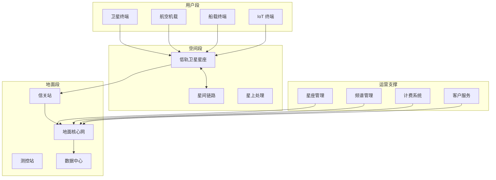
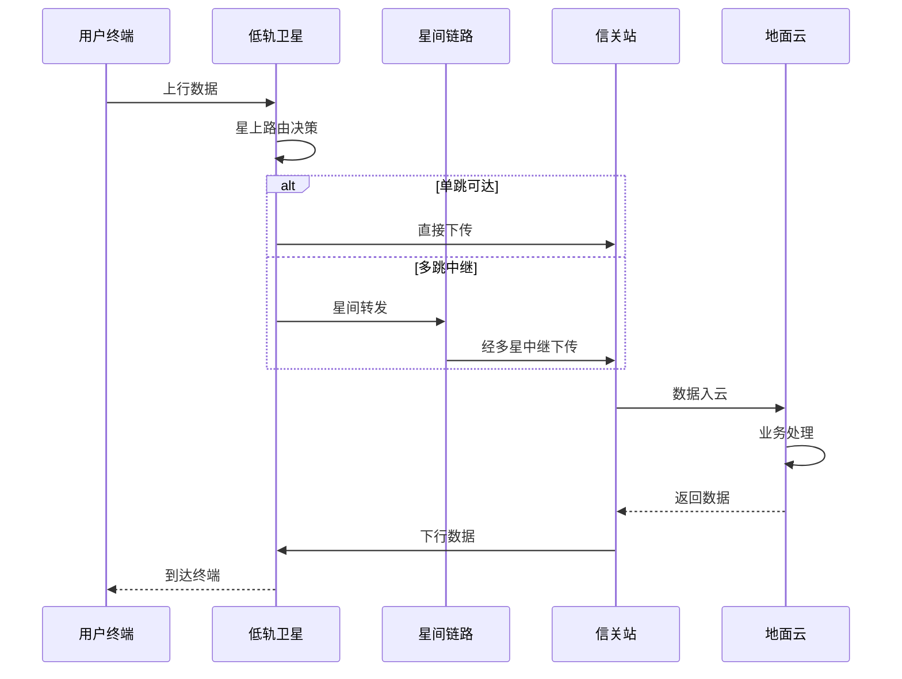

# 卫星互联网架构设计 — 阿里云视角

> **适用版本**: Kubernetes v1.29 - v1.33 | **最后更新**: 2026-04-24
> **作者**: 阿里云解决方案架构师 | **标签**: `#卫星互联网` `#低轨卫星` `#天地一体` `#阿里云`

---

## 目录

1. [行业背景](#1-行业背景)
2. [业务架构](#2-业务架构)
3. [技术架构](#3-技术架构)
4. [核心数据流](#4-核心数据流)
5. [安全与合规](#5-安全与合规)
6. [可观测性](#6-可观测性)
7. [阿里云组件映射](#7-阿里云组件映射)
8. [生产检查清单](#8-生产检查清单)

---

## 1. 行业背景

### 1.1 业务特点

卫星互联网通过低轨卫星星座提供全球覆盖的通信服务：

| 挑战 | 说明 | 架构影响 |
|:---|:---|:---|
| 高动态拓扑 | 卫星高速运动，切换频繁 | 快速路由收敛 |
| 长距离传输 | 星地距离 500-2000km | 协议优化/缓存 |
| 带宽受限 | 单星容量有限 | 流量调度/压缩 |
| 覆盖连续 | 极地/海洋/沙漠覆盖 | 多星协同 |
| 地面站分布 | 全球地面站网络 | 就近接入 |

### 1.2 核心场景

- **宽带接入**: 偏远地区/海洋/航空互联网
- **物联网**: 全球 IoT 数据采集
- **应急通信**: 灾害/战区应急通信
- **导航增强**: 高精度定位服务
- **遥感数据**: 卫星遥感图像传输与处理

---

## 2. 业务架构

### 2.1 卫星互联网全景架构



### 2.2 卫星数据传输时序



---

## 3. 技术架构

### 3.1 K8s 部署

```yaml
# 卫星数据处理 Deployment
apiVersion: apps/v1
kind: Deployment
metadata:
  name: satellite-data-processor
  namespace: satellite
spec:
  replicas: 3
  selector:
    matchLabels:
      app: satellite-data-processor
  template:
    metadata:
      labels:
        app: satellite-data-processor
    spec:
      nodeSelector:
        region: ground-station
      containers:
        - name: processor
          image: registry.cn-hangzhou.aliyuncs.com/satellite/data-processor:v1.0.0
          ports:
            - containerPort: 8080
          env:
            - name: SATELLITE_ORBIT_DATA
              value: "/data/tle"
            - name: GROUND_STATION_ID
              value: "GS-BEIJING-01"
          resources:
            requests:
              memory: "4Gi"
              cpu: "2000m"
            limits:
              memory: "8Gi"
              cpu: "4000m"
```

---

## 4. 核心数据流

### 4.1 遥感图像处理流水线


---

## 5. 安全与合规

- **频谱合规**: 国际电联频谱协调
- **数据安全**: 卫星通信加密
- **空间碎片**: 轨道安全避碰

---

## 6. 可观测性

- **链路可用性**: > 99%
- **传输延迟**: < 50ms（星地）
- **系统可用性**: 99.9%

---

## 7. 阿里云组件映射

| 功能域 | **阿里云云原生方案** |
|:---|:---|
| 容器平台 | **ACK Pro** |
| 大数据 | **MaxCompute + Flink** |
| AI | **PAI** |
| 对象存储 | **OSS** |
| 数据库 | **PolarDB** |
| 可观测性 | **ARMS + SLS** |

---

## 8. 生产检查清单

- [ ] 星地链路连通性验证
- [ ] 多星协同路由测试
- [ ] 遥感数据处理准确性
- [ ] 频谱干扰监测
- [ ] 应急通信切换演练

---

**维护者**: 阿里云解决方案架构师团队 | **许可证**: MIT
