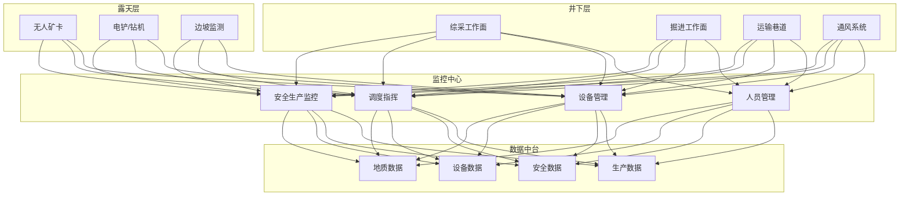
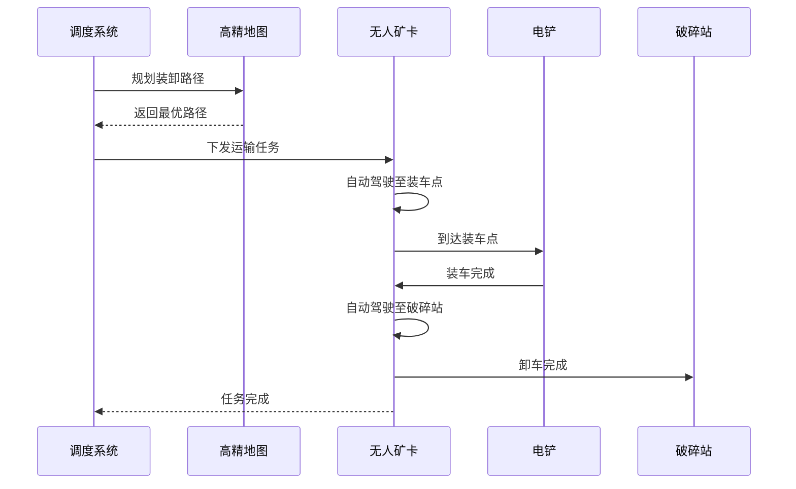
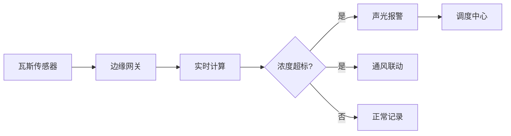

# 智慧矿山架构设计 — 阿里云视角

> **适用版本**: Kubernetes v1.29 - v1.33 | **最后更新**: 2026-04-24
> **作者**: 阿里云解决方案架构师 | **标签**: `#智慧矿山` `#无人矿卡` `#安全监控` `#阿里云`

---

## 目录

1. [行业背景](#1-行业背景)
2. [业务架构](#2-业务架构)
3. [技术架构](#3-技术架构)
4. [核心数据流](#4-核心数据流)
5. [安全与合规](#5-安全与合规)
6. [可观测性](#6-可观测性)
7. [阿里云组件映射](#7-阿里云组件映射)
8. [生产检查清单](#8-生产检查清单)

---

## 1. 行业背景

### 1.1 业务特点

智慧矿山通过数字化技术实现安全、高效、绿色开采：

| 挑战 | 说明 | 架构影响 |
|:---|:---|:---|
| 安全风险高 | 瓦斯/透水/塌方风险 | 实时监测 + AI 预警 |
| 环境恶劣 | 井下高温高湿粉尘 | 工业级设备 + 边缘计算 |
| 网络覆盖 | 井下/露天弱网环境 | 5G + 专网 + Mesh |
| 设备分散 | 采掘/运输/通风设备多 | IoT 统一管理 |
| 监管严格 | 安全生产法规 | 数据留痕 + 审计 |

### 1.2 核心场景

- **无人矿卡**: 露天矿无人驾驶运输
- **智能综采**: 采煤机自动化控制
- **安全监测**: 瓦斯/顶板/水害监测预警
- **人员定位**: 井下人员实时定位
- **视频监控**: AI 违章识别

---

## 2. 业务架构

### 2.1 智慧矿山全景架构



### 2.2 无人矿卡调度时序



---

## 3. 技术架构

### 3.1 K8s 部署

```yaml
# 安全监测边缘 DaemonSet
apiVersion: apps/v1
kind: DaemonSet
metadata:
  name: safety-monitor-edge
  namespace: smart-mining
spec:
  selector:
    matchLabels:
      app: safety-monitor-edge
  template:
    metadata:
      labels:
        app: safety-monitor-edge
    spec:
      hostNetwork: true
      nodeSelector:
        node-type: mining-edge
      tolerations:
        - key: "dedicated"
          operator: "Equal"
          value: "mining"
          effect: "NoSchedule"
      containers:
        - name: monitor
          image: registry.cn-hangzhou.aliyuncs.com/mining/safety-monitor:v2.0.0
          resources:
            requests:
              memory: "1Gi"
              cpu: "1000m"
```

---

## 4. 核心数据流

### 4.1 瓦斯监测预警



---

## 5. 安全与合规

- **安全生产**: 煤矿安全规程合规
- **数据留痕**: 监控数据 3 个月留存
- **人员安全**: 井下人员紧急撤离

---

## 6. 可观测性

- **瓦斯监测**: 实时更新 < 5s
- **人员定位**: 精度 < 1m
- **系统可用性**: 99.9%

---

## 7. 阿里云组件映射

| 功能域 | **阿里云云原生方案** |
|:---|:---|
| 容器平台 | **ACK Edge** |
| IoT | **阿里云 IoT 平台** |
| AI | **PAI / 视觉智能** |
| 数据库 | **PolarDB + Lindorm** |
| 对象存储 | **OSS** |
| 可观测性 | **ARMS + SLS** |
| 定位 | **高精度定位服务** |

---

## 8. 生产检查清单

- [ ] 瓦斯监测系统 24h 连续运行
- [ ] 无人矿卡安全测试
- [ ] 人员定位系统精度验证
- [ ] 应急撤离系统演练
- [ ] 煤矿安全规程合规审计

---

**维护者**: 阿里云解决方案架构师团队 | **许可证**: MIT
