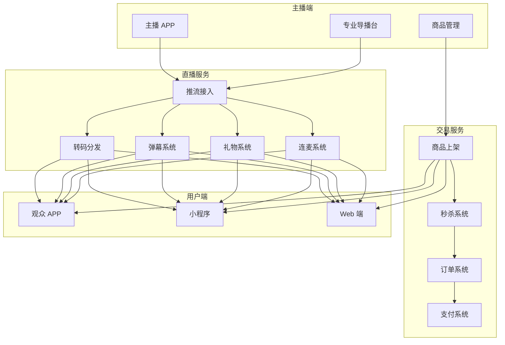
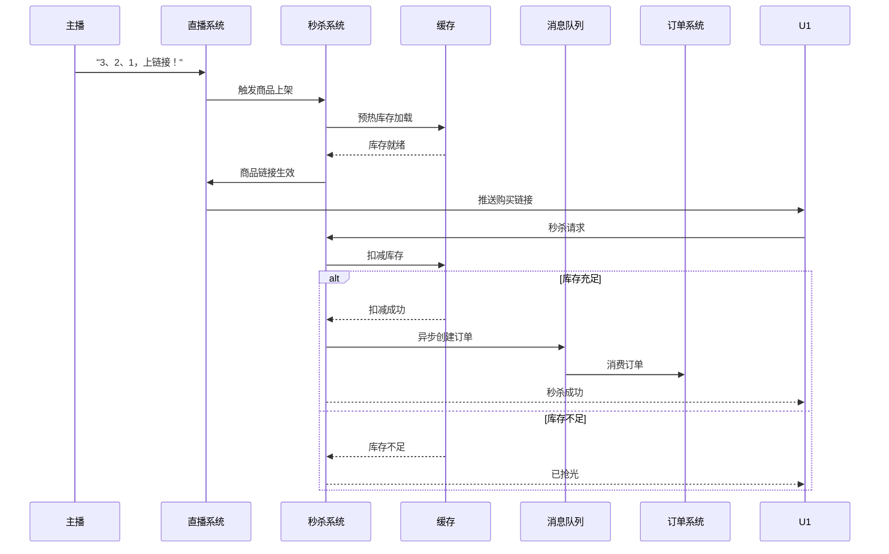
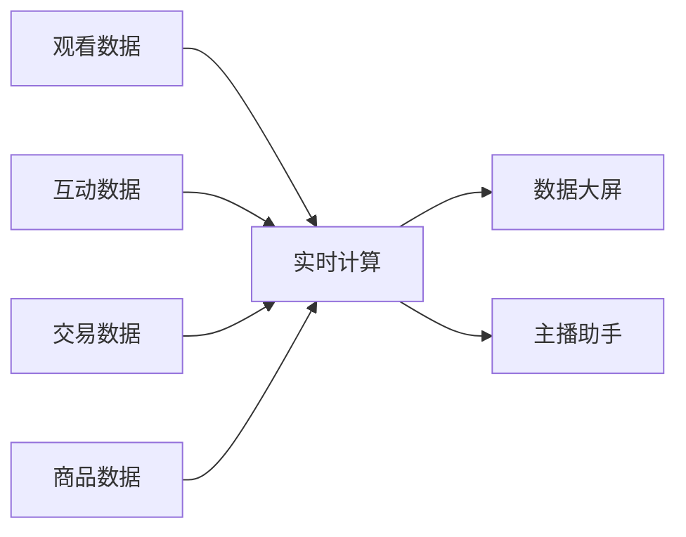

# 直播电商架构设计 — 阿里云视角

> **适用版本**: Kubernetes v1.29 - v1.33 | **最后更新**: 2026-04-24
> **作者**: 阿里云解决方案架构师 | **标签**: `#直播电商` `#带货` `#秒杀` `#阿里云`

---

## 目录

1. [行业背景](#1-行业背景)
2. [业务架构](#2-业务架构)
3. [技术架构](#3-技术架构)
4. [核心数据流](#4-核心数据流)
5. [安全与合规](#5-安全与合规)
6. [可观测性](#6-可观测性)
7. [阿里云组件映射](#7-阿里云组件映射)
8. [生产检查清单](#8-生产检查清单)

---

## 1. 行业背景

### 1.1 业务特点

直播电商将娱乐与购物融合，流量峰值极高：

| 挑战 | 说明 | 架构影响 |
|:---|:---|:---|
| 超高并发 | 头部主播 1000万+ 同时在线 | CDN + 弹性伸缩 |
| 秒杀峰值 | 上架瞬间订单 10万+/秒 | 库存预热 + 队列 |
| 低延迟互动 | 弹幕/点赞/连麦 < 1s | 实时消息系统 |
| 内容合规 | 直播内容实时审核 | AI 审核 + 人工复核 |
| 主播调度 | 多直播间资源分配 | 智能调度 |

### 1.2 核心场景

- **直播间**: 推流/拉流/弹幕/礼物
- **商品上架**: 直播过程中商品秒杀
- **互动玩法**: 抽奖/红包/连麦/PK
- **数据大屏**: 实时 GMV/观看数/转化率
- **直播回放**: 精彩片段剪辑与回放

---

## 2. 业务架构

### 2.1 直播电商全景架构



### 2.2 直播秒杀时序



---

## 3. 技术架构

### 3.1 K8s 部署

```yaml
# 弹幕服务 Deployment
apiVersion: apps/v1
kind: Deployment
metadata:
  name: danmaku-service
  namespace: livestream-ecommerce
spec:
  replicas: 20
  selector:
    matchLabels:
      app: danmaku-service
  template:
    metadata:
      labels:
        app: danmaku-service
    spec:
      hostNetwork: true
      containers:
        - name: danmaku
          image: registry.cn-hangzhou.aliyuncs.com/live/danmaku:v4.0.0
          ports:
            - containerPort: 8080
            - containerPort: 9999
              name: websocket
          env:
            - name: MAX_CONNECTIONS
              value: "1000000"
            - name: MESSAGE_FANOUT
              value: "broadcast"
          resources:
            requests:
              memory: "4Gi"
              cpu: "2000m"
            limits:
              memory: "8Gi"
              cpu: "4000m"
```

```yaml
# 秒杀服务 HPA
apiVersion: autoscaling/v2
kind: HorizontalPodAutoscaler
metadata:
  name: seckill-hpa
  namespace: livestream-ecommerce
spec:
  scaleTargetRef:
    apiVersion: apps/v1
    kind: Deployment
    name: seckill-service
  minReplicas: 10
  maxReplicas: 500
  metrics:
    - type: Resource
      resource:
        name: cpu
        target:
          type: Utilization
          averageUtilization: 60
  behavior:
    scaleUp:
      stabilizationWindowSeconds: 0
      policies:
        - type: Percent
          value: 200
          periodSeconds: 15
```

---

## 4. 核心数据流

### 4.1 实时数据大屏



---

## 5. 安全与合规

- **内容审核**: 直播画面实时 AI 审核
- **虚假宣传**: 商品描述合规检查
- **价格合规**: 最低价监控

---

## 6. 可观测性

- **直播延迟**: < 3s
- **弹幕到达**: P99 < 100ms
- **秒杀成功率**: > 99%

---

## 7. 阿里云组件映射

| 功能域 | **阿里云云原生方案** |
|:---|:---|
| 容器平台 | **ACK Pro** |
| 直播 | **视频直播 + CDN** |
| RTC | **阿里云 RTC** |
| 数据库 | **PolarDB** |
| 缓存 | **Redis 企业版** |
| 消息队列 | **RocketMQ** |
| AI | **视觉智能 / 内容安全** |
| 可观测性 | **ARMS + SLS** |

---

## 8. 生产检查清单

- [ ] 直播 CDN 预热
- [ ] 秒杀系统并发压测
- [ ] 弹幕系统百万级并发
- [ ] AI 内容审核实时性
- [ ] 主播端推流稳定性

---

**维护者**: 阿里云解决方案架构师团队 | **许可证**: MIT
