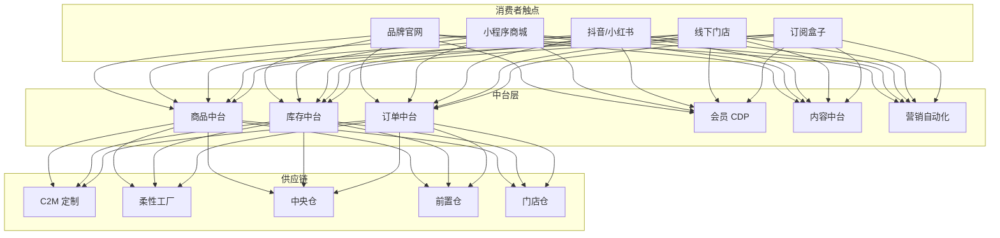
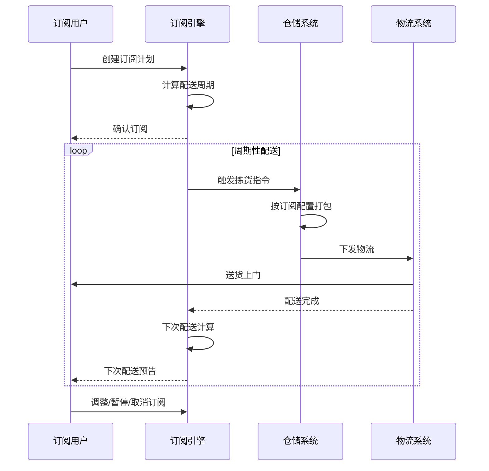
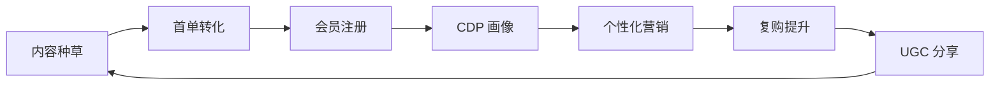

# 新零售 DTC 架构设计 — 阿里云视角

> **适用版本**: Kubernetes v1.29 - v1.33 | **最后更新**: 2026-04-24
> **作者**: 阿里云解决方案架构师 | **标签**: `#新零售` `#DTC` `#品牌直营` `#阿里云`

---

## 目录

1. [行业背景](#1-行业背景)
2. [业务架构](#2-业务架构)
3. [技术架构](#3-技术架构)
4. [核心数据流](#4-核心数据流)
5. [安全与合规](#5-安全与合规)
6. [可观测性](#6-可观测性)
7. [阿里云组件映射](#7-阿里云组件映射)
8. [生产检查清单](#8-生产检查清单)

---

## 1. 行业背景

### 1.1 业务特点

DTC（Direct-to-Consumer）品牌绕过中间商直接面向消费者：

| 挑战 | 说明 | 架构影响 |
|:---|:---|:---|
| 全渠道融合 | 官网/小程序/门店/社交电商 | 统一商品/库存/会员 |
| 私域运营 | 用户数据自主掌控 | CDP + 营销自动化 |
| 快速迭代 | 小单快反柔性供应链 | 数据中台驱动 |
| 内容营销 | 品牌故事/UGC/KOL | 内容中台 |
| 订阅模式 | 周期性配送服务 | 订阅引擎 |

### 1.2 核心场景

- **品牌官网**: 独立站商城建设与运营
- **社交电商**: 小红书/抖音内容种草转化
- **会员订阅**: 周期性商品订阅服务
- **门店数字化**: 智慧门店/导购数字化
- **柔性供应链**: C2M 反向定制

---

## 2. 业务架构

### 2.1 DTC 品牌全景架构



### 2.2 订阅服务时序



---

## 3. 技术架构

### 3.1 K8s 部署

```yaml
# DTC 官网前端 Deployment
apiVersion: apps/v1
kind: Deployment
metadata:
  name: dtc-frontend
  namespace: new-retail-dtc
spec:
  replicas: 6
  selector:
    matchLabels:
      app: dtc-frontend
  template:
    metadata:
      labels:
        app: dtc-frontend
    spec:
      containers:
        - name: nextjs
          image: registry.cn-hangzhou.aliyuncs.com/dtc/frontend:v2.3.0
          ports:
            - containerPort: 3000
          env:
            - name: CDN_DOMAIN
              value: "https://cdn.brand.com"
            - name: API_URL
              value: "https://api.brand.com"
          resources:
            requests:
              memory: "1Gi"
              cpu: "500m"
            limits:
              memory: "2Gi"
              cpu: "1000m"
```

---

## 4. 核心数据流

### 4.1 用户旅程数据闭环



---

## 5. 安全与合规

- **数据隐私**: 用户数据自主管控
- **跨境合规**: GDPR / 个人信息保护法
- **支付安全**: PCI-DSS 合规

---

## 6. 可观测性

- **网站性能**: P99 < 1s
- **转化率**: > 3%
- **系统可用性**: 99.99%

---

## 7. 阿里云组件映射

| 功能域 | **阿里云云原生方案** |
|:---|:---|
| 容器平台 | **ACK Pro** |
| CDN | **阿里云 CDN + DCDN** |
| 数据库 | **PolarDB** |
| 缓存 | **Redis 企业版** |
| 对象存储 | **OSS** |
| 搜索 | **OpenSearch** |
| CDP | **阿里云 CDP** |
| 可观测性 | **ARMS + SLS** |

---

## 8. 生产检查清单

- [ ] 全渠道库存一致性
- [ ] 订阅引擎周期准确性
- [ ] CDP 画像数据完整性
- [ ] 内容中台 CDN 预热
- [ ] 跨境数据合规审计

---

**维护者**: 阿里云解决方案架构师团队 | **许可证**: MIT
