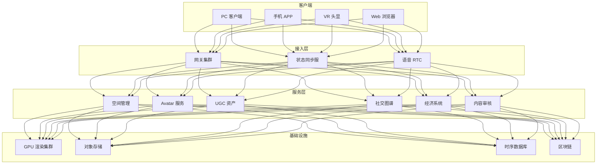
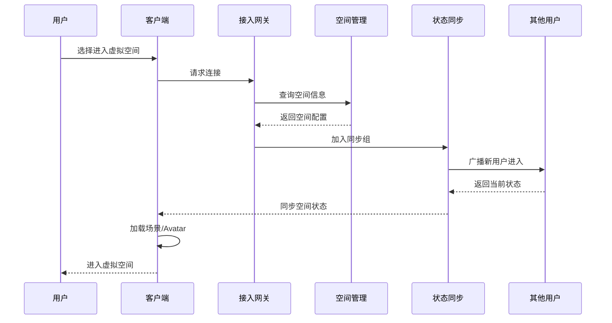
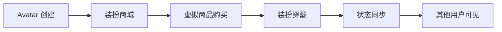

# 社交游戏与元宇宙社交架构设计 — 阿里云视角

> **适用版本**: Kubernetes v1.29 - v1.33 | **最后更新**: 2026-04-24
> **作者**: 阿里云解决方案架构师 | **标签**: `#社交游戏` `#元宇宙` `#虚拟社交` `#阿里云`

---

## 目录

1. [行业背景](#1-行业背景)
2. [业务架构](#2-业务架构)
3. [技术架构](#3-技术架构)
4. [核心数据流](#4-核心数据流)
5. [安全与合规](#5-安全与合规)
6. [可观测性](#6-可观测性)
7. [阿里云组件映射](#7-阿里云组件映射)
8. [生产检查清单](#8-生产检查清单)

---

## 1. 行业背景

### 1.1 业务特点

社交游戏与元宇宙社交融合游戏玩法与虚拟社交：

| 挑战 | 说明 | 架构影响 |
|:---|:---|:---|
| 实时同步 | 虚拟空间用户状态同步 | 状态同步服务器 |
| 万人同屏 | 大型虚拟活动并发 | 空间分区 + 兴趣管理 |
| UGC 创作 | 用户创作虚拟内容 | 内容审核 + 资产存储 |
| 跨平台 | PC/VR/手机互通 | 多端渲染适配 |
| 虚拟经济 | 虚拟商品交易 | 经济系统 + 防通胀 |

### 1.2 核心场景

- **虚拟空间**: 3D 虚拟世界/房间/场景
- **虚拟形象**: Avatar 创建与装扮
- **社交互动**: 语音/文字/动作/表情
- **UGC 创作**: 虚拟建筑/道具/服装创作
- **虚拟经济**: 虚拟货币/商品/交易市场

---

## 2. 业务架构

### 2.1 元宇宙社交全景架构



### 2.2 虚拟空间进入时序



---

## 3. 技术架构

### 3.1 K8s 部署

```yaml
# 状态同步服务 StatefulSet
apiVersion: apps/v1
kind: StatefulSet
metadata:
  name: state-sync-server
  namespace: social-gaming
spec:
  serviceName: state-sync-server
  replicas: 5
  selector:
    matchLabels:
      app: state-sync-server
  template:
    metadata:
      labels:
        app: state-sync-server
    spec:
      hostNetwork: true
      containers:
        - name: sync
          image: registry.cn-hangzhou.aliyuncs.com/social/state-sync:v3.0.0
          ports:
            - containerPort: 8080
            - containerPort: 9999
              name: udp-sync
          env:
            - name: SYNC_MODE
              value: "deterministic-lockstep"
            - name: MAX_PLAYERS_PER_ROOM
              value: "100"
          resources:
            requests:
              memory: "4Gi"
              cpu: "2000m"
            limits:
              memory: "8Gi"
              cpu: "4000m"
```

---

## 4. 核心数据流

### 4.1 Avatar 装扮系统



---

## 5. 安全与合规

- **内容安全**: UGC 虚拟内容审核
- **虚拟经济**: 防洗钱/防欺诈
- **未成年人**: 虚拟社交防沉迷

---

## 6. 可观测性

- **状态同步延迟**: P99 < 100ms
- **语音质量**: MOS > 4.0
- **并发在线**: 支持万人同屏

---

## 7. 阿里云组件映射

| 功能域 | **阿里云云原生方案** |
|:---|:---|
| 容器平台 | **ACK Pro + GPU** |
| GPU 渲染 | **GN7/GN10 实例** |
| RTC | **阿里云 RTC** |
| 对象存储 | **OSS + CDN** |
| 数据库 | **PolarDB + Lindorm** |
| AI | **PAI / 视觉智能** |
| 区块链 | **蚂蚁链 BaaS** |
| 可观测性 | **ARMS + SLS** |

---

## 8. 生产检查清单

- [ ] 状态同步一致性验证
- [ ] 万人同屏压力测试
- [ ] UGC 内容审核覆盖率
- [ ] 虚拟经济系统安全性
- [ ] VR 端性能优化

---

**维护者**: 阿里云解决方案架构师团队 | **许可证**: MIT
