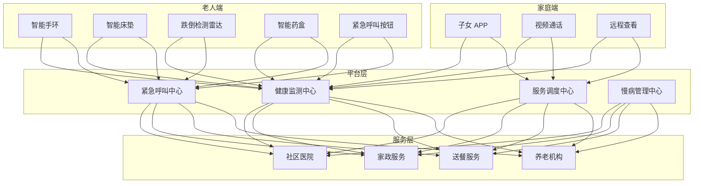
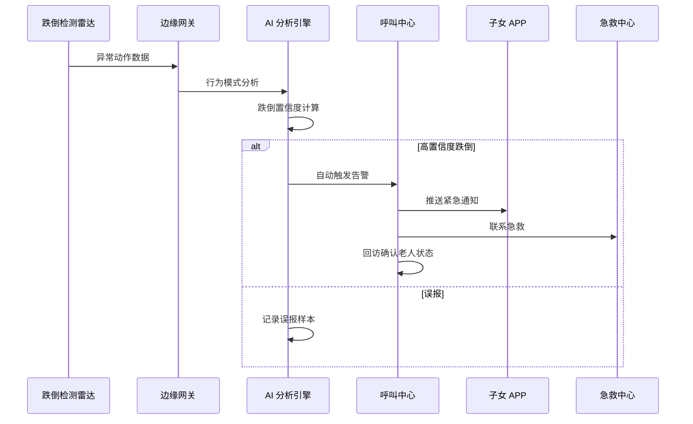
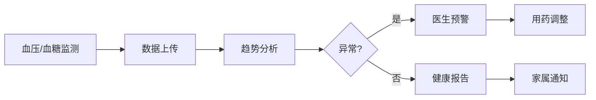

# 智慧养老架构设计 — 阿里云视角

> **适用版本**: Kubernetes v1.29 - v1.33 | **最后更新**: 2026-04-24
> **作者**: 阿里云解决方案架构师 | **标签**: `#智慧养老` `#居家养老` `#康养` `#阿里云`

---

## 目录

1. [行业背景](#1-行业背景)
2. [业务架构](#2-业务架构)
3. [技术架构](#3-技术架构)
4. [核心数据流](#4-核心数据流)
5. [安全与合规](#5-安全与合规)
6. [可观测性](#6-可观测性)
7. [阿里云组件映射](#7-阿里云组件映射)
8. [生产检查清单](#8-生产检查清单)

---

## 1. 行业背景

### 1.1 业务特点

智慧养老通过科技手段提升老年人生活质量与安全保障：

| 挑战 | 说明 | 架构影响 |
|:---|:---|:---|
| 适老化设计 | 老年人操作习惯特殊 | 大字体/语音交互/简化流程 |
| 紧急救助 | 跌倒/疾病突发响应 | 实时监测 + 自动告警 |
| 健康监测 | 慢病管理/用药提醒 | IoT 可穿戴 + AI 分析 |
| 社交孤独 | 子女不在身边 | 视频通话/社区活动 |
| 服务整合 | 医疗/家政/送餐 | 服务平台聚合 |

### 1.2 核心场景

- **居家安全**: 跌倒检测/燃气泄漏/门窗异常
- **健康监测**: 血压/血糖/心率/睡眠监测
- **紧急救助**: 一键呼叫/自动跌倒报警
- **智能照护**: 智能床垫/智能药盒/定位手环
- **养老服务**: 助餐/助洁/助医/助行预约

---

## 2. 业务架构

### 2.1 智慧养老全景架构



### 2.2 跌倒检测与救助时序



---

## 3. 技术架构

### 3.1 K8s 部署

```yaml
# 健康监测服务 Deployment
apiVersion: apps/v1
kind: Deployment
metadata:
  name: health-monitor
  namespace: smart-elderly
spec:
  replicas: 3
  selector:
    matchLabels:
      app: health-monitor
  template:
    metadata:
      labels:
        app: health-monitor
    spec:
      containers:
        - name: monitor
          image: registry.cn-hangzhou.aliyuncs.com/elderly/health-monitor:v1.5.0
          ports:
            - containerPort: 8080
          env:
            - name: ALERT_THRESHOLD_HEART_RATE
              value: "120"
            - name: FALL_DETECTION_ENABLED
              value: "true"
          resources:
            requests:
              memory: "1Gi"
              cpu: "500m"
            limits:
              memory: "2Gi"
              cpu: "1000m"
```

---

## 4. 核心数据流

### 4.1 慢病管理数据流



---

## 5. 安全与合规

- **隐私保护**: 老人健康数据加密
- **紧急响应**: 7×24 小时呼叫中心
- **医疗合规**: 健康数据管理规范

---

## 6. 可观测性

- **设备在线率**: > 95%
- **告警响应**: < 30s
- **误报率**: < 5%

---

## 7. 阿里云组件映射

| 功能域 | **阿里云云原生方案** |
|:---|:---|
| 容器平台 | **ACK Pro** |
| IoT | **阿里云 IoT 平台** |
| AI | **PAI / 视觉智能** |
| 数据库 | **PolarDB + Lindorm** |
| 对象存储 | **OSS** |
| 可观测性 | **ARMS + SLS** |
| 通信 | **阿里云语音服务** |

---

## 8. 生产检查清单

- [ ] 跌倒检测准确率 > 95%
- [ ] 紧急呼叫 7×24 响应
- [ ] 健康数据隐私加密
- [ ] 设备电池续航 > 7 天
- [ ] 家属通知通道畅通

---

**维护者**: 阿里云解决方案架构师团队 | **许可证**: MIT
