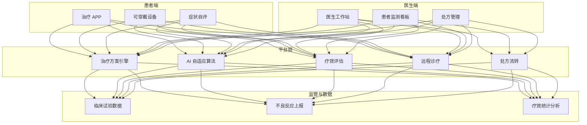
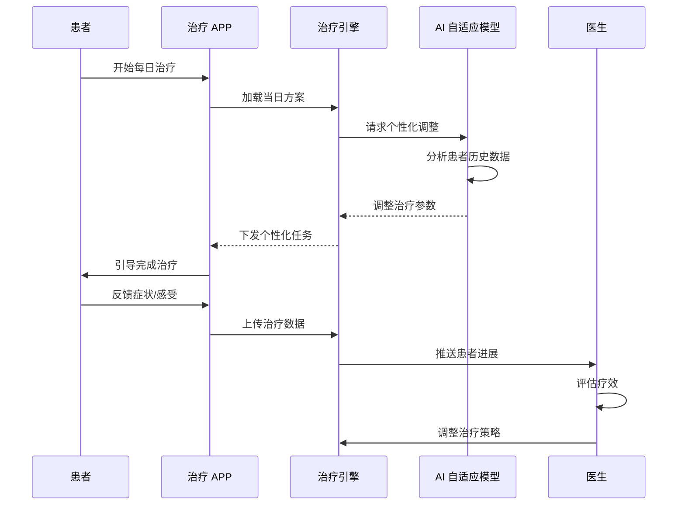
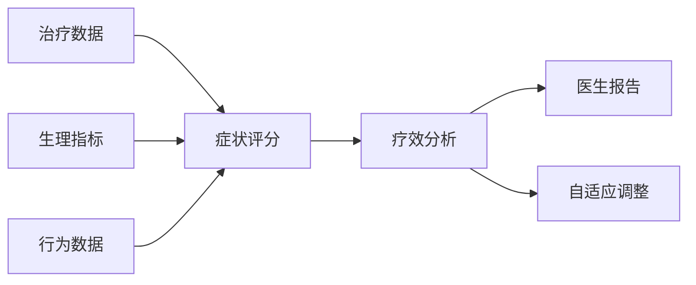

# 数字疗法与互联网医疗架构设计 — 阿里云视角

> **适用版本**: Kubernetes v1.29 - v1.33 | **最后更新**: 2026-04-24
> **作者**: 阿里云解决方案架构师 | **标签**: `#数字疗法` `#互联网医疗` `#远程诊疗` `#阿里云`

---

## 目录

1. [行业背景](#1-行业背景)
2. [业务架构](#2-业务架构)
3. [技术架构](#3-技术架构)
4. [核心数据流](#4-核心数据流)
5. [安全与合规](#5-安全与合规)
6. [可观测性](#6-可观测性)
7. [阿里云组件映射](#7-阿里云组件映射)
8. [生产检查清单](#8-生产检查清单)

---

## 1. 行业背景

### 1.1 业务特点

数字疗法（DTx）是经临床验证的软件治疗方案：

| 挑战 | 说明 | 架构影响 |
|:---|:---|:---|
| 医疗合规 | FDA/NMPA 审批要求 | 临床试验数据管理 |
| 疗效验证 | 需证明临床有效性 | 数据收集 + 分析 |
| 个性化治疗 | 千人千方 | AI 自适应算法 |
| 医患互动 | 远程监测与指导 | 实时通信 + 数据同步 |
| 数据安全 | 敏感健康数据 | 加密 + 审计 |

### 1.2 核心场景

- **认知行为治疗**: 抑郁/焦虑数字干预
- **慢病管理**: 糖尿病/高血压数字疗法
- **康复训练**: 卒中/运动损伤远程康复
- **远程诊疗**: 视频问诊/电子处方
- **处方流转**: 线上处方 + 线下药房

---

## 2. 业务架构

### 2.1 数字疗法全景架构



### 2.2 数字疗法执行时序



---

## 3. 技术架构

### 3.1 K8s 部署

```yaml
# 治疗引擎 Deployment
apiVersion: apps/v1
kind: Deployment
metadata:
  name: therapy-engine
  namespace: digital-therapeutics
spec:
  replicas: 3
  selector:
    matchLabels:
      app: therapy-engine
  template:
    metadata:
      labels:
        app: therapy-engine
    spec:
      containers:
        - name: engine
          image: registry.cn-hangzhou.aliyuncs.com/dtx/therapy-engine:v2.0.0
          ports:
            - containerPort: 8080
          env:
            - name: TREATMENT_PROTOCOL_VERSION
              value: "v3.1"
            - name: CLINICAL_TRIAL_MODE
              value: "false"
          resources:
            requests:
              memory: "2Gi"
              cpu: "1000m"
            limits:
              memory: "4Gi"
              cpu: "2000m"
```

---

## 4. 核心数据流

### 4.1 疗效评估数据流



---

## 5. 安全与合规

- **医疗器械认证**: FDA/NMPA 审批
- **数据隐私**: HIPAA / 个人信息保护法
- **临床试验**: GCP 规范合规

---

## 6. 可观测性

- **治疗完成率**: > 80%
- **症状改善率**: 跟踪统计
- **不良反应**: 实时上报

---

## 7. 阿里云组件映射

| 功能域 | **阿里云云原生方案** |
|:---|:---|
| 容器平台 | **ACK Pro** |
| AI | **PAI** |
| 数据库 | **PolarDB** |
| 对象存储 | **OSS** |
| RTC | **阿里云 RTC** |
| 可观测性 | **ARMS + SLS** |

---

## 8. 生产检查清单

- [ ] 医疗器械注册证合规
- [ ] 临床试验数据完整性
- [ ] 疗效评估算法验证
- [ ] 患者隐私数据加密
- [ ] 不良反应上报通道

---

**维护者**: 阿里云解决方案架构师团队 | **许可证**: MIT
