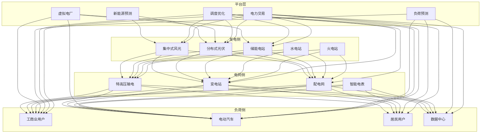
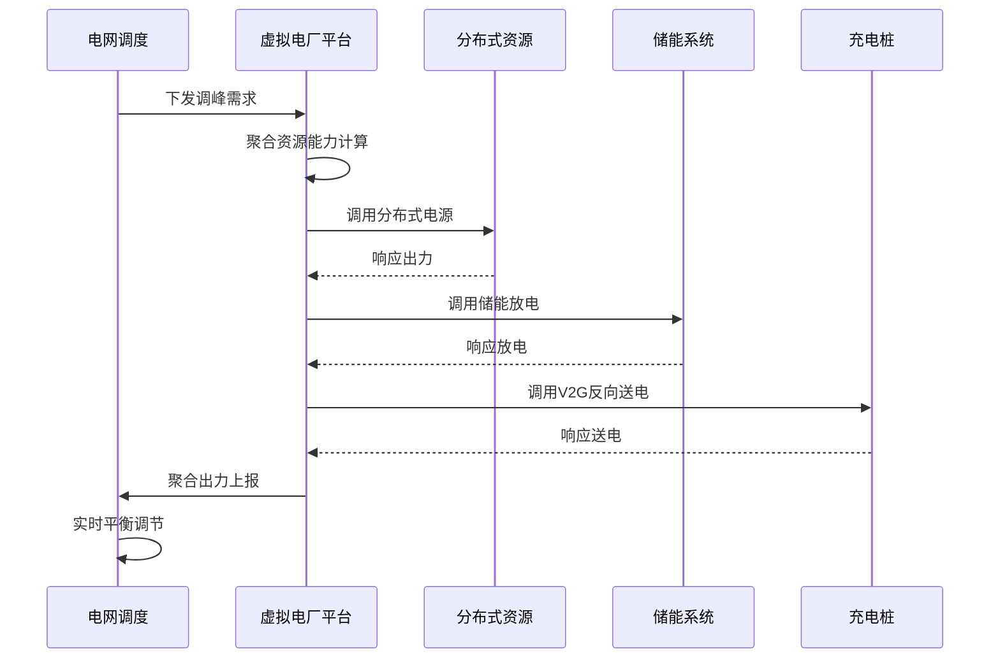
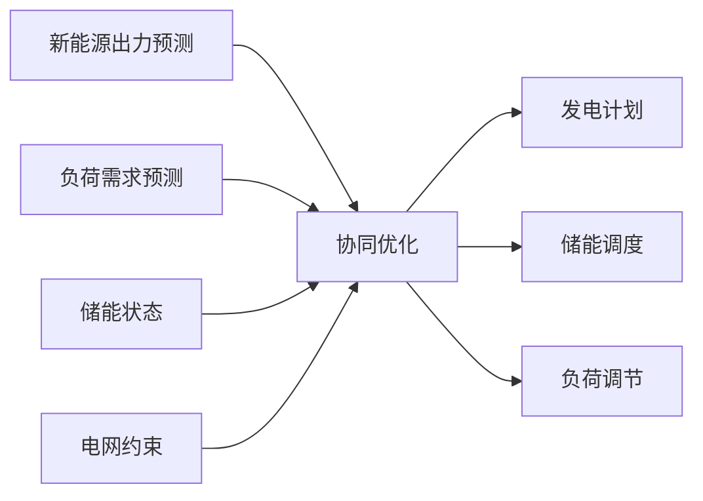

# 智慧电网架构设计 — 阿里云视角

> **适用版本**: Kubernetes v1.29 - v1.33 | **最后更新**: 2026-04-24
> **作者**: 阿里云解决方案架构师 | **标签**: `#智慧电网` `#虚拟电厂` `#负荷预测` `#阿里云`

---

## 目录

1. [行业背景](#1-行业背景)
2. [业务架构](#2-业务架构)
3. [技术架构](#3-技术架构)
4. [核心数据流](#4-核心数据流)
5. [安全与合规](#5-安全与合规)
6. [可观测性](#6-可观测性)
7. [阿里云组件映射](#7-阿里云组件映射)
8. [生产检查清单](#8-生产检查清单)

---

## 1. 行业背景

### 1.1 业务特点

智慧电网是新型电力系统的核心，实现源网荷储协同互动：

| 挑战 | 说明 | 架构影响 |
|:---|:---|:---|
| 新能源波动 | 风电/光伏间歇性出力 | 预测 + 储能调度 |
| 负荷峰谷差 | 用电高峰供需矛盾 | 需求响应 + 虚拟电厂 |
| 分布式接入 | 海量分布式电源并网 | 边缘计算 + 即插即用 |
| 电网安全 | 网络攻击风险 | 零信任 + 隔离 |
| 实时平衡 | 发用电实时平衡 | 毫秒级控制 |

### 1.2 核心场景

- **新能源预测**: 风电/光伏功率预测
- **虚拟电厂**: 分布式资源聚合调度
- **需求响应**: 用户侧负荷柔性调节
- **配电自动化**: 故障定位与自愈
- **源网荷储协同**: 多能互补优化调度

---

## 2. 业务架构

### 2.1 智慧电网全景架构



### 2.2 虚拟电厂调度时序



---

## 3. 技术架构

### 3.1 K8s 部署

```yaml
# 新能源预测引擎 Deployment
apiVersion: apps/v1
kind: Deployment
metadata:
  name: power-forecast
  namespace: smart-grid
spec:
  replicas: 3
  selector:
    matchLabels:
      app: power-forecast
  template:
    metadata:
      labels:
        app: power-forecast
    spec:
      nodeSelector:
        accelerator: nvidia-t4
      runtimeClassName: nvidia
      containers:
        - name: forecast
          image: registry.cn-hangzhou.aliyuncs.com/grid/power-forecast:v3.0.0-gpu
          ports:
            - containerPort: 8080
          env:
            - name: FORECAST_HORIZON_HOURS
              value: "72"
            - name: WEATHER_API_KEY
              valueFrom:
                secretKeyRef:
                  name: weather-api-secret
                  key: key
          resources:
            requests:
              nvidia.com/gpu: 1
              memory: "8Gi"
              cpu: "4000m"
            limits:
              nvidia.com/gpu: 1
              memory: "16Gi"
              cpu: "8000m"
```

```yaml
# 边缘测控 DaemonSet
apiVersion: apps/v1
kind: DaemonSet
metadata:
  name: substation-edge-controller
  namespace: smart-grid
spec:
  selector:
    matchLabels:
      app: substation-edge-controller
  template:
    metadata:
      labels:
        app: substation-edge-controller
    spec:
      hostNetwork: true
      nodeSelector:
        node-type: substation-edge
      tolerations:
        - key: "dedicated"
          operator: "Equal"
          value: "power-grid"
          effect: "NoSchedule"
      containers:
        - name: controller
          image: registry.cn-hangzhou.aliyuncs.com/grid/substation-ctrl:v2.5.0
          securityContext:
            privileged: true
          env:
            - name: IEC61850_SERVER
              value: "192.168.100.1"
            - name: CONTROL_CYCLE_MS
              value: "100"
          resources:
            requests:
              memory: "2Gi"
              cpu: "2000m"
            limits:
              memory: "4Gi"
              cpu: "4000m"
```

---

## 4. 核心数据流

### 4.1 源网荷储协同优化



---

## 5. 安全与合规

- **电力安全**: 电网安全稳定运行
- **网络安全**: 电力监控系统安全防护
- **等保三级**: 电力行业等级保护

---

## 6. 可观测性

- **预测准确率**: 风电 > 85%，光伏 > 90%
- **调度响应**: < 100ms
- **系统可用性**: 99.999%

---

## 7. 阿里云组件映射

| 功能域 | **阿里云云原生方案** |
|:---|:---|
| 容器平台 | **ACK Pro + ACK Edge** |
| AI | **PAI** |
| 时序数据库 | **Lindorm** |
| 实时计算 | **Flink** |
| 数据库 | **PolarDB** |
| 对象存储 | **OSS** |
| 可观测性 | **ARMS + SLS** |

---

## 8. 生产检查清单

- [ ] 新能源预测模型准确率验证
- [ ] 虚拟电厂资源聚合能力测试
- [ ] 电网安全稳定约束校验
- [ ] 边缘测控实时性 < 100ms
- [ ] 电力监控系统等保合规

---

**维护者**: 阿里云解决方案架构师团队 | **许可证**: MIT
