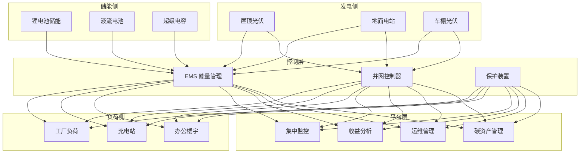
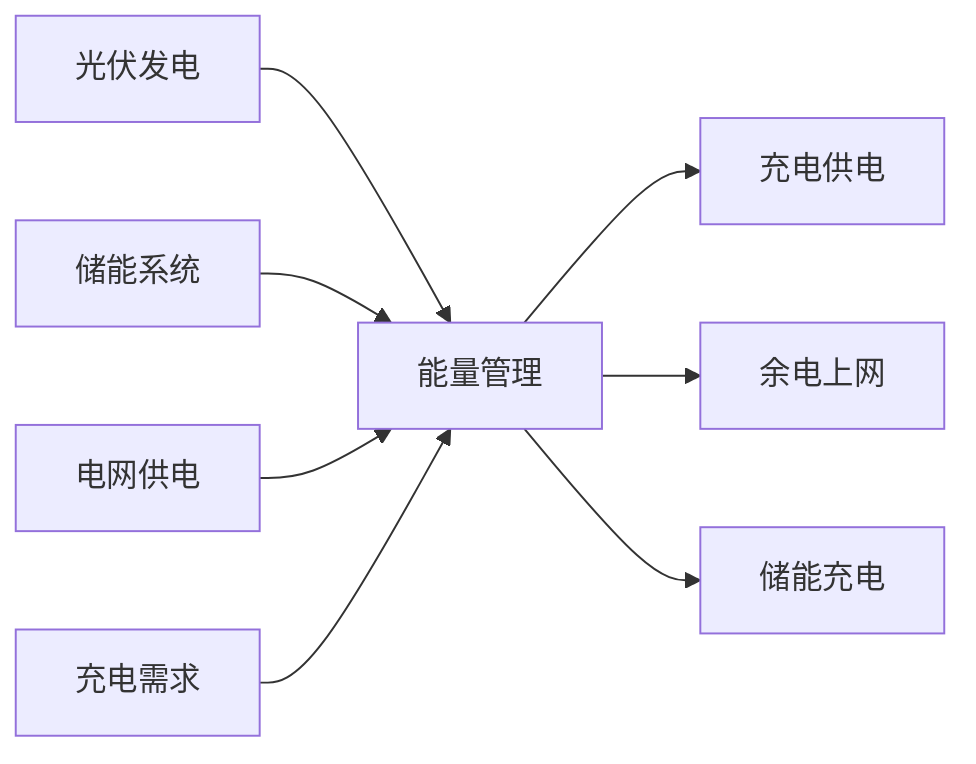

# 分布式能源架构设计 — 阿里云视角

> **适用版本**: Kubernetes v1.29 - v1.33 | **最后更新**: 2026-04-24
> **作者**: 阿里云解决方案架构师 | **标签**: `#分布式能源` `#光伏` `#储能` `#微电网` `#阿里云`

---

## 目录

1. [行业背景](#1-行业背景)
2. [业务架构](#2-业务架构)
3. [技术架构](#3-技术架构)
4. [核心数据流](#4-核心数据流)
5. [安全与合规](#5-安全与合规)
6. [可观测性](#6-可观测性)
7. [阿里云组件映射](#7-阿里云组件映射)
8. [生产检查清单](#8-生产检查清单)

---

## 1. 行业背景

### 1.1 业务特点

分布式能源（光伏+储能+微电网）是能源转型的关键：

| 挑战 | 说明 | 架构影响 |
|:---|:---|:---|
| 间歇性发电 | 光伏受天气影响 | 储能平抑 + 预测 |
| 并网标准 | 各地电网接入要求 | 并网控制器 |
| 能量管理 | 源储荷协调优化 | EMS 能量管理系统 |
| 运维分散 | 分布式站点分散 | 远程运维平台 |
| 收益计算 | 自发自用/余电上网 | 精细化计量 |

### 1.2 核心场景

- **光伏电站监控**: 组串/逆变器/汇流箱监控
- **储能系统管理**: BMS/PCS/EMS 协同
- **微电网控制**: 并网/离网模式切换
- **能量优化**: 峰谷套利/需量控制
- **碳资产管理**: 绿电溯源/碳减排计算

---

## 2. 业务架构

### 2.1 分布式能源全景架构



---

## 3. 技术架构

### 3.1 K8s 部署

```yaml
# EMS 能量管理系统 Deployment
apiVersion: apps/v1
kind: Deployment
metadata:
  name: ems-core
  namespace: distributed-energy
spec:
  replicas: 3
  selector:
    matchLabels:
      app: ems-core
  template:
    metadata:
      labels:
        app: ems-core
    spec:
      containers:
        - name: ems
          image: registry.cn-hangzhou.aliyuncs.com/energy/ems-core:v2.0.0
          ports:
            - containerPort: 8080
          env:
            - name: OPTIMIZATION_GOAL
              value: "cost-minimization"
            - name: GRID_TARIFF_PEAK
              value: "1.2"
          resources:
            requests:
              memory: "2Gi"
              cpu: "1000m"
            limits:
              memory: "4Gi"
              cpu: "2000m"
```

---

## 4. 核心数据流

### 4.1 光储充一体化优化



---

## 5. 安全与合规

- **电气安全**: 并网保护/绝缘监测
- **消防安全**: 储能系统热管理
- **电网合规**: 并网技术标准

---

## 6. 可观测性

- **发电效率**: 实时 PR 值监测
- **储能 SOC**: 实时状态更新
- **系统可用性**: 99.9%

---

## 7. 阿里云组件映射

| 功能域 | **阿里云云原生方案** |
|:---|:---|
| 容器平台 | **ACK Edge** |
| IoT | **阿里云 IoT 平台** |
| 时序数据库 | **Lindorm** |
| 数据库 | **PolarDB** |
| AI | **PAI** |
| 可观测性 | **ARMS + SLS** |

---

## 8. 生产检查清单

- [ ] 并网保护功能验证
- [ ] 储能系统热管理测试
- [ ] EMS 优化策略准确性
- [ ] 远程运维通道安全
- [ ] 碳减排计算合规

---

**维护者**: 阿里云解决方案架构师团队 | **许可证**: MIT
