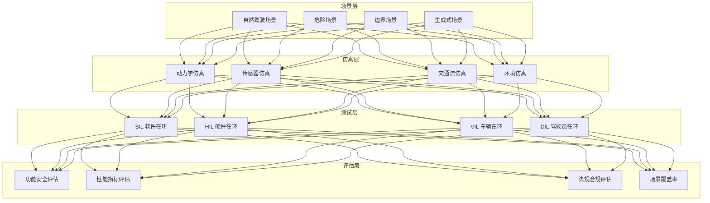
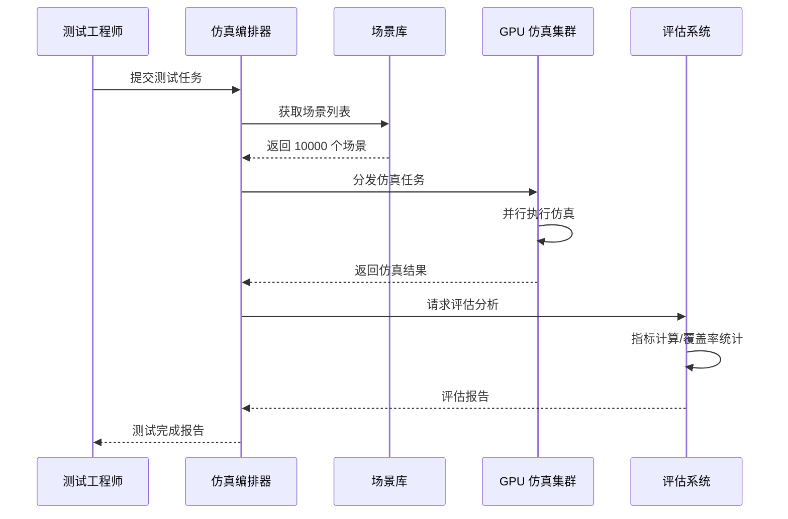
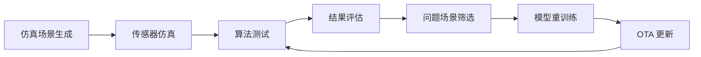

# 自动驾驶仿真架构设计 — 阿里云视角

> **适用版本**: Kubernetes v1.29 - v1.33 | **最后更新**: 2026-04-24
> **作者**: 阿里云解决方案架构师 | **标签**: `#自动驾驶` `#仿真测试` `#场景生成` `#阿里云`

---

## 目录

1. [行业背景](#1-行业背景)
2. [业务架构](#2-业务架构)
3. [技术架构](#3-技术架构)
4. [核心数据流](#4-核心数据流)
5. [安全与合规](#5-安全与合规)
6. [可观测性](#6-可观测性)
7. [阿里云组件映射](#7-阿里云组件映射)
8. [生产检查清单](#8-生产检查清单)

---

## 1. 行业背景

### 1.1 业务特点

自动驾驶仿真通过虚拟环境加速算法验证：

| 挑战 | 说明 | 架构影响 |
|:---|:---|:---|
| 场景覆盖 | 长尾场景难以路测 | 场景库 + 生成式 AI |
| 传感器仿真 | 摄像头/激光雷达仿真 | 物理级渲染 |
| 海量测试 | 数十亿公里虚拟测试 | 大规模并行仿真 |
| SIL/HIL | 软件/硬件在环测试 | 混合仿真架构 |
| 数据闭环 | 仿真结果驱动模型迭代 | 自动化流水线 |

### 1.2 核心场景

- **场景生成**: 自然驾驶/危险/边界场景
- **传感器仿真**: 相机/LiDAR/Radar 仿真
- **SIL 测试**: 软件在环算法验证
- **HIL 测试**: 硬件在环控制器测试
- **数据闭环**: 仿真数据训练模型

---

## 2. 业务架构

### 2.1 自动驾驶仿真全景架构



### 2.2 大规模并行仿真时序



---

## 3. 技术架构

### 3.1 K8s 部署

```yaml
# 仿真工作器 GPU Deployment
apiVersion: apps/v1
kind: Deployment
metadata:
  name: sim-worker
  namespace: ad-simulation
spec:
  replicas: 50
  selector:
    matchLabels:
      app: sim-worker
  template:
    metadata:
      labels:
        app: sim-worker
    spec:
      nodeSelector:
        accelerator: nvidia-a10
      runtimeClassName: nvidia
      containers:
        - name: worker
          image: registry.cn-hangzhou.aliyuncs.com/adsim/sim-worker:v2.0.0-gpu
          env:
            - name: SIM_ENGINE
              value: "carla"
            - name: SENSOR_MODE
              value: "camera+lidar+radar"
          resources:
            requests:
              nvidia.com/gpu: 1
              memory: "16Gi"
              cpu: "8000m"
            limits:
              nvidia.com/gpu: 1
              memory: "32Gi"
              cpu: "16000m"
```

---

## 4. 核心数据流

### 4.1 数据闭环流水线



---

## 5. 安全与合规

- **仿真可信度**: 仿真与真实场景一致性验证
- **功能安全**: ISO 26262 合规
- **数据安全**: 场景数据保密

---

## 6. 可观测性

- **仿真速度**: 实时/加速/减速
- **场景覆盖**: 功能场景覆盖率 > 90%
- **资源利用**: GPU 利用率 > 80%

---

## 7. 阿里云组件映射

| 功能域 | **阿里云云原生方案** |
|:---|:---|
| 容器平台 | **ACK Pro + GPU** |
| GPU | **GN7/GN10 实例** |
| 对象存储 | **OSS** |
| 数据库 | **PolarDB** |
| AI | **PAI** |
| 可观测性 | **ARMS + SLS** |

---

## 8. 生产检查清单

- [ ] 仿真场景与真实场景一致性验证
- [ ] 大规模并行仿真稳定性
- [ ] 传感器仿真精度校准
- [ ] 功能安全场景覆盖度
- [ ] 仿真数据隐私保护

---

**维护者**: 阿里云解决方案架构师团队 | **许可证**: MIT
