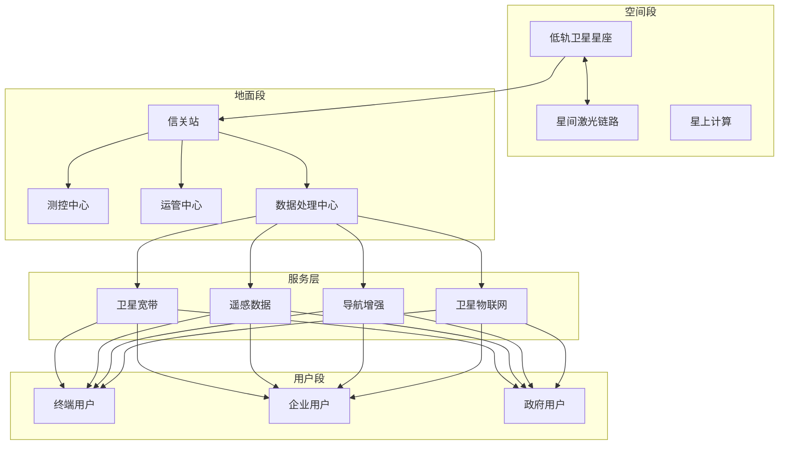
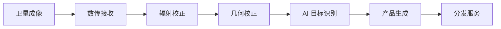

# 太空互联网架构设计 — 阿里云视角

> **适用版本**: Kubernetes v1.29 - v1.33 | **最后更新**: 2026-04-24
> **作者**: 阿里云解决方案架构师 | **标签**: `#太空互联网` `#低轨卫星` `#遥感` `#阿里云`

---

## 目录

1. [行业背景](#1-行业背景)
2. [业务架构](#2-业务架构)
3. [技术架构](#3-技术架构)
4. [核心数据流](#4-核心数据流)
5. [安全与合规](#5-安全与合规)
6. [可观测性](#6-可观测性)
7. [阿里云组件映射](#7-阿里云组件映射)
8. [生产检查清单](#8-生产检查清单)

---

## 1. 行业背景

### 1.1 业务特点

太空互联网通过低轨卫星星座提供全球通信与遥感服务：

| 挑战 | 说明 | 架构影响 |
|:---|:---|:---|
| 卫星规模化 | 万颗级卫星管理 | 自动化运维 |
| 轨道动态 | 星座拓扑快速变化 | 自适应路由 |
| 星地协同 | 天地一体化网络 | 协议适配 |
| 遥感大数据 | PB 级遥感图像 | 分布式处理 |
| 低延迟通信 | 卫星互联网接入 | 边缘计算 |

### 1.2 核心场景

- **卫星宽带**: 全球互联网接入服务
- **遥感服务**: 对地观测数据服务
- **导航增强**: 高精度定位服务
- **物联网**: 广域物联网数据采集
- **应急通信**: 灾害应急通信保障

---

## 2. 业务架构

### 2.1 太空互联网全景架构



---

## 3. 技术架构

### 3.1 K8s 部署

```yaml
# 卫星运管服务 Deployment
apiVersion: apps/v1
kind: Deployment
metadata:
  name: satellite-ops
  namespace: space-internet
spec:
  replicas: 3
  selector:
    matchLabels:
      app: satellite-ops
  template:
    metadata:
      labels:
        app: satellite-ops
    spec:
      containers:
        - name: ops
          image: registry.cn-hangzhou.aliyuncs.com/space/sat-ops:v1.0.0
          ports:
            - containerPort: 8080
          env:
            - name: TLE_DATA_URL
              value: "https://tle-data.space/track"
          resources:
            requests:
              memory: "4Gi"
              cpu: "2000m"
            limits:
              memory: "8Gi"
              cpu: "4000m"
```

---

## 4. 核心数据流

### 4.1 遥感数据处理



---

## 5. 安全与合规

- **频谱合规**: ITU 频谱协调
- **数据安全**: 遥感数据分级保护
- **空间碎片**: 轨道安全避碰

---

## 6. 可观测性

- **链路可用性**: > 99%
- **数据回传**: 实时/准实时
- **系统可用性**: 99.9%

---

## 7. 阿里云组件映射

| 功能域 | **阿里云云原生方案** |
|:---|:---|
| 容器平台 | **ACK Pro** |
| 大数据 | **MaxCompute** |
| AI | **PAI** |
| 对象存储 | **OSS** |
| 数据库 | **PolarDB** |
| 可观测性 | **ARMS + SLS** |

---

## 8. 生产检查清单

- [ ] 卫星轨道数据准确性
- [ ] 星地链路连通性
- [ ] 遥感数据产品质量
- [ ] 频谱干扰监测
- [ ] 空间碎片规避

---

**维护者**: 阿里云解决方案架构师团队 | **许可证**: MIT
