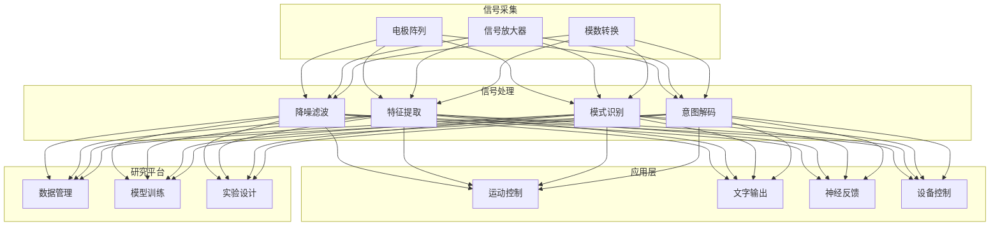
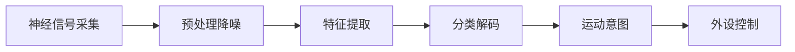

# 脑机接口架构设计 — 阿里云视角

> **适用版本**: Kubernetes v1.29 - v1.33 | **最后更新**: 2026-04-24
> **作者**: 阿里云解决方案架构师 | **标签**: `#脑机接口` `#BCI` `#神经信号` `#阿里云`

---

## 目录

1. [行业背景](#1-行业背景)
2. [业务架构](#2-业务架构)
3. [技术架构](#3-技术架构)
4. [核心数据流](#4-核心数据流)
5. [安全与合规](#5-安全与合规)
6. [可观测性](#6-可观测性)
7. [阿里云组件映射](#7-阿里云组件映射)
8. [生产检查清单](#8-生产检查清单)

---

## 1. 行业背景

### 1.1 业务特点

脑机接口（BCI）实现大脑与外部设备的直接通信：

| 挑战 | 说明 | 架构影响 |
|:---|:---|:---|
| 信号采集 | 微弱神经信号采集 | 高精度 ADC + 降噪 |
| 实时解码 | 毫秒级意图解码 | 边缘 AI + FPGA |
| 个体差异 | 不同用户信号差异大 | 个性化模型 |
| 数据隐私 | 神经数据高度敏感 | 端到端加密 |
| 医疗合规 | 植入式器械审批 | 临床试验规范 |

### 1.2 核心场景

- **医疗康复**: 瘫痪患者运动控制
- **辅助沟通**: 渐冻症患者文字输出
- **神经调控**: 帕金森/癫痫治疗
- **认知增强**: 注意力/记忆监测
- **人机交互**: 意念控制设备

---

## 2. 业务架构

### 2.1 脑机接口全景架构



---

## 3. 技术架构

### 3.1 K8s 部署

```yaml
# 神经信号处理 Deployment
apiVersion: apps/v1
kind: Deployment
metadata:
  name: neural-signal-processor
  namespace: bci
spec:
  replicas: 2
  selector:
    matchLabels:
      app: neural-signal-processor
  template:
    metadata:
      labels:
        app: neural-signal-processor
    spec:
      nodeSelector:
        accelerator: nvidia-t4
      runtimeClassName: nvidia
      containers:
        - name: processor
          image: registry.cn-hangzhou.aliyuncs.com/bci/neural-processor:v1.0.0-gpu
          ports:
            - containerPort: 8080
          env:
            - name: SAMPLING_RATE_HZ
              value: "2048"
            - name: CHANNEL_COUNT
              value: "256"
          resources:
            requests:
              nvidia.com/gpu: 1
              memory: "8Gi"
              cpu: "4000m"
            limits:
              nvidia.com/gpu: 1
              memory: "16Gi"
              cpu: "8000m"
```

---

## 4. 核心数据流

### 4.1 运动想象解码



---

## 5. 安全与合规

- **神经隐私**: 思维数据绝对保密
- **医疗合规**: FDA/NMPA 植入器械审批
- **伦理审查**: 人体实验伦理委员会

---

## 6. 可观测性

- **解码延迟**: < 50ms
- **解码准确率**: > 90%
- **系统稳定性**: 24h 连续运行

---

## 7. 阿里云组件映射

| 功能域 | **阿里云云原生方案** |
|:---|:---|
| 容器平台 | **ACK Pro + GPU** |
| AI | **PAI** |
| 数据库 | **PolarDB** |
| 对象存储 | **OSS** |
| 可观测性 | **ARMS + SLS** |

---

## 8. 生产检查清单

- [ ] 神经信号采集质量验证
- [ ] 实时解码延迟测试
- [ ] 神经数据加密传输
- [ ] 植入器械生物相容性
- [ ] 伦理审批与知情同意

---

**维护者**: 阿里云解决方案架构师团队 | **许可证**: MIT
