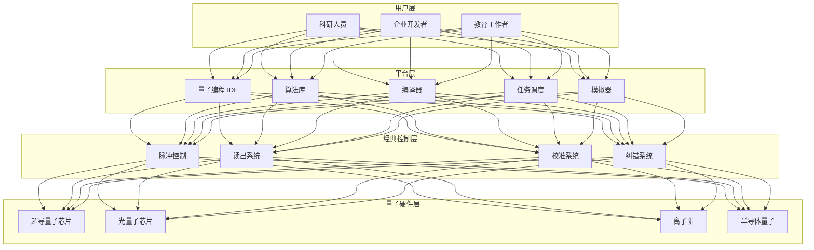
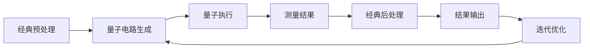

# 量子计算云平台架构设计 — 阿里云视角

> **适用版本**: Kubernetes v1.29 - v1.33 | **最后更新**: 2026-04-24
> **作者**: 阿里云解决方案架构师 | **标签**: `#量子计算` `#量子云` `#混合计算` `#阿里云`

---

## 目录

1. [行业背景](#1-行业背景)
2. [业务架构](#2-业务架构)
3. [技术架构](#3-技术架构)
4. [核心数据流](#4-核心数据流)
5. [安全与合规](#5-安全与合规)
6. [可观测性](#6-可观测性)
7. [阿里云组件映射](#7-阿里云组件映射)
8. [生产检查清单](#8-生产检查清单)

---

## 1. 行业背景

### 1.1 业务特点

量子计算云平台提供量子计算资源的远程访问：

| 挑战 | 说明 | 架构影响 |
|:---|:---|:---|
| 极低温环境 | 稀释制冷机 mK 级 | 物理机 + 经典控制 |
| 量子比特脆弱 | 退相干时间短 | 误差纠正 + 优化 |
| 混合计算 | 经典-量子协同 | 任务编排 |
| 算法适配 | 量子算法设计 | 算法库 + 编译器 |
| 资源稀缺 | 量子比特数量有限 | 队列调度 |

### 1.2 核心场景

- **量子模拟**: 分子/材料/金融模拟
- **优化求解**: 组合优化/路径规划
- **量子机器学习**: 量子神经网络
- **密码分析**: 量子安全密码研究
- **量子编程**: 量子算法开发与调试

---

## 2. 业务架构

### 2.1 量子计算云平台全景架构



---

## 3. 技术架构

### 3.1 K8s 部署

```yaml
# 量子任务调度 Deployment
apiVersion: apps/v1
kind: Deployment
metadata:
  name: quantum-scheduler
  namespace: quantum-cloud
spec:
  replicas: 3
  selector:
    matchLabels:
      app: quantum-scheduler
  template:
    metadata:
      labels:
        app: quantum-scheduler
    spec:
      containers:
        - name: scheduler
          image: registry.cn-hangzhou.aliyuncs.com/quantum/scheduler:v1.0.0
          ports:
            - containerPort: 8080
          env:
            - name: QUEUE_STRATEGY
              value: "fair-share"
            - name: MAX_QUBITS
              value: "128"
          resources:
            requests:
              memory: "2Gi"
              cpu: "1000m"
            limits:
              memory: "4Gi"
              cpu: "2000m"
```

---

## 4. 核心数据流

### 4.1 量子-经典混合计算



---

## 5. 安全与合规

- **量子安全**: 抗量子密码研究
- **访问控制**: 量子计算资源权限管理
- **数据安全**: 用户算法保密

---

## 6. 可观测性

- **任务队列**: 实时调度状态
- **量子比特**: 退相干时间监测
- **系统可用性**: 99%

---

## 7. 阿里云组件映射

| 功能域 | **阿里云云原生方案** |
|:---|:---|
| 容器平台 | **ACK Pro** |
| 量子计算 | **阿里云量子计算** |
| 数据库 | **PolarDB** |
| 对象存储 | **OSS** |
| 可观测性 | **ARMS + SLS** |

---

## 8. 生产检查清单

- [ ] 量子比特校准验证
- [ ] 量子电路编译正确性
- [ ] 任务调度公平性
- [ ] 量子-经典接口稳定性
- [ ] 用户算法隔离性

---

**维护者**: 阿里云解决方案架构师团队 | **许可证**: MIT
