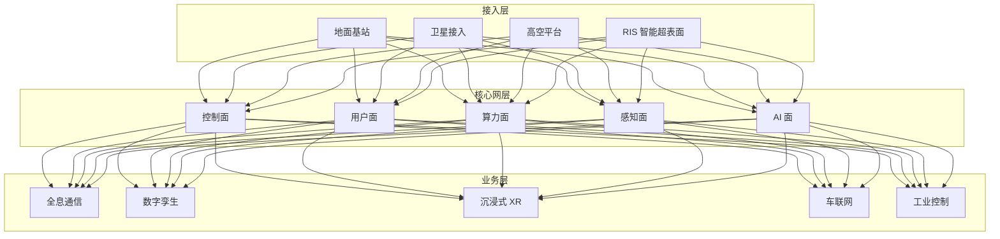
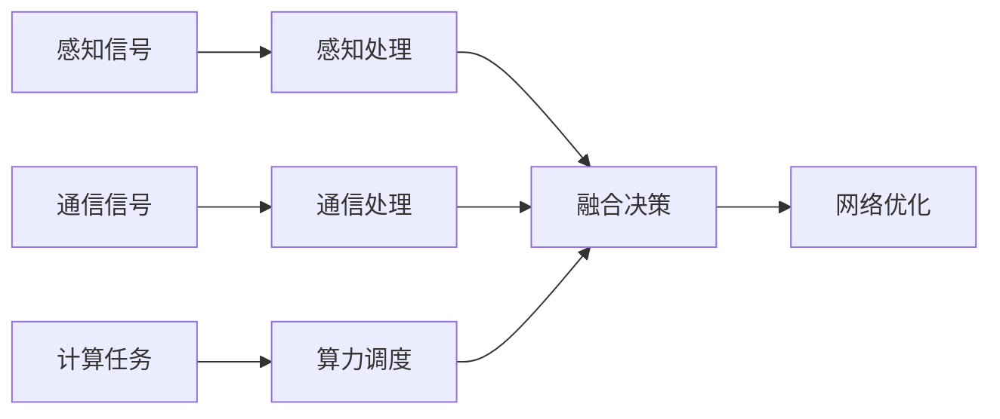

# 6G 核心网架构设计 — 阿里云视角

> **适用版本**: Kubernetes v1.29 - v1.33 | **最后更新**: 2026-04-24
> **作者**: 阿里云解决方案架构师 | **标签**: `#6G` `#核心网` `#通感一体` `#空天地` `#阿里云`

---

## 目录

1. [行业背景](#1-行业背景)
2. [业务架构](#2-业务架构)
3. [技术架构](#3-技术架构)
4. [核心数据流](#4-核心数据流)
5. [安全与合规](#5-安全与合规)
6. [可观测性](#6-可观测性)
7. [阿里云组件映射](#7-阿里云组件映射)
8. [生产检查清单](#8-生产检查清单)

---

## 1. 行业背景

### 1.1 业务特点

6G 核心网实现通信与感知融合、空天地一体化：

| 挑战 | 说明 | 架构影响 |
|:---|:---|:---|
| 通感一体 | 通信与雷达感知融合 | 波形共享 + 资源调度 |
| 空天地一体 | 地面/卫星/高空平台 | 统一核心网 |
| 智能超表面 | RIS 可编程无线环境 | 波束管理 |
| 超低延迟 | < 0.1ms 空口时延 | 边缘计算 |
| 算网融合 | 计算与网络协同 | 算力路由 |

### 1.2 核心场景

- **全息通信**: 3D 全息实时交互
- **数字孪生通信**: 物理世界实时映射
- **通感算一体化**: 感知-通信-计算融合
- **泛在连接**: 全球无缝覆盖
- **智能内生**: AI 原生网络架构

---

## 2. 业务架构

### 2.1 6G 核心网全景架构



---

## 3. 技术架构

### 3.1 K8s 部署

```yaml
# 6G 核心网控制面 Deployment
apiVersion: apps/v1
kind: Deployment
metadata:
  name: core-control-plane
  namespace: sixg-core
spec:
  replicas: 5
  selector:
    matchLabels:
      app: core-control-plane
  template:
    metadata:
      labels:
        app: core-control-plane
    spec:
      containers:
        - name: cp
          image: registry.cn-hangzhou.aliyuncs.com/6g/core-cp:v1.0.0
          ports:
            - containerPort: 8080
          env:
            - name: NETWORK_SLICES
              value: "eMBB,URLLC,mMTC,sensing"
          resources:
            requests:
              memory: "4Gi"
              cpu: "2000m"
            limits:
              memory: "8Gi"
              cpu: "4000m"
```

---

## 4. 核心数据流

### 4.1 通感算一体化



---

## 5. 安全与合规

- **网络安全**: 6G 安全架构
- **隐私保护**: 通感数据隐私
- **频谱合规**: 频谱使用规范

---

## 6. 可观测性

- **端到端延迟**: < 0.1ms
- **频谱效率**: 提升 2x
- **系统可用性**: 99.999%

---

## 7. 阿里云组件映射

| 功能域 | **阿里云云原生方案** |
|:---|:---|
| 容器平台 | **ACK Pro** |
| 数据库 | **PolarDB** |
| 缓存 | **Redis 企业版** |
| AI | **PAI** |
| 可观测性 | **ARMS + SLS** |

---

## 8. 生产检查清单

- [ ] 控制面高可用验证
- [ ] 网络切片隔离性
- [ ] 通感融合精度
- [ ] 空天地切换连续性
- [ ] 频谱效率达标

---

**维护者**: 阿里云解决方案架构师团队 | **许可证**: MIT
