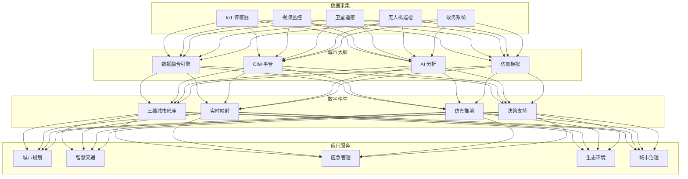
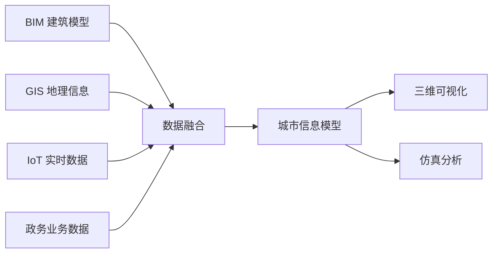

# 数字孪生城市架构设计 — 阿里云视角

> **适用版本**: Kubernetes v1.29 - v1.33 | **最后更新**: 2026-04-24
> **作者**: 阿里云解决方案架构师 | **标签**: `#数字孪生城市` `#CIM` `#智慧城市` `#阿里云`

---

## 目录

1. [行业背景](#1-行业背景)
2. [业务架构](#2-业务架构)
3. [技术架构](#3-技术架构)
4. [核心数据流](#4-核心数据流)
5. [安全与合规](#5-安全与合规)
6. [可观测性](#6-可观测性)
7. [阿里云组件映射](#7-阿里云组件映射)
8. [生产检查清单](#8-生产检查清单)

---

## 1. 行业背景

### 1.1 业务特点

数字孪生城市构建城市级数字镜像，实现虚实映射与智能决策：

| 挑战 | 说明 | 架构影响 |
|:---|:---|:---|
| 数据融合 | 多源异构城市数据 | 数据中台 + 语义建模 |
| 实时映射 | 物理城市动态变化 | 流式计算 + IoT |
| 三维渲染 | 城市级三维可视化 | GPU 集群 + 流式渲染 |
| 计算规模 | 千万级实体建模 | 分布式计算 |
| 跨域协同 | 规划/建设/管理 | CIM 平台 |

### 1.2 核心场景

- **城市信息模型 CIM**: BIM+GIS+IoT 融合
- **城市规划仿真**: 规划方案模拟验证
- **城市运行监测**: 交通/环境/能源实时监测
- **应急指挥**: 灾害模拟/疏散仿真
- **城市治理**: 一网统管/事件协同

---

## 2. 业务架构

### 2.1 数字孪生城市全景架构



---

## 3. 技术架构

### 3.1 K8s 部署

```yaml
# 三维渲染服务 GPU Deployment
apiVersion: apps/v1
kind: Deployment
metadata:
  name: city-3d-renderer
  namespace: digital-twin-city
spec:
  replicas: 5
  selector:
    matchLabels:
      app: city-3d-renderer
  template:
    metadata:
      labels:
        app: city-3d-renderer
    spec:
      nodeSelector:
        accelerator: nvidia-a10
      runtimeClassName: nvidia
      containers:
        - name: renderer
          image: registry.cn-hangzhou.aliyuncs.com/city/3d-renderer:v2.0.0-gpu
          ports:
            - containerPort: 8080
          env:
            - name: TILE_SIZE
              value: "256"
            - name: LOD_LEVELS
              value: "5"
          resources:
            requests:
              nvidia.com/gpu: 1
              memory: "16Gi"
              cpu: "8000m"
            limits:
              nvidia.com/gpu: 1
              memory: "32Gi"
              cpu: "16000m"
```

---

## 4. 核心数据流

### 4.1 CIM 数据融合



---

## 5. 安全与合规

- **数据安全**: 城市敏感数据保护
- **等保三级**: 智慧城市系统合规
- **隐私保护**: 市民位置/行为脱敏

---

## 6. 可观测性

- **数据融合延迟**: < 5s
- **三维渲染帧率**: > 30FPS
- **模型精度**: 厘米级

---

## 7. 阿里云组件映射

| 功能域 | **阿里云云原生方案** |
|:---|:---|
| 容器平台 | **ACK Pro + GPU** |
| 三维渲染 | **GN7/GN10 实例** |
| 数据库 | **PolarDB + Lindorm** |
| GIS | **阿里云 GIS** |
| AI | **PAI** |
| 对象存储 | **OSS** |
| 可观测性 | **ARMS + SLS** |
| 可视化 | **DataV** |

---

## 8. 生产检查清单

- [ ] CIM 数据融合完整性
- [ ] 三维渲染性能达标
- [ ] 实时数据同步延迟
- [ ] 城市敏感数据脱敏
- [ ] 等保三级合规审计

---

**维护者**: 阿里云解决方案架构师团队 | **许可证**: MIT
