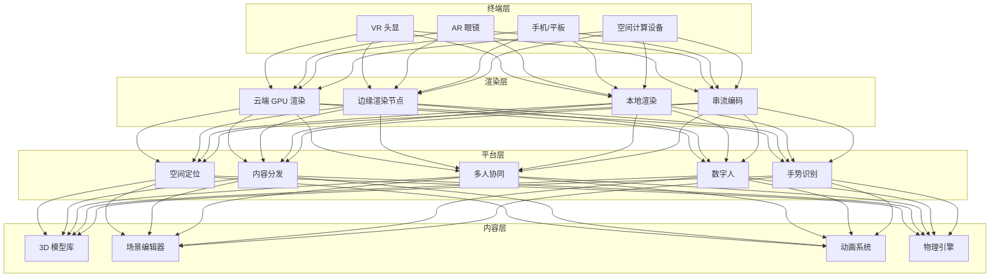
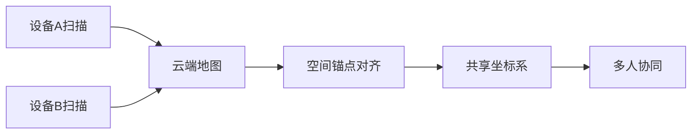

# 沉浸式 XR 架构设计 — 阿里云视角

> **适用版本**: Kubernetes v1.29 - v1.33 | **最后更新**: 2026-04-24
> **作者**: 阿里云解决方案架构师 | **标签**: `#XR` `#VR` `#AR` `#空间计算` `#阿里云`

---

## 目录

1. [行业背景](#1-行业背景)
2. [业务架构](#2-业务架构)
3. [技术架构](#3-技术架构)
4. [核心数据流](#4-核心数据流)
5. [安全与合规](#5-安全与合规)
6. [可观测性](#6-可观测性)
7. [阿里云组件映射](#7-阿里云组件映射)
8. [生产检查清单](#8-生产检查清单)

---

## 1. 行业背景

### 1.1 业务特点

沉浸式 XR（VR/AR/MR）融合虚拟与现实，开启空间计算时代：

| 挑战 | 说明 | 架构影响 |
|:---|:---|:---|
| 低延迟渲染 | 6DOF 交互 < 20ms | 边缘渲染 + 预测 |
| 空间定位 | SLAM/空间锚点 | 云端地图协同 |
| 内容生态 | 3D 内容生产门槛高 | 云化工具链 |
| 多用户协同 | 共享空间体验 | 状态同步 |
| 硬件差异 | 不同头显性能差异 | 自适应码率 |

### 1.2 核心场景

- **VR 娱乐**: 游戏/影视/社交
- **AR 工业**: 远程协助/培训/巡检
- **MR 办公**: 虚拟会议室/协作空间
- **空间计算**: 环境理解/手势识别
- **数字人交互**: 虚拟助手/客服

---

## 2. 业务架构

### 2.1 沉浸式 XR 全景架构



---

## 3. 技术架构

### 3.1 K8s 部署

```yaml
# 云渲染服务 GPU Deployment
apiVersion: apps/v1
kind: Deployment
metadata:
  name: cloud-xr-render
  namespace: immersive-xr
spec:
  replicas: 5
  selector:
    matchLabels:
      app: cloud-xr-render
  template:
    metadata:
      labels:
        app: cloud-xr-render
    spec:
      nodeSelector:
        accelerator: nvidia-a10
      runtimeClassName: nvidia
      containers:
        - name: render
          image: registry.cn-hangzhou.aliyuncs.com/xr/cloud-render:v2.0.0-gpu
          ports:
            - containerPort: 8080
          env:
            - name: RENDER_MODE
              value: "foveated-streaming"
            - name: TARGET_LATENCY_MS
              value: "15"
          resources:
            requests:
              nvidia.com/gpu: 1
              memory: "16Gi"
              cpu: "8000m"
            limits:
              nvidia.com/gpu: 1
              memory: "32Gi"
              cpu: "16000m"
```

---

## 4. 核心数据流

### 4.1 空间锚点共享



---

## 5. 安全与合规

- **隐私保护**: 环境扫描数据保密
- **内容安全**: XR 内容审核
- **使用安全**: VR 使用时长限制

---

## 6. 可观测性

- **渲染延迟**: P99 < 20ms
- **定位精度**: 厘米级
- **帧率稳定**: 90FPS+

---

## 7. 阿里云组件映射

| 功能域 | **阿里云云原生方案** |
|:---|:---|
| 容器平台 | **ACK Pro + GPU** |
| GPU | **GN7/GN10 实例** |
| RTC | **阿里云 RTC** |
| 对象存储 | **OSS + CDN** |
| AI | **PAI** |
| 可观测性 | **ARMS + SLS** |

---

## 8. 生产检查清单

- [ ] 渲染延迟 < 20ms
- [ ] 空间定位精度验证
- [ ] 多人协同同步一致性
- [ ] 环境扫描隐私加密
- [ ] 内容审核覆盖率

---

**维护者**: 阿里云解决方案架构师团队 | **许可证**: MIT
