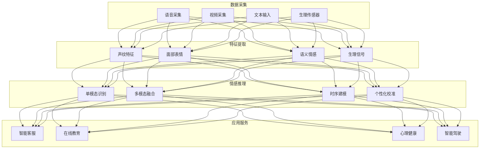
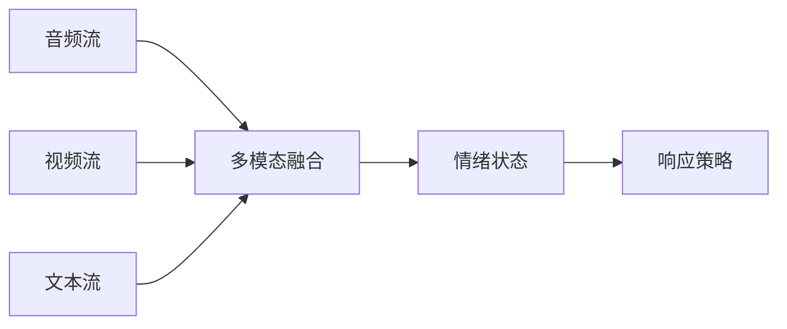

# 情感计算 AI 架构设计 — 阿里云视角

> **适用版本**: Kubernetes v1.29 - v1.33 | **最后更新**: 2026-04-24
> **作者**: 阿里云解决方案架构师 | **标签**: `#情感计算` `#情绪识别` `#心理评估` `#阿里云`

---

## 目录

1. [行业背景](#1-行业背景)
2. [业务架构](#2-业务架构)
3. [技术架构](#3-技术架构)
4. [核心数据流](#4-核心数据流)
5. [安全与合规](#5-安全与合规)
6. [可观测性](#6-可观测性)
7. [阿里云组件映射](#7-阿里云组件映射)
8. [生产检查清单](#8-生产检查清单)

---

## 1. 行业背景

### 1.1 业务特点

情感计算 AI 通过多模态信号识别人类情绪与心理状态：

| 挑战 | 说明 | 架构影响 |
|:---|:---|:---|
| 多模态融合 | 语音/表情/文本/生理 | 多模态模型 |
| 文化差异 | 不同文化情绪表达差异 | 地域化模型 |
| 实时处理 | 对话中实时情绪识别 | 流式推理 |
| 隐私敏感 | 情绪数据高度个人化 | 边缘计算 + 加密 |
| 场景多样 | 客服/教育/医疗/驾驶 | 场景适配 |

### 1.2 核心场景

- **智能客服**: 情绪感知/安抚策略
- **在线教育**: 学习状态/注意力监测
- **心理健康**: 抑郁/焦虑筛查
- **智能驾驶**: 驾驶员疲劳/分心监测
- **内容审核**: 视频情绪合规

---

## 2. 业务架构

### 2.1 情感计算 AI 全景架构



---

## 3. 技术架构

### 3.1 K8s 部署

```yaml
# 多模态情感推理 GPU Deployment
apiVersion: apps/v1
kind: Deployment
metadata:
  name: emotion-inference
  namespace: affective-computing
spec:
  replicas: 3
  selector:
    matchLabels:
      app: emotion-inference
  template:
    metadata:
      labels:
        app: emotion-inference
    spec:
      nodeSelector:
        accelerator: nvidia-t4
      runtimeClassName: nvidia
      containers:
        - name: inference
          image: registry.cn-hangzhou.aliyuncs.com/affective/emotion-inference:v1.0.0-gpu
          ports:
            - containerPort: 8080
          env:
            - name: MODALITIES
              value: "face,voice,text"
            - name: FUSION_METHOD
              value: "attention"
          resources:
            requests:
              nvidia.com/gpu: 1
              memory: "8Gi"
              cpu: "4000m"
            limits:
              nvidia.com/gpu: 1
              memory: "16Gi"
              cpu: "8000m"
```

---

## 4. 核心数据流

### 4.1 实时情绪识别



---

## 5. 安全与合规

- **隐私保护**: 情绪数据加密存储
- **伦理规范**: 不用于歧视性决策
- **知情同意**: 明确告知用户采集用途

---

## 6. 可观测性

- **识别准确率**: > 85%
- **推理延迟**: P99 < 100ms
- **多模态同步**: < 50ms

---

## 7. 阿里云组件映射

| 功能域 | **阿里云云原生方案** |
|:---|:---|
| 容器平台 | **ACK Pro + GPU** |
| AI | **PAI / 视觉智能 / 语音智能** |
| 数据库 | **PolarDB** |
| 对象存储 | **OSS** |
| 可观测性 | **ARMS + SLS** |

---

## 8. 生产检查清单

- [ ] 多模态识别准确率验证
- [ ] 实时推理延迟测试
- [ ] 情绪数据隐私加密
- [ ] 伦理审查通过
- [ ] 场景适配性测试

---

**维护者**: 阿里云解决方案架构师团队 | **许可证**: MIT
